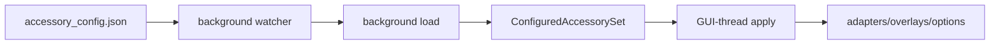

# Requirements

### Overview & Goals

Automatically reload EngineGui’s configured accessory state when `accessory_config.json` changes, including changes
propagated into `cache/config/accessory_config.json` by cache sync.

### Scope

#### In Scope

- Detect changes to the currently resolved accessory config file used by `ConfiguredAccessorySet`.
- Run file monitoring and JSON/config parsing outside the GUI thread.
- Apply the already-loaded configuration to `EngineGui` safely using the existing GUI scheduling/message patterns.
- Preserve the existing manual Admin panel `Accessories` reload button as a user-triggered fallback.
- Avoid repeated reload storms by using polling/debounce or signature comparison.

#### Out of Scope

- Changing cache sync behavior itself; the file is already synchronized by `CacheSyncManager`/`SidecarCacheTransport`.
- Live-editing individual accessory widgets in place; reload will reuse the existing teardown/rebuild behavior.
- Adding a new external file-watching dependency unless already present in the project.

### Functional Requirements

- When the effective config file changes on disk, `EngineGui` reloads configured accessories automatically.
- Invalid JSON or invalid config entries must not replace the current working accessory set.
- Reload failures should be logged and the watcher should continue monitoring later changes.
- The GUI thread must not perform file polling or config parsing; it should only apply the resulting
  `ConfiguredAccessorySet` and update GUI state.
- Both top-level `accessory_config.json` and cache-resolved `cache/config/accessory_config.json` must be handled
  according to the existing resolution rules in `ConfiguredAccessorySet.resolve_config_path()`.

# Technical Design

### Current Implementation

- `src/pytrain/gui/accessories/configured_accessory.py` defines `DEFAULT_CONFIG_FILE = "accessory_config.json"` and
  `DEFAULT_CONFIG_CACHE_DIR = Path("cache") / "config"`.
- `ConfiguredAccessorySet.from_file()` calls `_load()`, resolves the effective path, reads/parses JSON, validates
  entries, and rebuilds indexes synchronously.
- `EngineGui.__init__()` stores `self._accessory_config_file = config_file`, then loads
  `self._caa = ConfiguredAccessorySet.from_file(config_file, verify=True)` and creates
  `ConfiguredAccessoryAdapterProvider`.
- `EngineGui.reload_configured_accessories()` currently rereads the file and then clears/rebuilds adapter, overlay,
  recents, catalog, options, and prewarm state.
- `EngineGui` already has background support via `self._executor.submit(...)`, GUI scheduling via
  `self.app.tk.after(...)`, and lifecycle cleanup in `destroy_gui()`.
- Cache sync (`src/pytrain/db/cache_sync.py`) already polls/manifests cache file changes in a daemon thread, but it does
  not notify `EngineGui`.

### Key Decisions

- Use lightweight polling with file signature comparison instead of adding a dependency such as `watchdog`.
    - Rationale: the project already uses polling/debounce for cache sync, and this avoids platform-specific watcher
      concerns.
- Split reload into two phases:
    - background phase: detect file changes and build a fresh `ConfiguredAccessorySet`;
    - GUI phase: apply the prepared set to `EngineGui` using existing GUI scheduling/locking.
- Keep the watcher owned by `EngineGui`, because the reload affects GUI-owned adapter, popup, option, and prewarm state.

### Proposed Changes

- Add a small internal watcher mechanism near `EngineGui` or as a helper class in
  `src/pytrain/gui/controller/engine_gui.py`.
    - Track the effective config path from `self.accessories.path` after initial load.
    - Compare a signature such as `(resolved_path, exists, st_mtime_ns, st_size)` on a polling interval.
    - Debounce changed signatures briefly before loading to avoid partial writes while cache sync/configure writes the
      file.
- Refactor `EngineGui.reload_configured_accessories()` into:
    - a loading method that can run off the GUI thread, e.g. `_load_configured_accessories()` returning
      `ConfiguredAccessorySet | None`;
    - an apply method that only runs on the GUI thread, e.g. `_apply_configured_accessories(configured)`.
- Add a non-GUI-thread auto reload flow:
    - watcher detects file signature change;
    - background worker calls `ConfiguredAccessorySet.from_file(self._accessory_config_file, verify=True)`;
    - if successful, schedule `_apply_configured_accessories(configured)` via `self.app.tk.after(0, ...)` or the
      existing message queue pattern.
- Preserve manual reload:
    - `AdminPanel` line 181 can continue calling `self._gui.reload_configured_accessories`;
    - manual reload may synchronously schedule/load through the same split implementation, but config parsing should
      also avoid blocking the GUI if feasible.
- Add shutdown cleanup:
    - stop the watcher when `EngineGui.destroy_gui()` runs or when `self._shutdown_flag` is set;
    - ensure pending callbacks no-op if shutdown has started.

### Data Flow

### Files Affected

- `src/pytrain/gui/controller/engine_gui.py`
    - Add watcher state fields and startup scheduling after initial UI setup.
    - Split reload into load/apply helpers.
    - Start/stop watcher in existing lifecycle methods.
- `src/pytrain/gui/accessories/configured_accessory.py`
    - No required behavioral change expected; use existing `ConfiguredAccessorySet.path` and resolution behavior.
- `tests/` if GUI-controller tests exist or can be added without requiring a real display.
    - Prefer unit-level coverage around file signature/watcher helper and reload apply behavior with fakes/mocks.

### Risks & Mitigations

- **Partial writes:** debounce and catch parse errors; keep current config on failure.
- **GUI-thread safety:** perform only final state mutation and Tk scheduling on the GUI thread.
- **Config path switching:** because resolution prefers top-level file over cache file, each successful load should
  update the watched path from `configured.path`.
- **Duplicate reloads:** track last successfully applied file signature and ignore unchanged signatures.

# Testing

### Validation Approach

Use unit-level tests where possible and manual validation notes for GUI behavior that is hard to automate headlessly.

### Key Scenarios

- Initial load watches the resolved top-level config when it exists.
- Initial load watches `cache/config/accessory_config.json` when no top-level file exists.
- A valid changed file causes a new `ConfiguredAccessorySet` to be loaded and applied.
- Invalid JSON logs an error and leaves the previous accessory set intact.
- Multiple quick changes trigger at most one applied reload after debounce.
- Shutdown prevents further reload callbacks.

### Project Validation Commands

- For changed Python files: `../bin/python -m ruff format --check <changed Python files>`
- Full test suite: `../bin/python -m pytest`

# Delivery Steps

### ✓ Step 1: split-accessory-reload-into-load-and-apply

`EngineGui` has a reusable reload path where config parsing can happen off the GUI thread and GUI mutation is isolated.

- Extract the existing state-replacement logic from `reload_configured_accessories()` into a helper that accepts an
  already-built `ConfiguredAccessorySet`.
- Keep adapter/provider reset, accessory view clearing, overlay discard, catalog reset, options rebuild, and overlay
  prewarm in the GUI-side helper.
- Add a background-safe load helper that calls
  `ConfiguredAccessorySet.from_file(self._accessory_config_file, verify=True)` and logs failures without replacing
  current state.
- Update the manual Admin panel reload path to use the refactored helpers while preserving the same visible behavior.

### ✓ Step 2: add-background-config-change-watcher

`EngineGui` detects changes to the resolved accessory config file without polling or parsing in the GUI thread.

- Add watcher state to `EngineGui`, including last applied file signature, debounce timing, and a shutdown-aware
  background loop or executor task.
- Watch the effective path from `self.accessories.path`, respecting the existing top-level-then-cache resolution
  behavior.
- Compare file signatures using existence, modification time, and size rather than reading file contents on every poll.
- On a stable changed signature, load a fresh `ConfiguredAccessorySet` in the background and schedule the GUI-side apply
  helper.

### ✓ Step 3: wire-watcher-lifecycle-and-path-updates

The automatic reload watcher starts after GUI initialization and stops cleanly with the window.

- Start the watcher after the initial config load/UI setup is complete, avoiding startup reload duplication.
- After every successful reload, update the watched path/signature from the newly loaded `ConfiguredAccessorySet.path`.
- Ensure pending background completions and scheduled GUI callbacks check `self._shutdown_flag` before applying changes.
- Stop/join or otherwise cancel watcher activity from `destroy_gui()` alongside existing GUI cleanup.

### ✓ Step 4: validate-reload-behavior

The change is covered by focused tests or reliable validation for change detection and failure handling.

- Add tests for file signature detection and debounce behavior if the watcher is factored into a testable helper.
- Add tests or mocks confirming invalid config does not replace the current configured accessory set.
- Run the required formatter check for changed Python files.
- Run the full unit test suite with `../bin/python -m pytest`.
