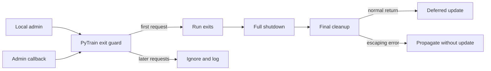

# Findings and Scope

### Goal: fix interrupted UPDATE, not explain it as two managers
The user clarified that the UPDATE crash is the real problem and confirmed **no Ctrl+C was pressed**. The traceback shows repeated interrupts in the main thread, not an exception raised by the cache worker.

1. **Intentional exit:** `PyTrain.do_admin_cmd()` raises `KeyboardInterrupt` at `src/pytrain/cli/pytrain.py:773` after forwarding UPDATE.
2. **Interrupted cleanup:** a second `KeyboardInterrupt` arrives while `CacheSyncManager.shutdown()` waits in `socketserver.shutdown()` (`src/pytrain/db/cache_sync.py:523`). This is a normal shutdown wait, not by itself evidence of a cache failure or deadlock.
3. **Unsafe finalization:** `PyTrain.shutdown()` catches `Exception`, which excludes `KeyboardInterrupt`. Cleanup can stop before disconnecting the client and stopping command listeners. `run()` retries service/cache cleanup, then calls `update()` from its unconditional `finally` block (`pytrain.py:414–428`) despite the interrupted full shutdown.
4. **Another interrupt:** the final traceback shows interruption while waiting for `git pull`. Its sender is not established by the traceback. No manual Ctrl+C occurred, but that does not identify the exact signal source.

### Verified race and remaining uncertainty
`PyTrain.__call__()` sends process-directed `SIGINT` at `pytrain.py:656`. Its `_received_admin_cmds` guard covers previously received commands, not locally issued ones; `do_admin_cmd()` never records the local UPDATE there. An echoed UPDATE can therefore interrupt teardown. The earlier `Message: UPDATE...` output supports this path.

One sequential UPDATE echo explains **one** additional interrupt, not both later interrupts in this traceback: the callback records the command before signaling. Other accepted admin commands can still signal and overwrite `_admin_action`, and the check/add is not explicitly synchronized. These are paths to test, not proven explanations for the final Git interruption. Add signal-source and phase diagnostics instead of asserting an unverified third-signal cause.

RESTART shares the vulnerable shutdown path. Unlike UPDATE, it does not run the Git/pip update sequence and catches `KeyboardInterrupt` around its initial log message (`pytrain.py:843–879`). Different timing and that narrow catch can hide the symptom; neither makes RESTART inherently safe.

### Acceptance criteria
- One committed local exit action per PyTrain lifecycle. Local UPDATE and its echoes do not produce redundant internal interrupts; later exiting admin commands cannot change the selected action during teardown or updating.
- Callback-only commands still wake the command loop once. Preserve API exit status, startup-triggered client UPDATE, targeted-node and client `me` routing, and normal RESYNC behavior.
- UPDATE executes once, after normal shutdown and final cleanup return successfully. An escaping cleanup interruption/error must not launch Git, pip, or a deferred relaunch from `finally`.
- Interrupted cache cleanup retains the same manager and resources for a safe retry. Successful cleanup releases ownership only after owned threads terminate.
- Preserve disabled-cache behavior, capability checks, cache transfer contracts, and existing update subprocess arguments.

### Relationship to the original singleton plan
The duplicate startup print is already removed from `PyTrain`; preserve that change. Repeated shutdown messages can come from retries on one object and do not prove duplicate construction.

`CacheSyncManager.build()` already serializes factory creation. Direct construction can bypass it, but no normal bypass call site was found. **Defer the previously proposed constructor metaclass/true-singleton rewrite**; it is separate hardening, not a prerequisite or explanation for this crash. Retain the relevant shutdown-ownership safeguards in this focused fix. Shared singleton utilities, command protocols, global signal masking, and a replacement event-loop architecture remain out of scope.

# Technical Design

### Extend the existing admin guard locally
Keep coordination inside `src/pytrain/cli/pytrain.py`; preserve existing routing, callback delivery, and the first interrupt used to wake `run()`. No new cross-module coordinator or transport API is needed.

- Initialize a short-lived admin-state lock and exit-request/shutdown-started flags before callback registration. Use a private helper such as `_claim_admin_exit(command, *, source) -> bool` to atomically accept the first exiting action, record `_admin_action`, and update `_received_admin_cmds`.
- In `do_admin_cmd()`, classify routing before committing a local exit. Claim and record locally exiting commands **before** `signal_clients()` or `enqueue_command()` can synchronously or asynchronously echo them; only the winning local request raises the intentional interrupt.
- Do not pre-claim targeted remote requests, RESYNC, or returning client `me` branches; those may rely on a callback to exit. `_admin_action == command` alone is not an adequate guard. Ensure incidental routing assignments cannot overwrite an already committed exit action.
- In `__call__()`, accept callback-only exiting requests through the same guard. The winner retains existing API shutdown/exit-status handling and its single wakeup signal; duplicate or different exiting commands after commitment must not signal, repeat callback shutdown, or replace the action.
- At the start of `shutdown()`, mark teardown underway even when it originated from ordinary Ctrl+C rather than an admin command. Retain the guard through the update/relaunch phase. Marking teardown must not suppress the already accepted callback's required initial wakeup.
- Roll back only the newly reserved local bookkeeping if dispatch fails before teardown begins. Do not hold the admin-state lock across networking, cleanup, joins, or signal delivery; keep it separate from `_shutdown_lock`.

### Make deferred actions conditional on completed control flow
Refactor `PyTrain.run()` without rewriting `update()` or changing its Git/pip commands:
- Handle the initial expected `KeyboardInterrupt` around both startup processing and the command loop, then call full `shutdown()` once on that normal exit path. Moving only the existing action block is insufficient: client version checks call `__call__(UPDATE)` before entering the loop.
- Keep final history/service/cache cleanup as a safety net, but move deferred admin-action dispatch **after**, not inside, the cleanup `finally` block.
- Allow an interruption/error that escapes shutdown or final cleanup to propagate without invoking UPDATE, UPGRADE, RESTART, or power actions. Preserve existing best-effort handling of ordinary individual cleanup errors; do not equate a still-retained cache manager after a failed stop with completed cache cleanup.
- Do not broadly catch `BaseException`, swallow `KeyboardInterrupt` inside `update()`, ignore SIGINT process-wide, or retry a partially executed Git/pip update automatically. Genuine external cancellation remains distinct from the internal duplicate-signal bug.

### Preserve cache ownership until cleanup succeeds
In `src/pytrain/db/cache_sync.py`, retain the existing factory registry and locking rather than adding constructor enforcement:
- Set `_shutdown` even if the sidecar never bound. Keep `shutdown()` idempotent and join both the worker and the serving thread; guard against self-join and unstarted threads.
- Preserve valid server/thread references across an interrupted `server.shutdown()` or `server_close()` so a retry continues on the same manager. Clear references only when the corresponding resource is actually released.
- Clean up a bound socket if `_start_sidecar()` fails to start its serving thread. Never call `socketserver.shutdown()` on a server whose serving loop was never started; the normal shutdown wait must not be mistaken for a timeout API.
- Keep `stop()` serialized against `build()`. Clear `_instance` only after successful cleanup and confirmed thread termination. If a bounded join expires, raise a cleanup failure and retain ownership; enabled `build()` must not hand out that stopping manager as an active one or create a replacement.
- Preserve `PyTrain.shutdown_cache()`'s reference-on-failure behavior, including `KeyboardInterrupt`. Release locks on exceptional exit, allow subsequent `stop()` to finish, and permit a fresh factory instance only after successful stop.

### Diagnose interrupt sources and lifecycle phases
- Replace the ad hoc admin print with debug records for accepted/suppressed requests and a record immediately before the internal `os.kill()`. Include action, local/callback source, selected action, phase, process ID, PyTrain identity, and current thread; do not imply knowledge of a remote sender that the callback does not provide.
- Log entry/completion of full teardown and entry into deferred UPDATE. These records distinguish late callback signals from an interrupt with no matching internal-send record; they cannot by themselves identify an external signal sender.
- Replace cache lifecycle prints with creation, stop-attempt, and stop-completion records including PID, manager identity, thread, role, and port. Preserve the distinct listener-bound message and the already removed PyTrain startup print. Completion must only be logged after confirmed cleanup.

### Affected files and existing patterns
Production changes are limited to `src/pytrain/cli/pytrain.py` and `src/pytrain/db/cache_sync.py`. Extend the existing callback-deduplication tests in `tests/cli/test_pytrain_admin.py`, shutdown ordering/retry tests in `tests/cli/test_pytrain_runtime.py`, mocked subprocess tests in `tests/cli/test_pytrain_update.py`, and ownership tests in `tests/cli/test_cache_sync_service.py` and `tests/db/test_cache_sync.py`. Initialize new lifecycle state in the relevant bare-object test fixtures, using `tests/cli/conftest.py` where shared initialization is appropriate.

# Validation

### Deterministic admin/UPDATE regressions
- In `tests/cli/test_pytrain_admin.py`, inject the local command's echo from inside mocked dispatch and again during teardown. Expect one local intentional exit and no callback `os.kill()`; parameterize UPDATE and RESTART, client/server, and API/non-API behavior.
- Test callback-only commands still signal once, simultaneous exiting callbacks accept only one action, and a different late action cannot overwrite UPDATE or signal during cleanup/update. Verify rollback after dispatch failure and preserve targeted routing, both client `me` branches, RESYNC, and API exit status.
- In `tests/cli/test_pytrain_runtime.py`, use real routing/cleanup methods with fake external resources. Inject an echo while cache-server shutdown is waiting; assert downstream disconnect/listener cleanup completes before one UPDATE dispatch.
- Inject an independent `KeyboardInterrupt` during full shutdown and during final cleanup. Assert no deferred action or subprocess starts, the interruption is not silently swallowed, and retained resources remain retryable. Keep ordinary cleanup-failure isolation and unexpected-runtime-error coverage.
- Cover startup-triggered client UPDATE before the command loop, ordinary Ctrl+C, headless/API mode, and existing deferred-action ordering for all supported actions.
- In `tests/cli/test_pytrain_update.py`, invoke late admin callbacks during mocked pip/Git waits and verify no internal signal is emitted. Preserve subprocess arguments and relaunch behavior. Separately verify a genuine injected subprocess interruption propagates without relaunch or automatic update retry.

### Cache cleanup and diagnostic regressions
- In `tests/db/test_cache_sync.py`, inject a single interruption from fake server shutdown using real `stop()`/`shutdown()` logic. Check manager/resource identity, lock release, retry success, and no premature registry clearing.
- Cover unavailable sidecar, serving-thread start failure, repeated stop, worker/serving-thread join timeout, and concurrent factory build/stop. A failed stop retains ownership; a successful stop permits a fresh factory instance.
- In `tests/cli/test_cache_sync_service.py`, check PyTrain retains its manager reference when stop raises, including `KeyboardInterrupt`, and clears it only after success. Preserve disabled-cache and capability tests.
- Assert signal-send diagnostics precede mocked `os.kill()` and record the accepted source/action. Assert cache retry logs carry the same PID/object identity and do not claim completion prematurely.

Use events/barriers and bounded waits, not sleep-based timing assertions. Mock signals, subprocesses, relaunch, networking, and hardware boundaries; never send SIGINT to the test runner or execute Git/pip updates. Restore singleton state and terminate test-owned threads. No reproduction run against the user's live system is required.

### Implementation checks
After Python edits, run `../bin/python -m ruff format --check <changed Python files>`. If it fails, run `../bin/python -m ruff format <changed Python files>` and repeat the check. Run all unit tests with `../bin/python -m pytest`. Consult the Python environment tooling before executing these commands.

This planning session changes only this plan file; it does not modify Python files, execute update commands, or run tests.

# Delivery Steps

### ✓ Step 1: Accept one admin exit request and suppress late callback signals
Local UPDATE and its echoes share one committed exit action without repeated internal interrupts.
- Extend `PyTrain.do_admin_cmd()`, `__call__()`, and shutdown-entry bookkeeping in `src/pytrain/cli/pytrain.py` with atomic first-request acceptance and pre-dispatch local deduplication.
- Preserve targeted requests, callback-dependent `me` routing, RESYNC, callback-only wakeup, and API exit status; roll back a failed local dispatch reservation safely.
- Add accepted/suppressed request and pre-SIGINT diagnostics with source, phase, process, object, and thread identity.
- Extend `tests/cli/test_pytrain_admin.py` and relevant bare-object fixtures for immediate echoes, concurrent callbacks, late different commands, dispatch failure, and UPDATE/RESTART parity.

### ✓ Step 2: Run deferred UPDATE only after uninterrupted shutdown and final cleanup
Git/pip update work cannot start while an exception is escaping teardown.
- Restructure `PyTrain.run()` to handle the expected initial interrupt from startup or command processing and then perform full shutdown.
- Retain final cleanup but move deferred-action dispatch outside `finally`; preserve ordinary cleanup-error isolation and do not swallow genuine cancellation.
- Add teardown/update phase diagnostics and keep existing update/relaunch subprocess contracts unchanged.
- Extend `tests/cli/test_pytrain_runtime.py` and `tests/cli/test_pytrain_update.py` for an echo during cache shutdown, interruptions during cleanup, startup-triggered UPDATE, and late callbacks during mocked Git/pip waits.

### ✓ Step 3: Make cache shutdown retryable and report completion accurately
Interrupted or incomplete cache shutdown retains the same manager until owned resources actually terminate.
- Update `CacheSyncManager.shutdown()`, `stop()`, `_start_sidecar()`, and the factory's stopping-instance guard in `src/pytrain/db/cache_sync.py`; keep constructor enforcement deferred.
- Signal termination without a listener, clean partial sidecar startup, check both owned threads after joins, and preserve resources/registry ownership across interruptions or timeouts.
- Preserve `PyTrain.shutdown_cache()` reference-on-failure semantics and replace ambiguous lifecycle prints with identity-tagged attempt/completion logs.
- Extend `tests/db/test_cache_sync.py` and `tests/cli/test_cache_sync_service.py` for same-instance retries, lock release, factory stop/build races, partial startup, and log accuracy.
- Run the required Ruff formatting checks, correct formatting if needed, and run the complete unit test suite.