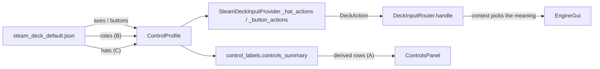

# Requirements

### Overview & Goals
**Status: not started. Parked deliberately** — the user asked for this to be written down so another fix could go
first, and then to come straight back to it. Nothing in the project has been changed for this plan.

The Controls panel footnote reads `* fixed, not set by the controller profile` (`controls_panel.py:499`) and attaches
to every section built with `fixed=True`, which earns a `*` on its heading (`controls_panel.py:598`). Five sections
claim it: `D-pad (w focus)`, `Switches (w focus)`, `Routes (w focus)`, `Catalog Panel (w focus)` and
`While a panel is open`. **The claim is not true of all of their rows**, and the goal is to make the screen and the
profile agree — first by correcting what is presently wrong on screen, then, optionally, by moving the genuinely
hard-coded bindings into the profile.

The investigation that produced this plan found that the footnote is **three unrelated jobs wearing one label**, and
they differ by roughly two orders of magnitude in cost:

| Section / row | Already in the profile | Actually hard-coded | Job |
| --- | --- | --- | --- |
| `Catalog Panel` — `R1 + Up / Down` | the modifier, action-keyed via `CATALOG_JUMP_MODIFIER` | only the **label** `"R1 + …"` | **A** — label |
| `Switches` / `Routes` — the trigger rows | the triggers *and* both face buttons, action-keyed via `SWITCH_THRU_ACTIONS` / `SWITCH_OUT_ACTIONS` / `ROUTE_FIRE_BUTTON_ACTIONS` | only the **labels** `"A / Y or L2 / R2"` and `"A or L2 / R2"` | **A** — label |
| `Catalog Panel` — `A`, `X`; `While a panel is open` — `X` | the buttons are bound (`sequence_control`, `reset`) | the **override**, by index: `SELECT_BUTTON = 0`, `CLOSE_POPUP_BUTTON = 2` | **B** — schema |
| `D-pad` — every row, and the D-pad rows of `Catalog Panel` | **nothing** | the whole input, all four directions in every context | **C** — new binding type |

Only **A** corrects something currently incorrect. **B** and **C** add configurability nobody has asked for yet, and
**C** also raises a design question the profile format has no answer to.

### Scope
#### In Scope
- **(A)** Deriving the jump-modifier and trigger row labels from the profile, as the stick rows beside them already
  are, and resolving what the `*` means for a section that is then only partly fixed.
- **(B)** An optional `roles` block in the profile that carries what `SELECT_BUTTON` / `CLOSE_POPUP_BUTTON` /
  `CATALOG_JUMP_MODIFIER` hard-code today, defaulting to exactly today's values.
- **(C)** A `hats` section plus `HatBinding` so the D-pad is bound like anything else, with `_hat_actions` looking
  bindings up rather than synthesizing them, and the `D-pad` section derived rather than literal.
- Whatever falls out of the above: the `fixed` flag and its footnote, `FOOTER_LINES`, and the column-packing
  assertions that move with them.

#### Out of Scope
- Any change to what a control *does* — this is about where the binding is declared, not about behaviour. The one
  exception is forced and called out under **(B)**: the existing dual select path has to be resolved.
- Re-deriving the Controls-panel layout (column order, `starts_column`, the Routes row budget). Settled last round;
  see the comment above `sections` in `control_labels.py`.
- Regenerating `doc/reference/steam-deck-controller-layout-screen.png` (a checked-in screenshot that cannot be
  produced headlessly).

### User Stories
- As a reader of the Controls panel, I want the modifier and trigger rows to name the buttons **my** profile binds,
  so the screen cannot tell me to press a button that does nothing.
- As a reader, I want a `*` to mean the row really cannot be moved, so the footnote is worth believing.
- As an author of a custom profile, I want to move *Select entry* and *Close panel* off A and X **(B)**.
- As an owner of a non-Deck gamepad, I want to bind the D-pad at all **(C)** — my pad reports its D-pad as
  game-controller buttons rather than as a hat, so today it cannot reach the D-pad rows.

### Functional Requirements
1. **(A)** The jump-modifier row names the button(s) in `catalog_jump_modifier_buttons`; the switch/route trigger rows
   name the axes actually carrying `SWITCH_THRU_ACTIONS` / `SWITCH_OUT_ACTIONS`.
2. **(A)** A row whose binding is absent from the profile is not rendered at all, rather than naming nothing.
3. **(A)** A section that is no longer wholly fixed must not carry a blanket `*`.
4. **(B)** `select`, `close_popup` and `catalog_jump` are declarable in the profile; omitting the block reproduces
   today's behaviour exactly.
5. **(B)** A profile that leaves `close_popup` unreachable is rejected or visibly degraded — there must always be a
   way out of a panel.
6. **(C)** The four D-pad directions are declarable, with a target, and default to today's `focused` synthesis.
7. **(C)** The D-pad section of the Controls panel is derived from those bindings.

### Non-Functional Requirements
- **Backward compatibility is the hard constraint.** Profiles are user files passed with `-controller_profile`;
  `ControlProfile.load` falls back to the bundled default only on `ProfileError`, so a silently-missing new section
  would quietly delete the control it describes. Every addition must be optional with defaults equal to today's
  constants.
- `control_labels`' stated first rule holds: the profile is the source of truth, and an unknown index degrades rather
  than raises. New labels must hold that line for a role that is unbound or on a button with no name.
- `ruff format --check` clean; the full `pytest` suite green.

# Technical Design

### Current Implementation

**The two label rows (A).** Neither binding needs moving — both are already action-keyed, exactly as you would want.
What is hard-coded is the row in `control_labels.py` that names them:

```python
ControlEntry("R1 + Up / Down", "Jump to first / last", ""),    # FIXED_CATALOG_ENTRIES
ControlEntry("A / Y or L2 / R2", "Throw thru / out", ""),      # FIXED_SWITCH_ENTRIES
ControlEntry("A or L2 / R2", "Fire route", ""),                # FIXED_ROUTE_ENTRIES
```

R1 is the jump modifier only because `steam_deck_default.json` binds button `5` to `front_coupler` and
`DECK_BUTTON_LABELS[5] == "R1"`. Rendering `controls_summary` against three profiles showed what a reader sees:

- **bundled** — modifier buttons `[5]`, row reads `R1 + Up / Down`. Correct.
- **`front_coupler` moved to button 4** — modifier buttons `[4]`, so **L1** jumps and the row still says `R1`. Wrong
  in the way that costs the reader most: it names a button that does nothing.
- **`front_coupler` unbound** — modifier buttons `[]`, the jump is unreachable, and the row is still listed.

Note the inconsistency inside the module: `button_label()` reads `DECK_BUTTON_LABELS`, and the switch/route *stick*
rows call `stick_label()` / `stick_deflection_label()` off the axis constants **precisely so the screen cannot drift
from the profile**. These three rows are the exception.

**Select and Close (B).** The buttons *are* bound; the router overrides them by index before it looks at the binding:

```python
if action.button == SELECT_BUTTON and getattr(gui, "catalog_visible", False):
if action.button == CLOSE_POPUP_BUTTON and getattr(gui, "popup_visible", False):
```

Four call sites: twice in `handle()`, once in `_controls_only()` (X closes the help screen), once in `_chooser_only()`
(A commits a choice). Separately, `_button_actions` returns no `DeckAction` at all for a button the profile does not
bind, so the router never reaches those checks — meaning a profile that omits index `0` or `2` silently kills *Select
entry* and the X half of *Close catalog* (D-pad left still closes it), and the screen would not say so. A profile
cannot **move** those two, which is what `fixed` means here, but it can switch them off.

**The D-pad (C).** Genuinely absent from the profile. `poll()` hands the SDL hat straight to `_hat_actions`, which
synthesizes `dpad_up`/`dpad_down`/`dpad_left`/`dpad_right` with target `"focused"` without consulting `self.profile`
at all, apart from the jump modifier. There is nothing to move — there is something to invent.

### Job A — the label fix

- Build the catalog row as `f"{button_label(index)} + Up / Down"` from `catalog_jump_modifier_buttons`; render nothing
  when the set is empty.
- Build the switch/route trigger rows from the axes *and buttons* carrying `SWITCH_THRU_ACTIONS` / `SWITCH_OUT_ACTIONS`, via
  `axis_label()` and `button_label()`; likewise drop a half whose binding is unbound. A route takes the thru button
  alone (`ROUTE_FIRE_BUTTON_ACTIONS`) and swallows the out one, so its row names one face button where the switch row
  names two — `ROUTE_FIRE_ACTIONS` is what fires, `ROUTE_CLAIMED_ACTIONS` what a route panel takes.
- `FIXED_CATALOG_ENTRIES` / `FIXED_SWITCH_ENTRIES` / `FIXED_ROUTE_ENTRIES` stop being module constants and become
  functions of the profile, as the derived sections already are.
- The `fixed=True` flag on those three sections becomes untrue, so **either** the `*` moves to individual entries
  **or** those sections gain a `note` naming the profile-derived part. Deciding this is part of the step.
- No schema change, no router change. Roughly a half-day including tests.

### Job B — a `roles` block

The blocker is the schema shape: `buttons` is `index → one binding`, so a button cannot carry both "sequence control
on an engine" and "select in the catalog". Today the dual meaning is exactly what the hard-coded index buys. So this
needs a new kind of entry — a **role map**, not a binding:

```json
"roles": {
  "select":       [0],
  "close_popup":  [2],
  "catalog_jump": [5]
}
```

…or, following the pattern already in the module, keyed by action (`"select": "sequence_control"`) so the role moves
with the binding. Also involved:

- **An existing hybrid to resolve first.** `handle()` already selects from the catalog on
  `action.name == SEQUENCE_CONTROL` *and* on `action.button == SELECT_BUTTON`, so today two different buttons can both
  select if a profile moves `sequence_control`. Making this configurable forces a choice between them, which is a
  behaviour change rather than plumbing — flag it to the user before implementing.
- **What "unbound" should mean.** Reject in `from_dict`, or degrade visibly? Validate `close_popup` at minimum.
- Defaults identical to today's constants.

Perhaps a day and a half, mostly tests.

### Job C — a `hats` section, and the design question it hides

Mechanically:

- A `hats` section, a `HatBinding`, parsing and validation in `from_dict` (a hat has an index **and** a direction,
  which no existing binding does), and index validation for both.
- `_hat_actions` looks bindings up instead of synthesizing; the target comes from the binding rather than being fixed
  at `"focused"`; the `jump` flag on `DeckAction` and the paired press/release emission have to survive that.
- `capability_warnings()` has no notion of hats and would want `get_numhats()`.
- `control_labels`: a `DECK_HAT_LABELS` / `hat_label()` pair, and the D-pad section derived rather than literal. The
  action *names* are already in `ACTION_LABELS`, so that part is done.

**The design question.** One D-pad press means four different things depending on what is on screen — page the help
screen, move a chooser, scroll or jump the catalog, or boost/brake the engine — and the router picks between them at
handling time. The profile format says "this control does this one thing". So:

1. **Bind the role** — the file says *which physical control* plays `dpad_up`, and the four meanings stay in the
   router. Fits the existing format, keeps every context guaranteed reachable, and is what makes the app usable on a
   non-Deck gamepad: `scripts/deckinfo.py` documents that the profile is indexed by the *joystick* numbering, in which
   the Deck's D-pad is a hat, while other pads report a D-pad as game-controller buttons 11–14. Those pads cannot be
   bound to it at all today.
2. **Bind the meanings** — the file says what up does with the catalog open, with a chooser open, with the help screen
   open, otherwise. Multiplies the schema by the number of contexts, needs a new action name per context, and lets
   someone write a profile with no way to scroll the catalog.

**Do (1), not (2).** (2) is configurability nobody has asked for, at the cost of a format that can express an
unusable machine.

Two to three days for (1), most of it tests — `test_steam_deck_input.py` is ~3,000 lines and around forty of its tests
drive the hat or those constants directly.

### Key Decisions
- **Sequencing: A now, B next, C separately.** A is the only part that corrects something untrue on screen and needs
  no schema change. B belongs before C because the `roles` block is where the D-pad's own roles would live. C should
  be justified by generic-controller support rather than by the footnote; if the Deck is the only target, the honest
  cheap alternative is to keep the constants and say so in the section note.
- **Action-keyed over index-keyed** wherever there is a choice, matching `CATALOG_JUMP_MODIFIER` and the switch/route
  remaps, so a role follows the binding a profile moves.
- **Every new section optional**, defaults equal to today's constants.

### Data Models / Contracts
```python
# steam_deck_input.py  (Job B)
DEFAULT_ROLES = {"select": frozenset({SELECT_BUTTON}),
                 "close_popup": frozenset({CLOSE_POPUP_BUTTON})}

@dataclass(frozen=True)
class ControlProfile:
    ...
    roles: Mapping[str, frozenset[int]] = field(default_factory=dict)   # merged over DEFAULT_ROLES

# steam_deck_input.py  (Job C)
HAT_DIRECTIONS = ("up", "down", "left", "right")

@dataclass(frozen=True)
class HatBinding:
    action: str      # "dpad_up" | "dpad_down" | "dpad_left" | "dpad_right"
    target: Target   # "focused" by default, as _hat_actions fixes it today
```

```python
# control_labels.py  (Job A) -- rows become functions of the profile
def catalog_entries(profile: ControlProfile) -> tuple[ControlEntry, ...]: ...
def switch_entries(profile: ControlProfile) -> tuple[ControlEntry, ...]: ...
def route_entries(profile: ControlProfile) -> tuple[ControlEntry, ...]: ...
```

### File Structure
- `src/pytrain/gui/controller/control_labels.py` — **(A)** derived modifier/trigger rows, the `fixed` flag question;
  **(C)** `DECK_HAT_LABELS` / `hat_label()` and a derived D-pad section.
- `src/pytrain/gui/controller/steam_deck_input.py` — **(B)** `roles` parsing/validation and the four override call
  sites; **(C)** `hats` / `HatBinding`, `_hat_actions`, `capability_warnings`.
- `src/pytrain/gui/controller/controls_panel.py` — the footnote, the `*` on headings, and `FOOTER_LINES` if `fixed`
  retires.
- `src/pytrain/gui/controller/steam_deck_default.json` — a `roles` block **(B)** and a `hats` section **(C)**.
- `tests/gui/controller/test_control_labels.py`, `test_controls_panel.py`, `test_steam_deck_input.py`.
- `scripts/deckinfo.py` (the numbering note), `scripts/controlspreview.py`,
  `doc/reference/steam-deck-controller-layout-screen.png` (stale, cannot be regenerated headlessly).

### Architecture Diagram


### Alternatives Considered
- **Make the code match the label** — key the jump modifier on a fixed button index. Honest, but it throws away a
  remappability that was chosen on purpose, and not worth doing just to rescue a footnote.
- **Keep the `*`, footnote the exception** — leave the rows literal and add a section note saying the jump modifier is
  the front-coupler button. The cheapest honest fix, and the fallback if (A) proper is not wanted; costs a row in a
  column that has one to spare.
- **Soften the footnote for all fixed sections** ("fixed unless noted"). Vaguest, and it weakens a claim that is
  exactly true of the D-pad, switch, route and popup sections.

### Risks
- **A silently-missing section deletes a control.** See the backward-compatibility note above; this is the one that
  can break a user's machine rather than a test.
- **The `fixed` flag stops meaning anything.** If all five sections become profile-derived, `ControlSection.fixed`,
  the `*` on headings and `"* fixed, not set by the controller profile"` all go — and `FOOTER_LINES` drops from 2 to
  1 (`controls_panel.py:107`), handing the columns back a row. That is the row spent on the Routes section, so it is a
  small bonus; it also moves every column-packing assertion in `test_controls_panel.py`.
- **Row width.** A derived label can be longer than the literal it replaces (`Button 7 + Up / Down` against
  `R1 + Up / Down`), and the Deck's column width is what it is. Check with `scripts/controlspreview.py`.
- **Test surface.** ~40 tests in `test_steam_deck_input.py` drive the hat or the two button constants directly; **(C)**
  is mostly that.
- **No documented schema.** The profile format is documented only by module comments — nothing in `doc/`. If this is
  meant to be a user-facing capability, that gap is worth filling in the same work.

# Testing

### Validation Approach
Three fronts, matching the three jobs. **(A)** is pure label derivation, so it is tested the way the derived sections
already are: build `controls_summary` against hand-made profiles and assert on the rows. **(B)** and **(C)** need the
fake-pygame provider tests in `test_steam_deck_input.py`, plus profile-parsing tests for the new blocks. The
column-packing consequences are asserted in `test_controls_panel.py`.

### Key Scenarios
- **(A)** With the bundled profile, the rows read `R1 + Up / Down`, `A / Y or L2 / R2` and `A or L2 / R2` — unchanged
  from today.
- **(A)** With `front_coupler` on button 4, the row reads `L1 + Up / Down`.
- **(A)** With the switch triggers moved to other axes, the trigger rows name those axes.
- **(B)** A profile with no `roles` block behaves exactly as today at all four override call sites.
- **(B)** A profile that moves `select` to another button selects with that button and not with A.
- **(C)** A profile with no `hats` section produces today's `dpad_*` actions with target `focused`, including the
  paired release and the `jump` flag.
- **(C)** A profile binding a hat direction to a fixed pane targets that pane.

### Edge Cases
- **(A)** `front_coupler` unbound → no jump row at all, and the section still renders its other three.
- **(A)** A binding on a button or axis with no name in `DECK_*_LABELS` → `Button 7` / `Axis 9`, never a raise.
- **(B)** `close_popup` unreachable → rejected in `from_dict`, or a visible warning; a panel must always have a way
  out.
- **(C)** A hat index the device does not have → `capability_warnings()` says so; nothing raises.
- **(C)** A profile binding only some directions → the others simply do nothing, and their rows are not drawn.

### Test Changes
- `test_control_labels.py` — the row expectations for the three sections, plus new cases driving a moved and an
  unbound modifier/trigger. The existing `test_the_panel_remaps_name_their_sticks_as_the_joysticks_section_does` is
  the pattern to follow: it exists because the stick rows are derived.
- `test_controls_panel.py` — the `fixed` / `*` assertions and, if `FOOTER_LINES` changes, the budget sweep in
  `test_the_last_column_holds_only_the_per_panel_sections`.
- `test_steam_deck_input.py` — `roles` and `hats` parsing, the four override call sites, and the ~40 existing tests
  that drive the hat or the button constants.
- `../bin/python -m ruff format --check` on the changed files, then the full `../bin/python -m pytest`.

# Delivery Steps

### Step 1: Derive the modifier and trigger labels from the profile (Job A)
The Controls panel names the buttons and axes the loaded profile actually binds, so no row can name a control that
does nothing.

- In `control_labels.py`, replace `FIXED_CATALOG_ENTRIES` / `FIXED_SWITCH_ENTRIES` / `FIXED_ROUTE_ENTRIES` with
  profile-taking builders; derive the jump row from `catalog_jump_modifier_buttons` via `button_label()` and the
  trigger rows from the axes carrying `SWITCH_THRU_ACTIONS` / `SWITCH_OUT_ACTIONS` via `axis_label()`.
- Omit a row whose binding is absent rather than naming nothing; keep the rest of the section.
- Decide and implement what happens to `fixed=True` on those three sections — the `*` on individual entries, or a
  section `note` — and record the reasoning in the comment beside it, as the module does elsewhere.
- Check the derived labels against the Deck's column width with `scripts/controlspreview.py`.
- Update `test_control_labels.py` and any `fixed`/`*` assertion in `test_controls_panel.py`; run
  `ruff format --check` and the full suite.

### Step 2: Add an optional `roles` block for select / close / catalog-jump (Job B)
A profile can move *Select entry*, *Close panel* and the catalog-jump modifier off A, X and R1, and a profile without
the block behaves exactly as it does today.

- **Ask the user first** how the existing dual select path should resolve: `handle()` selects on both
  `action.name == SEQUENCE_CONTROL` and `action.button == SELECT_BUTTON`, so making this configurable forces a
  behaviour decision.
- Add a `roles` mapping to `ControlProfile` with parsing and validation in `from_dict`, defaulting to today's
  `SELECT_BUTTON` / `CLOSE_POPUP_BUTTON` / `CATALOG_JUMP_MODIFIER` values.
- Replace the four index comparisons (twice in `handle()`, once in `_controls_only()`, once in `_chooser_only()`) with
  role lookups.
- Validate that `close_popup` is reachable; decide reject-vs-degrade and document it.
- Add the block to `steam_deck_default.json`, extend `test_steam_deck_input.py`, and update the affected label rows.

### Step 3: Bind the D-pad in the profile (Job C)
The D-pad is declared like any other control, which also makes the app bindable on a gamepad that reports its D-pad as
buttons rather than as an SDL hat.

- Add `HatBinding` and a `hats` section with parsing, direction and index validation in `from_dict`; default to
  today's synthesis so an existing profile is unaffected.
- Have `_hat_actions` look bindings up rather than synthesize, taking the target from the binding while preserving the
  `jump` flag and the paired press/release emission.
- Teach `capability_warnings()` about hats (`get_numhats()`).
- Add `DECK_HAT_LABELS` / `hat_label()` and derive the D-pad section from the bindings.
- Retire `ControlSection.fixed`, the `*` and the footnote if nothing fixed remains, dropping `FOOTER_LINES` to 1 and
  moving the column-packing assertions with it.
- Update `steam_deck_default.json`, the numbering note in `scripts/deckinfo.py`, and the ~40 hat/constant tests in
  `test_steam_deck_input.py`; run `ruff format --check` and the full suite.
