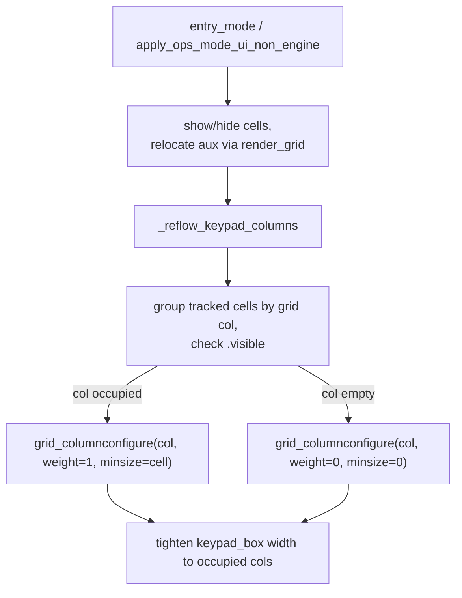

# Requirements

### Overview & Goals

The keypad on the Portrait and Landscape (Steam Deck) controllers is a fixed five-column grid. Columns 0–2 hold the numeric keypad; column 3 (the visible "4th column") holds ops-only keys (Set / Info / Aux1 / Aux2 / toggle / acc-generic); column 4 holds the accessory throttle slider. On the Entry views — and on any ops view that puts nothing in column 3 — the 4th column still reserves its width and shows as an empty gap.

Goal: the 4th column (and, generally, any keypad column) should occupy space only when it actually contains a visible button. When empty, it collapses so the numeric keypad reads as a clean 3-wide pad with no dangling empty column.

### Scope

**In Scope**

- Collapse keypad column 3 (and column 4) when it has no visible cell; restore it when a cell becomes visible.
- Apply on the Entry views and on every ops view (route, switch, generic accessory, BPC2/ASC2, etc.).
- Works identically on Portrait and both Steam Deck panes, because the whole change lands in `KeypadView`.

**Out of Scope**

- Any change to which keys appear on which panel (behavior stays locked by the existing checkpoint tests).
- Reworking the numeric keypad columns 0–2 (they always hold visible keys).
- New keys, new panels, or gamepad changes.

### User Stories

1. As an operator on the Entry view, I want the empty 4th column gone, so that the number pad looks clean and centered.
2. As an operator, I still want the Set / Info / Aux / toggle keys to appear normally when I move to an operating screen that uses them, so the collapse is invisible in daily use.

### Functional Requirements

- **FR-1** — In Entry mode, column 3 is collapsed (no reserved width, no visible empty cell) because its cells (`sw_set_cell`, `info_cell`, `acc_generic_cell`, aux `Set` / toggle / `Aux1` / `Aux2`) are all hidden.
- **FR-2** — When entering an ops view that shows a column-3 cell (Switch `Set`/`Info`, generic-accessory `Info`/aux, BPC2/ASC2 toggle), column 3 expands to full cell width.
- **FR-3** — Returning to Entry mode (or to any view with an empty column 3, such as Route ops) re-collapses it.
- **FR-4** — The numeric columns 0–2 never collapse.
- **FR-5** — The visible keypad tightens around its occupied columns so the numeric pad does not float, leaving a gap where the empty column used to be.

### Non-Functional Requirements

- No regression to key visibility, panel selection, or transitions — the existing checkpoint suite stays green apart from the intended entry/ops column-width expectations.
- No new blocking work on the Tk thread; the reflow is a cheap grid reconfigure.
- Compact (Steam Deck) geometry unaffected apart from the intended collapse; `ruff format --check` clean; full `pytest` green.

# Technical Design

### Current Implementation

The keypad is built in `KeypadView.build` (`keypad_view.py`). `host.keypad_box` is the outer `Box`; `host.keypad_keys` is the inner `layout="grid"` `Box` that actually holds the cells.

Every cell is created through `EngineGui.make_keypad_button` → `GuiZeroBase._build_keypad_button`, which for each cell runs, on `keypad_keys`:

```python
keypad_box.tk.grid_columnconfigure(col, weight=1, minsize=self.button_size + (2 * extra_pad))
```

This reserves a column's width **at build time**, and the reservation persists regardless of whether the cell is later hidden.

**Root cause of the empty 4th column.** The accessory/switch work added three cells built directly at column 3 — `sw_set_cell` (grid `[3, 0]`), `info_cell` (grid `[3, 2]`) and `acc_generic_cell` (grid `[3, 2]`). Building them configured column 3 with a permanent `minsize`, so column 3 now reserves space in Entry mode (and any view that hides them). By contrast:

- Column 4 (the throttle) is created via `make_slider` and its column is never `grid_columnconfigure`d on `keypad_keys`, so it collapses naturally when hidden.
- The aux `Set` / toggle / `Aux1` / `Aux2` cells are built at column 2 and only *relocated* to column 3 at runtime via their `render_grid` attribute in `_expand_acc_aux_cells` / `_collapse_acc_aux_cells`, so historically column 3 was never permanently reserved.

The mode transitions (`entry_mode`, `enter_ops_mode_base`, `apply_ops_mode_ui_non_engine`) only show/hide cells and relocate aux cells — none of them reconfigure column widths.

### Key Decisions

| Decision | Choice | Rationale |
| --- | --- | --- |
| Where to fix | A reflow pass in `KeypadView` that reconfigures `keypad_keys` columns from live cell visibility | Keeps the single grid the one source of layout truth; no per-cell special casing |
| Trigger | Call reflow at the end of every keypad mode transition | Column occupancy is only known after cells are shown/hidden and aux cells relocated |
| Occupancy source | Read each keypad cell's `.grid[0]` and `.visible` at reflow time | Cells already carry `.grid`; reading late captures aux cells relocated to col 3 via `render_grid` |
| Empty-column form | `grid_columnconfigure(col, weight=0, minsize=0)` when empty; restore `weight=1, minsize=button_size+pad` when occupied | Standard Tk collapse; symmetric with the build-time config |
| Numeric columns | 0–2 always hold visible numeric keys, so the occupancy rule never collapses them | Falls out of the rule; no special case |
| Avoid a floating pad | Also tighten `keypad_box` / `keypad_keys` width to the occupied-column count | Removes the right-side gap so the pad stays visually centered |

### Proposed Changes

1. **Track keypad cells.** Collect every cell built into `keypad_keys` in a new `KeypadView` collection (e.g. `self._keypad_cells`). The single factory point is `make_keypad_button`; register the returned cell when its parent box is `keypad_keys` (numeric, entry, ops and aux cells all pass through it). Include the accessory throttle box so column 4 is covered by the same rule.
2. **Add `KeypadView._reflow_keypad_columns()`:**
   - Group `self._keypad_cells` by `cell.grid[0]`.
   - For each grid column `0..num_cols-1`: if any cell in it is `visible` → `keypad_keys.tk.grid_columnconfigure(col, weight=1, minsize=min_cell_width)`; else `grid_columnconfigure(col, weight=0, minsize=0)`.
   - Compute the occupied-column count and set `keypad_box` (and `keypad_keys`) width to `occupied_cols * min_cell_width` so the pad tightens.
3. **Invoke reflow** at the end of each keypad transition: `entry_mode`, and every branch of `apply_ops_mode_ui_non_engine` (route, switch, and the accessory/BPC2/ASC2 branch) after `_expand_acc_aux_cells` / `_collapse_acc_aux_cells` and the cell show/hide. Engine/train hide the keypad entirely, so a reflow there is unnecessary (and harmless).

### Data Models / Contracts

```python

# KeypadView

self._keypad_cells: list          # cells parented to keypad_keys (+ throttle box)
def _reflow_keypad_columns(self) -> None
```

### Components

| Component | Change |
| --- | --- |
| `KeypadView.build` / `make_keypad_button` path | Record keypad cells for reflow |
| `KeypadView._reflow_keypad_columns` | New: collapse/expand columns from visibility, tighten width |
| `KeypadView.entry_mode` | Call reflow after hiding ops cells |
| `KeypadView.apply_ops_mode_ui_non_engine` | Call reflow at the end of each branch |
| `EngineGui.make_keypad_button` | Optionally surface the built cell/parent so `KeypadView` can register it |
| `SteamDeckGui` | **No change** — it hosts `KeypadView` via `EngineGui` panes |

### File Structure

```
src/pytrain/gui/controller/
  keypad_view.py            (modified)  cell tracking + _reflow_keypad_columns + wiring

tests/gui/
  test_keypad_view.py       (modified)  column collapse/expand per scope + width tightening
  test_gui_checkpoint.py    (modified)  lock: col 3 collapsed in entry, expanded in ops
  test_gui_deck_parity.py   (modified)  compact / pane-hosted parity of the collapse
```

### Architecture Diagram



### Risks

| Risk | Mitigation |
| --- | --- |
| Numeric columns wrongly collapse | Numeric cells are tracked and always visible in entry + ops; the occupancy rule keeps 0–2 |
| Aux cells relocated to col 3 not counted | Reflow reads `.grid[0]` at call time, after `_expand_acc_aux_cells`, so the relocation is seen |
| Pad floats after collapse | Tighten `keypad_box` width to the occupied-column count |
| Compact geometry drift | Cover compact construction in `test_gui_deck_parity.py`; widths derive from `button_size` |
| Missing a transition path | Reflow is called from the shared entry/ops choke points; tests assert every scope |

# Testing

### Validation Approach

Headless, using the existing `DummyTk` / `DummyWidget` fakes. `DummyTk.grid_columnconfigure` is currently a no-op; extend it (or add a recording subclass) to capture per-column `weight` / `minsize` so tests can assert collapse and expand.

### Key Scenarios

- Entry mode: column 3 configured `weight=0, minsize=0`; columns 0–2 remain occupied.
- Switch ops: column 3 occupied (`Set` / `Info` visible) → `weight=1, minsize>0`.
- Generic accessory ops: column 3 occupied (`Info` + relocated aux) → expanded.
- BPC2 / ASC2 ops: column 3 occupied (acc-generic toggle) → expanded.
- Route ops: column 3 empty (only the fire key, in col 1) → collapsed.
- Returning to entry after any ops view re-collapses column 3.

### Edge Cases

- Column 4 (throttle) stays collapsed except on the generic accessory panel.
- Aux cells relocated to col 3 via `render_grid` count as occupancy.
- The pad width equals the occupied-column count in both compact and portrait.

### Test Changes

- **Modified** `tests/gui/test_keypad_view.py` — collapse/expand assertions per scope plus width tightening.
- **Modified** `tests/gui/test_gui_checkpoint.py` — reconcile the entry/ops column-width expectations (the only intended change); every other locked assertion untouched.
- **Modified** `tests/gui/test_gui_deck_parity.py` — compact / pane-hosted parity of the collapse.

Each stage ends with `../bin/python -m ruff format --check <changed files>` and the full `../bin/python -m pytest`, per the project instructions.

# Delivery Steps

### ✓ Step 1: Add keypad column reflow to KeypadView
`KeypadView` can compute which keypad columns hold visible cells and collapse the empty ones, verified in isolation.

- Add a `self._keypad_cells` collection in `KeypadView` and register each cell built into `keypad_keys` (numeric, entry, ops and aux cells) plus the accessory throttle box, via the `make_keypad_button` path.
- Add `_reflow_keypad_columns()` that groups tracked cells by `cell.grid[0]` and, for each grid column, sets `keypad_keys.tk.grid_columnconfigure(col, weight=1, minsize=button_size+pad)` when it has a visible cell, else `weight=0, minsize=0`.
- Tighten `keypad_box` / `keypad_keys` width to the occupied-column count so the numeric pad does not float.
- Add focused unit tests in `tests/gui/test_keypad_view.py` (with a recording `grid_columnconfigure`) asserting the occupancy computation for a hand-built mix of visible and hidden cells, including an aux cell relocated to column 3.
- Run `../bin/python -m ruff format --check` on the changed files and the full `../bin/python -m pytest`.

### ✓ Step 2: Wire the reflow into every keypad transition and lock it with tests
The empty 4th column disappears on Entry and any empty-column view and reappears when a column-3 key is shown, across Portrait and both Steam Deck panes.

- Call `_reflow_keypad_columns()` at the end of `entry_mode` and at the end of every branch of `apply_ops_mode_ui_non_engine` (route, switch, generic accessory / BPC2 / ASC2), after the aux expand/collapse and cell show/hide.
- Extend `tests/gui/test_keypad_view.py` to assert column 3 collapses in entry and route, expands for switch / generic / BPC2 / ASC2, and re-collapses on return to entry.
- Reconcile `tests/gui/test_gui_checkpoint.py`: update only the entry/ops column-width expectations, leaving all other locked assertions intact as the no-regression proof.
- Add compact / Steam-Deck parity assertions in `tests/gui/test_gui_deck_parity.py` that the collapse, expand and width tightening hold for a compact host and a pane-hosted `EngineGui` (no `SteamDeckGui` change).
- Run `../bin/python -m ruff format --check` on the changed files and the full `../bin/python -m pytest`.
