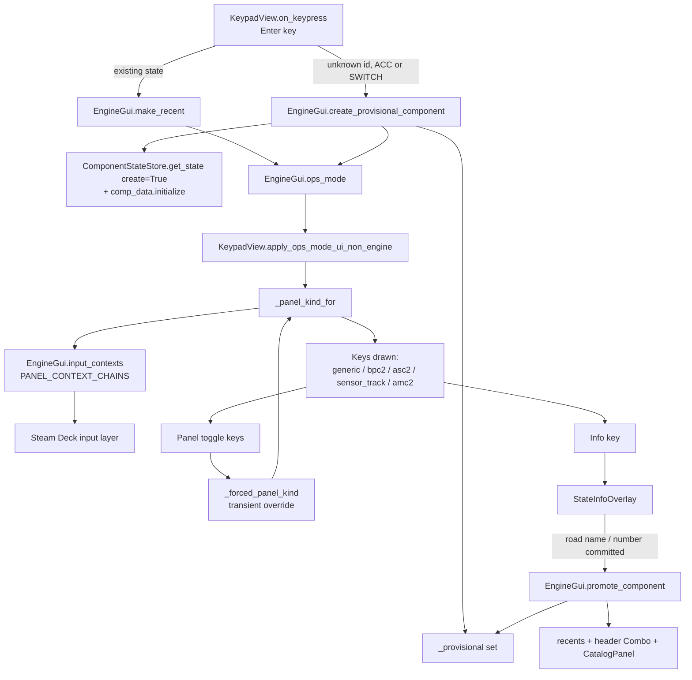

# Requirements

### Overview & Goals

Today `EngineGui` is a *selector* for entities that already exist. Typing a TMCC ID that the Base 3 has never heard of leaves you stranded on the entry keypad: `KeypadView.on_keypress`'s `↵` branch calls `EngineGui.make_recent`, gets `False` because `state_store.get_state(..., create=False)` returned nothing, and falls straight back to `entry_mode`.

This change makes the graphical controllers able to **create** as well as operate **Accessories** and **Switches**, and makes the LCS-specific accessory screens (BPC2, ASC2, Sensor Track, AMC2) able to toggle to the generic Accessory screen — the one that carries `Set Address` — and back.

Per your direction, **Engines, Trains and Routes are out of scope** for this pass.

### Scope

**In Scope**

- `↵` on an undefined **Accessory** or **Switch** ID enters the operating screen instead of bouncing back to entry.
- That screen is the **generic** panel for its scope, augmented with a `Set` key and an `Info` key where those do not already exist.
- `Info` opens the existing `StateInfoOverlay` for the current TMCC ID, where Road Name and Road Number can be assigned.
- A provisional (unnamed) record stays out of the recents dropdown and the scope catalog until a Road Name or Road Number is committed.
- A **panel toggle** on the BPC2, ASC2, Sensor Track and AMC2 operating screens that switches to the generic Accessory panel, and a way back from the generic panel to the LCS-specific one.
- Everything works identically on the portrait controller and on both Steam Deck panes, because it all lands in `EngineGui` / `KeypadView`, which `SteamDeckGui` hosts unchanged.
- A behavior-locking checkpoint test module committed **before** any behavior change.

**Out of Scope**

- Engine and Train creation (deferred to a later turn, as you asked).
- Route creation and Route editing.
- Creating or editing `accessory_config.json` entries (configured accessories) from the GUI — naming here writes Road Name/Road Number to the Base 3 via `comp_data`, exactly as long-pressing the image does today.
- New gamepad bindings for the new keys; the existing context chains keep working because they are keyed off the reported panel kind.

### User Stories

1. As an operator, I want to key in an Accessory number that does not exist yet and press `↵`, so that I land on the generic Accessory screen and can press `Set` to program a new LCS device or accessory to that address.
2. As an operator, I want an `Info` key on that screen, so that I can give the new Accessory a Road Name and Road Number without hunting for a long-press target.
3. As an operator, I want the same for an undefined Switch number, so that I can name new switches — today the Switch screen has no image at all, so long-press info is simply unavailable there.
4. As an operator on a BPC2 or ASC2 screen, I want a key that takes me to the generic Accessory panel so I can reach `Set Address`, and a key there that takes me back to the LCS-specific display.
5. As an operator, I do not want mistyped IDs cluttering my recents list or scope catalog.

### Functional Requirements

**FR-1 — Create on `↵`**

- Scope is `ACC` or `SWITCH`, entered ID passes the same validation the `Set` key already applies (`2 <= id <= 98`, `id != 99`), and no state exists → materialize the record and enter ops mode.
- Scope is `ENGINE`, `TRAIN` or `ROUTE` → unchanged; still returns to entry mode.
- An out-of-range or `0` ID → unchanged; still returns to entry mode.

**FR-2 — Augmented operating screen**

| Screen | `Set` | `Info` |
| --- | --- | --- |
| Generic Accessory | already present (aux cell, `SET_ADDRESS`) | **new**, 4th column |
| Switch | **new** | **new**, 4th column |

- `Info` opens `StateInfoOverlay` for the current scope + TMCC ID with Road Name and Road Number editable, and `Clear` disabled for LCS-backed states (`LcsState.is_deletable` is already `False`).
- Both keys appear for provisional *and* already-defined Accessories/Switches — you asked for creation *and* editing.

**FR-3 — Deferred promotion**

- A provisional record does not appear in the header `Combo`, the recents deque, or the `CatalogPanel` list.
- Committing a Road Name or Road Number promotes it: it is added to recents, the options list is rebuilt, and the catalog cache is reset.
- A real configuration record arriving from the Base 3 for that ID promotes it too.
- Leaving the ID without naming it leaves no trace in recents or the catalog.

**FR-4 — Panel toggling**

- BPC2, ASC2, Sensor Track and AMC2 screens each carry a key that switches the display to the generic Accessory panel for the same TMCC ID.
- The generic panel, when reached that way, carries a key back to the LCS-specific panel.
- An Accessory ID that is neither defined nor backed by an LCS device displays the generic panel — which is already what the panel-kind rules produce; the fix is being able to *reach* ops mode at all (FR-1).
- The gamepad follows the screen: because `KeypadView.accessory_panel_kind` remains the single decision point, a forced-generic display reports `generic` and the input layer picks the `acc_generic` chain automatically.

**FR-5 — Override lifetime**

Per your choice, the override is a **single transient flag**: it is cleared on any change of selected TMCC ID, any change of scope, and on return to entry mode. Leaving a device and coming back shows its native panel again.

### Non-Functional Requirements

- No geometry regressions on the compact (Steam Deck) panes: new keys occupy existing empty grid slots and add no rows or columns.
- No new blocking work on the Tk thread; naming continues to go out through `BaseReq.process_sync_reqs(..., do_async=True)`.
- `ruff format --check` clean; full `pytest` suite green.

# Technical Design

### Current Implementation

**The dead end.** `KeypadView.on_keypress` (`keypad_view.py:590`):

```python
elif key == ENTER_KEY:
    self._reset_on_keystroke = False
    if host.make_recent(host.scope, int(tmcc_id)):
        host.ops_mode()
    else:
        self.entry_mode(clear_info=False)   # <-- the trap
```

`EngineGui.make_recent` returns `False` whenever `state_store.get_state(self.scope, tmcc_id, False)` yields nothing, so an unknown ID can never leave entry mode.

**The creation primitive already exists**, in the `Set` branch immediately above (`keypad_view.py:577`):

```python
state = ComponentStateStore.get_state(host.scope, tmcc_id, create=False)
if state is None:
    state = ComponentStateStore.get_state(host.scope, tmcc_id, create=True)
    state.initialize(scope=host.scope, tmcc_id=tmcc_id)
    host.ops_mode(update_info=True, state=state)
    host.on_info(state=state)
```

`ComponentStateStore.get_state(create=True)` indexes the `ComponentStateDict` default-dict, so the state becomes a real store entry. `CompDataMixin.initialize` (`db/comp_data.py:246`) builds an `AccessoryData` / `SwitchData` with `_empty = True` and `_comp_data_record = True`, so `is_comp_data_empty` stays `True` until the Base 3 answers — which is exactly the marker that distinguishes "provisional" from "real".

**Panel selection** is centralized in `KeypadView._panel_kind_for` (`keypad_view.py:130`), read both by `apply_ops_mode_ui_non_engine` for the keys it draws and by `EngineGui._accessory_contexts` for the gamepad chain via `PANEL_CONTEXT_CHAINS`.

**Naming** already works: `StateInfoOverlay._on_road_name_edited` / `_on_road_number_edited` build `comp_data.set_road_name_req` / `set_road_number_req` and dispatch through `BaseReq.process_sync_reqs`.

**Reachability of the info panel today**: `EngineGui._bind_image_long_press` puts `on_info` on the image's `SwipeDetector`. But `_refresh_component_view` hides `image_box` for any scope outside `{ENGINE, TRAIN, ACC}` — so a **Switch has no long-press route to the info panel at all**. The new `Info` key closes that hole.

### Key Decisions

| Decision | Choice | Rationale |
| --- | --- | --- |
| Creation mechanism | Reuse the `Set` key's `get_state(create=True)` + `comp_data.initialize` pair | Already proven in production code; no new persistence path |
| Panel override storage | Single transient `_forced_panel_kind` on `KeypadView` (your choice) | Keeps `_panel_kind_for` the one decision point, so screen and gamepad cannot disagree |
| Recents/catalog entry | Deferred until named (your choice) | Mistyped IDs leave nothing behind |
| Provisional marker | `state.is_comp_data_empty` plus an explicit `EngineGui._provisional` set | The flag alone is ambiguous — a real but not-yet-fetched state is also "empty"; the set records *we* created it |
| Generic-panel exit key | Extend the existing `ac_op_btn` rather than add a cell | It already means "go to the more specific view of this ID" and already sits in the one free generic-panel slot |
| New key placement | Column 3 (the 4th column), row 2 | Verified empty: `Set`=[3,0], toggle-direction=[3,1], `Aux1`=[3,3], `Aux2`=[3,4]; column 4 is the throttle slider |

### Proposed Changes

**1. `keypad_view.py` — the `↵` branch**

```python
elif key == ENTER_KEY:
    self._reset_on_keystroke = False
    entered = int(tmcc_id)
    if host.make_recent(host.scope, entered):
        host.ops_mode()
    elif self._can_create(host.scope, entered):
        state = host.create_provisional_component(host.scope, entered)
        host.ops_mode(update_info=True, state=state)
    else:
        self.entry_mode(clear_info=False)
```

`_can_create` gates on `scope in CREATABLE_SCOPES` (`{ACC, SWITCH}`) and the `Set` key's existing range rule. `CREATABLE_SCOPES` is derived from `SCOPE_TO_SET_ENUM` minus `ENGINE`, so adding Engines later is a one-line change.

**2. `engine_gui.py` — provisional bookkeeping**

```python
self._provisional: set[tuple[CommandScope, int]] = set()

def create_provisional_component(self, scope: CommandScope, tmcc_id: int) -> ComponentState:
    state = self._state_store.get_state(scope, tmcc_id, False)
    if state is None:
        state = ComponentStateStore.get_state(scope, tmcc_id, create=True)
        state.initialize(scope=scope, tmcc_id=tmcc_id)
    self._provisional.add((scope, tmcc_id))
    self._scope_tmcc_ids[scope] = tmcc_id
    return state

def is_provisional(self, scope, tmcc_id) -> bool: ...
def promote_component(self, state) -> None:      # clears the flag, make_recent,
    ...                                          # _request_options_rebuild,
                                                 # _reset_catalog_configured_accessories
```

- `_update_recent_selection` skips `make_recent` while the selection is provisional (FR-3).
- `on_new_switch` / `on_new_accessory` call `promote_component` when a provisional state stops reporting `is_comp_data_empty` — i.e. the Base 3 answered.
- `_rebuild_state_caches` discards the provisional entry when a state is deleted.

**3. `state_info_overlay.py` — promotion hook**

`_on_road_name_edited` and `_on_road_number_edited` gain a single trailing call to `self.gui.promote_component(state)` after the request is dispatched. Nothing else in the overlay changes; the existing `reset_visibility(scope, ...)` already renders the right field set for `ACC`, and `SwitchState` (a `TmccState, LcsProxyState`) is handled by the default/None-scope fields.

**4. `keypad_view.py` — the override and the new keys**

```python
@property
def panel_kind_override(self) -> str | None: ...
def set_panel_kind_override(self, kind: str | None) -> None: ...

def _panel_kind_for(self, state):
    if not self.is_accessory_or_bpc2 or state is None:
        return None
    if self._forced_panel_kind is not None:
        return self._forced_panel_kind
    ...   # unchanged flag rules
```

Cleared from `entry_mode`, from `EngineGui.on_scope`, and from `update_component_info` when `selection_changed` — FR-5.

New cells built in `KeypadView.build` next to the existing aux/BPC2 cells:

- `host.info_cell` / `host.info_btn` — grid `[3, 2]`, `command=host.on_info`, shown by the `PANEL_GENERIC` branch and the `SWITCH` branch of `apply_ops_mode_ui_non_engine`.
- `host.sw_set_cell` / `host.sw_set_btn` — grid `[3, 0]`, `on_press=(host.on_set_key, [CommandScope.SWITCH, ...])`, shown by the `SWITCH` branch. `on_set_key` already resolves `TMCC1SwitchCommandEnum.SET_ADDRESS` out of `SCOPE_TO_SET_ENUM`.
- `host.acc_generic_cell` / `host.acc_generic_btn` — grid `[3, 2]` on the BPC2/ASC2 panels (column 3 is entirely free there), `command=host.on_show_generic_acc_panel`.

**5. Exit from the generic panel**

`enable_acc_view` is generalized into `enable_alternate_acc_view`: `ac_op_btn` at `[1, 4]` keeps today's meaning (open the configured-accessory overlay) whenever no override is in force, and becomes "return to the native LCS panel" when `_forced_panel_kind` is set and the state has a native kind. One key, one meaning — *the other view of this ID*.

**6. The two keypad-less panels**

- **Sensor Track**: `host.sensor_track_box` is a `TitleBox` holding only the `CheckBoxGroup`; a compact full-width `HoldButton` is appended below the group.
- **AMC2**: `Amc2OpsPanel._header` (a `Box` at grid `[0, 0]`) gains one small button; `Amc2OpsPanel` exposes it so `KeypadView` can wire the command without reaching into privates.

**7. `engine_gui.py` — the toggle handlers**

```python
def on_show_generic_acc_panel(self) -> None:
    self._keypad_view.set_panel_kind_override(PANEL_GENERIC)
    self.ops_mode(update_info=False)

def on_show_native_acc_panel(self) -> None:
    self._keypad_view.set_panel_kind_override(None)
    self.ops_mode(update_info=False)
```

Both close any open popup first via `self._popup.close()`, matching every other panel transition.

### Data Models / Contracts

```python

# engine_gui_conf.py

INFO_KEY = "Info"
ACC_PANEL_KEY = "Acc"      # LCS panel -> generic
LCS_PANEL_KEY = "LCS"      # generic  -> LCS panel
CREATABLE_SCOPES: frozenset[CommandScope] = frozenset({CommandScope.ACC, CommandScope.SWITCH})

# EngineGui

def create_provisional_component(self, scope: CommandScope, tmcc_id: int) -> ComponentState
def is_provisional(self, scope: CommandScope, tmcc_id: int) -> bool
def promote_component(self, state: ComponentState | None = None) -> bool
def on_show_generic_acc_panel(self) -> None
def on_show_native_acc_panel(self) -> None

# KeypadView

panel_kind_override: str | None                       # read-only property
def set_panel_kind_override(self, kind: str | None) -> None
def _can_create(self, scope: CommandScope, tmcc_id: int) -> bool
```

### Components

| Component | Change |
| --- | --- |
| `KeypadView.on_keypress` | `↵` gains the create path for `ACC` / `SWITCH` |
| `KeypadView._panel_kind_for` | Consults the new transient override first |
| `KeypadView.build` | Three new keypad cells; Sensor Track box gains a footer button |
| `KeypadView.apply_ops_mode_ui_non_engine` | Shows `Info` on generic + switch, `Set` on switch, the generic-panel toggle on BPC2/ASC2 |
| `KeypadView.enable_acc_view` | Generalized to serve both "configured overlay" and "back to LCS" |
| `EngineGui` | Provisional set, create/promote API, two toggle handlers, override clearing |
| `StateInfoOverlay` | Promotion call after a Road Name / Road Number commit |
| `Amc2OpsPanel` | One header button, exposed for wiring |
| `SteamDeckGui` | **No change** — it hosts `EngineGui` panes, so it inherits all of it |
| `accessory_bindings.py` | **No change** — chains are keyed by reported panel kind |

### File Structure

```
src/pytrain/gui/controller/
  engine_gui.py            (modified)  provisional API, toggle handlers, override clearing
  keypad_view.py           (modified)  create-on-Enter, override, new cells, ops-mode wiring
  engine_gui_conf.py       (modified)  INFO_KEY, ACC_PANEL_KEY, LCS_PANEL_KEY, CREATABLE_SCOPES
  state_info_overlay.py    (modified)  promote on name/number commit
  amc2_ops_panel.py        (modified)  header panel-toggle button

tests/gui/
  test_gui_checkpoint.py           (new)       behavior-locking baseline
  test_engine_gui_create.py        (new)       creation + promotion
  test_keypad_view.py              (modified)  new cells, override, Enter path
  test_engine_gui_accessories.py   (modified)  panel toggling
  test_engine_gui_transitions.py   (modified)  override lifetime
  test_state_info_overlay.py       (modified)  promotion hook
```

### Architecture Diagram



### Risks

| Risk | Mitigation |
| --- | --- |
| A provisional state lingers in the store after you navigate away | It is a normal store entry with empty comp data, indistinguishable from an unfetched one, and stays out of recents/catalog; `_rebuild_state_caches` already drops deleted states |
| Grid collision for the new keys | Column 3 row 2 verified empty on the generic panel; column 3 verified entirely free on BPC2/ASC2; entry/ops cells already share slots by design |
| Compact (Deck) pane overflow | No rows or columns added; the Sensor Track footer button is the one height change and that box is already the tallest case, guarded by `sensor_track_row_pady` |
| Screen and gamepad disagreeing after a toggle | The override lives *inside* `_panel_kind_for`, the single property both read |
| `on_info` treating a provisional record as pre-existing | `on_info` already computes `is_new = state.is_comp_data_empty`, which is `True` for a freshly initialized record |
| Frozen-surface compatibility tests | `tests/gui/controller/test_engine_gui_compatibility.py` asserts the constructor's `GuiZeroBase` kwargs, which are untouched; new methods are additive |

# Testing

### Validation Approach

The suite is fully headless — `tests/gui/test_keypad_view.py` and friends drive `KeypadView` and `EngineGui` against hand-rolled `DummyTk` / `DummyWidget` / `SimpleNamespace` fakes, with no display and no Base 3. Everything below is therefore checkable by the agent.

The checkpoint you asked for is **stage one**: a new `tests/gui/test_gui_checkpoint.py` that asserts today's behavior and is committed *before* any production change, so every later stage runs against a red/green signal rather than a hunch.

### Key Scenarios

**Checkpoint (locks current behavior)**

- For each scope, `apply_ops_mode_ui_non_engine` shows exactly the cells it shows today (route → fire only; switch → thru + out; generic acc → aux cells expanded, accessory keys active, throttle box; bpc2 → on/status/off; asc2 → adds Aux1; sensor track → sequence box, keypad hidden; amc2 → amc2 box, keypad hidden).
- `_panel_kind_for` returns the documented kind for every state-flag combination, including ASC2 winning over BPC2.
- `PANEL_CONTEXT_CHAINS` lookups for every kind, and `input_contexts` for switch / route / accessory-with-nothing-selected.
- `↵` on an unknown ID currently returns to entry mode in **all** scopes.
- `entry_mode` / `enter_ops_mode_base` cell visibility and aux collapse/expand grids.

**Creation**

- `↵` + unknown ACC ID → state created, `comp_data` initialized, ops mode entered, generic panel drawn.
- `↵` + unknown SWITCH ID → state created, switch panel drawn with the new `Set` and `Info` keys visible.
- `↵` + unknown ENGINE / TRAIN / ROUTE ID → still returns to entry mode.
- `↵` + out-of-range ID (`0`, `1`, `99`, `>98`) in ACC scope → still returns to entry mode.
- The existing `Set`-key create path keeps working unchanged.

**Deferred promotion**

- After creation, the ID is absent from `get_options()` and from the recents deque.
- `StateInfoOverlay._on_road_name_edited` on a provisional state → `promote_component` runs, `make_recent` is called, options are rebuilt, catalog cache reset.
- Same for `_on_road_number_edited`.
- A Base-3 record arriving for a provisional ID promotes it without an edit.
- Selecting a provisional ID, leaving, and returning leaves recents unchanged.

**Panel toggling**

- BPC2 / ASC2 ops mode shows the generic-panel toggle; pressing it sets the override, re-enters ops mode, and draws the generic panel.
- With the override in force, `accessory_panel_kind` reports `generic` and `input_contexts` yields the `acc_generic` chain — the screen/pad-agreement invariant.
- The generic panel's `ac_op_btn` returns to the native panel when the override is set, and still opens the configured-accessory overlay when it is not.
- Sensor Track and AMC2 toggles reach the generic panel and back.
- Override clears on change of TMCC ID, change of scope, and on `entry_mode`.

**Info key**

- `Info` on the generic accessory panel calls `on_info` for the current scope + ID.
- `Info` on the switch panel does the same — the only route to the info panel there, since `image_box` is hidden for switch scope.
- `Info` is hidden in entry mode and on engine/train ops screens.

### Edge Cases

- An ID that is LCS-backed but matches none of the four named kinds still reports `generic` (existing rule, re-asserted).
- `Clear` stays disabled in the info overlay for LCS-backed states (`is_deletable` is `False`).
- A provisional state that is deleted while selected — `_rebuild_state_caches` drops the provisional entry and does not re-add it to recents.
- Toggling to generic on an ID that has *both* a configured accessory and an LCS panel — the exit key resolves to one destination deterministically.
- Compact (`_compact=True`) construction of every new cell, so no Deck-only geometry path is left untested.
- The Sensor Track footer button does not disturb the ten-row cursor stepping (`step_sensor_track_sequence` clamping still asserted).

### Test Changes

- **New** `tests/gui/test_gui_checkpoint.py` — the baseline, committed first.
- **New** `tests/gui/test_engine_gui_create.py` — creation, provisional bookkeeping, promotion.
- **Modified** `tests/gui/test_keypad_view.py` — `↵` create path, override, new cells.
- **Modified** `tests/gui/test_engine_gui_accessories.py` — panel toggling across all four LCS kinds.
- **Modified** `tests/gui/test_engine_gui_transitions.py` — override lifetime across scope/selection changes.
- **Modified** `tests/gui/test_state_info_overlay.py` — promotion hook.
- **Verified unchanged** `tests/gui/controller/test_accessory_bindings.py`, `test_steam_deck_input.py`, `test_engine_gui_compatibility.py`.

Each stage ends with `../bin/python -m ruff format --check <changed files>` and the full `../bin/python -m pytest`, per the project instructions.

# Open Questions

### Answered

- **Focus** — Accessories and Switches only this pass; Engines in a later turn.
- **Create trigger** — `↵` on an undefined ID goes straight to the generic operating screen, augmented with `Set` and `Info` where missing; no confirmation dialog, no auto-popup.
- **Info key** — generic Accessory panel and Switch panel.
- **Panel toggle** — BPC2, ASC2, Sensor Track and AMC2 all get it.
- **Override storage** — single transient flag on `KeypadView`.
- **Recents/catalog** — provisional records appear only after naming.
- **Checkpoint** — behavior-locking headless test module.

### Nothing blocking

I have what I need to start. Three cosmetic points I will decide by matching existing style unless you say otherwise — all cheap to change later:

1. **Key labels.** I plan text labels — `Info`, and `Acc` / `LCS` for the two toggle directions — rather than new artwork, since `Set`, `Aux1` and `Aux2` in the same column are already text. If you would rather have images, `op-acc.jpg` is already preloaded and I can point the toggle at it.
2. **Toggle placement on Sensor Track.** That panel replaces the whole keypad, so its toggle goes below the Sequence list as a full-width button. On AMC2 it goes in the existing header row beside the output selector.
3. **Gamepad access.** I am not binding the new keys to controller buttons, since you did not ask and the face buttons are heavily committed already. Say the word and I will add them to the `acc_generic` / `acc_bpc2` / `acc_asc2` context tables.

### One thing worth flagging

The Switch operating screen currently hides `image_box` (`_refresh_component_view` only shows it for `ENGINE`, `TRAIN` and `ACC`), so there is **no long-press target there at all** — switches have never had a route to the info panel. The new `Info` key is therefore not just a convenience on that screen; it is the only way in. Worth knowing in case you had assumed long-press worked for switches and it merely seemed unresponsive.

# Delivery Steps

### ✓ Step 1: Checkpoint current GUI behavior with a baseline test module
A new headless test module locks today's panel selection, cell visibility and transitions for every scope, committed before any production code changes, so later stages have a real regression signal.

- Add `tests/gui/test_gui_checkpoint.py` in the style of `tests/gui/test_engine_gui_transitions.py`, reusing its `DummyTk` / `DummyWidget` fakes.
- Assert `KeypadView._panel_kind_for` for every accessory state-flag combination, including ASC2 taking precedence over BPC2 and an unrecognized LCS port falling through to `generic`.
- Assert the exact cells `apply_ops_mode_ui_non_engine` shows for each scope: route (fire only), switch (thru + out), generic accessory (aux cells expanded, accessory keys active, throttle box shown), BPC2 (on/status/off), ASC2 (adds Aux1), Sensor Track (sequence box, keypad hidden), AMC2 (amc2 box, keypad hidden).
- Assert `EngineGui.input_contexts` and `_accessory_contexts` resolve through `PANEL_CONTEXT_CHAINS` for every panel kind, plus the switch, route and nothing-selected cases.
- Assert today's dead end explicitly: `↵` on an unknown TMCC ID returns to entry mode in all five scopes.
- Assert `entry_mode` / `enter_ops_mode_base` cell visibility and the aux `render_grid` / `reset_grid` collapse-expand behavior.
- Run `ruff format --check` on the new file and the full `pytest` suite to confirm the baseline is green.

### ✓ Step 2: Create Accessory and Switch records from the Enter key
Pressing `↵` on an undefined Accessory or Switch ID materializes a provisional record and enters ops mode instead of bouncing back to the entry keypad.

- Add `CREATABLE_SCOPES = frozenset({CommandScope.ACC, CommandScope.SWITCH})` to `engine_gui_conf.py`, derived alongside `SCOPE_TO_SET_ENUM` so Engines can be added later in one line.
- Add `EngineGui.create_provisional_component(scope, tmcc_id)`: resolve via `state_store.get_state(..., False)`, and when absent call `ComponentStateStore.get_state(..., create=True)` plus `state.initialize(scope=..., tmcc_id=...)` — the same pair the `Set` key already uses.
- Add `EngineGui._provisional: set[tuple[CommandScope, int]]` and `is_provisional(scope, tmcc_id)`.
- Rework the `ENTER_KEY` branch of `KeypadView.on_keypress`: keep the `make_recent` fast path, add a `_can_create` path (scope in `CREATABLE_SCOPES`, `2 <= id <= 98`, `id != 99`) that creates and enters ops mode, and leave the `entry_mode` fallback for everything else.
- Make `EngineGui._update_recent_selection` skip `make_recent` while the selection is provisional, so nothing reaches recents or the header `Combo` yet.
- Drop provisional entries in `_rebuild_state_caches` when a state is deleted.
- Add `tests/gui/test_engine_gui_create.py` covering creation for ACC and SWITCH, unchanged behavior for ENGINE/TRAIN/ROUTE, rejection of out-of-range IDs (`0`, `1`, `99`, `>98`), and absence from recents.
- Run `ruff format --check` on the changed files and the full `pytest` suite.

### ✓ Step 3: Add Info and Set keys to the generic Accessory and Switch screens
Both screens carry an `Info` key in the 4th column that opens the StateInfoPanel, the Switch screen gains its own `Set` key, and committing a Road Name or Road Number promotes a provisional record into recents and the catalog.

- Add `INFO_KEY` to `engine_gui_conf.py`.
- In `KeypadView.build`, create `host.info_cell` / `host.info_btn` at grid `[3, 2]` — the verified-empty slot in column 3, between the aux `Set` at `[3, 0]`/toggle at `[3, 1]` and `Aux1`/`Aux2` at `[3, 3]`/`[3, 4]` — wired to `host.on_info`.
- Create `host.sw_set_cell` / `host.sw_set_btn` at grid `[3, 0]` wired to `host.on_set_key` with `CommandScope.SWITCH`, which already resolves `TMCC1SwitchCommandEnum.SET_ADDRESS` through `SCOPE_TO_SET_ENUM`.
- Show `info_cell` from the `PANEL_GENERIC` branch and the `SWITCH` branch of `apply_ops_mode_ui_non_engine`; show `sw_set_cell` from the `SWITCH` branch only; keep both out of `entry_cells` so `entry_mode` hides them.
- Add `EngineGui.promote_component(state)`: clear the provisional entry, call `make_recent`, `_request_options_rebuild()` and `_reset_catalog_configured_accessories()`.
- Call `promote_component` from `StateInfoOverlay._on_road_name_edited` and `_on_road_number_edited` after the request is dispatched.
- Promote automatically from `on_new_accessory` / `on_new_switch` when a provisional state stops reporting `is_comp_data_empty`, i.e. the Base 3 answered.
- Extend `tests/gui/test_engine_gui_create.py`, `test_keypad_view.py` and `test_state_info_overlay.py` for key visibility per scope, `on_info` dispatch, and both promotion routes.
- Run `ruff format --check` on the changed files and the full `pytest` suite.

### ✓ Step 4: Toggle between LCS-specific and generic Accessory panels
BPC2, ASC2, Sensor Track and AMC2 screens each get a key that switches to the generic Accessory panel, and the generic panel gets a key back — with the Steam Deck gamepad context following the screen automatically.

- Add `ACC_PANEL_KEY` and `LCS_PANEL_KEY` labels to `engine_gui_conf.py`.
- Add `KeypadView._forced_panel_kind`, a read-only `panel_kind_override` property and `set_panel_kind_override(kind)`; have `_panel_kind_for` consult it before the state-flag rules, so screen and gamepad keep sharing one decision point.
- Clear the override from `entry_mode`, from `EngineGui.on_scope`, and from `update_component_info` when `selection_changed` — the transient lifetime you chose.
- Add `host.acc_generic_cell` / `acc_generic_btn` at grid `[3, 2]` on the BPC2/ASC2 panels, where column 3 is entirely free, wired to `EngineGui.on_show_generic_acc_panel`.
- Add a full-width `HoldButton` below the `CheckBoxGroup` inside `host.sensor_track_box`, and a small button in `Amc2OpsPanel._header` exposed for `KeypadView` to wire, since both panels replace the keypad entirely.
- Generalize `KeypadView.enable_acc_view` into `enable_alternate_acc_view`: `ac_op_btn` at `[1, 4]` keeps opening the configured-accessory overlay when no override is in force, and returns to the native LCS panel when one is.
- Add `EngineGui.on_show_generic_acc_panel` and `on_show_native_acc_panel`, each closing any open popup then re-entering `ops_mode(update_info=False)`.
- Extend `tests/gui/test_engine_gui_accessories.py` and `test_engine_gui_transitions.py`: toggling from all four LCS kinds, the return path, `accessory_panel_kind` reporting `generic` under the override, `input_contexts` yielding the `acc_generic` chain, and override clearing on ID/scope/entry-mode changes.
- Run `ruff format --check` on the changed files and the full `pytest` suite.

### ✓ Step 5: Verify compact Steam Deck parity and finish the regression pass
The new keys render correctly on both Steam Deck panes as well as portrait, and the whole suite including the stage-one checkpoint is green.

- Exercise every new cell through a `_compact=True` construction path in the tests, covering `fit_image_box_size`, `info_box_height` and `sensor_track_row_pady`, so no Deck-only geometry branch is left unasserted.
- Confirm `SteamDeckGui` needs no change by asserting that a pane-hosted `EngineGui` (with `parent` and `parent_gui` set) exposes the same creation, Info and toggle behavior as a standalone one.
- Re-assert the Sensor Track cursor contract after the footer button is added: `step_sensor_track_sequence` clamping at both ends, and the dot-versus-cursor separation the panel depends on.
- Reconcile the stage-one checkpoint module with intended changes: update only the assertions that encode the old dead-end behavior, leaving every other locked assertion untouched as proof of no collateral regression.
- Confirm `tests/gui/controller/test_accessory_bindings.py`, `test_steam_deck_input.py` and `test_engine_gui_compatibility.py` still pass unmodified.
- Run `../bin/python -m ruff format --check` on all changed Python files, fix with `ruff format` if needed, then run the full `../bin/python -m pytest`.