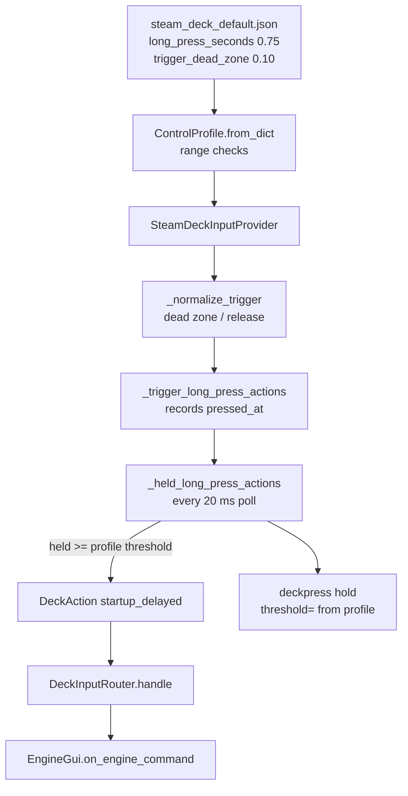

# Log Findings

### What the `deckpress` trace proves

The log you captured accounts for the whole delay. Squeeze to first echo is **2.247 s**, and none of it is a defect in the input layer:

| Time | Event | Elapsed |
|---|---|---|
| 13.947 | `trigger rest` axis=5 raw=-0.969 → `squeeze` raw=-0.639 fraction=0.164 | — |
| 13.947 | `hold squeeze axis=5 action=startup threshold=1.000s` | 0.000 s |
| 14.960 | `hold fired axis=5 action=startup_delayed held=1.013s polls=50 gap=0.020s worst_gap=0.021s` | **1.013 s** |
| 14.961 | `Enqueue command [ENGINE 60 START_UP_DELAYED] (client)` | +0.001 s |
| 14.990 | `Enqueue command [ENGINE 60 START_UP_DELAYED] (client)` — the same command again | +0.029 s |
| 16.194 | first echo printed: `[ENGINE 60 START_UP_DELAYED]` | **+1.233 s** |
| 16.502 | second echo printed | +0.308 s |
| 17.281 | `trigger release` raw=-1.000, `hold release … emitted nothing; the hold already reported` | 3.334 s |

**1. The hold measured 1.013 s against a 1.000 s threshold.** `polls=50`, `gap=0.020s`, `worst_gap=0.021s` — the Tk loop never stalled, so the stalled-poll theory is dead. The 1.0 s threshold is real and it is the only threshold in the code.

**2. ~1.23 s of the wait is the round trip, not the Deck.** `CommBufferProxy.enqueue_command` (`comm_buffer.py:595`) sends synchronously over a fresh socket and the second send started 29 ms later, so the client→server hop is under 29 ms. `ClientStateListener.offer` (`client_state_listener.py:144`) stamps the echo on arrival with no batching, and `Base3Buffer.run` writes as soon as `select` wakes. The second-plus is the server → Base 3 → echo → relay path, outside this codebase.

**3. The command is sent twice.** `EngineGui.__init__` defaults `repeat: int = 2` (`engine_gui.py:145`), `get_repeats` only overrides it for the entries in `REPEAT_EXCEPTIONS` (`engine_gui_conf.py:431`), and `CommandReq._enqueue_command` loops the repeat with no spacing (`command_req.py:262`). Hence two enqueues and two echoes.

**4. The resting trigger has almost no margin.** The `rest` line reports raw=-0.969, which normalizes to 0.0155 against `trigger_dead_zone` 0.02 — under 0.005 of headroom. `_normalize_trigger` also computes `release = max(0.0, trigger_dead_zone - hysteresis)`, which with the bundled 0.02 / 0.05 collapses to exactly **0.000** (visible on every trigger line). A resting value that drifts to -0.95 would read as permanently squeezed and never be seen to let go.

### What this plan does about it

Per your answers: make the hold threshold a profile setting with a **0.75 s** default, and raise the resting-trigger margin. Items 2 and 3 above (the duplicate send, round-trip instrumentation, an instant on-screen cue) are recorded here but **deliberately not implemented** — you did not select them.

# Requirements

### Overview & Goals

The long-press threshold that separates `START_UP_IMMEDIATE` from `START_UP_DELAYED` is a module constant (`LONG_PRESS_SECONDS = 1.0`), so the only way to change how long R2 must be squeezed is to edit code and push a build. Make it a profile setting like every other feel-related number on the pad, shorten the shipped default to 0.75 s, and give the analog triggers enough dead zone that a trigger at rest can never read as squeezed.

### Scope

**In Scope**

- A `long_press_seconds` key in the control profile, validated alongside `dead_zone` / `repeat_interval` / `trigger_dead_zone`.
- The default long-press threshold drops from 1.0 s to **0.75 s**, applied to triggers *and* buttons carrying `startup` / `shutdown`.
- `long_press_seconds: 0.75` written into `steam_deck_default.json`, where an operator will find the other tunables.
- The `deckpress` diagnostics report the *effective* threshold rather than a constant.
- `trigger_dead_zone` in the bundled profile raised from 0.02 to **0.10**, so a resting trigger is unambiguous and the release threshold sits at 0.05 instead of 0.000.

**Out of Scope**

- The duplicate send (`EngineGui` `repeat=2`). Diagnosed above; not changed.
- Round-trip (send → echo) instrumentation.
- Any new on-screen confirmation when a hold fires.
- The Python fallback `DEFAULT_TRIGGER_DEAD_ZONE = 0.02`, which stays as-is so a hand-written profile that puts the quilling horn on a trigger keeps its responsive onset.
- Anything in the comm layer: `comm_buffer.py`, `base3_buffer.py`, `client_state_listener.py` are untouched.

### User Stories

- As an operator, I want to dial the startup/shutdown hold time in my profile so the pad feels right without waiting for a new build.
- As an operator, I want the shipped hold to be 0.75 s, so a deliberate hold is confirmed sooner while a tap is still clearly a tap.
- As an operator, I want a trigger I am not touching to never count as squeezed, so a startup can never fire from a resting trigger and a release is always recognized.
- As a maintainer, I want a profile that omits the new key to keep loading and behaving predictably.

### Functional Requirements

1. `ControlProfile` exposes `long_press_seconds: float`, defaulting to 0.75 s when the profile omits it.
2. `from_dict` rejects a value outside `0.1 .. 5.0` with a `ProfileError` naming `long_press_seconds`.
3. A trigger or button bound to `startup` / `shutdown` emits its `*_DELAYED` action the moment the hold reaches the **profile's** threshold, while the control is still down — the behavior added earlier, now driven by the profile.
4. A press released before that threshold still reports its `*_IMMEDIATE` action on the release.
5. The bundled profile sets `long_press_seconds: 0.75`, so the Deck's hold is 0.75 s out of the box.
6. The `deckpress[hold]` lines print `threshold=` from the profile, so a `-debug` session reports the number actually in force.
7. The poll-stall diagnostic stays proportionate to the effective threshold (one tenth of it) rather than to a fixed constant.
8. The bundled profile's `trigger_dead_zone` is 0.10, keeping it above `hysteresis` (0.05) so the release threshold is 0.05 rather than 0.000.

### Non-Functional Requirements

- No new threads, no per-poll allocation, no change to the 20 ms poll cadence.
- Existing profiles (including `examples/steam-deck.json`, which binds no triggers) keep loading unchanged.
- `STARTUP_LONG_PRESS_SECONDS` stays importable — roughly twenty test sites and the cross-module spelling in `accessory_bindings.py` depend on the module-level names.

# Technical Design

### Current Implementation

**The threshold** — `src/pytrain/gui/controller/steam_deck_input.py`

```python
LONG_PRESS_SECONDS = 1.0                       # line 156
STARTUP_LONG_PRESS_SECONDS = LONG_PRESS_SECONDS # line 158, back-compat alias
DIAG_POLL_STALL_SECONDS = LONG_PRESS_SECONDS / 10.0  # line 183
```

It is compared in exactly three places, all on `SteamDeckInputProvider` (which already holds `self.profile`):

- `_held_long_press_actions()` — the sweep at the end of `poll()`; two `now - pressed_at < LONG_PRESS_SECONDS` tests, one for buttons and one for trigger axes, each followed by a `fired …` diagnostic.
- `_trigger_long_press_actions()` — the release fallback for a poll that saw squeeze and release together, plus the `squeeze` / `release` diagnostics.
- `_long_press_button_actions()` — the same fallback for a button, plus its `press` / `release` diagnostics.

**The profile** — `ControlProfile` (line 611) is a frozen dataclass whose optional feel settings each have a default and a range check in `from_dict` (line 638): `trigger_dead_zone`, `touch_dead_zone`, per-button `repeat_interval`. `long_press_seconds` slots straight into that pattern.

**The trigger dead zone** — `_normalize_trigger` (line 1224):

```python
fraction = max(0.0, min(1.0, (value + 1.0) / 2.0))
dead_zone = self.profile.trigger_dead_zone
release = max(0.0, dead_zone - self.profile.hysteresis)
```

With the bundled `trigger_dead_zone: 0.02` and `hysteresis: 0.05`, `release` is 0.000 — which is what every `deckpress[trigger]` line in your log printed.

### Key Decisions

1. **`LONG_PRESS_SECONDS` becomes the default, not a second source of truth.** Its value changes to `0.75` and it is used as the dataclass field default; the provider reads `self.profile.long_press_seconds` at every decision point. The name and the `STARTUP_LONG_PRESS_SECONDS` alias survive, so no test import or cross-module spelling breaks.
2. **Range `0.1 .. 5.0`.** At the 20 ms poll, 0.1 s is five polls — the shortest hold that can honestly be told from a tap. Anything past 5 s would read as broken hardware. Same shape as the `repeat_interval` check.
3. **Profile-wide, not per-binding.** One number covers both triggers and both startup/shutdown buttons, so L2 and R2 cannot disagree about what a hold is. A per-binding override (like the per-button `repeat_interval`) stays available later if you want it.
4. **The stall diagnostic follows the threshold.** `DIAG_POLL_STALL_SECONDS` is replaced by `DIAG_POLL_STALL_FRACTION = 0.1`, applied to the effective threshold, keeping the original rationale ("a tenth of the measurement, well clear of the 20 ms poll") true at any configured value.
5. **The dead zone is raised in the bundled JSON only.** In the bundled profile the triggers are *digital* (`4` → shutdown, `5` → startup); the quilling horn lives on the trackpads. So 0.10 costs nothing there and buys real margin. The Python fallback stays 0.02 for hand-written profiles that use a trigger as an *analog* horn, where a small onset is the point. From your log a normal squeeze is first seen at fraction 0.164, already past 0.10 — the hold still starts on the first axis event.
6. **The release threshold is fixed by arithmetic, not by new code.** With `trigger_dead_zone` 0.10 and `hysteresis` 0.05, `release` becomes 0.05, so a release is recognized before the trigger returns to its exact resting extreme. `_normalize_trigger` itself is not changed (you declined the separate release floor); instead `from_dict` logs a warning when `trigger_dead_zone <= hysteresis`, so a profile that can never see a release announces itself at load time.

### Proposed Changes

**`steam_deck_input.py`**

```python

# The default hold, in seconds, that separates a tap from a hold on a control bound to

# startup/shutdown. A profile may override it with long_press_seconds; this is what one

# that says nothing gets.

LONG_PRESS_SECONDS = 0.75
STARTUP_LONG_PRESS_SECONDS = LONG_PRESS_SECONDS
LONG_PRESS_SECONDS_MIN = 0.1   # five polls at CONTROLLER_POLL_MS; less cannot be told from a tap
LONG_PRESS_SECONDS_MAX = 5.0
DIAG_POLL_STALL_FRACTION = 0.1  # replaces DIAG_POLL_STALL_SECONDS

@dataclass(frozen=True)
class ControlProfile:
    ...
    long_press_seconds: float = LONG_PRESS_SECONDS
```

`from_dict`, beside the existing optional-number reads:

```python
long_press_seconds = (
    cls._number(data, "long_press_seconds") if "long_press_seconds" in data else LONG_PRESS_SECONDS
)
if not LONG_PRESS_SECONDS_MIN <= long_press_seconds <= LONG_PRESS_SECONDS_MAX:
    raise ProfileError("long_press_seconds must be between 0.1 and 5 seconds")
if trigger_dead_zone <= hysteresis:
    log.warning(
        "trigger_dead_zone %.3f is not above hysteresis %.3f: a squeezed trigger is only "
        "seen to let go at its exact resting value", trigger_dead_zone, hysteresis,
    )
```

On the provider, one read-through property so the three decision points and the diagnostics cannot drift:

```python
@property
def _long_press_seconds(self) -> float:
    return self.profile.long_press_seconds
```

Applied at: both comparisons in `_held_long_press_actions`, the release fallback in `_trigger_long_press_actions`, the release fallback in `_long_press_button_actions`, every `threshold={…:.3f}s` diagnostic, and the stall test in `_diag_poll` (`self._long_press_seconds * DIAG_POLL_STALL_FRACTION`).

**`steam_deck_default.json`** — the tunables block at the top becomes:

```json
{
  "dead_zone": 0.15,
  "trigger_dead_zone": 0.10,
  "touch_dead_zone": 0.05,
  "hysteresis": 0.05,
  "long_press_seconds": 0.75,
  "throttle_rate": 36.0,
  "repeat_interval": 0.1,
  "direction_threshold": 0.75
}
```

### Data Models / Contracts

| Key | Type | Default | Valid range | Effect |
|---|---|---|---|---|
| `long_press_seconds` | float | 0.75 | 0.1 – 5.0 | Hold at which a `startup`/`shutdown` control emits its `*_DELAYED` action |
| `trigger_dead_zone` | float | 0.02 (bundled: 0.10) | 0 – 1 | Normalized travel at which a trigger counts as squeezed; release is `trigger_dead_zone - hysteresis` |

### File Structure

| File | Change |
|---|---|
| `src/pytrain/gui/controller/steam_deck_input.py` | Default constant → 0.75, range constants, `ControlProfile.long_press_seconds`, `from_dict` validation + release-collapse warning, three decision points and the diagnostics read the profile, stall threshold derived from it |
| `src/pytrain/gui/controller/steam_deck_default.json` | `long_press_seconds: 0.75`; `trigger_dead_zone` 0.02 → 0.10 |
| `tests/gui/controller/test_steam_deck_input.py` | New profile-parsing, honored-threshold, diagnostic and dead-zone tests; `test_bundled_profile_uses_small_trigger_dead_zone` reworked |
| `examples/steam-deck.json` | Unchanged — binds no triggers and sets no `trigger_dead_zone` |

### Architecture Diagram



### Risks

- **A tap becomes a hold more easily.** 0.75 s is a quarter-second less room; if a brisk squeeze starts reporting `startup_delayed`, the profile key now exists to raise it without a build.
- **Divergence from the on-screen buttons.** `HoldButton.hold_threshold` stays 1.0 s, so the pad and the screen no longer agree. Deliberate — you asked for 0.75 s on the pad — and worth revisiting if it grates.
- **Trigger travel to engage grows five-fold** (raw ≈ -0.96 → ≈ -0.80). Immaterial for a digital startup/shutdown, and your log shows the first observed squeeze already at 0.164. It *would* matter for a hand-written profile that puts the quilling horn on a trigger, which is why the Python fallback stays 0.02.
- **`DIAG_POLL_STALL_SECONDS` disappears.** Module-internal — no test or other module imports it.

### Alternatives Considered

- **Per-binding `long_press_seconds`** (like the per-button `repeat_interval`): more flexible, but it lets L2 and R2 disagree about what a hold is, for no benefit you asked for.
- **A separate release floor in `_normalize_trigger`**: fixes the collapsed release threshold for every profile rather than just the bundled one, but changes normalization behavior for profiles that are working today. You chose the dead-zone bump; the load-time warning covers the rest.

# Testing

### Validation Approach

Everything here is exercised by the existing provider harness in `tests/gui/controller/test_steam_deck_input.py`: `SteamDeckInputProvider` takes an injected `pygame` stub and an injected `clock`, so a hold of any length is driven deterministically. The bundled profile is asserted directly through `ControlProfile.load(DEFAULT_PROFILE, fallback=False)`, as the existing bundled-profile tests already do.

After the changes, per the project guidelines: `../bin/python -m ruff format --check` on both changed Python files, then the full `../bin/python -m pytest` (currently 4022 passing).

### Key Scenarios

1. **The profile's value is honored.** A profile with `long_press_seconds: 0.25` fires `startup_delayed` on the poll that crosses 0.25 s — for a button *and* for a trigger axis — and a release at 0.20 s reports `startup_immediate` instead.
2. **The default applies when the key is absent.** `_profile()` (which omits it) yields `long_press_seconds == 0.75`.
3. **The bundled profile ships 0.75.** `ControlProfile.load()` reports `long_press_seconds == 0.75`.
4. **The diagnostics report the effective threshold.** With a 0.25 s profile and DEBUG enabled, the `deckpress[hold] squeeze …` and `… fired …` lines carry `threshold=0.250s`.
5. **The existing timing tests stay green unchanged.** The roughly twenty sites keyed on `STARTUP_LONG_PRESS_SECONDS` are all relative to the constant, so they follow it from 1.0 to 0.75 without edits — which is itself the check that nothing hard-codes the old number.
6. **The bundled trigger dead zone.** `trigger_dead_zone == 0.10`, still below `dead_zone`, and strictly above `hysteresis` so the release threshold is 0.05 rather than 0.000.

### Edge Cases

- **Out-of-range rejected:** `long_press_seconds` of 0.05 and of 6.0 each raise `ProfileError` matching `long_press_seconds`.
- **A resting trigger that drifts:** with the bundled dead zone, a raw value of -0.95 (fraction 0.025) normalizes to 0.0 — under the old 0.02 it read as *engaged*, which is the stuck-trigger hazard the log exposed at raw -0.969.
- **A real squeeze still engages immediately:** the raw -0.639 / fraction 0.164 first event from your log is past 0.10, so the hold timer still starts on the first axis event of a squeeze.
- **Collapsed release warns:** a profile with `trigger_dead_zone` 0.02 and `hysteresis` 0.05 still loads, and logs the warning naming both numbers.
- **A stalled poll still reports:** the existing stalled-poll test drives a 1.0 s gap, which stays far above the derived threshold (0.075 s at the default).
- **A hold that joins a chord** (e.g. the halt chord) and **a trigger whose panel takes a switch or route mid-squeeze** still emit nothing — the existing suppression tests must keep passing against the new threshold.

### Test Changes

- **Add:** profile parsing (honored value, default when omitted, both out-of-range rejections), threshold honored for a button and for a trigger, the diagnostic `threshold=` line, and the resting-drift normalization case.
- **Update:** `test_bundled_profile_uses_small_trigger_dead_zone` (lines 2105-2111) becomes a test of the *digital*-trigger dead zone — 0.10, below `dead_zone`, above `hysteresis` — with the reasoning that the bundled triggers carry startup/shutdown rather than the horn.
- **Unchanged:** `test_trigger_dead_zone_defaults_when_omitted` (the Python fallback stays 0.02) and all `_horn_profile()` tests, which rely on that fallback.

# Delivery Steps

### ✓ Step 1: Make the long-press threshold a profile setting at a 0.75 s default
`ControlProfile` carries a validated `long_press_seconds`, the shipped default becomes 0.75 s, and the bundled profile states it.

- In `src/pytrain/gui/controller/steam_deck_input.py`, change `LONG_PRESS_SECONDS` from `1.0` to `0.75` and reword its comment to say it is the default a profile that says nothing gets; keep the `STARTUP_LONG_PRESS_SECONDS` alias so the ~20 test sites and the cross-module spelling keep importing.
- Add `LONG_PRESS_SECONDS_MIN = 0.1` and `LONG_PRESS_SECONDS_MAX = 5.0`, with the rationale that 0.1 s is five polls at `CONTROLLER_POLL_MS` and anything past 5 s reads as broken hardware.
- Add `long_press_seconds: float = LONG_PRESS_SECONDS` to the `ControlProfile` dataclass, beside the other optional feel settings (`trigger_dead_zone`, `touch_dead_zone`).
- In `ControlProfile.from_dict`, read the key when present via `cls._number` and raise `ProfileError("long_press_seconds must be between 0.1 and 5 seconds")` outside the range, in the same style as the `repeat_interval` check.
- Add `"long_press_seconds": 0.75` to the tunables block at the top of `steam_deck_default.json`, where an operator will find `dead_zone` and `repeat_interval`.
- Tests in `tests/gui/controller/test_steam_deck_input.py`: the key is parsed and exposed, it defaults to 0.75 when omitted, the bundled profile reports 0.75, and 0.05 / 6.0 each raise `ProfileError`.

### ✓ Step 2: Have the provider and its diagnostics honor the configured threshold
The hold fires at the profile's threshold rather than a module constant, and the `deckpress` trace reports the number in force.

- Add a `_long_press_seconds` property on `SteamDeckInputProvider` returning `self.profile.long_press_seconds`, so the decision points and the diagnostics cannot drift apart.
- Replace `LONG_PRESS_SECONDS` with it at all three decision points: both comparisons in `_held_long_press_actions` (the button sweep and the trigger sweep), the release fallback in `_trigger_long_press_actions`, and the release fallback in `_long_press_button_actions`.
- Update every `threshold={…:.3f}s` diagnostic — the `press`, `squeeze`, `fired` and `release` lines — to print the effective value.
- Replace `DIAG_POLL_STALL_SECONDS` with `DIAG_POLL_STALL_FRACTION = 0.1` and compute the stall threshold in `_diag_poll` from the effective threshold, keeping the original rationale (a tenth of the measurement, well clear of the 20 ms poll) true at any configured value.
- Refresh the module-header commentary and the docstrings that name `LONG_PRESS_SECONDS` as *the* threshold so they describe a profile setting with a default.
- Tests: a 0.25 s profile fires `startup_delayed` on the poll crossing 0.25 s for a button and for a trigger axis, a 0.20 s release still reports `startup_immediate`, and the `deckpress[hold]` lines carry `threshold=0.250s`. The existing chord-suppression and switch/route-mid-squeeze tests must keep passing, as must the ~20 tests keyed on `STARTUP_LONG_PRESS_SECONDS` without edits.

### ✓ Step 3: Give the resting trigger real margin in the bundled profile
A trigger at rest can no longer read as squeezed, and a release is recognized before the trigger reaches its exact resting extreme.

- Raise `trigger_dead_zone` in `steam_deck_default.json` from `0.02` to `0.10`, so the log's resting raw of -0.969 (fraction 0.0155) sits well clear of the engage point, and `release = trigger_dead_zone - hysteresis` becomes 0.05 instead of the 0.000 every trigger line reported.
- Leave the Python fallback `DEFAULT_TRIGGER_DEAD_ZONE = 0.02` and `_normalize_trigger` untouched, so a hand-written profile using a trigger as an analog quilling horn keeps its responsive onset and no existing `_horn_profile()` test changes.
- Add a `log.warning` in `from_dict` when `trigger_dead_zone <= hysteresis`, naming both numbers, so a profile whose release threshold collapses to zero announces itself at load rather than presenting as a stuck trigger.
- Rework `test_bundled_profile_uses_small_trigger_dead_zone` into a test of the digital-trigger dead zone: 0.10, still below `dead_zone`, strictly above `hysteresis`, with the reasoning that the bundled triggers carry startup/shutdown rather than the horn.
- Add a normalization regression: raw -0.95 reads as rest under the bundled profile (it read as *engaged* at 0.02), while the log's raw -0.639 / fraction 0.164 still engages, so a real squeeze starts the hold on its first axis event.
- Run `../bin/python -m ruff format --check` on both changed Python files and the full `../bin/python -m pytest`.