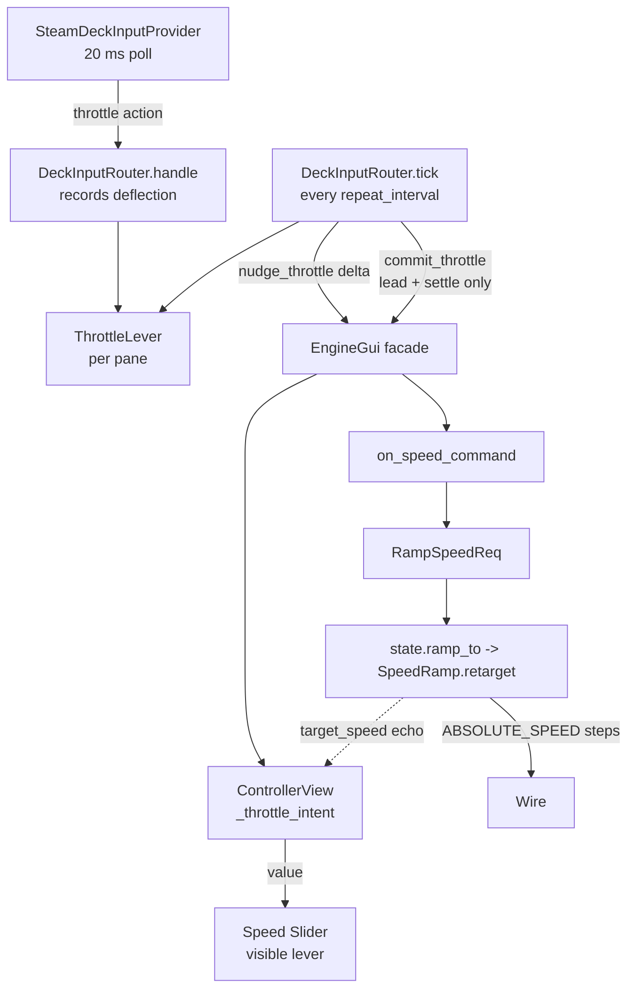

# Requirements

### Overview & Goals

The Steam Deck joystick throttle currently emits a `RampSpeedReq` on **every** router tick. With the bundled profile (`throttle_rate: 36.0`, `repeat_interval: 0.1`) each tick retargets the live ramp to a speed only ~3.6 steps beyond where it already is, so `SpeedRamp` settles almost immediately and the momentum effect the ramp exists to produce is never visible.

The goal is to make the joystick behave like a **spring-centered rate control driving a virtual throttle lever** — the model used by flight and train sims — where the lever is the GUI's existing Speed slider, and ramp commands are issued sparingly rather than per poll.

### Scope

**In Scope**

- A per-panel *throttle lever* (pending target speed) that the joystick moves and the GUI Speed slider displays.
- Removal of per-tick `RampSpeedReq` emission for ramped (non-Cab-1) engines.
- A **lead** command at first deflection so the engine physically starts accelerating/decelerating right away.
- A single final `RampSpeedReq` when the stick returns to center.
- A profile-selectable commit policy (`lead`, `release`, `dwell`) so all three behaviors can be felt on real hardware.
- Help-screen wording for the throttle row.

**Out of Scope**

- The Cab-1 `RELATIVE_SPEED` joystick path — it never builds a ramp and keeps its current repeat behavior.
- `SpeedRamp` / `RampSpeedReq` internals: no change to `speed_ramp.py`, `ramp_speed_req.py`, or `engine_state.py`.
- The direct-absolute-speed chord: **designed here, implemented in a follow-up pass** (per your choice).
- The D-pad boost/brake bindings.

### User Stories

- As an operator, I want to push the stick up and see the engine *physically start to accelerate*, so the throttle feels connected to the locomotive.
- As an operator, I want to pull the stick down and see the engine decelerate toward a lower target.
- As an operator, I want the GUI Speed slider to travel up and down with the stick so I can see the target speed I am about to commit to before I release.
- As an operator, I want momentum to be visible — the engine should take time to reach the speed I selected, not snap to it.
- As a maintainer, I do not want `RampSpeedReq` commands generated by the hardware polling loop.

### Functional Requirements

1. While a pane's throttle stick is deflected past the dead zone, that pane's **lever** moves at `throttle_rate` steps/second in the stick's direction, clamped to `0 .. state.speed_max`.
2. The pane's GUI Speed slider shows the lever position continuously; the periodic state refresh must not overwrite it while the lever is held.
3. On first deflection out of center, one `RampSpeedReq` is sent to a **lead target** — the lever's projected position `throttle_lead_time` seconds ahead — so the engine begins moving with real ramp headroom.
4. While the stick stays deflected, no further request is sent unless the lever overruns the outstanding lead target, and then no more often than `throttle_commit_min_interval`.
5. When the stick returns to center, exactly one `RampSpeedReq` is sent for the lever's resting value; the running ramp retargets to it rather than a new thread starting.
6. The commit policy is selectable in the profile:
   - `lead` (default) — requirements 3 + 5.
   - `release` — requirement 5 only; the lever moves silently until the stick is let go.
   - `dwell` — requirement 5, plus a commit if the stick is held steady for `throttle_dwell`.
7. The lever is discarded — with no command sent — on controller disconnect, on `DeckInputRouter.clear()`, and when the pane's selected engine/train changes.
8. A HALT, reset, direction change, or emergency stop clears the lever so a stale target cannot be committed afterward.
9. Cab-1 engines keep today's behavior exactly: repeated `RELATIVE_SPEED` steps while the stick is held.

### Non-Functional Requirements

- No new threads, and no work added to `SpeedRamp`.
- Router tick cost stays O(active panes); the GUI is touched through `EngineGui`, never by reaching into widgets from the input layer.
- A profile omitting the new keys behaves as `lead` with the documented defaults, so existing hand-written profiles keep loading.

# Technical Design

### Current Implementation

**The joystick path**

- `SteamDeckGui._poll_controller` (`steam_deck_gui.py`) runs every `CONTROLLER_POLL_MS = 20`, draining `provider.poll()` into `DeckInputRouter.handle` and then calling `router.tick(time.monotonic())`.
- `DeckInputRouter.handle` (`steam_deck_input.py:1804-1811`) stores the clamped stick deflection in `self._throttles[target]`.
- `DeckInputRouter.tick` (`steam_deck_input.py:1930-1945`) integrates it:
  - `current = self._commanded_speeds.setdefault(target, state.speed)`
  - `next_speed = clamp(current + value * profile.throttle_rate * elapsed)`
  - `if round(next_speed) != round(current): gui.on_speed_command(round(next_speed))`
- `EngineGui.on_speed_command` (`engine_gui.py:2874-2909`) builds `RampSpeedReq` / `RampSpeedDialogReq` and submits it. `RampSpeedReqBase._on_before_send` then calls `state.ramp_to(...)`, which `RampRegistry.ramp_to` turns into `SpeedRamp.retarget`.

**This is the defect.** `tick` only runs every `repeat_interval` (0.1s), and at `throttle_rate` 36 that is a retarget every 100ms to a target 3-4 steps away. `next_step()` closes a 3-4 step gap in one or two steps, `_settle()` runs, and `DEFAULT_RAMP_LINGER` (0.25s) keeps the thread alive just long enough to be retargeted again — a permanent settle loop with no momentum.

**The GUI slider path (the model to copy)**

- `ControllerView` builds the Speed slider in `make_slider` (`controller_view.py:1396-1500`, wired at `376-397`) with a motion `command` (`on_throttle_change`) and `on_release=self._on_throttle_release_event`.
- For a Legacy engine `on_throttle_change` returns early (`controller_view.py:1196-1199`), so **dragging sends nothing**; only `_on_throttle_release_event` (`1247-1269`) clamps to `state.speed_max` and calls `host.on_speed_command(host.throttle.value)` — one ramp request per gesture.
- The state refresh writes `host.throttle.value = throttle_state.target_speed` but only when the slider does not hold focus (`controller_view.py:695-697`) — the existing "don't fight the user while dragging" guard.

### Key Decisions

1. **The lever is the GUI Speed slider.** `ControllerView` owns it and `EngineGui` exposes a small façade; the router never touches Tk widgets. Joystick and touch then share one lever and one commit path, and "the slider tracks the stick" is automatic rather than a mirror to keep in sync.
2. **The router keeps rate integration, not command emission.** `tick` computes lever deltas and hands them to the GUI; it calls `on_speed_command` only at a commit point. This is the literal fix for "no `RampSpeedReq` from the polling loop".
3. **A lead target, not the lever position, is what the first command asks for.** Commanding the lever's current position would reintroduce the no-headroom problem. Projecting `throttle_lead_time` (default 2.0s) ahead gives the ramp a gap of ~70 steps at full deflection — momentum becomes visible immediately.
4. **Commit policy is profile-selectable.** You want to feel `lead`, `release`, and `dwell` before settling; all three are one `ThrottleCommit` enum and a `throttle_commit` profile key, defaulting to `lead`.
5. **Cab-1 is left alone.** Its joystick path emits `RELATIVE_SPEED` and never builds a ramp, so it has no defect to fix and no lever to own.

### Proposed Changes

**`controller_view.py` — the lever**

Factor the send out of `_on_throttle_release_event` and add lever state:

```python
self._throttle_intent: float | None = None   # the lever, in speed steps

def throttle_intent_base(self) -> int:
    """Where a lever starts: the engine's announced target, else its speed."""

def nudge_throttle_intent(self, delta: float) -> int | None:
    """Move the lever by delta steps, clamp to 0..speed_max, show it on the
    slider, and return the new position. Seeds from throttle_intent_base()
    on the first nudge. Sends nothing."""

def commit_throttle_intent(self, speed: int | None = None) -> None:
    """Send one RampSpeedReq for `speed` (default: the lever) via
    _send_throttle_value, the body lifted out of _on_throttle_release_event."""

def clear_throttle_intent(self) -> None:
    """Drop the lever without sending; the slider resumes tracking state."""

@property
def throttle_intent_active(self) -> bool: ...
```

The refresh guard at `controller_view.py:696` widens from "slider has focus" to "slider has focus **or** `throttle_intent_active`", so the state refresh cannot drag the slider off the lever mid-gesture. Slider writes go through the existing `__updating()` context manager so `on_throttle_change` stays inert. `_on_throttle_release_event` calls `clear_throttle_intent()` first — a touch drag takes the lever back from the stick.

**`engine_gui.py` — the façade**

Thin delegates beside `on_speed_command`, so the router talks to `EngineGui` exactly as it does for every other action:

```python
def nudge_throttle(self, delta: float) -> int | None: ...
def commit_throttle(self, speed: int | None = None) -> None: ...
def clear_throttle(self) -> None: ...
@property
def throttle_target(self) -> int | None: ...
```

`select_component` and the HALT/reset paths call `clear_throttle()`.

**`steam_deck_input.py` — the router**

`_throttles` / `_commanded_speeds` are replaced by one record per pane:

```python
@dataclass
class ThrottleLever:
    value: float          # stick deflection, -1.0 .. 1.0
    lever: float          # pending target, in speed steps
    lead_target: int | None      # what was last commanded
    last_commit: float | None    # monotonic, for throttle_commit_min_interval
    steady_since: float | None   # for the dwell policy
```

`handle` records deflection and, on the transition to `0.0`, marks the lever for settle instead of popping it. `tick`'s throttle loop becomes:

1. Cab-1 → unchanged `gui.on_speed_command(relative_speed)`.
2. Deflected → `gui.nudge_throttle(value * throttle_rate * elapsed)`; update `steady_since`.
3. Policy `lead` and no `lead_target` yet → commit the projected lead target.
4. Policy `lead` and the lever has passed `lead_target`, with `throttle_commit_min_interval` elapsed → re-lead.
5. Policy `dwell` and `steady_since` older than `throttle_dwell` → commit the lever, then rearm.
6. Settling (deflection back to 0) → `gui.commit_throttle()` once, drop the record.

`clear()` drops every lever and calls `gui.clear_throttle()` for each pane — matching `test_disconnect_clears_active_throttle_without_issuing_stop`, which must keep passing.

**`ControlProfile`** gains `throttle_commit: ThrottleCommit = LEAD`, `throttle_lead_time: float = 2.0`, `throttle_commit_min_interval: float = 1.0`, `throttle_dwell: float = 0.35`, validated in `from_dict` alongside the existing `throttle_rate` / `repeat_interval` checks. All are optional, so existing profiles load unchanged.

**`steam_deck_default.json`** gains the four keys at their defaults, documenting them where an operator will find them.

**`control_labels.py`** gets `ACTION_NOTES["throttle"]` — a short "(sets target; releases to send)" style note that the help screen already renders for every axis row.

### Data Models / Contracts

```python
class ThrottleCommit(Enum):
    LEAD = "lead"        # lead command at first deflection + commit on settle
    RELEASE = "release"  # commit on settle only
    DWELL = "dwell"      # commit on settle + while held steady
```

The lead target:

```python
def lead_target(lever: float, value: float, profile, speed_max: int) -> int:
    projected = lever + value * profile.throttle_rate * profile.throttle_lead_time
    return max(0, min(speed_max, round(projected)))
```

### Architecture Diagram



### Risks

- **Slider fights the lever.** Mitigated by widening the existing `controller_view.py:696` guard and routing every programmatic write through `__updating()`.
- **A stale lever commits after a HALT.** Mitigated by `clear_throttle()` on HALT, reset, direction change, and engine selection change (requirement 8).
- **A re-lead is read as a foreign throttle command.** It is not: it goes out through `on_speed_command` → `RampSpeedReq` → `state.ramp_to`, so `SpeedRamp.retarget` records it in the `TARGET` echo queue exactly as today's per-tick calls do.
- **`throttle_lead_time` overshoots on a short flick.** The settle commit is authoritative and retargets the same ramp thread downward, which is the ordinary deceleration path; `DEFAULT_RAMP_LINGER` keeps the flick and the settle on one thread.
- **Cab-1 regression.** The Cab-1 branch is untouched and covered by `test_cab1_rate_throttle_emits_bounded_relative_steps`.

# Research

### How games treat a spring-centered stick as a throttle

Research into train and flight sim input conventions lines up with the design above:

- **A spring-centered axis is a rate control, never a position.** A self-centering stick cannot hold an absolute lever position, so sims integrate deflection into a *virtual lever* and let the lever hold its value when the stick returns to center. This is exactly what `_commanded_speeds` already does — the defect is that it also *commands* on every integration step.
- **Repeated commands from an axis band are a known failure mode.** Guidance for mapping HOTAS hardware to Train Simulator Classic warns that a non-centering axis "may keep issuing commands merely because it remains inside an active axis band," and that translating axis motion into a stream of incremental commands is what causes the physical control and the in-game lever to drift out of sync. That is exactly what the joystick does here relative to the engine's real speed.
- **Buttons and detents are preferred because a press is one controlled increment.** The lesson generalizes: one deliberate gesture should produce one command, not a stream.
- **Notched hardware exists because operators want feedback about lever position, separate from the machine's response.** The GUI Speed slider is our detent readout — it shows where the lever is while the locomotive is still catching up.

The resulting convention, and what this plan implements: **stick moves the lever; the lever is displayed; the command is issued at gesture boundaries.** The `lead` policy adds the one thing a model railroad needs that a sim does not — the engine has to *start* moving before the gesture ends, because the operator is watching a physical locomotive rather than a virtual cab.

### Designed, not yet built: the direct-speed chord

Specified now so the follow-up pass has no open questions.

- **Binding.** A new profile action `absolute_speed_modifier`, bound to a shoulder button. `L1` (button 4) is already the admin chord modifier and a coupler, and `R1` (button 5) is already the catalog-jump modifier — both take on a modifier role only while a specific panel is up, so either can carry this one for the engine screen. Recommend `R1`, matching `CATALOG_JUMP_MODIFIER`'s precedent of "held = modifier, tapped = its own action".
- **Behavior while held.** The stick's **deflection maps directly to absolute speed** across `0 .. state.speed_max` — position, not rate — because the operator is now selecting a speed rather than asking for a change. The lever follows the mapped value so the slider still shows the selection.
- **Emission.** `CommandReq.build(ABSOLUTE_SPEED, ...)` rather than `RampSpeedReq`, rate-limited to one per `repeat_interval`, bypassing the ramp entirely. Any live ramp aborts on the first of these through the existing foreign-throttle arbitration in `EngineState._update_state` — no new abort path needed.
- **Release.** Dropping the modifier hands the lever back to the rate model, reseeded from the last absolute speed sent.
- **Help screen.** One entry in the `Joysticks` section plus a note in `ACTION_NOTES`.

# Testing

### Validation Approach

All validation is at the router and view level with fake GUIs — the pattern `tests/gui/controller/test_steam_deck_input.py` already uses (`_gui()` returns a `SimpleNamespace` recording `speed_calls`). The fake gains `nudge_throttle` / `commit_throttle` / `clear_throttle` recorders, so a test can assert *both* that the lever moved and that no command went out.

After each edit: `../bin/python -m ruff format --check <files>`, then the full `../bin/python -m pytest`.

### Key Scenarios

- **No commands from the polling loop.** Deflect the stick, run many `tick`s across several seconds: exactly one `speed_calls` entry (the lead) — replacing today's `test_rate_throttle_is_proportional_bounded_and_center_holds_speed`, which asserts the opposite.
- **The lever tracks the stick.** Full up-deflection over 1s at `throttle_rate` 20 moves the lever ~20 steps; full down-deflection moves it back down.
- **Lead gives the ramp headroom.** The single command at first deflection is `lever + throttle_rate * throttle_lead_time`, not the lever's current value.
- **Settle commits once.** Deflect, tick, return to `0.0`, tick: one further `commit_throttle` with the lever's resting value.
- **`release` policy stays silent until settle.** Zero commands while held, exactly one on settle.
- **`dwell` policy commits while held steady** after `throttle_dwell` and does not re-commit every tick.
- **Slider shows the lever.** With `throttle_intent_active`, a state refresh carrying a different `target_speed` leaves the slider on the lever.
- **Touch drag wins.** `_on_throttle_release_event` clears the lever, and a subsequent tick does not re-commit a stale value.

### Edge Cases

- **Disconnect / `clear()`** — lever dropped, no command; `test_disconnect_clears_active_throttle_without_issuing_stop` must still pass.
- **Cab-1** — unchanged repeats; `test_cab1_rate_throttle_emits_bounded_relative_steps` must still pass.
- **Clamping** — a lever held up cannot exceed `state.speed_max`; held down it stops at 0 and never goes negative.
- **`state.speed_max` drops mid-gesture** (a speed limit is set) — the lever re-clamps on the next nudge.
- **No engine selected** (`throttle_state is None`) — the tick skips the pane and does not seed a lever.
- **HALT under a held stick** — lever cleared, and the settle that follows sends nothing.
- **Profile without the new keys** — loads and behaves as `lead` with defaults; a bad `throttle_commit` value raises `ProfileError`.

### Test Changes

- Rewrite the throttle tests at `test_steam_deck_input.py:1282-1306` and extend the fake GUI.
- Add profile-validation cases for the four new keys beside the existing `throttle_rate` / `dead_zone` cases.
- Add lever tests for `ControllerView` (intent seeding, clamping, refresh guard, touch-drag takeover).
- Keep `test_steam_deck_packaging.py` / `test_gui_deck_parity.py` green — the new profile keys must not break the bundled-profile assertions.

# Delivery Steps

### ✓ Step 1: Add the throttle lever to the GUI Speed slider
`ControllerView` owns a pending target speed that the Speed slider displays and that only sends on demand.

- Add `_throttle_intent` state to `ControllerView.__init__` (`controller_view.py:301-305`).
- Lift the send body out of `_on_throttle_release_event` (`1247-1269`) into `_send_throttle_value(value)` so touch and joystick share one commit path.
- Add `throttle_intent_base()`, `nudge_throttle_intent(delta)`, `commit_throttle_intent(speed=None)`, `clear_throttle_intent()`, and the `throttle_intent_active` property; slider writes go through the existing `__updating()` context manager so `on_throttle_change` stays inert.
- Widen the refresh guard at `controller_view.py:696` from "slider has focus" to also cover `throttle_intent_active`, so a state refresh cannot drag the slider off the lever.
- Have `_on_throttle_release_event` clear the lever first, so a touch drag takes it back from the stick.
- Expose `nudge_throttle` / `commit_throttle` / `clear_throttle` / `throttle_target` on `EngineGui` beside `on_speed_command`, and call `clear_throttle()` from `select_component` and the HALT/reset paths.
- Add `ControllerView` lever tests: seeding from `target_speed`, clamping to `speed_max` and 0, the refresh guard, and touch-drag takeover.

### ✓ Step 2: Rewire the joystick to move the lever instead of commanding per tick
Holding the stick moves the lever and the slider, and no `RampSpeedReq` is generated by the polling loop.

- Replace `DeckInputRouter._throttles` / `_commanded_speeds` with a `ThrottleLever` dataclass per pane holding deflection, lever position, and settle state.
- Update `handle` (`steam_deck_input.py:1804-1811`) to record deflection and, on the transition to `0.0`, mark the lever for settle rather than popping it.
- Rewrite the throttle loop in `tick` (`1930-1945`) to call `gui.nudge_throttle(value * throttle_rate * elapsed)` while deflected and `gui.commit_throttle()` once on settle; keep the Cab-1 `RELATIVE_SPEED` branch exactly as it is.
- Have `clear()` drop every lever and call `gui.clear_throttle()` per pane, preserving `test_disconnect_clears_active_throttle_without_issuing_stop`.
- Rewrite `test_rate_throttle_is_proportional_bounded_and_center_holds_speed` and extend the `_gui()` fake with lever recorders, asserting the lever moves while `speed_calls` stays empty until settle.

### ✓ Step 3: Add the lead command so the engine moves during the gesture
Pushing the stick up starts the engine accelerating immediately, with enough ramp headroom for visible momentum.

- Add `throttle_lead_time` (default 2.0s) and `throttle_commit_min_interval` (default 1.0s) to `ControlProfile`, validated in `from_dict` beside the existing `throttle_rate` check, and record them in `steam_deck_default.json`.
- Add a `lead_target()` helper projecting the lever forward by `throttle_rate * throttle_lead_time`, clamped to `0..speed_max`.
- On the first deflection out of center, commit the lead target through `gui.commit_throttle(lead)`; store it on the `ThrottleLever`.
- Re-lead when the lever overruns the outstanding lead target, no more often than `throttle_commit_min_interval`.
- Keep the settle commit authoritative, so a short flick retargets the same ramp thread back down rather than overshooting.
- Test that the first command is the projected lead rather than the lever, that a long hold produces only the rate-limited re-leads, and that the settle value is the lever's resting position.

### ✓ Step 4: Make the commit policy selectable and update the help screen
All three commit behaviors can be chosen from the profile and are described on the controls screen.

- Add a `ThrottleCommit` enum (`LEAD`, `RELEASE`, `DWELL`) and a `throttle_commit` profile key defaulting to `LEAD`, plus `throttle_dwell` (default 0.35s); raise `ProfileError` on an unknown value.
- Implement `RELEASE`: skip the lead and the re-lead, commit only on settle.
- Implement `DWELL`: track `steady_since` per lever and commit when the stick is held steady past `throttle_dwell`, rearming rather than re-committing each tick.
- Record the keys in `steam_deck_default.json` so they are discoverable where an operator will look.
- Add `ACTION_NOTES["throttle"]` in `control_labels.py` describing the lever/commit behavior, which the help screen already renders for axis rows.
- Test each policy's command pattern and the profile validation cases, and confirm `test_steam_deck_packaging.py` and `test_gui_deck_parity.py` stay green.