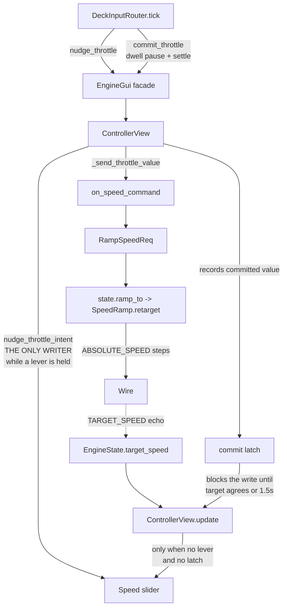

# Requirements

### Overview & Goals

The virtual throttle lever shipped and does the job it was built for: the polling loop no longer emits a `RampSpeedReq` per tick, and the speed the engine finally settles on is right. What is wrong is the **handle on screen**. Holding the stick up makes the Speed slider lurch far above where the lever is and snap back; pulling it down makes the handle dive toward the bottom and jump back up. The number the gesture ends on is fine — the journey to it is not.

This is not display lag. `ControllerView._send_throttle_value` repaints the slider to **whatever speed it commits**, and under the `lead` policy that is a projection the operator never selected — 106 while the lever stood at 34, in your trace. The lever itself does not move, so the next joystick tick drags the handle straight back. One lurch per lead, one per re-lead.

Three goals:

1. While a gesture is in progress the Speed slider shows the **lever and nothing else** — it is a statement of intent, not a readout of intermediate commands.
2. When the gesture ends the handle stays on the speed that was committed, rather than falling back for a moment to a target the engine is about to stop advertising.
3. Ship `dwell` as the throttle commit policy, so the shipped behavior has no projection in it at all.

### Scope

**In Scope**

- `ControllerView._send_throttle_value` stops moving the slider while a lever is held.
- A **commit latch**: after a commit the handle holds the committed value until the engine's advertised `target_speed` agrees, or a short grace expires.
- `throttle_intent_base()` seeds a new lever from the latched commit in preference to a possibly-stale `state.target_speed`.
- `"throttle_commit": "dwell"` in `steam_deck_default.json`, and `ThrottleCommit.DWELL` as the `ControlProfile` fallback, so "the default" means one thing in both places.
- A **steady band** so "held still" tolerates stick jitter. Without it dwell's clock never matures on real hardware and nothing is sent until release.
- `ACTION_NOTES["throttle"]` reworded to match dwell.

**Out of Scope**

- `throttle_rate` stays at 36.0 — your call, after seeing what the lever/locomotive gap actually looks like with the swing removed.
- `lead` and `release` stay available. Both are repaired by the same changes; neither is removed.
- No change to `SpeedRamp`, `RampSpeedReq`, `EngineState`, or `comp_data`.
- The Cab-1 `RELATIVE_SPEED` path, untouched as before.
- The direct-absolute-speed chord — still designed, still deferred (see Technical Design).

### User Stories

- As an operator, I want the Speed slider to move only where I put it, so the handle reads as a control rather than a flickering gauge.
- As an operator, I want the handle to stay where I let go of it, so I can read off the speed I just asked for.
- As an operator, I want a pause on the stick to mean "this is the speed I mean", and the engine to start moving on that pause rather than waiting for my thumb to come off.
- As an operator, I want a hold at three-quarters deflection to count as steady even though my thumb is not perfectly still.

### Functional Requirements

1. While a lever is held, **no commit** — lead, re-lead, dwell, or settle — may move the Speed slider. `nudge_throttle_intent` is the only writer of the handle during a gesture.
2. After any commit, the handle holds the committed value until `throttle_state.target_speed` equals it, or `THROTTLE_COMMIT_GRACE` (1.5 s) elapses, whichever comes first.
3. The grace exists so a command that never takes effect — a HALT, another controller taking the throttle — cannot freeze the handle indefinitely.
4. `clear_throttle()` (engine selection change, HALT, reset) drops both the lever and the latch. `clear_throttle_intent()`, which is the ordinary end-of-gesture release, drops only the lever.
5. A new gesture seeds its lever from the latched commit when one is live, otherwise from `state.target_speed`, otherwise from `state.speed`.
6. The bundled profile commits on **dwell**: a pause of `throttle_dwell` (0.35 s) sends the lever's own value, with no projection; the settle at the end of the gesture remains authoritative.
7. "Held still" means the deflection has not moved by more than `hysteresis` (0.05) since the dwell clock started — not that it has not changed at all.
8. A profile that omits `throttle_commit` behaves as `dwell`.
9. Cab-1 engines are unaffected: repeated `RELATIVE_SPEED` steps while the stick is held, no lever, no latch.

### Non-Functional Requirements

- No new threads, no new profile keys, and no work added to `SpeedRamp`.
- The latch lives on `ControllerView`, so the two panes cannot interfere with each other.
- Every programmatic slider write still goes through the existing `__updating()` context manager, so `on_throttle_change` stays inert.
- The router still reaches the GUI only through the `EngineGui` façade; no Tk widget is touched from the input layer.

# Technical Design

### Current Implementation

Everything below is already in the tree; this pass changes three small things inside it.

| Piece | Where | What it does today |
| --- | --- | --- |
| The lever | `ControllerView._throttle_intent` (`controller_view.py:313`) | A pending target speed in steps, `None` when no gesture is in progress. |
| Moving it | `nudge_throttle_intent` (`1319-1340`) | Seeds from `throttle_intent_base()`, clamps to `0..speed_max`, writes the handle under `__updating()`. |
| Committing it | `commit_throttle_intent` (`1342-1348`) → `_send_throttle_value` (`1268-1292`) | Clamps, **writes the handle**, then `host.on_speed_command(value)`. |
| Dropping it | `clear_throttle_intent` (`1350-1352`) | Sets `_throttle_intent = None`; nothing is sent. |
| The refresh guard | `controller_view.py:699-701` | `host.throttle.value = throttle_state.target_speed`, skipped while the slider has focus or `throttle_intent_active`. |
| The router | `DeckInputRouter.tick` (`steam_deck_input.py:2114-2147`) | Nudges while deflected, then dispatches on `profile.throttle_commit` to `_lead` (`2537-2571`) or `_dwell` (`2573-2589`); `_commit_lever` (`2591-2597`) on settle. |
| The stick record | `ThrottleLever` (`1877-1897`) | `value`, `lever`, `lead_target`, `last_commit`, `steady_since`, `settling`. |
| The profile | `steam_deck_default.json:10` | `"throttle_commit": "lead"`. |

The three defects are set out in the **Diagnosis** tab. In one line each: a commit repaints the handle; the handle is released at settle while the state still advertises the previous target; and a new lever can seed from that same stale advertisement.

### Key Decisions

1. **The lever is the only writer of the handle during a gesture.** Rather than special-casing the lead, `_send_throttle_value` simply declines to touch the slider whenever `_throttle_intent` is not `None`. The touch path is unaffected because `_on_throttle_release_event` already calls `clear_throttle_intent()` before it sends, so by the time the touch commit reaches `_send_throttle_value` there is no lever to defer to. One guard covers every commit — lead, re-lead, dwell, settle — present and future.

2. **A commit latch, not a synchronous state write.** The obvious alternative is to have the GUI call `EngineState.sync_target_speed(value)` so the advertised target changes the instant the command is built. That is rejected: `SpeedRamp.retarget` deliberately leaves `comp_data.target_speed` to the echo path so the `TARGET` ledger can claim its own announcement, and writing it from the GUI would put a second, unsynchronized author on that byte. The latch instead treats the disagreement as what it is — a brief period during which the state has not caught up — and holds the *display* still through it.

3. **The latch expires.** A commit that never lands (HALT, a foreign controller grabbing the throttle, a dropped connection) would otherwise pin the handle forever. `THROTTLE_COMMIT_GRACE = 1.5 s` is comfortably longer than a Base 3 round trip and far shorter than a gesture, so in practice the latch always ends by agreement and the deadline is a safety net rather than a timer anyone waits on.

4. **Dwell is the default in both places.** Changing only `steam_deck_default.json` would leave `ControlProfile`'s Python fallback at `LEAD`, so a hand-written profile omitting the key would behave differently from the shipped one. The feature is a day old and the bundled profile is the only one in existence, so moving both costs nothing and keeps one answer to "what does the throttle do by default".

5. **The steady band reuses `hysteresis` rather than adding a profile key.** `hysteresis` (0.05) is already the file's word for "a change this small is not a change", used by `_normalize_axis`, `_dispatch_axis`, and `_dispatch_axis_held`. A fourth use for the same idea should not need a fourth knob.

6. **`lead` is repaired, not removed.** Decisions 1-3 fix its display problem too, so you can still switch back and compare the three policies on even terms. The values `lead` picks are still open questions and are recorded at the end of the Diagnosis tab.

### Proposed Changes

**`controller_view.py` — the handle has one writer, and a latch**

```python

# module scope; the module has no time import today

from time import monotonic

THROTTLE_COMMIT_GRACE: float = 1.5

# ControllerView.__init__, beside _throttle_intent

self._throttle_committed: int | None = None      # the last speed asked for
self._throttle_committed_at: float | None = None # monotonic, for the grace
```

`_send_throttle_value` changes in two places:

```python
value = max(0, min(int(ms), int(value)))

# The lever owns the handle while a gesture is in progress: a lead target is a

# projection, not a selection, and must not appear under the operator's thumb.

if self._throttle_intent is None and host.throttle.value != value:
    with self.__updating():
        host.throttle.value = value
self._throttle_committed = value
self._throttle_committed_at = monotonic()
if state.speed != value:
    host.on_speed_command(value)
```

The latch is recorded even when no command goes out (`state.speed == value`), because it still records what the operator asked for and the handle should stay there either way.

The refresh guard at `699-701` gains the latch:

```python
if host.throttle.tk.focus_displayof() != host.throttle.tk and not self.throttle_intent_active:
    if self._commit_latch_holds(throttle_state):
        pass          # the engine has not yet said it heard us; leave the handle alone
    else:
        host.throttle.value = throttle_state.target_speed

def _commit_latch_holds(self, throttle_state) -> bool:
    """Whether the handle is still standing on a commit the engine has not confirmed."""
    if self._throttle_committed is None:
        return False
    if throttle_state.target_speed == self._throttle_committed:
        self._clear_commit_latch()          # agreed; the state can have the handle back
        return False
    if monotonic() - (self._throttle_committed_at or 0.0) >= THROTTLE_COMMIT_GRACE:
        self._clear_commit_latch()          # it is never going to agree; do not freeze
        return False
    return True
```

`throttle_intent_base()` prefers the latch:

```python
def throttle_intent_base(self) -> int:
    """Where a lever starts: the speed last asked for, else the engine's
    announced target, else its speed."""
    if self._throttle_committed is not None:
        return self._throttle_committed
    ...unchanged...
```

`clear_throttle_intent()` keeps the latch — that is the whole point of it surviving the end of a gesture. A new `clear_throttle_commit()` drops it, and `EngineGui.clear_throttle()` calls both, so an engine selection change, a HALT, or a reset starts from a clean sheet.

**`engine_gui.py`** — `clear_throttle()` clears the latch as well as the lever. No new façade methods.

**`steam_deck_input.py` — steady means steady enough**

`ThrottleLever` gains one field:

```python
steady_value: float | None = None   # the deflection the dwell clock started at
```

and `_record_deflection` (`2513-2516`) compares against it rather than against the last reading:

```python

# A thumb resting on the stick is never perfectly still: _normalize_axis returns a

# continuous float and SDL reports every wobble. Measured against the deflection the

# clock started at, and only outside the hysteresis band, a hold reads as a hold.

if lever.steady_value is None or abs(deflection - lever.steady_value) > self.profile.hysteresis:
    lever.steady_since = None
    lever.steady_value = deflection
```

`tick` already seeds `steady_since = now` when it is `None`, and `_dwell` already rearms it; both keep working unchanged. `_dwell` also sets `steady_value` to the current deflection when it rearms, so a slow drift across the band is eventually noticed rather than accumulating unbounded.

**`steam_deck_default.json`** — `"throttle_commit": "dwell"`.

**`ControlProfile`** — the `throttle_commit` field default and `_throttle_commit`'s "key absent" return both become `ThrottleCommit.DWELL`. Validation, the accepted words, and the error message are unchanged.

**`control_labels.py`** — `ACTION_NOTES["throttle"]` becomes `"pause to send"` (13 chars). It replaces `"sends on release"`, which is no longer the primary way a command goes out and, at 16 characters, sits right on the width limit `test_the_columns_are_cut_to_what_their_rows_need` enforces.

### Data Models / Contracts

```python

# controller_view.py

THROTTLE_COMMIT_GRACE: float = 1.5

class ControllerView:
    _throttle_intent: float | None       # the lever; None between gestures
    _throttle_committed: int | None      # the last speed asked for; None when settled
    _throttle_committed_at: float | None # monotonic stamp for the grace

    def clear_throttle_commit(self) -> None: ...
    def _commit_latch_holds(self, throttle_state) -> bool: ...
```

```python

# steam_deck_input.py

@dataclass
class ThrottleLever:
    value: float = 0.0
    lever: float = 0.0
    lead_target: int | None = None
    last_commit: float | None = None
    steady_since: float | None = None
    steady_value: float | None = None   # new: where the dwell clock started
    settling: bool = False
```

### Architecture Diagram

Who is allowed to move the handle, and when:



### Risks

- **The latch pins the handle on a command that never lands.** Bounded by `THROTTLE_COMMIT_GRACE`, and cleared outright by `clear_throttle()` on HALT, reset, and engine selection change.
- **The latch and a touch drag disagree.** They cannot: `_on_throttle_release_event` sends through `_send_throttle_value`, which re-stamps the latch with the value the finger chose, so the most recent gesture always owns it.
- **`target_speed` never equals the committed value** because the ramp was aborted at a different speed. Then the grace expires and the handle resumes tracking the state — the correct outcome, one beat late.
- **The steady band masks a genuine slow sweep.** A thumb creeping across the range at under 0.05 deflection per dwell period would be read as steady and committed. That is the right reading: the lever is still moving with the stick, so what is committed is where the lever actually is.
- **Dwell feels unresponsive on a slow sweep.** Nothing is sent until the thumb settles for 0.35 s, so a long, continuously-moving sweep produces no command until release. `release` and `lead` remain in the profile if that turns out to matter.
- **Cab-1 regression.** The Cab-1 branch is untouched and still covered by `test_cab1_rate_throttle_emits_bounded_relative_steps`.

### Deferred: the direct-speed chord

Carried forward unchanged from the previous pass, so the follow-up has no open questions:

- **Binding.** A new profile action `absolute_speed_modifier` on `R1` (button 5), matching `CATALOG_JUMP_MODIFIER`'s precedent of "held = modifier, tapped = its own action".
- **Behavior while held.** Deflection maps directly to absolute speed across `0..state.speed_max` — position, not rate — because the operator is selecting a speed rather than asking for a change. The lever follows the mapped value so the handle still shows the selection.
- **Emission.** `CommandReq.build(ABSOLUTE_SPEED, ...)` rather than `RampSpeedReq`, rate-limited to one per `repeat_interval`, bypassing the ramp. A live ramp aborts on the first of these through the existing foreign-throttle arbitration in `EngineState._update_state`.
- **Release.** Dropping the modifier hands the lever back to the rate model, reseeded from the last absolute speed sent.
- **Seam.** `tick`'s policy switch (`steam_deck_input.py:2143-2147`) is where a held-modifier branch short-circuits all three policies. `ThrottleCommit` needs no new member.
- **Help screen.** One entry in the `Joysticks` section plus an `ACTION_NOTES` note, which must stay inside the ~16-character column budget.

# Diagnosis

### Why the handle swings

Three separate paths let a speed the operator never chose reach the Speed slider. The first is by far the largest and is the one you are watching.

**1. A commit repaints the handle.** `ControllerView._send_throttle_value` (`controller_view.py:1268-1292`) ends with:

```python
value = max(0, min(int(ms), int(value)))
if host.throttle.value != value:
    with self.__updating():
        host.throttle.value = value
if state.speed != value:
    host.on_speed_command(value)
```

That write exists for the **touch** path: a handle dropped past `speed_max` has to be pulled back to the clamped value. But `commit_throttle_intent(speed)` (`1342-1348`) routes through the same body, so `_lead`'s *projected* target is written straight to the widget while `_throttle_intent` stays exactly where it was. The next `tick` calls `nudge_throttle_intent`, which writes the lever again — and the handle snaps back.

Using your own trace: the re-lead at `12:41:57.041` asked for **106** with the lever at **34**. The handle jumped 72 steps, more than a third of the dial, and returned 100 ms later. Pulling down, the projection sits *below* the lever and usually clamps to 0, which is precisely the undershoot you described on deceleration.

The existing test walks right past it — it checks the lever and never looks at the widget:

```python
view.nudge_throttle_intent(10)
view.commit_throttle_intent(80)
assert speed_calls == [80]
assert view.throttle_intent == 10     # the lever: checked
                                      # host.throttle.value == 80: not checked
```

**2. The handle falls back to a stale target at release.** `_commit_lever` (`steam_deck_input.py:2591-2597`) commits and then immediately calls `clear_throttle()`, reopening the refresh guard at `controller_view.py:699-701`. But the commit does not update state synchronously: `RampSpeedReqBase._on_before_send` (`ramp_speed_req.py:109-113`) calls `state.ramp_to`, and `SpeedRamp.retarget` (`speed_ramp.py:636-651`) only records the value in the echo ledger — `comp_data.target_speed` is written when the `TARGET_SPEED` command is processed. Worse, `encode_target_speed` (`comp_data.py:66-71`) returns `None` while `is_ramping`, so the ramp's own `ABSOLUTE_SPEED` steps never correct it either. For the frames in between, the refresh paints the **previous** target: the outstanding lead under `lead`, the last dwell commit under `dwell`.

**3. A new gesture can seed from that same stale target.** `throttle_intent_base()` (`controller_view.py:1309-1317`) reads `state.target_speed`, so a lever started inside that window picks up the old lead and the handle jumps on the very first nudge.

### Why dwell removes most of it on its own

`_dwell` calls `gui.commit_throttle()` with no argument, so `commit_throttle_intent` resolves the speed to `round(self._throttle_intent)` — the lever's own position, which the handle is already showing. `host.throttle.value != value` is false and the write never happens. Path 1 disappears completely. Path 2 shrinks from "the projection" to "the previous dwell commit", at most `throttle_dwell * throttle_rate` ≈ 12.6 steps away instead of 72.

That is why the policy change is a real repair rather than only an experiment — but paths 1-3 are still fixed outright, so `lead` and `release` are honest too and you can compare all three fairly.

### The dwell trap on real hardware

This is the one thing that would have made the switch look like it did nothing.

`_record_deflection` (`steam_deck_input.py:2513-2516`) resets `steady_since` whenever `lever.value != deflection` — an exact float comparison. `_normalize_axis` (`1347-1358`) returns a continuously rescaled float and applies `hysteresis` only at the dead-zone edge, so a thumb resting on the stick reports a slightly different number on nearly every poll. `test_the_dwell_policy_commits_while_the_stick_is_held_steady` feeds a constant `1.0` and passes; a real thumb at three-quarters would never be seen to rest, `_dwell` would never fire, and dwell would behave exactly like `release` — nothing until you let go. Functional requirement 7 and the `steady_value` field exist for this.

### The lead-policy trace (previous pass, retained)

A hardware trace of one held gesture (engine 60, stick ~3/4 up, ~2 s hold, 12:41:56 - 12:42:03) read back against the shipped code. **The three `TARGET_SPEED` lines are exactly the three commits the `lead` policy specifies** — the polling loop is no longer emitting a stream — but two of the three carry values the operator never asked for.

### What each line in the trace is

| Line | Origin |
| --- | --- |
| `TARGET_SPEED` | One `RampSpeedReq`. `RampSpeedReqBase.__init__` (`ramp_speed_req.py:92`) adds exactly one target announcement per request, so **one line == one `commit_throttle`**. |
| `ABSOLUTE_SPEED` | `SpeedRamp` stepping. `ramp_increment` = 3 for a Legacy engine below momentum 4; `ramp_delay` = `BASE_STEP_DELAY` + momentum x 0.010. |
| `ENGINE_LABOR` | The ramp's effort shaping; a steamer (the record's road name is `LINDBERG SPECIAL E6 ATLANTIC`) gets labor instead of `DIESEL_RPM`. |
| `PDI Base_Memory` | The Base 3 broadcasting the engine record. Payload offset `0x07` is `_speed` and `0x08` is `_target_speed` (`comp_data.py:295-296`), so the dumps independently confirm the target. |

### Reconstruction

Profile in force: `dead_zone 0.15`, `throttle_rate 36.0`, `throttle_lead_time 2.0`, `throttle_commit_min_interval 1.0`, `repeat_interval 0.1`, `throttle_commit "lead"`.

1. **`TARGET_SPEED 5` @ 56.119 — the lead, sampled mid-sweep.** From a lever seeded at 0, `_lead` asks for `lever + 72 x value`, and the lever itself is `36 x value x 0.1`, so the command equals `75.6 x value`. A value of 5 means `value ~ 0.066`, i.e. a raw stick reading of ~0.21 after `_normalize_axis` rescales the dead zone: **the 100 ms tick landed while the thumb was only a fifth of the way through its sweep.** The engine obeyed (`ABSOLUTE_SPEED 3`, then `5`), reached 5, and sat there — the dead half-second at 56.834 - 57.336.
2. **`TARGET_SPEED 106` @ 57.041 — the re-lead, delayed a full second.** The lever passed the stale target of 5 within ~150 ms, but `_lead`'s `throttle_commit_min_interval` gate held the correction for 1.0 s. By then the lever was ~34 and the deflection was near full, so the projection was `34 + 72 = 106`. Corroborated by the PDI dumps at 57.117 and 57.652: speed `0x05` / `0x08` against target `0x6A` = 106. This value **cannot** be a first lead — a fresh gesture's lead is bounded by ~75.6 — which pins the reading.
3. **`TARGET_SPEED 68` @ 58.100 — the settle, authoritative as designed.** The stick returned to center with the lever at 68; the commit retargeted the *same* ramp thread down from 106, and the dumps follow it in (`1A/44`, `26/44`, `32/44`, `3B/44`, `44/44` — arrived at 12:42:02.976).

### What the trace proves

- **The lead's quality is a coin flip.** `_lead` fires on the first `tick` after the record exists, and `tick` runs at most every 100 ms while SDL reports the axis far faster. Where the thumb happens to be at that boundary decides the whole gesture's opening target — anywhere from ~1 to ~76.
- **The rate limit compounds a bad lead.** `last_commit` is stamped by the bogus lead, so the 1.0 s floor blocks the correction precisely when the correction is most needed. The felt result is start / stall / lunge.
- **The lever outruns the locomotive by ~3x.** The lever traveled 0 - 68 in ~1.98 s (~34 steps/s, i.e. ~0.95 of `throttle_rate` 36), while the ramp managed 5 - 68 in ~5.3 s (~12 steps/s, matching +3 every ~0.25 s). A 2 s projection at `throttle_rate` therefore always aims far past anything the gesture will settle on — here 106 against a final 68.
- **Reported deflection saturates early.** A physical 0.75 rescales to 0.71 and would have moved the lever only ~50 steps in 2 s; 68 implies ~0.95 was reported. Worth confirming against Steam Input's response curve before retuning `throttle_rate`.

### Still open, and deliberately not touched here

These all concern `lead`, which is no longer the shipped policy. Recorded so nothing is lost if you go back to it:

- **Arm the lead once the sweep has settled** — require `steady_since` to be at least one tick old, or lead from the maximum deflection seen in the first ~150 ms, so the opening target reflects the gesture rather than its first instant.
- **Let a growing deflection bypass the rate limit** — re-lead immediately when `value` has grown materially since `lead_target` was computed, keeping the 1.0 s floor only for a steady hold.
- **Project with the ramp's achievable rate** rather than `throttle_rate`, or cap the lead a fixed distance ahead, so the engine never chases a speed 38 steps past the gesture.
- **`throttle_rate`** stays at 36.0 by your decision. Worth revisiting once the swing is gone: the lever crosses the full Legacy range in ~5 s while the ramp needs ~16 s, so the handle will still be well ahead of the locomotive — which is momentum working, not a fault, but it is a large gap.

# Testing

### Validation Approach

The defect is a **widget value**, so the tests have to assert on `host.throttle.value` and not only on what was sent. `tests/gui/controller/test_controller_view_throttle.py` already builds a `ControllerView` against a fake host whose `throttle` records its value, and `tests/gui/controller/test_steam_deck_input.py` already drives the router against a `SimpleNamespace` GUI with `nudge_calls` / `commit_calls` / `clear_calls` / `speed_calls` recorders. Both stay; each gains cases that watch the handle.

The monotonic clock the latch reads is monkeypatched so the grace can be crossed without sleeping.

Per the project guidelines, after each edit: `../bin/python -m ruff format --check <changed files>`, then `../bin/python -m pytest`. The fast gate while iterating is `../bin/python -m pytest tests/gui/controller -q` (~1 s, and it covers packaging and parity as well as the router).

### Key Scenarios

- **A lead commit leaves the handle alone.** With a lever at 10, `commit_throttle_intent(80)` sends 80 and leaves `host.throttle.value == 10`. This is the swing, expressed as one assertion, and it is the assertion `test_committing_an_explicit_speed_leaves_the_lever_where_it_was` is missing today.
- **A touch commit still moves the handle.** No lever held, `commit_throttle_intent(400)` against `speed_max` 75 clamps the widget to 75 — `test_committing_clamps_to_the_engines_top_speed`, which must keep passing unchanged.
- **The handle holds the committed value after release.** Commit 68, clear the lever, then refresh with `target_speed` still 106: the handle stays on 68.
- **The latch releases on agreement.** Refresh again with `target_speed == 68`: the latch drops, and a later refresh carrying 40 moves the handle to 40.
- **The latch releases on the deadline.** Commit 68, advance the fake clock past `THROTTLE_COMMIT_GRACE`, refresh with a target that never agrees: the handle follows the state.
- **A new lever seeds from the latch.** Commit 68 while `state.target_speed` still reads 106, then nudge by 5: the lever is 73, not 111.
- **Dwell commits the lever, never a projection.** Under `throttle_commit="dwell"`, the first command of a held gesture equals the lever's position at that moment.
- **Dwell survives a jittering stick.** Deflections of 0.80, 0.81, 0.80, 0.82 across the dwell period still commit; the clock is not restarted by wobble inside `hysteresis`.
- **A real move still restarts the clock.** 0.80 → 0.95 exceeds the band, so `steady_since` resets and nothing is committed until the new position has been held.
- **The bundled profile is dwell.** `ControlProfile.load().throttle_commit is ThrottleCommit.DWELL`, and a profile omitting the key resolves the same way.

### Edge Cases

- **HALT under a latch** — `clear_throttle()` drops lever and latch together, so the handle is free to follow the engine to a stand.
- **Engine selection change under a latch** — same path; the incoming engine's handle is never pinned by the outgoing engine's commit.
- **`_send_throttle_value` sends nothing** because `state.speed == value` — the latch is still recorded, so the handle does not fall back.
- **Cab-1** — `_send_throttle_value` returns early and takes no latch; `test_cab1_rate_throttle_emits_bounded_relative_steps` and the Cab-1 lever test must still pass.
- **Disconnect / `clear()`** — unchanged: lever dropped, nothing sent; `test_disconnect_clears_active_throttle_without_issuing_stop` must still pass.
- **A slow sweep under dwell** — a stick moved further on every tick never rests and commits nothing until settle; `test_the_dwell_policy_restarts_its_clock_when_the_stick_moves` must still pass, with its deltas widened past the band.
- **`lead` still leads** — `test_the_first_throttle_command_leads_the_lever_rather_than_matching_it` and the re-lead rate-limit test are unaffected by the display fix and must stay green.

### Test Changes

- `test_controller_view_throttle.py`: add the handle assertion to `test_committing_an_explicit_speed_leaves_the_lever_where_it_was`; add latch tests (hold, agree, expire, seed-from-latch, cleared by `clear_throttle`).
- `test_steam_deck_input.py`: add jitter-tolerance tests for `_record_deflection` / `_dwell`; widen the deltas in `test_the_dwell_policy_restarts_its_clock_when_the_stick_moves` so it still describes a genuine move.
- Update `test_profile_defaults_and_validates_the_throttle_commit_policy` and `test_bundled_profile_records_the_throttle_commit_defaults` for the new `DWELL` default.
- `test_controls_panel.py` / the help-screen width test: confirm `"pause to send"` keeps `test_the_columns_are_cut_to_what_their_rows_need` inside its budget.
- Keep `test_steam_deck_packaging.py` and `test_gui_deck_parity.py` green.

# Delivery Steps

### * Step 1: Stop a commit from moving the Speed slider
The handle no longer jumps to a lead target: while a lever is held, only the lever writes it.

- Guard the slider write in `ControllerView._send_throttle_value` (`controller_view.py:1268-1292`) with `self._throttle_intent is None`, so a commit sends its value without repainting the widget. The clamp and the `on_speed_command` call are unchanged.
- Leave the touch path working exactly as it does: `_on_throttle_release_event` (`1251-1266`) already calls `clear_throttle_intent()` before it sends, so there is no lever to defer to and the clamped value still reaches the handle.
- Add the missing assertion to `test_committing_an_explicit_speed_leaves_the_lever_where_it_was` (`test_controller_view_throttle.py:174-183`): after `commit_throttle_intent(80)` with the lever at 10, `host.throttle.value` must still be 10. This test named the intent and never checked the widget, which is why the defect shipped.
- Confirm `test_committing_clamps_to_the_engines_top_speed` and `test_a_touch_drag_takes_the_lever_back_from_the_stick` still pass unchanged — they are the two cases that must keep moving the handle.

###   Step 2: Hold the handle on the committed speed until the engine agrees
Releasing the stick no longer lets the handle drop back to the target the engine is about to stop advertising.

- Add `from time import monotonic` (the module has no `time` import today) and `THROTTLE_COMMIT_GRACE = 1.5` at module scope in `controller_view.py`, plus `_throttle_committed` / `_throttle_committed_at` beside `_throttle_intent` in `__init__` (`313`).
- Record both in `_send_throttle_value` on every resolved commit, including the case where `state.speed == value` and nothing goes on the wire.
- Add `_commit_latch_holds(throttle_state)`: `True` while a commit is outstanding, dropping the latch when `throttle_state.target_speed` agrees or `THROTTLE_COMMIT_GRACE` has passed.
- Consult it in the refresh guard at `699-701`, so `host.throttle.value = throttle_state.target_speed` is skipped while the latch holds.
- Have `throttle_intent_base()` (`1309-1317`) prefer the latched commit over `state.target_speed`, so a new gesture cannot seed from a stale advertisement.
- Add `clear_throttle_commit()`, leave `clear_throttle_intent()` alone, and have `EngineGui.clear_throttle()` call both so HALT, reset, and engine selection change drop the latch with the lever.
- Test the four latch behaviors against a monkeypatched clock: holds through disagreement, releases on agreement, releases on the deadline, and seeds the next lever.

###   Step 3: Ship dwell, and make "held still" survive a real thumb
The bundled profile commits on a pause, and a hold at three-quarters deflection is recognized as a hold.

- Add `steady_value: float | None` to `ThrottleLever` (`steam_deck_input.py:1877-1897`) and compare against it in `_record_deflection` (`2513-2516`), resetting `steady_since` only when the deflection moves by more than `profile.hysteresis`. Without this, `_normalize_axis`'s continuous float means a resting thumb never reads as steady and dwell degrades into `release`.
- Have `_dwell` (`2573-2589`) re-stamp `steady_value` when it rearms, so a slow drift across the band is eventually noticed instead of accumulating.
- Set `"throttle_commit": "dwell"` in `steam_deck_default.json:10`, and move the `ControlProfile` field default and `_throttle_commit`'s key-absent return to `ThrottleCommit.DWELL` so both answers agree.
- Change `ACTION_NOTES["throttle"]` in `control_labels.py` from `"sends on release"` to `"pause to send"`, which describes the shipped policy and stays well inside the column budget.
- Test that a jittering hold (0.80 / 0.81 / 0.80 / 0.82) still commits, that a genuine move (0.80 → 0.95) restarts the clock, and that the dwell commit is the lever's own value rather than a projection.
- Update the two profile-default tests for `DWELL`, and confirm `tests/gui/controller` — including packaging, parity, and the help-screen width test — stays green.

### ✓ Step 4: Update / Follow-up
Can you make the code changes too?

###   Step 5: Update / Follow-up
Modify the controls panel to annotate the joystick throttle documentation based on the throttle_commit mode in steam_deck_default.json (do not hard code it)