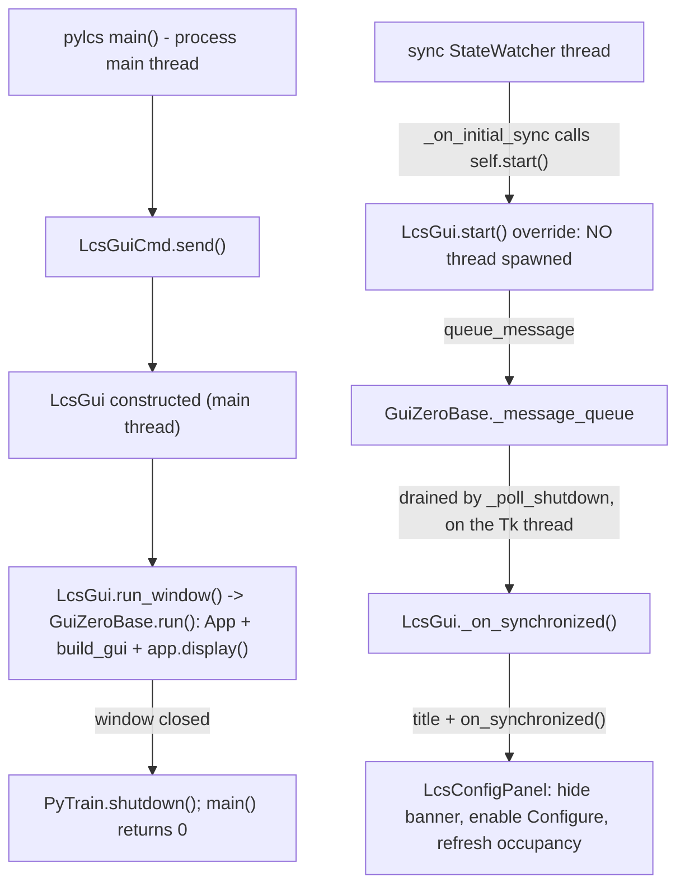

# Requirements

### Overview & Goals

Make the stand-alone **`pylcs`** window actually open on macOS, and give it honest feedback while the Base 3 is still synchronizing.

### Why it still crashes: none of this has been built yet

I checked the files before rewriting anything. **The fix was planned last round but never written.** The code on disk is unchanged:

- `src/pytrain/gui/controller/lcs_gui.py` has **no** `start()` override and **no** `run_window()` — the class is still a plain `GuiZeroBase` subclass that gets started as a thread.
- `src/pytrain/cli/lcs.py` L84-96 still calls `wait_for_sync()`, constructs `LcsGui(...)`, then blocks on `destroy_complete.wait()` and `join(timeout=10)` — it never drives the Tk loop itself.

So the second crash is not a new defect and not a partial fix misbehaving; it is the *same* untouched code producing the *same* abort. Your new trace confirms the path is identical under `-client`:

```
Opening LCS configuration window...          <- cli/lcs.py L86, still there
*** Terminating app due to uncaught exception 'NSInternalInconsistencyException',
    reason: 'NSWindow should only be instantiated on the main thread!'
...
29  Python  thread_run + 180                 <- the App is built inside a Python thread
```

`-client` and `-base` differ only in the arguments `CommandBase.__init__` (`command_base.py` L67-88) hands to `PyTrain`; the window is created the same way in both, so both abort. This plan is unchanged in substance — what it gains is an explicit statement that it starts from zero, and a **proof step** so it cannot be reported done again without a real window having opened.

Right now `cli/lcs.py -client` (and `-base <ip>`) aborts before a single pixel is drawn:

```
*** Terminating app due to uncaught exception 'NSInternalInconsistencyException',
    reason: 'NSWindow should only be instantiated on the main thread!'
```

**This is not a slip in `LcsGui`.** It is the one assumption the whole GUI layer rests on. `GuiZeroBase` *is* a `Thread` (`guizero_base.py` L205), `run()` creates the guizero `App` inside the thread body (L500-505), and `_on_initial_sync` calls `self.start()` from the sync watcher's thread (L439). Every PyTrain GUI therefore builds its window on a worker thread. Under X11 on the Pi that is legal - which is why this has never surfaced - but macOS Aqua requires every `NSWindow` on the main thread, so Tk aborts in `TkMacOSXMakeRealWindowExist`. Your stack trace confirms it: frame 29 is `thread_run`, and the two nested `slot_tp_init` frames below `_tkinter_create` are `App.__init__` calling `Tk.__init__`.

The irony is that `pylcs` is *already* on the main thread when it builds the host: `main()` -> `LcsCli.__init__` -> `cmd.fire()` -> `LcsGuiCmd.send()` all run there. The window is exactly one hop from being legal, and that hop is `Thread.start()`.

### Scope

**In scope**
- `pylcs` runs its Tk event loop on the process's **main thread**, so the window opens on macOS.
- The window opens **immediately**, before Base 3 synchronization, and fills in when sync completes.
- A visible "waiting for Base 3" state, with **Configure** disabled until the state store is populated.
- A clean process exit when the window is closed.
- A written recipe so the next stand-alone entry point does not repeat the mistake.
- **A real window, opened and closed on this Mac, as the acceptance evidence** — not only headless assertions.

**Out of scope**
- **Any change to `GuiZeroBase`** (your choice: keep the fix local to `LcsGui`). The Pi/thread path is untouched, byte for byte.
- `EngineGui`, `SteamDeckGui`, and the generated `buttons_gui.py` launcher path. They are constructed from inside a running PyTrain, on PyTrain's own thread, and must keep running Tk in a thread.
- Making the other GUIs macOS-capable. Only the recipe is written down.
- The device registry, sequence builder, ID map, and everything about how the panel programs a module. None of it changes.

### User Stories

1. As a Mac user, I want `pylcs -base <ip>` to open a window instead of dumping core, so I can configure LCS modules from my laptop.
2. As a user on a layout that takes a while to sync, I want the window to appear at once and tell me it is waiting, rather than a silent terminal that might be hung.
3. As a user, I do not want to press **Configure** while the panel cannot yet see which TMCC IDs are in use, because the occupancy banner would be lying to me.
4. As a user, when I close the window I want the process to exit instead of lingering.
5. As a developer, I want the main-thread requirement written down where the next stand-alone GUI's author will read it.

### Functional Requirements

**Launch**
- The argument surface is unchanged: `pylcs [-client | -server <host> | -base <ip>] [-width] [-height] [-scale_by] [-full_screen]`.
- The guizero `App` is created on the process main thread. On macOS no `NSWindow` exception occurs; on Windows Tk is likewise no longer driven from a secondary thread.
- The window appears without waiting for synchronization, at the requested geometry (default 480x800).
- The panel opens on its device page with base ID 1 and no device pre-selected, exactly as it does today when nothing is on screen.

**While waiting for the Base 3**
- A single status line, visible on every page, reads `Waiting for Base 3...`.
- **Configure** is disabled for as long as that line is showing; the footnote and press preview still render, so the operator can read the sequence they are about to send.
- Back / Next and every other control work normally: device, ID, and options can all be chosen during the wait.
- The ID page's occupancy line reads `Not currently in use` while the store is empty, which is the truthful answer to "what do I know about this ID" at that moment.

**When synchronization completes**
- The status line disappears and **Configure** becomes available.
- The window title becomes the base's name, as it does for every other GUI.
- The panel re-resolves what it derives from the store: the occupancy banner, the overlap advisory, and the Sensor Track Action Command prefill.
- **The operator's choices are never clobbered.** If a device has already been selected during the wait, that selection, the ID, and the options are all left alone and only the derived lines refresh. Only when no device has been chosen yet does the panel re-seed itself from the store.
- If synchronization never arrives, the window stays open and usable, the status line stays, and **Configure** stays disabled. Nothing hangs.

**Closing**
- Closing the window ends the Tk loop, PyTrain is shut down, and the process exits with status 0.
- No attempt is made to `join()` a thread that was never started.

### Non-Functional Requirements
- Zero behavior change for the panel embedded in `EngineGui` or `SteamDeckGui`; the new waiting state is inert unless a host turns it on.
- Zero change to `GuiZeroBase`, so nothing on the Pi can regress.
- The full suite keeps passing (2272 tests today), with `ruff format --check` clean on every changed file.
- **The change is not considered done until a real Tk window has been opened on the main thread on this machine and closed cleanly.** Headless tests can prove *where* the loop runs; only a real window proves the `NSWindow` abort is gone.

# Technical Design

### Current Implementation

- **`guizero_base.py`** - `GuiZeroBase(Thread, ABC)`; `Thread.__init__(daemon=True, name=title)` at L205. `run()` (L500-583) is fully self-contained: it creates the `App` (L505), applies geometry, registers `_poll_shutdown` via `app.repeat(20, ...)` (L565), calls `build_gui()` (L553), blocks in `app.display()` (L573), then tears down and sets `destroy_complete` (L583). Nothing in it depends on being a thread body, so it is legal to invoke directly.
- **`_on_initial_sync`** (L422-439) runs on the sync `StateWatcher`'s thread: it retires the watcher, sets `self.title` from `BaseState.base_name`, waits on `_init_complete_flag`, then calls `self.start()`. **That call is the entire bug on macOS.**
- **`queue_message(fn, *args)`** (L441-442) puts a callable on `_message_queue`; `_poll_shutdown` drains up to `MAX_GUI_MESSAGES_PER_POLL` of them every 20 ms **on the Tk thread**. Messages queued before the app exists simply wait in the queue.
- **`_atexit_close`** (L342-350) already guards its `join` behind `self.is_alive()`, which is `False` for a thread that was never started - so a directly-run host needs no special handling there.
- **`__init__` L213-220** builds a throwaway `tkinter.Tk()` to measure the screen when `width`/`height` are omitted. `LcsGui` passes `width or DEFAULT_WIDTH`, so it is never reached - but it is a live trap for any future host, and belongs in the recipe.
- **`cli/lcs.py`** - `LcsGuiCmd.send()` calls `wait_for_sync()` (L84), constructs `LcsGui` (L87-92), then `destroy_complete.wait()` and `join(timeout=10)` (L95-96). It overrides `send` and ignores `shutdown`, so `CommandBase.fire()` never tears the comm buffer down. **This is still exactly what is on disk** - nothing from the previous plan was applied.
- **`lcs_gui.py`** - `LcsGui.__init__` (L55-96) ends in `init_complete()`, which notifies the sync synchronizer; the watcher thread then runs `_on_initial_sync` -> `start()` -> `run()` -> `App(...)`. There is no `start()` override and no `run_window()` today. Because it passes `width or DEFAULT_WIDTH` / `height or DEFAULT_HEIGHT`, the screen-measuring `Tk()` in `GuiZeroBase.__init__` (L213-220) is never reached, so the *only* Tk object in play is the one `run()` builds.
- **`-client` vs `-base`** - `CommandBase.__init__` (L67-88) only varies the `PyTrain` argument string (`-client` vs `-headless -base <ip>`). Neither touches the GUI, which is why both connection modes abort identically.
- **`cli/pytrain.py`** - `PyTrain.shutdown()` (L671-709) closes zeroconf, the comm buffer, both listeners, the state store, and GPIO. The `-api` thread is a daemon (L297), so it dies with the process.
- **`lcs_config_panel.py`** - `build(body)` (L195) builds the page Boxes into one body Box; `_refresh_review_page` (L476-483) is the single place **Configure** is enabled (`self._enable(self._configure_btn, program is not None)`); `_refresh_occupancy` (L892), `overlap_text` (L932), `_seed_sensor_track_action` (L723) and `configure(...)` (L669) are the store-derived refresh points.

### Key Decisions

1. **The override lives in `LcsGui`, not the base class** (your choice). `LcsGui.start()` is overridden to *not* spawn a thread: it records that the host is ready and hands the sync notification to the Tk loop. `cli/lcs.py` then calls the inherited `run()` itself, on the main thread. `GuiZeroBase` is not touched, so no other GUI's startup can change.
2. **The window comes up first; sync arrives afterwards** (your choice). `LcsGuiCmd.send()` stops calling `wait_for_sync()` and goes straight into the window, so a Mac user sees something immediately.
3. **Sync crosses threads through the queue that already exists.** `_on_initial_sync` runs on the watcher thread and must not touch a single widget. The overridden `start()` therefore only calls `queue_message(self._on_synchronized)`; `_poll_shutdown` runs it on the Tk thread 20 ms later. This is the same mechanism the panel's read-back already uses, and it works whether or not the app exists yet.
4. **The waiting state is a panel capability, off by default.** `LcsConfigPanel.sync_pending` starts `False`, so the panel embedded in `EngineGui` is bit-for-bit unchanged. Only `LcsGui` sets it, and only until sync lands.
5. **On sync, refresh but never re-seed over the operator.** Re-running `configure()` would wipe a device chosen during the wait. `on_synchronized()` re-seeds only when `device is None`; otherwise it refreshes just the derived lines.
6. **The CLI owns the loop and the exit.** After `run()` returns, `send()` calls `self.pytrain.shutdown()` and returns; `main()` returns 0. The `join(timeout=10)` goes away, because there is no thread to join.

### Proposed Changes

**1. `src/pytrain/gui/controller/lcs_gui.py`**

```python
def start(self) -> None:
    """Deliberately does NOT start a thread.

    GuiZeroBase._on_initial_sync calls this from the sync watcher's thread. On macOS a
    window built on that thread aborts the process, so the Tk loop is owned by whoever
    called run_window() -- the process main thread -- and this only reports that the
    Base 3 is now synchronized.
    """
    self._synced.set()
    self.queue_message(self._on_synchronized)

def run_window(self) -> None:
    """Own the Tk event loop on the calling thread. Must be the main thread."""
    if current_thread() is not main_thread():
        raise RuntimeError("LcsGui.run_window() must be called on the main thread")
    self.run()          # inherited: App + build_gui + app.display(), all right here

def _on_synchronized(self) -> None:
    """On the Tk thread: title, then let the panel refresh what it reads from the store."""
    if self.app is not None:
        self.app.title = self.title
    if self._panel is not None:
        self._panel.on_synchronized()

@property
def is_synchronized(self) -> bool:
    """GuiZeroBase keeps `_synchronized` private and exposes no such property."""
    if self._synchronized:
        return True
    return self._sync_state is not None and self._sync_state.is_synchronized()
```

`build_gui()` additionally calls `self._panel.set_sync_pending(not self.is_synchronized)` before `show_popup`, so a window that opens pre-sync shows the banner and one that opens post-sync does not. Note that `is_synchronized` is a small addition **on `LcsGui`**: `GuiZeroBase` sets `_synchronized` (L314, L428) but publishes no property for it, and per your choice the base class is not touched.

The module docstring gains **the recipe** - what a stand-alone GUI must do to run on macOS or Windows: construct the host on the main thread; always pass explicit `width`/`height` so the base class's screen-measuring `Tk()` (L213-220) is never built; override `start()` so the sync watcher cannot spawn the Tk thread; call `run()` from the main thread; marshal every cross-thread update through `queue_message`.

**2. `src/pytrain/gui/controller/lcs_config_panel.py`**

```python
@property
def sync_pending(self) -> bool: ...
def set_sync_pending(self, pending: bool) -> None:   # shows/hides the banner, re-gates Configure
def on_synchronized(self) -> None:                   # sync landed: refresh, re-seed only if untouched
```

- `build(body)` adds one `_sync_line` `Text` to `body` **above** the page Boxes, so the banner shows on whichever page is up. Hidden while `sync_pending` is `False`.
- `_refresh_review_page` gains one condition: `self._enable(self._configure_btn, program is not None and not self._sync_pending)`.
- `on_synchronized()` clears the flag, hides the banner, then: if `self._device is None`, re-seeds from the store via the existing `configure()` path; otherwise calls only `_seed_sensor_track_action()`, `_refresh_id_page()` and `_refresh_review_page()`, leaving the operator's device, ID, and options exactly as they left them.

**3. `src/pytrain/cli/lcs.py`**

```python
def send(self, ...):
    from ..gui.controller.lcs_gui import LcsGui
    # No wait_for_sync(): the window opens now and populates when the Base 3 syncs.
    self._gui = LcsGui(width=..., height=..., scale_by=..., full_screen=...)
    self._gui.run_window()        # blocks on the MAIN thread until the window is closed
    self.pytrain.shutdown()       # so the process exits instead of lingering
```

### Architecture Diagram



### Risks

- **`start()` is a `Thread` method, and overriding it to do nothing is surprising.** Mitigated by a blunt docstring explaining exactly why, and by `run_window()` raising if it is ever called off the main thread - so the failure is a clear Python exception rather than an Objective-C abort.
- **A message queued before the app exists.** If sync completes between construction and `run()`, `queue_message` just parks the callable; `_poll_shutdown` drains it once the loop is up. Nothing is lost and nothing touches Tk early.
- **The panel now renders against an empty store.** `occupant_of` / `overlaps` return nothing and `_seed_sensor_track_action` finds no IRDA state, which the panel already treats as "not in use" - the same path as a genuinely unused ID. The gate on **Configure** is what keeps that honest rather than misleading.
- **`is_alive()` is `False` for a host that was run directly.** `_atexit_close` already checks it before joining, and the CLI no longer joins at all.
- **Real Tk rendering cannot be verified by the unit suite.** No headless assertion reaches `TkMacOSXMakeRealWindowExist`, which is why a green suite coexisted with an abort. Mitigated by promoting the real-window smoke run in the Testing tab to a gating step inside Step 1, rather than leaving it as an optional manual note.

# Testing

### Validation Approach

Two layers, because the headless layer alone is exactly what let this be reported done while still crashing.

1. **A real window is opened on the main thread on this machine** and closed from a timer - the only check that actually exercises `TkMacOSXMakeRealWindowExist`, and the one that must pass before anything is called complete.
2. **Headless assertions about *where* things happen**: that `start()` spawns nothing, that `run_window()` refuses a non-main thread, that the sync callback is delivered through the message queue rather than invoked inline, and that the CLI calls `run_window()` and then shuts PyTrain down. The panel's waiting state is driven through `set_sync_pending` / `on_synchronized`, in the established style of `tests/gui/test_lcs_config_panel.py`.

### Key Scenarios

**Real-window proof (run once, by hand, on this Mac)**

This is the check that was missing, and the reason the crash was reported twice. It needs no Base 3 and no server: it builds a real guizero `App` on the main thread with the runtime singletons stubbed the way `tests/cli/test_lcs.py`'s `_patch_runtime` fixture already does, opens the window, closes it from a timer, and exits.

```python

# run as a one-off command during implementation; nothing is committed

from unittest.mock import patch
with patch("pytrain.gui.guizero_base.CommandDispatcher.get"), \
     patch("pytrain.gui.guizero_base.ComponentStateStore.get"), \
     patch("pytrain.gui.guizero_base.GpioHandler.cache_handler"):
    from pytrain.gui.controller.lcs_gui import LcsGui
    gui = LcsGui(width=480, height=800, stand_alone=False)
    gui.queue_message(lambda: gui.app.after(2500, gui.close))
    gui.run_window()      # main thread; aborts here today, must not after the fix
print("window opened and closed on the main thread")
```

Pass = the LCS panel is visible for a couple of seconds and the command exits 0. Fail = the `NSInternalInconsistencyException` abort, i.e. the fix is not real. If the agent's terminal has no window-server access, this must be handed to the operator to run rather than skipped silently.

**Main-thread ownership (`tests/cli/test_lcs.py`)**
- `LcsGui.start()` returns without spawning a thread: `is_alive()` stays `False` and `threading.active_count()` is unchanged across the call.
- `LcsGui.start()` puts exactly one callable on the message queue instead of invoking it inline, proving no widget is touched from the watcher's thread.
- `run_window()` calls the inherited `run()` on the caller's thread; called from a worker thread it raises `RuntimeError`.
- `LcsGuiCmd.send()` does **not** call `wait_for_sync()`, calls `run_window()`, and then calls `pytrain.shutdown()`. The existing `join_calls == [10]` assertion (`tests/cli/test_lcs.py` L144-156) is replaced by these.
- `main(["-base", "10.0.0.9"])` still returns 0 against a stand-in CLI.

**Sync delivery (`tests/cli/test_lcs.py`)**
- Draining the queued message runs `_on_synchronized`, which sets the app title and calls `panel.on_synchronized()` exactly once.
- `_on_synchronized` with no app and no panel is a no-op rather than an error, covering sync that lands before `run()`.
- `build_gui()` sets the panel's `sync_pending` from the host's synchronized state: `True` when unsynced, `False` when already synced.

**Waiting state (`tests/gui/test_lcs_config_panel.py`)**
- With `sync_pending` set, the banner line carries the waiting text and **Configure** is disabled even when the press program is fully valid; clearing it re-enables Configure.
- Every other control stays usable while pending: device selection, `_set_base_id`, Next / Back.
- `on_synchronized()` with **no device chosen** re-seeds from the store - a known BPC2 at the current ID pre-selects BPC2 and its mode.
- `on_synchronized()` with a device already chosen **keeps** it, along with the ID and the options, and refreshes only the occupancy and overlap lines.
- An unsynchronized panel reports `Not currently in use` for an ID that will later resolve to a module, and reports the module after `on_synchronized()`.

### Edge Cases
- Sync completing before `run()` is called: the message waits in the queue and is applied once the loop starts.
- Sync never completing: the banner stays, **Configure** stays disabled, every other control still works.
- Two sync notifications: `on_synchronized()` is idempotent.
- Window closed during the wait: `run()` returns, `pytrain.shutdown()` runs, `main()` returns 0.
- `sync_pending` is never set by `EngineGui`, so the embedded panel's Configure gating is unchanged - asserted explicitly.

### Test Changes
`tests/cli/test_lcs.py` is **modified** rather than only extended: `FakeGui` gains `run_window` and the geometry test drops `join_calls`. `tests/gui/test_lcs_config_panel.py` gains the waiting-state cases. No other test file changes. Per the project instructions, `ruff format --check` runs on every changed Python file and the full `pytest` suite runs before hand-off.

### Manual checks
- The real-window proof above, run before anything is reported complete.
- `cli/lcs.py -client` and `cli/lcs.py -base 192.168.3.124` on the Mac: the window opens at once showing `Waiting for Base 3...`, the banner clears and the title becomes the base name when sync lands, **Configure** becomes available, and closing the window returns the shell prompt.
- The same on Windows, confirming the window opens and closes cleanly.
- Unchanged behavior of the **LCS...** key inside `EngineGui` on the Pi and in the `SteamDeckGui` compact pane: no banner, and **Configure** gated only by the press program as before.

# Delivery Steps

### ✓ Step 1: Give `pylcs` ownership of the Tk event loop on the main thread
`pylcs` opens its window on macOS instead of aborting, because the guizero `App` is created on the process main thread.

- Override `start()` in `src/pytrain/gui/controller/lcs_gui.py` so it does **not** spawn a thread: `GuiZeroBase._on_initial_sync` (`guizero_base.py` L439) calls it from the sync watcher's thread, and that call is what built the window off-main-thread.
- Add `LcsGui.run_window()`, which raises `RuntimeError` unless it is on the main thread and otherwise calls the inherited `GuiZeroBase.run()` - the `App`, `build_gui()`, and `app.display()` all then happen right there on the main thread.
- Change `LcsGuiCmd.send()` in `src/pytrain/cli/lcs.py` to call `run_window()` instead of relying on the thread, and drop the `destroy_complete.wait()` / `join(timeout=10)` pair, since there is no thread to join.
- Call `self.pytrain.shutdown()` (`cli/pytrain.py` L671-709) after the window closes so the process exits instead of lingering.
- Write the macOS/Windows recipe into the `lcs_gui.py` module docstring: construct the host on the main thread, always pass explicit `width`/`height` so the base class's screen-measuring `Tk()` (`guizero_base.py` L213-220) is never built, override `start()`, call `run()` from the main thread, and marshal every cross-thread update through `queue_message`.
- Update `tests/cli/test_lcs.py`: assert `start()` spawns no thread, that `run_window()` rejects a worker thread, and that `send()` calls `run_window()` then `pytrain.shutdown()`; replace the `join_calls == [10]` assertion and give `FakeGui` a `run_window`.
- Leave `src/pytrain/gui/guizero_base.py` untouched, so no other GUI's startup can change.
- **Prove it with a real window before going further**: run the one-off main-thread smoke command from the Testing tab - real guizero `App`, runtime singletons stubbed, auto-closed from a timer - and confirm it exits 0 instead of aborting with `NSInternalInconsistencyException`. Headless assertions alone are what let this ship broken twice.

### ✓ Step 2: Add a waiting-for-Base-3 state to the panel
The panel can be told it is running ahead of synchronization, shows that plainly, and refuses to send presses until the state store is populated.

- Add `sync_pending`, `set_sync_pending(pending)`, and `on_synchronized()` to `src/pytrain/gui/controller/lcs_config_panel.py`, defaulting to **not** pending so the panel embedded in `EngineGui` is unchanged.
- Build one `_sync_line` `Text` into the body in `build(body)` (L195), above the page Boxes, so the `Waiting for Base 3...` banner is visible on whichever page is showing; hidden whenever `sync_pending` is `False`.
- Extend the single Configure gate in `_refresh_review_page` (L476-483) to `program is not None and not self._sync_pending`, leaving the press preview and the program-mode footnote fully rendered.
- Implement `on_synchronized()` to clear the flag and hide the banner, then re-seed from the store through the existing `configure()` path **only when no device has been chosen**; otherwise refresh just the derived views via `_seed_sensor_track_action()`, `_refresh_id_page()`, and `_refresh_review_page()`, so an operator's device, ID, and options are never overwritten.
- Make `on_synchronized()` idempotent, since two sync notifications are possible.
- Extend `tests/gui/test_lcs_config_panel.py`: Configure disabled while pending and enabled after, other controls still usable while pending, re-seed only when untouched, selection preserved when touched, and occupancy going from `Not currently in use` to the real module.

### ✓ Step 3: Open the window before sync and deliver synchronization into the Tk loop
The stand-alone window appears immediately, and fills itself in when the Base 3 finishes synchronizing.

- Remove the `wait_for_sync()` call from `LcsGuiCmd.send()` (`cli/lcs.py` L84) so the window is built at once rather than after the store is loaded.
- Have the overridden `LcsGui.start()` post `queue_message(self._on_synchronized)` instead of doing any work itself, so nothing touches a widget from the sync watcher's thread; `_poll_shutdown` (`guizero_base.py` L517-551) drains it on the Tk thread within 20 ms, and a message queued before the app exists simply waits.
- Add `LcsGui._on_synchronized()`: set the window title from `self.title` (the base name that `_on_initial_sync` has already resolved) and call `panel.on_synchronized()`; a no-op when there is no app or panel yet.
- Have `LcsGui.build_gui()` call `panel.set_sync_pending(not self.is_synchronized)` before `show_popup`, so a window opened pre-sync shows the banner and one opened post-sync does not.
- Extend `tests/cli/test_lcs.py`: draining the queued message applies the title and calls `panel.on_synchronized()` once, `_on_synchronized` with no app/panel is safe, and `build_gui()` sets `sync_pending` from the host's synchronized state.