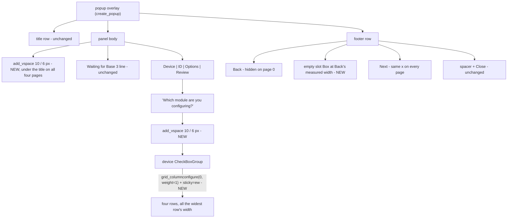

# Requirements

### Overview & Goals

Three presentational corrections to the LCS configuration panel's first screen. Nothing about *what* gets programmed changes — no new presses, no new options, no change to the registry, the sequence builder, the ID map, or the macOS main-thread fix that is now working.

1. **All four LCS device selection boxes get the same width.** They are ragged today because guizero sizes each radio row to its own label.
2. **Tighter whitespace** below the popup title line, and below the "Which module are you configuring?" prompt.
3. **Back is hidden on the first page**, while **Next stays at exactly the same position** it occupies on every other page.

### What is actually wrong today, measured

The device rows are sized by their labels. Measured with real Tk at the panel's own text size, the four rows request:

| Row | Requested width |
|---|---|
| `ASC2 (Accessory / Switch)` | **326 px** |
| `Sensor Track (Accessory)` | 318 px |
| `BPC2 (Track / Accessory)` | 317 px |
| `STM2 (Switch)` | **225 px** |

So STM2's box is 101 px shorter than ASC2's — exactly the raggedness you are seeing. The cause is in guizero itself: `ButtonGroup` grids its rows into a single column with `align="left"`, which becomes `sticky="W"`, so every row keeps its natural width instead of filling the column.

On the footer, `Back` and `Next` are both packed `align="left"`, so `Back` is simply the first thing in the row. Hiding it on its own would let `Next` slide left into its place — which is what you explicitly do not want.

### Scope

**In scope**
- The four device rows on the Device page share one width: the widest row's (your choice).
- A tight gap under the popup title row, on all four pages (your choice), and a tight gap under the Device page's prompt.
- `Back` hidden on the Device page, with `Next` pinned to the same x position on every page.

**Out of scope**
- The mode radio group on the ID page and the option groups on the Options page. You asked about the *device selection* boxes; those groups keep their present natural widths, and unlike the device group they are torn down and rebuilt whenever the device changes.
- `popup_manager.py`, `guizero_base.py`, and every other panel (`AdminPanel`, `StateInfoOverlay`, `Amc2OpsPanel`). The shared footer helpers are reused, not modified.
- Any change to behavior: the same presses, the same `Next` enablement rule (a device must be chosen), the same `Configure` gating (a valid program, and no pending sync).
- `Close`, the footer gap before it, and the waiting-for-Base-3 banner, all unchanged.

### User Stories

1. As an operator, I want the four module choices to read as one tidy column of equal boxes, so the list looks deliberate rather than ragged.
2. As an operator, I want a little air below the title bar and below the question, so the first screen does not feel crowded against the window frame.
3. As an operator, I do not want a dead **Back** button on the first screen, because there is nothing behind it.
4. As an operator stepping through the pages, I want **Next** to stay under my thumb — it must not jump sideways when **Back** appears on page 2.

### Functional Requirements

**Device selection boxes**
- All four rows render at one width: the widest row's natural width (today ASC2's, 326 px on this Mac; the exact number varies with font scaling and is never hard-coded).
- Each row keeps its current text size, radio indicator, and left inset. No label is clipped or wrapped.
- The group as a whole is never wider than it already is today, so nothing new can overflow the Steam Deck's compact pane.
- When AMC2 is added to the registry next turn, its row joins at whatever the new widest width is, with no constant to update.

**Whitespace**
- A tight gap sits between the popup title row and the panel's first content line, on all four pages — Device, ID, Options, and Review.
- The same tight gap sits between "Which module are you configuring?" and the first device row.
- "Tight" is **10 px** on the Pi portrait overlay and **6 px** on the compact pane, which has far less vertical room to spend.
- The `Waiting for Base 3...` banner, when showing, sits below the title gap and still appears on whichever page is up.

**Footer on the first page**
- On the Device page, **Back** is not visible at all — not merely greyed out as it is today.
- **Next** occupies the same horizontal position on all four pages. Stepping to the ID page must not move it.
- From the ID page onward, **Back** is visible and enabled, exactly as now.
- **Close** stays at the right of the row, and the padding around every footer button survives the show/hide.

### Non-Functional Requirements
- Every page still fits the portrait `EngineGui` overlay and the `SteamDeckGui` compact pane; the compact gap values are used on the Deck.
- No functional regression: the existing panel tests, including the waiting-for-sync cases, keep passing unchanged.
- `ruff format --check` clean on every changed file, and the full `pytest` suite green.

# Technical Design

### Current Implementation

All three items live in one file, `src/pytrain/gui/controller/lcs_config_panel.py`:

- **`build(body)`** L240-253 — creates `_sync_line` and then the four page Boxes directly on `body`. There is nothing between the popup's title row and that first line.
- **`_build_device_page(body)`** L262-275 — the prompt `_label(page, "Which module are you configuring?", size=host.s_16, bold=True)` immediately followed by `CheckBoxGroup(page, size=host.s_14, options=self.device_options(), style="radio", ...)`. **No `width` is passed**, which is why each row sizes itself to its own label.
- **`build_footer(footer)`** L1028-1037 — `Back` then `Next`, both `HoldButton(..., align="left", width=8)`, each passed to `style_footer_button`, then `footer_spacer(host, footer)`. `create_popup` (`popup_manager.py` L441-454) appends `Close` afterwards and then calls `restore_footer_packing`. Note: it does **not** currently keep a reference to `footer`, so `self._footer = footer` has to be added before `_show_back` can replay the footer's packing.
- **`refresh_footer()`** L1039-1044 — `Back` is *enabled* when `_page_index > 0` and `Next` when a device is chosen and a page remains. `Back` is therefore present but greyed on page 0 today.
- **`_show_page`** calls `refresh_footer()`, and `build()` calls `_show_page` **before** `build_footer` runs, so `refresh_footer` must stay tolerant of `None` footer widgets.

What the change reuses, unmodified:

- **`GuiZeroBase.add_vspace(parent, pixels)`** (`guizero_base.py` L756-758) — `Box(parent, height=pixels, width="fill", align="top")` with `pack_propagate(False)`. A real, fixed-height spacer widget; already used by `popup_manager.add_close_acc_btn` L517.
- **`popup_manager.style_footer_button`** L82-109 — records its pack padding (`FOOTER_BUTTON_PAD` 20, `FOOTER_BUTTON_PAD_COMPACT` 4) on the widget, and **`restore_footer_packing`** L280-292 replays it, because `Container._pack_widget` rebuilds pack options from scratch and keeps only side/fill.
- **guizero `ButtonGroup`** — `__init__` passes layout `"grid"` for its own frame and `_refresh_options` grids each `RadioButton` at `[0, n]` with `align="left"` (sticky `"W"`). That single fact is the whole cause of item 1.
- **`admin_panel._mirror_two_up_columns`** L603-644 — the in-repo precedent for exactly this fix: `group.tk.grid_columnconfigure(column, weight=1)` plus stretching each option into its cell, complete with the warning in `_apply_compact_grid` L646-659 that creating any widget in a container re-grids every sibling and wipes sticky.

### Key Decisions

1. **Equal widths come from the group's own grid column, not an explicit pixel width** (your choice: "widest label sets the width"). Give the group's column 0 `weight=1` and each row `sticky="ew"`; every row then fills the column, whose width is the widest row's. Measured rationale for *not* using `CheckBoxGroup(width=...)`: with an explicit `-width`, Tk **drops the row's `padx`** — a row measured 306 px at `width=300` whether `padx` was 18 or 0, against 326 px natural with `padx=18` — so the radio dots would slide flush against the left edge. Stretching in the column keeps today's inset, needs no magic number, and lets AMC2's label set the new shared width automatically next turn.
2. **Only the device group is touched.** Its rows are built once — `_refresh_device_selector` L840-847 only assigns `.value` — whereas the mode and option groups are rebuilt with `clear()` / `append()` (L902-904), which destroys and recreates their rows and would silently discard grid options. That matches your scope: the *device selection* boxes.
3. **Whitespace is real spacer widgets via the existing `host.add_vspace`,** not `pack_configure` padding. Padding is discarded the next time anything in the container is created or shown — the documented reason `footer_spacer` and `footer_lead` are widgets rather than padding. One call at the top of `build()` (before `_sync_line`, so it sits under the title on all four pages) and one in `_build_device_page` after the prompt.
4. **Tight means 10 px portrait / 6 px compact** (your choice: tighter than the 16/8 I proposed). One constant pair in the panel, selected by the existing `self.compact`.
5. **`Back` is hidden and its slot is held by an invisible spacer Box sized from `Back`'s own measured width** — not by blanking the button and not by a look-alike widget. Measured: a styled `Button(width=8)` requests **184x52** while an identically padded `Label(width=8)` requests only **156x48**, so a label stand-in would let `Next` drift 28 px; and a blank *button* would still draw a button face. A `Box` with `pack_propagate(False)` at `Back`'s requested width plus its pack padding holds the slot exactly, and an empty frame is genuinely invisible on Aqua where a `tk.Button` background is not dependable.
6. **Every show/hide of a footer child is followed by `restore_footer_packing(footer)`.** `hide()` / `show()` run the footer's `display_widgets()`, which rebuilds pack options from scratch; without the replay, `Back`, `Next`, and `Close` would all lose their 20 px insets the first time you stepped off page 0.

### Proposed Changes

One source file changes. New module constants:

```python

# Tight whitespace under the popup title row, and under a page's prompt. Real spacer

# widgets (host.add_vspace), never pack padding: padding is discarded the next time

# anything in the container is created or shown -- the same reason footer_spacer and

# footer_lead are widgets. The compact pane cannot afford the portrait value.

SECTION_GAP = 10
SECTION_GAP_COMPACT = 6

# Fallback slot width for the hidden Back button, used only when the real button cannot

# be measured (a headless stand-in). Chosen from the measured 184 px request of a styled

# width=8 footer button at portrait size.

FOOTER_SLOT_FALLBACK = 184
```

**1. Whitespace (item 2)**

```python
@property
def _section_gap(self) -> int:
    return SECTION_GAP_COMPACT if self.compact else SECTION_GAP

def build(self, body: Box) -> None:
    host = self._gui
    self._body = body
    # First child of the body, so every page sits this far below the title row.
    host.add_vspace(body, self._section_gap)
    self._sync_line = self._label(body, "", bold=True)
    ...

def _build_device_page(self, body: Box) -> Box:
    page = Box(body, align="top", border=0)
    self._label(page, "Which module are you configuring?", size=host.s_16, bold=True)
    host.add_vspace(page, self._section_gap)
    self._device_group = CheckBoxGroup(...)          # unchanged arguments
    self._equalize_group_rows(self._device_group)
    return page
```

**2. Equal-width device rows (item 1)**

```python
@staticmethod
def _equalize_group_rows(group: CheckBoxGroup) -> None:
    """Make every row of a vertical ButtonGroup as wide as the widest one.

    guizero grids a vertical group's rows into one column with align="left", i.e.
    sticky="W", so each row keeps its natural width and a short label leaves a short
    box -- measured 326 / 317 / 225 / 318 px for ASC2 / BPC2 / STM2 / Sensor Track.
    Giving the column weight and stretching each row into it makes them all the
    column's width, which is the widest row's.

    Deliberately not CheckBoxGroup(width=...): Tk honors an explicit -width by
    *dropping* the row's padx (306 px at width=300 regardless of padx), which would
    pull every radio dot flush against the left edge.

    Only safe on a group whose rows are not rebuilt. ButtonGroup._refresh_options
    destroys and recreates them, and creating a widget re-grids every sibling and wipes
    sticky -- see admin_panel._apply_compact_grid. The device group never rebuilds; the
    mode and option groups do, and are left alone.
    """
    rows = getattr(group, "_rbuttons", None) or ()
    try:
        group.tk.grid_columnconfigure(0, weight=1)
        for row in rows:
            row.tk.grid_configure(sticky="ew")
    except (AttributeError, RuntimeError, TclError, TypeError, ValueError):
        pass
```

Guarded exactly as `amc2_ops_panel` guards its own `grid_columnconfigure` calls (L118-122, L126-130), so a headless stand-in or a future guizero change degrades to today's ragged-but-working layout instead of raising. `TclError` is added to the imports.

**3. Footer: hide `Back`, pin `Next` (item 3)**

```python
def build_footer(self, footer: Box) -> None:
    host = self._gui
    self._footer = footer
    self._back_btn = back = HoldButton(footer, text="Back", align="left", width=8, command=self.previous_page)
    style_footer_button(host, back)
    host.cache(back)
    # Holds Back's place while it is hidden, so Next never moves between pages.
    self._back_slot = self._button_slot(footer, back)
    self._next_btn = nxt = HoldButton(footer, text="Next", align="left", width=8, command=self.next_page)
    ...                                              # unchanged from here down

def _button_slot(self, footer: Box, button: HoldButton) -> Box:
    """An empty Box exactly as wide as `button`'s footer slot, created hidden."""
    pad = FOOTER_BUTTON_PAD_COMPACT if self.compact else FOOTER_BUTTON_PAD
    try:
        button.tk.update_idletasks()
        width = int(button.tk.winfo_reqwidth()) + 2 * pad
    except (AttributeError, RuntimeError, TclError, TypeError, ValueError):
        width = FOOTER_SLOT_FALLBACK + 2 * pad
    slot = Box(footer, align="left", width=width, height=1)
    try:
        slot.tk.pack_propagate(False)
    except (AttributeError, RuntimeError, TclError):
        pass
    slot.hide()
    return slot

def refresh_footer(self) -> None:
    self._show_back(self._page_index > 0)
    if self._next_btn is not None:
        can_advance = self._page_index < len(self._pages) - 1 and self._device is not None
        self._enable(self._next_btn, can_advance)

def _show_back(self, visible: bool) -> None:
    """Back is meaningless on the first page, so it is hidden rather than greyed.

    Its slot stays behind: _back_slot is an empty Box of Back's own requested width,
    shown exactly when Back is not, so Next keeps the same x on every page. Both hide()
    and show() run the footer's display_widgets(), which rebuilds pack options from
    scratch and discards the padding style_footer_button recorded, so it is replayed.
    """
```

`_show_back` enables `Back` when it is shown (preserving today's rule that it is only live off page 0), toggles the slot inversely, and finishes with `restore_footer_packing(self._footer)`. `restore_footer_packing`, `FOOTER_BUTTON_PAD`, and `FOOTER_BUTTON_PAD_COMPACT` join `footer_spacer` and `style_footer_button` in the existing import from `popup_manager` (L47).

### Components

| Component | Change |
|---|---|
| `LcsConfigPanel.build` | one `add_vspace` before `_sync_line` |
| `LcsConfigPanel._build_device_page` | one `add_vspace` after the prompt; `_equalize_group_rows` on the device group |
| `LcsConfigPanel._equalize_group_rows` | **new**; grid-column stretch for a vertical `CheckBoxGroup` |
| `LcsConfigPanel.build_footer` | creates `_back_slot` between `Back` and `Next` |
| `LcsConfigPanel._button_slot`, `_show_back` | **new**; measure the slot, toggle `Back`, replay footer packing |
| `LcsConfigPanel.refresh_footer` | `Back` is shown/hidden instead of enabled/disabled; `Next` rule unchanged |

### File Structure

- **Modified** `src/pytrain/gui/controller/lcs_config_panel.py`
- **Modified** `tests/gui/test_lcs_config_panel.py`
- Nothing else. `popup_manager.py`, `guizero_base.py`, `checkbox_group.py`, `lcs_gui.py`, `cli/lcs.py`, and the registry / sequence-builder / ID-map modules are untouched.

### Architecture Diagram



### Risks

- **Grid sticky is wiped whenever a sibling is created in the same container.** Documented in `admin_panel._apply_compact_grid`. Mitigated because the device group's rows are created once and never rebuilt, `_equalize_group_rows` runs immediately after construction, and the constraint is spelled out in its docstring so the AMC2 pass keeps it true.
- **The slot measurement runs before the window is mapped.** `winfo_reqwidth()` is valid after `update_idletasks()` on an unmapped widget — verified, a styled `width=8` button reports 184x52 unmapped — and the `try` falls back to `FOOTER_SLOT_FALLBACK` if a stand-in has no `tk` methods.
- **Two 10 px gaps push content ~20 px down.** `footer_fill` and `balance_footer_row` absorb it out of the overlay's spare band, and the compact pane uses 6 px. The Review page is the tallest; if it ever crowds the row on the Deck, these gaps are the first thing to trim.
- **A future `width=` on the device group would silently undo item 1** by making Tk drop the padx again. Called out in the helper docstring with the measured numbers.
- **Tk geometry cannot be asserted headlessly.** The dummy-widget suite can prove the grid options and the show/hide bookkeeping, but only a real window proves the boxes look equal — hence the visual check in Testing.

# Testing

### Validation Approach

Two layers, because this is a styling change and Tk geometry is not assertable headlessly:

1. **Headless assertions about the layout instructions the panel issues** — which spacers it asks for and how tall, which grid options it applies to the device group, and which footer widget is visible on which page. This is the established style of `tests/gui/test_lcs_config_panel.py`, whose dummy widgets record their construction arguments.
2. **One real-window visual check** on the Mac via `pylcs`, because only a rendered window proves the four boxes actually line up and that `Next` did not move.

### Key Scenarios

**Whitespace (`tests/gui/test_lcs_config_panel.py`)**
- `FakeHost` gains a recording `add_vspace(parent, pixels)`; building the panel records exactly two calls — one on the body, one on the device page.
- The body spacer is requested **before** `_sync_line` and the pages, so it renders under the title on all four pages.
- The device-page spacer is requested **after** the prompt label and before the device group.
- Both are 10 px on a non-compact host and 6 px when `compact` is `True`.

**Equal-width device rows (`tests/gui/test_lcs_config_panel.py`)**
- Against a stand-in group that exposes `_rbuttons` with recording `tk` stubs, `_equalize_group_rows` configures column 0 with `weight=1` and applies `sticky="ew"` to **every** row — one per registry device.
- It is a silent no-op when `_rbuttons` is missing or empty, which is the plain `DummyCheckBoxGroup` case, so the existing tests keep passing untouched.
- It swallows a `TclError` from `grid_configure` rather than propagating it, matching the `amc2_ops_panel` guard style.
- The device group is still constructed with **no** `width` argument — asserted, because passing one would make Tk drop the row inset and quietly undo the fix.

**Footer (`tests/gui/test_lcs_config_panel.py`)**
- On page 0: `Back` is **not visible** and `_back_slot` **is** visible.
- On pages 1, 2, and 3: `Back` is visible and enabled, and `_back_slot` is hidden.
- Stepping page 0 -> 1 -> 0 restores the initial visibility exactly, so the slot cannot end up doubled with the button.
- `restore_footer_packing` (patched to record) is called after every toggle.
- `Next` enablement is unchanged: disabled with no device chosen, enabled once a device is selected, disabled on the last page.
- `_button_slot` falls back to `FOOTER_SLOT_FALLBACK` — without raising — when the button stand-in cannot be measured.

**Real-window visual check (`pylcs` on this Mac)**
- The four device boxes are visibly the same width, with the radio dots still inset as they are today and no label clipped.
- There is visible air under the title bar and under the question, on the first page, and the same air under the title on the ID, Options, and Review pages.
- **Back** is absent on the first page, and stepping to the ID page makes it appear **without `Next` moving** — the point of the whole footer change.

### Edge Cases
- `refresh_footer()` is called from `_show_page` during `build()`, before `build_footer` exists: no crash with `_back_btn` and `_back_slot` still `None`.
- A host with `compact=True`: gaps are 6 px, the slot padding is 4 px rather than 20, and the group is no wider than today, so nothing clips.
- Sync banner and the new gap coexist: the existing waiting-state tests still pass, with the banner visible on whichever page is up.
- `Close` and the footer spacer are untouched: still present, still to the right of `Next`.

### Test Changes
`tests/gui/test_lcs_config_panel.py` is extended: `FakeHost` gains a recording `add_vspace`, the widget dummies gain what the new assertions read, and `restore_footer_packing` is patched to record calls. No existing assertion is weakened, and no other test file changes. Per the project instructions, `ruff format --check` runs on every changed Python file and the full `pytest` suite runs before hand-off.

# Delivery Steps

### ✓ Step 1: Give the four device selection boxes one width
The Device page shows four radio rows of identical width — the widest row's — with their current inset and text size intact.

- Add `_equalize_group_rows(group)` to `src/pytrain/gui/controller/lcs_config_panel.py`: `group.tk.grid_columnconfigure(0, weight=1)` plus `sticky="ew"` on every row in `group._rbuttons`, wrapped in the same `(AttributeError, RuntimeError, TclError, TypeError, ValueError)` guard `amc2_ops_panel` uses (L118-122).
- Call it from `_build_device_page` (L262-275) immediately after the `CheckBoxGroup` is constructed, and leave that construction otherwise unchanged — in particular **do not** pass `width=`, which makes Tk drop the row's `padx` and pull every radio dot flush left.
- Add `from tkinter import TclError` to the imports.
- Document in the helper's docstring why the grid column is used rather than an explicit width (measured 306 px at `width=300` regardless of `padx`, against 326 px natural), and that it is only safe on a group whose rows are never rebuilt — the device group qualifies, the mode and option groups do not.
- Extend `tests/gui/test_lcs_config_panel.py`: a stand-in group with recording `tk` stubs proves column 0 gets `weight=1` and every row gets `sticky="ew"`; a group without `_rbuttons` is a silent no-op; a raised `TclError` is swallowed; and the device group is still built with no `width` argument.

### ✓ Step 2: Add tight whitespace under the title row and the module prompt
Every page sits a little below the popup title, and the device list sits a little below the question.

- Add `SECTION_GAP = 10` / `SECTION_GAP_COMPACT = 6` module constants and a `_section_gap` property selecting between them on the existing `self.compact`.
- In `build(body)` (L240-253), call `host.add_vspace(body, self._section_gap)` as the **first** child, before `_sync_line` and the page Boxes, so the gap is under the title on all four pages and the waiting banner stays below it.
- In `_build_device_page`, call `host.add_vspace(page, self._section_gap)` between the prompt label and the device group.
- Use `GuiZeroBase.add_vspace` (`guizero_base.py` L756-758) rather than `pack_configure` padding, because padding is discarded on the next repack — the documented reason `footer_spacer` and `footer_lead` are widgets.
- Extend `tests/gui/test_lcs_config_panel.py`: give `FakeHost` a recording `add_vspace`, then assert exactly two spacers are requested, in the right order relative to the sync line and the prompt, at 10 px normally and 6 px when compact.

### ✓ Step 3: Hide Back on the first page without moving Next
`Back` is absent on the Device page and appears from the ID page onward, while `Next` keeps the same position throughout.

- Add `FOOTER_SLOT_FALLBACK = 184` and a `_button_slot(footer, button)` helper that measures `button.tk.winfo_reqwidth()` after `update_idletasks()`, adds `2 * FOOTER_BUTTON_PAD` (or the compact value), and returns a hidden `Box(footer, align="left", width=..., height=1)` with `pack_propagate(False)`.
- In `build_footer` (L1028-1037), create that slot between `Back` and `Next` so it occupies `Back`'s position in the packed row; keep `Next`, `footer_spacer`, and the `Close` button that `create_popup` adds exactly as they are.
- Replace the `Back` enable/disable in `refresh_footer` (L1039-1044) with a `_show_back(visible)` helper that hides `Back` and shows the slot on page 0, does the reverse on every later page, and enables `Back` whenever it is shown.
- Call `restore_footer_packing(self._footer)` at the end of `_show_back`, because `hide()`/`show()` run the footer's `display_widgets()`, which rebuilds pack options from scratch and drops the padding `style_footer_button` recorded.
- Store the footer box in `build_footer` (`self._footer = footer`, with a `_footer: Box | None = None` initializer), because the method does not keep it today and `_show_back` needs it for the packing replay.
- Import `restore_footer_packing`, `FOOTER_BUTTON_PAD`, and `FOOTER_BUTTON_PAD_COMPACT` alongside the existing `popup_manager` imports (L47).
- Extend `tests/gui/test_lcs_config_panel.py`: `Back` hidden and the slot visible on page 0; `Back` visible and enabled with the slot hidden on pages 1-3; visibility restored exactly after stepping forward and back; `restore_footer_packing` called on every toggle; `Next`'s enablement rule unchanged; and the fallback slot width used without raising when the button cannot be measured.
- Confirm on the Mac with `pylcs`: equal device boxes, the new gaps, no `Back` on the first screen, and `Next` in the same place on the first and second screens.