# Requirements

### Overview & Goals
Map the Steam Deck analog triggers to the engine horn so a player can "blow the horn" with variable intensity while holding a trigger:

- **R2** controls the **right** panel's engine/train.
- **L2** controls the **left** panel's engine/train.

Behavior depends on the target engine's control type:

- **Legacy** engines/trains: send the **Quilling Horn** command with an intensity that ramps `0 → 15` proportional to how far the trigger is depressed (`15` = fully depressed). Re-send every **100 ms** while the trigger is held, updating the intensity to match the current trigger position.
- **Non-Legacy** engines (TMCC, Cab-1, R100): send the plain **Blow Horn** command every **100 ms** while the trigger is held. This command carries no intensity value.

### Scope
#### In Scope
- A new analog controller action (`quilling_horn`) in the Steam Deck input layer.
- Trigger-aware axis normalization (triggers rest at one extreme and travel to the other, unlike sticks that rest centered).
- Routing that repeats the horn command every 100 ms while held and stops on release.
- Binding L2/R2 to the left/right panels in the bundled default profile.
- Unit tests mirroring the existing throttle/axis and startup/shutdown tests.

#### Out of Scope
- Any change to the underlying command protocol / `QUILLING_HORN` / `BLOW_HORN_ONE` definitions.
- Touch-UI horn slider behavior in `controller_view.py` (unchanged; only reused as the reference implementation).
- Making the horn work on the physical volume keys or other non-gamepad inputs.

### User Stories
- As an operator of a **Legacy** engine, I want to press R2/L2 partway to sound a soft horn and press it fully for a loud horn, so I have expressive, variable horn control.
- As an operator of a **TMCC/Cab-1/R100** engine, I want holding R2/L2 to repeatedly sound the (fixed-volume) horn, so the horn keeps blowing while I hold the trigger.
- As a two-panel user, I want R2 to affect the right engine and L2 the left engine independently.

### Functional Requirements
1. Holding R2 targets the right panel; holding L2 targets the left panel.
2. While a trigger is held past a small dead zone, a horn command is emitted every ~100 ms; on release, emission stops.
3. For Legacy targets, the emitted command is the Quilling Horn with intensity `= round(fraction × 15)`, clamped to `1..15` while held (so a held-but-light press still sounds), and `15` at full depression.
4. For non-Legacy targets, the emitted command is Blow Horn with no intensity dependence.
5. Legacy-vs-non-Legacy selection is automatic per target engine (no separate binding).

### Non-Functional Requirements
- No regressions to existing throttle/direction/startup/shutdown/halt handling.
- `ruff format --check` clean; full `pytest` suite green.
- If `pygame`/SDL is unavailable, behavior is unchanged (touch controls still work).

# Technical Design

### Current Implementation
The controller pipeline lives in `src/pytrain/gui/controller/steam_deck_input.py`:

- `SteamDeckInputProvider.poll()` translates SDL joystick events into `DeckAction`s. Axis motion (`JOYAXISMOTION`) is looked up in `profile.axes`, normalized by `_normalize_axis()` (a symmetric dead-zone around `0.0`), and emitted as a `DeckAction(action, target, value, "changed")`.
- `DeckInputRouter.handle()` processes actions. `"throttle"` stores the per-target value in `self._throttles`; `"direction"` is latched; button/press actions run below a `if action.phase != "pressed": return` guard.
- `DeckInputRouter.tick(now)` runs on a cadence gated by `profile.repeat_interval` (bundled default **0.1 s = 100 ms**) and applies the stored throttle values by calling `gui.on_speed_command(...)`.
- `ControlProfile.from_dict()` validates bindings. Axis actions must be in `AXIS_ACTIONS = {"throttle", "direction"}` and must target a fixed panel (`left`/`right`).

The GUI command entry point is `EngineGui.on_engine_command(targets, data=...)` (`engine_gui.py`). It accepts a **fallback list**: `do_engine_command()` tries each target in order and uses the first that resolves for the engine's generation. The existing touch horn slider proves the exact pattern we need — `ControllerView.do_quilling_horn()` calls:
```python
host.on_engine_command(["QUILLING_HORN", "BLOW_HORN_ONE"], data=value)
```
For a **Legacy** engine `QUILLING_HORN` resolves (via `TMCC2EngineOpsEnum`) and uses `data` as intensity; for a **non-Legacy** engine `QUILLING_HORN` does not resolve and the list falls through to `BLOW_HORN_ONE` (intensity ignored). Control type is available via `gui.throttle_state.is_legacy` (`EngineState`), the same object the router already reads in `tick()`/`_handle_direction()`.

Bundled profile `steam_deck_default.json` currently binds only stick axes `0,1,3,4`. On the standard SDL Steam Deck layout the triggers are **axis 2 = L2** and **axis 5 = R2**, both currently free.

### Key Decisions
- **Reuse the fallback-list pattern instead of branching on control type in the router.** The router will always emit `["QUILLING_HORN", "BLOW_HORN_ONE"]` with `data=intensity`; `do_engine_command()` already picks Quilling (Legacy, with intensity) vs Blow Horn (non-Legacy, intensity ignored). This matches the proven `do_quilling_horn()` behavior and keeps the router simple, while still satisfying the per-type requirement. Rationale: single source of truth for the TMCC/Legacy distinction already exists in `do_engine_command`.
- **Repeat via the existing `tick()` loop at `profile.repeat_interval`.** The bundled interval is already `0.1 s`, so "every 100 ms" comes for free and stays consistent with throttle repeats. A per-target `self._quills` dict holds the current normalized fraction, analogous to `self._throttles`.
- **Add trigger-aware normalization.** SDL triggers rest at `-1.0` and travel to `+1.0`, so the stick-style symmetric dead zone would read a *released* trigger as full magnitude. A new `AxisBinding.trigger` flag selects a `_normalize_trigger()` path mapping `[-1, +1] → [0, 1]` with a dead zone near the resting end. Rationale: keeps stick behavior untouched and makes the trigger convention explicit/configurable.
- **New analog action name `quilling_horn`.** Added to `SUPPORTED_ACTIONS` and `AXIS_ACTIONS`, reusing the existing axis validation (fixed `left`/`right` target).

### Proposed Changes
**`steam_deck_input.py`**
1. Add `"quilling_horn"` to `SUPPORTED_ACTIONS` and `AXIS_ACTIONS`; add module constants `QUILLING_HORN = "quilling_horn"`, `HORN_MAX_INTENSITY = 15`, and the emitted command list `HORN_COMMAND = ["QUILLING_HORN", "BLOW_HORN_ONE"]`.
2. Extend `AxisBinding` with `trigger: bool = False`; parse `raw_binding.get("trigger", False)` in `from_dict()`.
3. In `poll()`, when the axis binding has `trigger=True`, normalize via a new `_normalize_trigger(axis, value)` (maps resting `-1.0 → 0.0`, full `+1.0 → 1.0`, applies dead zone/hysteresis) instead of `_normalize_axis`. Emit `DeckAction("quilling_horn", target, fraction, "changed")`.
4. In `DeckInputRouter.__init__`, add `self._quills: dict[Target, float] = {}`.
5. In `handle()`, add a branch **before** the `phase != "pressed"` guard: for `"quilling_horn"`, store `self._quills[target] = fraction` when `fraction > 0`, else `pop` the target (release/stop). Optionally emit one immediate horn on the rising edge for responsiveness.
6. In `tick()`, after the throttle loop, iterate `self._quills`: resolve the target `gui`; compute `intensity = max(1, min(HORN_MAX_INTENSITY, round(fraction * HORN_MAX_INTENSITY)))`; call `gui.on_engine_command(HORN_COMMAND, data=intensity)`. This runs every `repeat_interval` (100 ms) while held.
7. In `clear()` and the disconnect/stop paths, clear `self._quills`.

**`steam_deck_default.json`**
8. Add axis bindings:
```json
"2": { "action": "quilling_horn", "target": "left",  "trigger": true },
"5": { "action": "quilling_horn", "target": "right", "trigger": true }
```

**`tests/gui/controller/test_steam_deck_input.py`**
9. Add tests (see Testing tab).

### Data Models / Contracts
```python

# steam_deck_input.py

QUILLING_HORN = "quilling_horn"
HORN_MAX_INTENSITY = 15
HORN_COMMAND = ["QUILLING_HORN", "BLOW_HORN_ONE"]

@dataclass(frozen=True)
class AxisBinding:
    action: str
    target: Target
    invert: bool = False
    trigger: bool = False   # NEW: trigger-style axis (rests at -1.0)

# Router.tick(), appended after throttle handling:

for target, fraction in tuple(self._quills.items()):
    gui = self._target_gui(target)
    if gui is None:
        continue
    intensity = max(1, min(HORN_MAX_INTENSITY, round(fraction * HORN_MAX_INTENSITY)))
    gui.on_engine_command(HORN_COMMAND, data=intensity)  # Legacy: Quilling+intensity; else: Blow Horn
```

### File Structure
- `src/pytrain/gui/controller/steam_deck_input.py` — new action, trigger normalization, router state + repeat.
- `src/pytrain/gui/controller/steam_deck_default.json` — bind L2 (axis 2 → left), R2 (axis 5 → right).
- `tests/gui/controller/test_steam_deck_input.py` — new tests.
- (reference only, unchanged) `controller_view.py` `do_quilling_horn`, `engine_gui.py` `on_engine_command`/`do_engine_command`.

### Architecture Diagram

```mermaid
graph LR
    T[R2 / L2 trigger] -->|JOYAXISMOTION| P[SteamDeckInputProvider.poll]
    P -->|normalize_trigger 0..1| A[DeckAction quilling_horn changed]
    A --> H[DeckInputRouter.handle]
    H -->|store fraction| Q[_quills per target]
    Q --> K[DeckInputRouter.tick every 100ms]
    K -->|QUILLING_HORN, BLOW_HORN_ONE + intensity| G[EngineGui.on_engine_command]
    G -->|Legacy: Quilling w/ intensity| L[(Engine)]
    G -->|non-Legacy: Blow Horn| L
```


### Risks
- **Trigger resting value / axis indices.** Assumes standard SDL layout: L2 = axis 2, R2 = axis 5, resting at `-1.0`. Steam Input remapping can change this. Mitigation: the `trigger` flag isolates the normalization; the connect log already reports axis counts, and indices/inversion are profile-editable if hardware differs. Worth a quick runtime confirmation with the actual axis dump.
- **Command flood.** Emitting every 100 ms is intentional and matches the touch horn (`repeat_interval`/on_repeat) cadence; no additional throttling needed.
- **Minimum intensity.** Clamping held presses to `>=1` keeps a light Legacy press audible; documented so it is a deliberate choice, not a bug.

# Delivery Steps

### ✓ Step 1: Add the quilling_horn analog action and trigger normalization to the input provider
The Steam Deck input layer recognizes a `quilling_horn` analog action and correctly reads trigger axes that rest at -1.0.

- In `steam_deck_input.py`, add `"quilling_horn"` to `SUPPORTED_ACTIONS` and `AXIS_ACTIONS`, plus constants `QUILLING_HORN`, `HORN_MAX_INTENSITY = 15`, and `HORN_COMMAND = ["QUILLING_HORN", "BLOW_HORN_ONE"]`.
- Extend `AxisBinding` with a `trigger: bool = False` field and parse `trigger` in `ControlProfile.from_dict()` (reusing the existing axis validation that requires a fixed `left`/`right` target).
- Implement `_normalize_trigger(axis, value)` mapping SDL's `[-1, +1]` trigger travel to `[0, 1]` with dead-zone/hysteresis near the resting end.
- In `SteamDeckInputProvider.poll()`, route `trigger`-flagged axes through `_normalize_trigger` and emit `DeckAction("quilling_horn", target, fraction, "changed")`.

### ✓ Step 2: Route and repeat the horn command every 100 ms in DeckInputRouter
Holding a mapped trigger repeatedly blows the horn for the correct panel and stops on release, with Legacy vs non-Legacy handled automatically.

- Add `self._quills: dict[Target, float]` to `DeckInputRouter.__init__`.
- In `handle()`, add a `"quilling_horn"` branch above the `phase != "pressed"` guard: store the fraction when `> 0`, pop the target on release, and optionally fire one immediate horn on the rising edge.
- In `tick()`, after the throttle loop, iterate `self._quills`, resolve the target GUI, compute `intensity = max(1, min(HORN_MAX_INTENSITY, round(fraction * HORN_MAX_INTENSITY)))`, and call `gui.on_engine_command(HORN_COMMAND, data=intensity)` so the fallback list selects Quilling+intensity for Legacy and Blow Horn for non-Legacy.
- Clear `self._quills` in `clear()` and on the disconnect/stop paths.

### ✓ Step 3: Bind L2/R2 in the default profile and add unit tests
The bundled profile ships with L2→left and R2→right horn control, verified by tests.

- In `steam_deck_default.json`, add axis `2` → `{action: quilling_horn, target: left, trigger: true}` and axis `5` → `{action: quilling_horn, target: right, trigger: true}`.
- In `tests/gui/controller/test_steam_deck_input.py`, add tests for: the bundled bindings (axes 2/5 with `trigger`); trigger normalization (resting `-1.0` → 0, full `+1.0` → 1, dead zone); provider emitting `quilling_horn` changed actions with fractional values; router storing/clearing `_quills` on press/release; `tick()` emitting `HORN_COMMAND` with the expected intensity for a Legacy fake GUI and Blow-Horn fallback for a non-Legacy fake GUI; and no emission after release.
- Run `../bin/python -m ruff format --check` on the changed files and the full `../bin/python -m pytest` suite.