# Requirements

### Overview & Goals
The earlier **L2/R2 analog-trigger** mapping for the quilling horn did not work well in practice. Replace it with a **trackpad drag gesture**: the player pulls a finger **down from the top of a Steam Deck trackpad toward the bottom** and the engine horn sounds, with intensity following how far down the finger is. The command repeats **every 100 ms** for as long as a finger stays on the pad, and stops the instant the finger lifts.

- **Left trackpad** controls the **left** panel's engine/train.
- **Right trackpad** controls the **right** panel's engine/train.

Behavior still depends on the target engine's control type (unchanged from the trigger design):

- **Legacy** engines/trains: send the **Quilling Horn** command with an intensity that ramps `0 → 15` as the finger moves from the top toward the bottom of the pad. Re-send every **100 ms** while a finger is on the pad, tracking the current finger position.
- **Non-Legacy** engines (TMCC, Cab-1, R100): send the plain **Blow Horn** command every **100 ms** while a finger is on the pad. This command carries no intensity value.

### Scope
#### In Scope
- Capturing the Steam Deck trackpads via SDL's **Game Controller touchpad** events (a new input path in the provider), since trackpads do **not** appear on the joystick API the app currently uses.
- Translating an absolute vertical finger position into a `0..1` horn fraction (top ≈ 0/off, bottom ≈ 1/full), with a small dead zone near the top.
- Reusing the existing `quilling_horn` routing (`_quills` + the `tick()` 100 ms repeat) so no router logic change is needed.
- A configurable trackpad→panel binding (left pad → left panel, right pad → right panel) in the bundled default profile.
- Removing the now-unused L2/R2 `quilling_horn` axis bindings from the default profile (the triggers become free again).
- Unit tests exercising the touchpad path with a fake pygame module + synthetic touchpad events.

#### Out of Scope
- Any change to the underlying command protocol / `QUILLING_HORN` / `BLOW_HORN_ONE` definitions.
- Touch-UI horn slider behavior in `controller_view.py` (unchanged; only reused as the reference implementation).
- Removing the trigger-normalization code (`AxisBinding.trigger` / `_normalize_trigger`); it stays available for profiles that still want a trigger binding.
- Making the horn work on the physical volume keys or other non-gamepad inputs.

### User Stories
- As an operator of a **Legacy** engine, I want to drag my finger a little way down the trackpad for a soft horn and all the way down for a loud horn, so I have expressive, variable horn control that felt more natural than the triggers.
- As an operator of a **TMCC/Cab-1/R100** engine, I want keeping my finger on the trackpad to repeatedly sound the (fixed-volume) horn, so the horn keeps blowing while I hold.
- As a two-panel user, I want the left trackpad to affect the left engine and the right trackpad the right engine independently.

### Functional Requirements
1. A finger on the **left** trackpad targets the left panel; a finger on the **right** trackpad targets the right panel.
2. While a finger is on a mapped trackpad past the top dead zone, a horn command is emitted every ~100 ms; when the finger lifts, emission stops immediately.
3. Intensity follows the finger's **absolute vertical position**: near the top ≈ soft/off, at the bottom ≈ full. For Legacy targets the emitted command is the Quilling Horn with intensity `= round(fraction × 15)`, clamped to `1..15` while a finger is down.
4. For non-Legacy targets, the emitted command is Blow Horn with no intensity dependence.
5. Legacy-vs-non-Legacy selection is automatic per target engine (no separate binding), reusing the existing fallback-list mechanism.
6. If multiple fingers touch the same pad, a single horn stream is driven (last-moved finger wins); the horn stops only when the last finger lifts.

### Non-Functional Requirements
- No regressions to existing throttle/direction/startup/shutdown/halt/D-pad handling.
- `ruff format --check` clean; full `pytest` suite green.
- If `pygame`/SDL is unavailable, or the connected device exposes no touchpad, behavior is unchanged (touch controls still work; the horn simply has no trackpad source).

# Technical Design

### PyGame reminder — how the trackpads surface
The app's controller input (`SteamDeckInputProvider` in `steam_deck_input.py`) is built entirely on pygame's **joystick** subsystem. `start()` calls `pygame.joystick.init()` and restricts events to `JOYAXISMOTION`, `JOYBUTTONDOWN/UP`, `JOYHATMOTION`, `JOYDEVICEADDED/REMOVED` (lines 330–339). `poll()` (lines 370–396) only decodes those. **Trackpads never appear on this joystick API** — that is why they cannot be bound as an axis today.

The Steam Deck trackpads are surfaced by SDL through the **Game Controller** API as *touchpad* events, which pygame-ce exposes as:

- `pygame.CONTROLLERTOUCHPADDOWN` — a finger touched a pad.
- `pygame.CONTROLLERTOUCHPADMOTION` — a finger moved on a pad.
- `pygame.CONTROLLERTOUCHPADUP` — a finger lifted.

Each event carries `instance_id`, `touch_id` (the touchpad **index** on the device), `finger` (finger index), `x`/`y` normalized to `[0.0, 1.0]` (`y = 0.0` at the **top**, `1.0` at the **bottom**), and `pressure`. Confirmed available locally: **pygame-ce 2.5.8 / SDL 2.32.10** exposes `CONTROLLERTOUCHPADMOTION` and the `pygame._sdl2.controller` module. These events are only generated for devices that were **opened as game controllers** (`pygame._sdl2.controller.Controller(index)` / `controller.init()`), which is separate from opening them as joysticks. On the Steam Deck the two pads are touchpads **index 0 (left)** and **index 1 (right)** on the single controller device.

### Steam Deck controller configuration (SteamOS trackpad behavior)
Because the plan reads the **raw SDL Game Controller touchpad events** (`CONTROLLERTOUCHPADDOWN/MOTION/UP`), each trackpad's **behavior in the SteamOS / Steam Input controller layout must be set to `None`**. Any emulation behavior (Mouse, Mouse Region, Flick Stick, Joystick / As Joystick, Direction Pad, Button Pad, Single Button, Direction Swipe, Scroll Wheel, or the radial/touch/hotbar menus) tells Steam Input to **consume** the finger data and translate it into a synthetic cursor/stick/button, so the raw `x/y` touchpad stream never reaches the app (or arrives corrupted). `None` leaves the pad unmapped in the emulation layer so the native touchpad data passes through to SDL — which is exactly what this plan needs. Set **both** the left and right trackpad behavior to `None`.

### Current Implementation
The controller pipeline lives in `src/pytrain/gui/controller/steam_deck_input.py`:

- `SteamDeckInputProvider.start()` opens each device as a **joystick** only (`_add_device`, lines 527–551) and allows the six joystick event types.
- `poll()` (lines 370–396) decodes joystick axis/button/hat events into `DeckAction`s.
- The **`quilling_horn` routing already exists** from the trigger work and can be reused verbatim: `handle()` stores the fraction in `self._quills` on a `QUILLING_HORN` action (lines 608–616), and `tick()` re-emits `HORN_COMMAND` with `intensity = max(1, min(15, round(fraction*15)))` every `profile.repeat_interval` (**0.1 s = 100 ms**) for each stored target (lines 731–740). `clear()` already clears `self._quills` (line 772) and runs on disconnect.
- `EngineGui.on_engine_command(targets, data=...)` accepts a **fallback list**: for a **Legacy** engine `QUILLING_HORN` resolves and uses `data` as intensity; for a **non-Legacy** engine the list falls through to `BLOW_HORN_ONE` (intensity ignored). This is exactly what `ControllerView.do_quilling_horn()` (`controller_view.py`) already does for the on-screen slider.

So the horn command path, per-target repeat, intensity scaling, and Legacy/non-Legacy handling are **already built** — the only genuinely new work is a **touchpad capture path in the provider** that emits the same `QUILLING_HORN` `DeckAction`s.

### Key Decisions (confirmed with the user)
- **Capture trackpads via the SDL Game Controller touchpad API** (not Steam Input axis remapping). Add the controller subsystem alongside the existing joystick subsystem, open each device as a `Controller`, allow the three `CONTROLLERTOUCHPAD*` events, and decode them in `poll()`. Rationale: robust and independent of per-user Steam Input configuration; the alternative (mapping a pad to a free joystick axis via Steam Input) was rejected as unreliable.
- **Absolute vertical position → intensity.** `fraction` is derived directly from the finger's `y` (top ≈ `0`/off, bottom ≈ `1`/full) with a small top dead zone, mirroring the on-screen vertical horn slider. The relative-drag and directional-swipe alternatives were considered but rejected as harder to tune.
- **Left pad → left panel, right pad → right panel**, mirroring the L2/R2 scheme it replaces. Touchpad index `0` = left, `1` = right (to be confirmed at runtime, like the trigger indices were).
- **Reuse the existing `quilling_horn` router path unchanged.** The provider emits `DeckAction(QUILLING_HORN, target, fraction, "changed")` while a finger is down and `DeckAction(QUILLING_HORN, target, 0.0, "changed")` when the last finger lifts; `_quills` + `tick()` already turn that into a 100 ms repeat with the correct intensity and Legacy/non-Legacy selection. No router logic change.
- **Add a configurable `touchpads` profile section** (a new `TouchpadBinding`) rather than hard-coding the pad→panel map, mirroring how `axes`/`buttons` are declared and validated, so the mapping is testable and overridable.
- **Remove the L2/R2 `quilling_horn` axis bindings** from the bundled profile (triggers freed), but keep the `AxisBinding.trigger`/`_normalize_trigger` code so a profile can still bind a trigger if desired.

### Proposed Changes
**`steam_deck_input.py`**
1. Add `CONTROLLERTOUCHPADDOWN/MOTION/UP` to the allowed-event list in `start()` and initialize the controller subsystem (`pygame._sdl2.controller.init()`); open each device as a `Controller` in `_add_device` (keeping the existing joystick open), storing it so touchpad events can be decoded. Guard everything so a device without a touchpad, or a missing controller module, degrades gracefully.
2. Add a `TouchpadBinding(action, target)` dataclass and a `touchpads: Mapping[int, TouchpadBinding]` field on `ControlProfile`; parse/validate a `touchpads` section in `from_dict()` (action must be in a new `TOUCHPAD_ACTIONS = {"quilling_horn"}`, target must be a fixed `left`/`right` panel), and add a `TOUCHPAD_DEAD_ZONE`/`touch_dead_zone` tuning value.
3. Add `_normalize_touch_y(y)` mapping `y ∈ [0, 1]` to a `[0, 1]` fraction with a small top dead zone (`fraction = max(0, (y - dz) / (1 - dz))`).
4. In `poll()`, decode the touchpad events: on DOWN/MOTION, look up `profile.touchpads[touch_id]`, compute the fraction, track the active finger(s) per pad, and emit `DeckAction(QUILLING_HORN, binding.target, fraction, "changed")`; on UP, drop that finger and, when the pad has no fingers left, emit `DeckAction(QUILLING_HORN, binding.target, 0.0, "changed")` to stop.
5. Track per-pad finger state (`self._touch_fingers: dict[int, set[int]]`) and reset it in `stop()`/`_remove_device` alongside the other state.
6. **No `DeckInputRouter` change** — the existing `quilling_horn` `handle()`/`tick()`/`clear()` path already stores/repeats/stops the horn at 100 ms.

**`steam_deck_default.json`**
7. Add a `touchpads` section binding pad `0` → `left` and pad `1` → `right` as `quilling_horn`; **remove** the axis `2`/`5` `quilling_horn` (L2/R2) bindings. Optionally add `touch_dead_zone`.

**`tests/gui/controller/test_steam_deck_input.py`**
8. Add tests (see Testing tab), extending the fake pygame module with touchpad event types and a fake controller.

### Data Models / Contracts
```python

# steam_deck_input.py

TOUCHPAD_ACTIONS = {"quilling_horn"}
DEFAULT_TOUCH_DEAD_ZONE = 0.05

@dataclass(frozen=True)
class TouchpadBinding:
    action: str      # "quilling_horn"
    target: Target   # fixed "left" / "right"

# poll(), new branches:

elif event.type == self._pygame.CONTROLLERTOUCHPADUP:
    for action in self._touch_up(event.touch_id, event.finger):
        actions.append(action)     # emits fraction 0.0 when the pad empties
elif event.type in (self._pygame.CONTROLLERTOUCHPADDOWN, self._pygame.CONTROLLERTOUCHPADMOTION):
    for action in self._touch_moved(event.touch_id, event.finger, float(event.y)):
        actions.append(action)     # emits DeckAction(QUILLING_HORN, target, fraction, "changed")

def _normalize_touch_y(self, y: float) -> float:
    dz = self.profile.touch_dead_zone
    y = max(0.0, min(1.0, y))
    return max(0.0, (y - dz) / (1.0 - dz))
```
The router side is unchanged and already reads these actions (lines 608–616, 731–740).

### File Structure
- `src/pytrain/gui/controller/steam_deck_input.py` — controller-subsystem init + touchpad capture in the provider, `TouchpadBinding`/`touchpads` profile support, `_normalize_touch_y`, per-pad finger tracking. (Router unchanged.)
- `src/pytrain/gui/controller/steam_deck_default.json` — add `touchpads` (pad 0 → left, pad 1 → right); remove L2/R2 axis `quilling_horn` bindings.
- `tests/gui/controller/test_steam_deck_input.py` — new touchpad tests.
- (reference only, unchanged) `controller_view.py` `do_quilling_horn`, `engine_gui.py` `on_engine_command`/`do_engine_command`.

### Architecture Diagram

```mermaid
graph LR
    T[Left / Right trackpad] -->|CONTROLLERTOUCHPAD DOWN/MOTION/UP| P[SteamDeckInputProvider.poll]
    P -->|normalize_touch_y 0..1| A[DeckAction quilling_horn changed]
    A --> H[DeckInputRouter.handle unchanged]
    H -->|store fraction| Q[_quills per target]
    Q --> K[DeckInputRouter.tick every 100ms]
    K -->|QUILLING_HORN, BLOW_HORN_ONE + intensity| G[EngineGui.on_engine_command]
    G -->|Legacy: Quilling w/ intensity| L[(Engine)]
    G -->|non-Legacy: Blow Horn| L
```


### Alternatives Considered
- **Steam Input remap trackpad → joystick axis.** Needs no new event path (bind it like a stick), but depends on per-user Steam configuration and is unreliable — rejected in favor of the native touchpad API.
- **Relative pull-down distance** (anchor at touch-down, intensity ∝ downward displacement) and **directional swipe gate** (sound only during active downward motion). More gesture-like/expressive but harder to tune; rejected in favor of the simpler absolute-position mapping that mirrors the existing on-screen slider.

### Risks
- **Touchpad index mapping.** Assumes pad `0` = left, `1` = right on the Steam Deck. If reversed on real hardware, it is a one-line profile edit (`touchpads` section). Worth a quick runtime confirmation, like the earlier trigger-axis check; the connect log can be extended to report `get_num_touchpads()`.
- **Requires the controller subsystem to open the device.** Touchpad events only fire for devices opened as `Controller`s. Mitigation: open both joystick and controller for each device, and degrade gracefully (no touchpad horn) if `pygame._sdl2.controller` is missing or the device has no touchpad.
- **Multi-finger / ghost touches.** Track fingers per pad and only stop when the last finger lifts (FR6); use the most recently moved finger's `y` for intensity.
- **Testing without real SDL.** Unit tests inject a fake pygame module exposing the touchpad event constants and a fake controller, then feed synthetic events — same strategy already used for the joystick tests.
- **Command flood.** Emitting every 100 ms is intentional and matches the on-screen horn cadence; no extra throttling needed.

# Testing

### Validation Approach
Exercise the new touchpad path through the same fake-pygame strategy already used for the joystick tests in `tests/gui/controller/test_steam_deck_input.py`: extend the fake pygame module with the `CONTROLLERTOUCHPADDOWN/MOTION/UP` event-type constants and a minimal fake controller, feed the provider synthetic touchpad events, and assert on the `DeckAction`s produced by `poll()` and the `on_engine_command` calls produced by the router's `tick()`.

### Key Scenarios
- **Profile parsing:** the bundled `steam_deck_default.json` loads a `touchpads` section binding pad `0` → `left` and pad `1` → `right` as `quilling_horn`, and no longer binds axes `2`/`5` to `quilling_horn`.
- **Vertical normalization:** `_normalize_touch_y` maps top (`y≈0`) → `0` (within the dead zone), mid (`y=0.5`) → ~`0.5`, and bottom (`y=1.0`) → `1.0`.
- **Down/motion → horn:** a DOWN then MOTION on the left pad emits `DeckAction(QUILLING_HORN, "left", fraction, "changed")`; after `handle()` + a `tick()` at 100 ms, a Legacy fake GUI receives `on_engine_command(HORN_COMMAND, data=intensity)` with the expected intensity, and a non-Legacy fake GUI falls through to Blow Horn.
- **Repeat cadence:** while a finger stays down, `tick()` re-emits the horn every `repeat_interval`.
- **Right pad → right panel:** a touch on pad `1` drives the right panel independently of the left.

### Edge Cases
- **Finger lift stops the horn:** a single UP emits `fraction 0.0`, `handle()` pops `_quills`, and subsequent `tick()`s emit nothing.
- **Multi-finger:** two fingers down then one up keeps the horn sounding; only the last UP stops it.
- **No touchpad / missing controller module:** the provider starts and polls without error and simply produces no touchpad actions (touch controls unaffected).
- **Disconnect:** `_remove_device`/`clear()` resets finger state and `_quills` so a stale horn cannot persist.

### Test Changes
- Add the above cases to `tests/gui/controller/test_steam_deck_input.py`; keep the existing trigger-normalization tests (the trigger code remains) but drop/adjust any assertion that the bundled profile still binds axes `2`/`5` to `quilling_horn`.
- Run `../bin/python -m ruff format --check` on the changed files and the full `../bin/python -m pytest` suite.

# Delivery Steps

### ✓ Step 1: Capture Steam Deck trackpads via the SDL Game Controller touchpad API
The provider opens each controller's touchpads and turns a downward finger drag into `quilling_horn` `DeckAction`s.

- In `steam_deck_input.py` `start()`, initialize the controller subsystem (`pygame._sdl2.controller.init()`) and add `CONTROLLERTOUCHPADDOWN`, `CONTROLLERTOUCHPADMOTION`, and `CONTROLLERTOUCHPADUP` to the `set_allowed(...)` event list.
- In `_add_device`, additionally open each device as a `Controller` (keeping the existing joystick open) and store it; guard so a missing `pygame._sdl2.controller` module or a device with no touchpad degrades gracefully (log and continue).
- Add `TOUCHPAD_ACTIONS = {"quilling_horn"}`, a `DEFAULT_TOUCH_DEAD_ZONE`, and a `_normalize_touch_y(y)` helper mapping `y ∈ [0,1]` → `[0,1]` with a small top dead zone.
- Add per-pad finger tracking (`self._touch_fingers`) plus `_touch_moved(touch_id, finger, y)` and `_touch_up(touch_id, finger)` helpers, and decode the three touchpad events in `poll()`: DOWN/MOTION emit `DeckAction(QUILLING_HORN, target, fraction, "changed")`; the last UP on a pad emits `fraction 0.0`.
- Reset `_touch_fingers` in `stop()` and `_remove_device`.

### ✓ Step 2: Add a configurable touchpad profile binding and update the default profile
Profiles can map each trackpad to a panel, and the bundled profile ships left-pad→left / right-pad→right, replacing the L2/R2 triggers.

- Add a `TouchpadBinding(action, target)` dataclass and a `touchpads: Mapping[int, TouchpadBinding]` field on `ControlProfile` (default empty), plus an optional `touch_dead_zone` tuning value.
- Parse and validate a `touchpads` section in `ControlProfile.from_dict()`: the action must be in `TOUCHPAD_ACTIONS` and the target must be a fixed `left`/`right` panel (reusing the axis-style validation).
- In `steam_deck_default.json`, add a `touchpads` section binding pad `0` → `left` and pad `1` → `right` as `quilling_horn` (optionally `touch_dead_zone`), and **remove** the axis `2`/`5` `quilling_horn` (L2/R2) bindings so the triggers are freed.
- Confirm the existing `DeckInputRouter` `quilling_horn` `handle()`/`tick()`/`clear()` path drives the 100 ms repeat unchanged (no router edits).

### ✓ Step 3: Add unit tests and run the checks
The touchpad horn is verified end-to-end with a fake pygame controller, and the suite stays green.

- Extend the fake pygame module in `tests/gui/controller/test_steam_deck_input.py` with the touchpad event-type constants and a minimal fake controller, and feed synthetic DOWN/MOTION/UP events.
- Add the scenarios and edge cases from the Testing tab (profile parsing, `_normalize_touch_y`, down/motion→horn intensity for Legacy vs non-Legacy, repeat cadence, right-pad targeting, finger-lift stop, multi-finger, no-touchpad, disconnect); adjust the stale bundled-profile axis `2`/`5` assertion.
- Run `../bin/python -m ruff format --check` on the changed files and the full `../bin/python -m pytest` suite (format then re-check if needed).