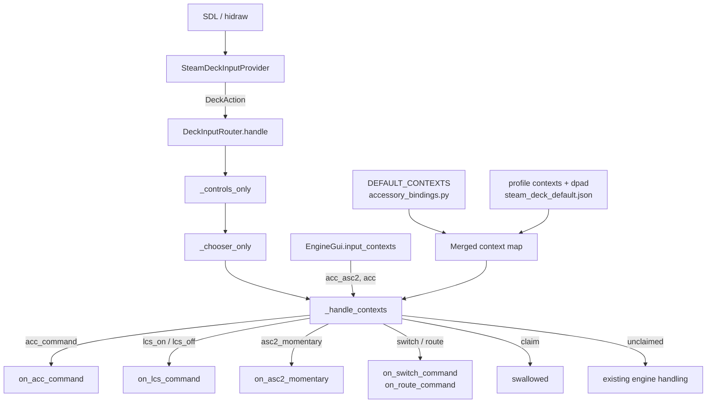

# Understanding

### Confirmation of your request

Yes — understood. To restate it in my own words so we are aligned before any code moves:

1. **This is a spec pass, not an implementation pass.** We expect several rounds of revision before anything is built.
2. **Accessories are the last scope to wire up**, and they are the hardest because one ACC port (TMCC ID / address) can be any of seven different things: BPC2, ASC2, AMC2, Sensor Track, a Lionel operating accessory, an operating accessory driven through ASC2 ports, or an unassigned port awaiting configuration.
3. **The GUI compounds it**: the same scope shows three different panel shapes — an operating-accessory control panel, an ASC2/BPC2/Sensor-Track ops panel, and a generic ACC control panel.
4. **The binding depends on the cross product** of what the port *is* and what panel is *showing*.
5. **It must be configurable, not hard-coded** — and you have accepted that this may require reworking what is already built.
6. **The Controls help page is explicitly out of scope this turn.** I have recorded exactly what it will need in the "Controls Page Notes" tab, and I will not touch it.
7. **A new Controls page may be needed** just for accessories; I have costed that but not committed to it.

### Your three initial requirements, as I read them

| Context | Predicate | Bindings |
|---|---|---|
| Generic ACC panel | `scope == ACC` and `is_lcs_component` is False | Stick ↕ → Throttle (relative speed); L1 → Rear Coupler; R1 → Front Coupler; D-pad ↑/↓ → Boost / Brake |
| BPC2 panel | `scope == ACC` and `is_power_district` is True | R2 and D-pad → `send_lcs_on_command`; L2 and D-pad ← → `send_lcs_off_command` |
| ASC2 panel | `scope == ACC` and `is_asc2` is True | R2 and D-pad → On; L2 and D-pad ← → Off; A and D-pad ↑ → `KeypadView.when_pressed` on press, `when_released` on release |

### Decisions you have already made

- **Defaults in Python, overridable from `steam_deck_default.json`.**
- **Migrate switches and routes onto the new mechanism now**, so there is one mechanism rather than two.
- **Ordered context chain** — a pane reports `("acc_asc2", "acc")` and the most specific entry wins.
- **Full profile `dpad` section** — the D-pad stops being hard-coded and becomes as bindable as buttons and axes.
- **Verb-plus-payload entries** — each binding names a dispatch verb and its payload.
- **AMC2, Sensor Track, operating-accessory overlay and unassigned ports are deferred** to a later pass.

### Open questions I would like settled in the next pass

These are deliberately *not* resolved in this spec — they are what the next round of back-and-forth should decide:

1. **Numeric keypad on the generic ACC panel.** You listed it as a feature of that panel but gave it no binding. A gamepad has no clean way to offer 1–9; a chooser-style overlay (reusing `chooser_visible`) is the obvious candidate.
2. **What the generic ACC stick throttle sends.** `AccessoryState` carries `_relative_speed` and `KeypadView` has an `acc_throttle` slider with its own repeat loop. Should the stick drive `RELATIVE_SPEED` directly, or reuse the slider's send-and-repeat path so gamepad and touch cannot diverge?
3. **AUX1 on the ASC2 panel.** `KeypadView` shows `ac_aux1_cell` for ASC2 but your requirements do not bind it.
4. **Whether the operating-accessory overlay is a context or a page.** It is a popup with `OperationAssets`-driven buttons, so it may want a chooser rather than fixed bindings — this is most likely the "new page" you mentioned.
5. **Does an unassigned port claim controls or ignore them?** Claiming prevents a stray stick reaching a stale engine; ignoring is less surprising.
6. **Should the ACC contexts be pane-scoped or focused-only?** Switches and routes are per-pane; accessories may want the same.


# Requirements

### Overview & Goals

Give the Steam Deck gamepad meaningful control over the ACC scope, and do it through a **data-driven context mechanism** rather than another bespoke handler. The mechanism is the deliverable; the three accessory contexts you specified are its first consumers, and switches and routes are migrated onto it to prove it can carry what already works.

The end state: *what a control does in a given situation* is a table entry, editable from the bundled profile JSON, not a branch in `DeckInputRouter`.

### Scope

**In scope**

- A context-resolution mechanism: ordered context chains, per-context binding tables, Python defaults, profile overrides.
- A `dpad` section in the profile schema, making the D-pad bindable for the first time.
- A dispatch-verb registry so an entry can say *how* to send, not just *what*.
- Three accessory contexts: `acc` (generic), `acc_bpc2`, `acc_asc2`.
- Migration of `_handle_switch` / `_handle_route` onto the mechanism, behavior-for-behavior.
- A widget-free ASC2 momentary entry point on `EngineGui`.

**Out of scope (this turn)**

- **Any change to `ControlsPanel` or `control_labels.py`.** Recorded as notes only.
- AMC2, Sensor Track, unassigned-port and operating-accessory-overlay contexts.
- The numeric keypad on the generic ACC panel.
- Any change to on-screen accessory panels; the gamepad drives the panels that exist.

### User Stories

- As an operator with a generic accessory selected, I want the stick and shoulder buttons to work the way they do for an engine, so I do not have to relearn the pad per scope.
- As an operator with a power district selected, I want a trigger or a D-pad press to switch the block on and off without reaching for the screen.
- As an operator with an ASC2 selected, I want a button I can *hold* for a momentary output, because that is what the on-screen key does.
- As a user with an unusual layout, I want to retune any of this in my own profile without editing Python.
- As a maintainer, I want one mechanism for context remaps, so the next scope is a table entry rather than a fourth handler.

### Functional Requirements

**FR-1 — Generic ACC context (`acc`)**

Active when the pane's scope is ACC, an id is selected, and `is_lcs_component` is False.

| Control | Effect |
|---|---|
| Stick ↕ (own pane) | Accessory throttle / relative speed |
| L1 | Rear coupler |
| R1 | Front coupler |
| D-pad ↑ / ↓ | Boost / Brake, repeating while held |

Engine-only controls that have no accessory meaning are **claimed and dropped**, exactly as the switch and route contexts already do, so a stick or trigger cannot address an engine the pane no longer holds.

**FR-2 — BPC2 context (`acc_bpc2`)**

Active when scope is ACC, an id is selected, and `is_power_district` is True.

| Control | Effect |
|---|---|
| R2, D-pad → | `send_lcs_on_command` |
| L2, D-pad ← | `send_lcs_off_command` |

**FR-3 — ASC2 context (`acc_asc2`)**

Active when scope is ACC, an id is selected, and `is_asc2` is True. Inherits `acc_bpc2`'s On/Off pair through the chain rather than restating it.

| Control | Effect |
|---|---|
| R2, D-pad → | `send_lcs_on_command` |
| L2, D-pad ← | `send_lcs_off_command` |
| A, D-pad ↑ | **Momentary**: press → `when_pressed`, release → `when_released` |

The momentary pair is the only binding in this spec that needs both phases, and it is why the dispatch verb carries the phase.

**FR-4 — Configurability**

- Every entry above is a **default**, defined in Python.
- A `contexts` section in the profile JSON overrides, adds or removes any entry.
- Removal is explicit (`null`), so "unbind this" is expressible and not merely an omission.
- An unknown context name, action or verb is **logged and skipped**, never raised — matching `ControlProfile.load`'s existing fallback discipline.

**FR-5 — No regression**

Switch and route behavior after migration is **identical**, verified by the existing suites in `tests/gui/controller/test_steam_deck_input.py` passing unmodified except where they reference internals that move.

### Non-Functional Requirements

- **No new per-event allocation.** Context resolution runs on every action inside the Tk-driven poll that also services the touch screen; resolution is a dict lookup over a short tuple.
- **Contexts are resolved fresh per action, never cached across actions** — a pane's scope can change between two presses of the same button, which is exactly the `_handle_switch` clean-up case.
- **Tk-free tables.** `accessory_bindings.py` imports no `tkinter` and no `guizero`, so the whole map is testable headless, as `control_labels.py` already is.


# Technical Design

### Current Implementation

The input layer is three files plus a profile:

- **`steam_deck_input.py`** — `ControlProfile` (JSON schema + validation), `SteamDeckInputProvider` (SDL/hidraw → `DeckAction`), `DeckInputRouter` (`DeckAction` → GUI calls).
- **`control_labels.py`** — pure, Tk-free rendering of a profile into help-screen sections.
- **`steam_deck_default.json`** — the bundled profile: `axes`, `buttons`, `touchpads`, `chords`. **No `dpad` section.**

Context remaps today are **module constants plus a handler per panel type**:

- `SWITCH_THRU_ACTIONS` / `SWITCH_OUT_ACTIONS` / `SWITCH_AXIS_ACTIONS` / `SWITCH_BUTTON_ACTIONS` → `_handle_switch`, gated on `gui.switch_active`.
- `ROUTE_FIRE_ACTIONS` / `ROUTE_CLAIMED_ACTIONS` / `ROUTE_AXIS_ACTIONS` → `_handle_route`, gated on `gui.route_active`.
- `_controls_only` and `_chooser_only` are the same shape one level up: claim-everything gates that run before the layout sees an action.

`handle()` is an ordered chain of early-return gates:

```
disconnect → _controls_only → _chooser_only → _handle_switch → _handle_route → throttle → direction → quilling_horn → dpad ↕ → admin → dpad ↔ → repeat buttons → (pressed-only) → global → panel commands
```

The D-pad never reaches the profile at all: `_hat_actions` emits fixed `dpad_*` names and `_handle_scroll_boost` / `_handle_select_smoke` hard-code boost/brake and smoke.

GUI-side entry points that already exist and that the verbs will call:

| Target | Location |
|---|---|
| `on_acc_command(target, data)` → `TMCC1AuxCommandEnum` for `active_state` | `engine_gui.py:2549` |
| `send_lcs_on_command(state)` / `send_lcs_off_command(state)` → BPC2 vs ASC2 branch | `engine_gui_conf.py:503-508` |
| `KeypadView.when_pressed` / `when_released` → `Asc2Req(... CONTROL1, values=1/0)` | `keypad_view.py:882-903` |
| `switch_active` / `route_active`, `on_switch_command` / `on_route_command` | `engine_gui.py:1996-2042` |

Two details shape the design:

- `when_pressed` / `when_released` take a guizero `EventData` **only** to read `event.widget.enabled`. Extracting a widget-free `on_asc2_momentary(pressed: bool)` is therefore a genuine refactor, not a reimplementation.
- `KeypadView.update_accessory_view` (`keypad_view.py:780-814`) already branches Sensor Track / AMC2 / BPC2-or-ASC2 / generic — **the same four-way split the contexts need**. The context names should mirror those branches so the panel on screen and the context claiming the pad cannot drift.

### Key Decisions

**KD-1 — Ordered context chain, reported by the pane.** `EngineGui.input_contexts` returns a tuple, most specific first, e.g. `("acc_asc2", "acc")`. The router walks it and takes the first context defining the action. Chosen over one flat name per context because `acc_asc2` then states only its *differences* from `acc_bpc2`, which is exactly how your ASC2 requirement reads.

**KD-2 — Defaults in Python, overrides in JSON.** `accessory_bindings.py` holds `DEFAULT_CONTEXTS`; `ControlProfile.from_dict` merges a `contexts` section over it. Code-reviewed defaults, user-retunable behavior.

**KD-3 — The D-pad becomes a first-class profile section.** A `dpad` section binds `up`/`down`/`left`/`right` to actions the same way `buttons` does. `_hat_actions` keeps emitting `dpad_*` so the provider is unchanged; the *router* resolves those through the profile instead of hard-coding. Today's boost/brake/smoke behavior moves into the bundled JSON, so it is visibly a default rather than a law.

**KD-4 — Verb-plus-payload entries.** Each entry names a dispatch verb from a small registry. Verbs, and the GUI method each calls:

| Verb | Calls | Phases |
|---|---|---|
| `acc_command` | `gui.on_acc_command(command, data)` | pressed |
| `engine_command` | `gui.on_engine_command(command, data)` | pressed |
| `lcs_on` / `lcs_off` | `gui.on_lcs_command(on=True/False)` | pressed |
| `asc2_momentary` | `gui.on_asc2_momentary(pressed)` | **both** |
| `switch_thru` / `switch_out` | `gui.on_switch_command(thru)` | pressed |
| `route_fire` | `gui.on_route_command()` | pressed |
| `acc_throttle` | `gui.on_acc_speed_command(value)` | analog |
| `claim` | nothing — swallow | both |

`claim` is the verb that makes the migration honest: the switch and route handlers' "swallow so it cannot reach an engine that is not there" becomes a table entry rather than a comment.

**KD-5 — Migrate switches and routes now, as a pure refactor.** `_handle_switch` / `_handle_route` are replaced by `switch` / `route` contexts in the same table. The distinctive parts — axis latching, the catalog's claw-back of the face buttons, the `_held_commands` / `_sequences` clean-up — become **per-context flags**, not lost behavior. Any behavior change here is a bug.

**KD-6 — `_controls_only` and `_chooser_only` stay as they are.** They are modal gates over *every* action, not per-action remaps, and folding them in would make the table describe two different things.

### Proposed Changes

**1. `accessory_bindings.py` (new)** — Tk-free, `control_labels.py`-style.

```python
@dataclass(frozen=True)
class Dispatch:
    verb: str
    command: str | None = None
    data: int | None = None
    repeat: bool = False
    both_phases: bool = False

@dataclass(frozen=True)
class ContextSpec:
    name: str
    bindings: Mapping[str, Dispatch | None]   # action -> dispatch; None = unbind
    claims_unbound: bool = False              # swallow anything not bound here
    axis_latched: bool = False                # one fire per deflection
    yields_to_catalog: frozenset[str] = frozenset()

DEFAULT_CONTEXTS: Mapping[str, ContextSpec] = {...}   # acc, acc_bpc2, acc_asc2, switch, route
```

**2. `steam_deck_input.py`**

- `ControlProfile`: parse `dpad`; parse and merge `contexts`; validate verbs; keep `load`'s log-and-fall-back behavior.
- `DeckInputRouter`: add `_handle_contexts(action)` in place of `_handle_switch` / `_handle_route`, positioned identically in `handle()`'s chain. It resolves `gui.input_contexts`, walks the chain, dispatches or claims.
- Retain `SWITCH_*` / `ROUTE_*` names as thin aliases over the table so `control_labels.py` and its tests keep importing what they import — the Controls page stays untouched this turn.

**3. `engine_gui.py`**

- `input_contexts` property — derived from `scope`, the selected id, and `AccessoryState` flags, mirroring `update_accessory_view`'s branch order.
- `on_lcs_command(on)` — resolves state, calls `send_lcs_on_command` / `send_lcs_off_command`, matching `do_command`'s existing branch at lines 1985-1992.
- `on_asc2_momentary(pressed)` — delegates to `KeypadView`.
- `on_acc_speed_command(value)` — relative-speed entry point (**pending open question 2**).

**4. `keypad_view.py`** — extract the bodies of `when_pressed` / `when_released` into `asc2_control(pressed: bool)`; the existing event handlers become one-line wrappers that keep the `event.widget.enabled` check. No behavior change for touch.

**5. `steam_deck_default.json`** — add `dpad` (carrying today's boost/brake/smoke as defaults) and `contexts` (carrying the three accessory contexts).

### Data Models / Contracts

```python
# EngineGui
@property
def input_contexts(self) -> tuple[str, ...]:
    """Most specific first, e.g. ("acc_asc2", "acc"). Empty = an engine panel."""

def on_lcs_command(self, on: bool) -> None: ...
def on_asc2_momentary(self, pressed: bool) -> None: ...
def on_acc_speed_command(self, value: int) -> None: ...
```

```json
"dpad": {
  "up":    {"action": "boost",     "target": "focused", "repeat": true},
  "down":  {"action": "brake",     "target": "focused", "repeat": true},
  "left":  {"action": "smoke_down", "target": "focused"},
  "right": {"action": "smoke_up",   "target": "focused"}
},
"contexts": {
  "acc_bpc2": {
    "claims_unbound": true,
    "bindings": {
      "startup":  {"verb": "lcs_on"},
      "shutdown": {"verb": "lcs_off"},
      "dpad_right": {"verb": "lcs_on"},
      "dpad_left":  {"verb": "lcs_off"}
    }
  },
  "acc_asc2": {
    "inherits": "acc_bpc2",
    "bindings": {
      "sequence_control": {"verb": "asc2_momentary", "both_phases": true},
      "dpad_up":          {"verb": "asc2_momentary", "both_phases": true}
    }
  }
}
```

Note that R2/L2 are reached as `startup` / `shutdown` — the actions the bundled profile puts on those triggers — not as axis indices, so a user who moves them keeps the accessory behavior. This is the same action-keyed indirection the existing `SWITCH_*` constants and `CATALOG_JUMP_MODIFIER` use.

### Architecture Diagram



### Risks

- **The switch/route migration is the real risk.** Those handlers carry hard-won detail: axis latching with hysteresis, the catalog reclaiming A/Y, dropping pending `_throttles` / `_commanded_speeds` / `_held_commands` / `_sequences` when a pane changes scope. Mitigation: migrate with the existing tests unmodified, and treat any diff as a defect. If a behavior genuinely cannot be expressed as a flag, that is a signal to add a flag — not to accept the change.
- **`_handle_contexts` runs on every action** in the thread that also services the touch screen. Mitigation: resolution is a dict lookup over a tuple of ≤2 names; no allocation on the miss path.
- **`is_asc2` and `is_power_district` are not mutually exclusive in principle** (`is_power_district` is `is_bpc2`, and both read `_control_req` / `_config_req`). Mitigation: the chain is ordered, mirroring `update_accessory_view`'s branch order, so the most specific wins deterministically.
- **Profile override surface is wide** — a user can unbind HALT. Mitigation: refuse overrides for `global`-target safety actions, as `_validate_action_target` already refuses a non-global HALT.
- **The context name and the panel on screen can drift.** Mitigation: derive `input_contexts` from the same flags `update_accessory_view` branches on, and assert the correspondence in a test.


# Controls Page Notes

### Not changing this turn — recorded per your instruction

No edit will be made to `controls_panel.py` or `control_labels.py` in this work. This is the change list for when we do.

### Why it slots in cleanly

`control_labels.py:169` already anticipates this. The comment introducing the panel-section headings reads:

> "…so the panel types still to come — **Aux** — need no new phrasing invented for them, as Routes did not."

The heading vocabulary was designed with an accessory section in mind.

### Changes needed

**1. New section titles**, beside `SWITCH_PANEL_TITLE` / `ROUTE_PANEL_TITLE` (lines 175-179), in the established `"<type> (w focus)"` form:

- `ACC_PANEL_TITLE = "Accessories (w focus)"`
- `BPC2_PANEL_TITLE = "Power Districts (w focus)"`
- `ASC2_PANEL_TITLE = "ASC2 (w focus)"`

**2. Entries stop being `FIXED_*` constants.** `FIXED_SWITCH_ENTRIES` and `FIXED_ROUTE_ENTRIES` are literals because the remaps were module constants. Once contexts come from the merged table, these sections must be **generated from it**, or the help screen will confidently describe bindings a custom profile has overridden. This is the largest change and the reason it deserves its own turn.

**3. `ControlSection.fixed` needs rethinking.** Its docstring says fixed means "a custom profile cannot change" — and it is currently True for the D-pad, switch, route, catalog and popup sections. After KD-3 and KD-5, **the D-pad, switch and route sections are no longer fixed.** Rendering them as fixed would tell the user the D-pad is not remappable at the exact moment it becomes remappable.

**4. `ACTION_LABELS` additions** (lines 109-146) for the new verbs and any new action names: LCS on/off, ASC2 momentary, accessory throttle, boost/brake and smoke as *bound* actions rather than fixed D-pad text. `DPAD_UP`'s label is currently the literal `"Boost speed"`; once bindable it must resolve through the profile.

**5. The momentary hold needs a note.** `ACTION_NOTES` (line 151) has `"hold: w dialog"` for startup/shutdown. ASC2 momentary needs something like `"hold: output on"` — it is the only binding in the set whose *release* does something.

**6. Column budget is the hard constraint.** The comments at lines 520-536 record that the last column already fills "to within a row of the budget `ROWS_PER_COLUMN` falls back to", and that adding one row "put the catalog behind a page turn nobody would think to take." **Three new panel sections cannot fit.** Options, for you to choose from next pass:

- **A second Controls page** — the "new page just to handle accessories" you floated. `ControlsPanel` already pages (`page_controls(forward=...)` is bound to D-pad ↕ in `_controls_only`), so the machinery exists.
- **Context-sensitive Controls** — show the accessory sections only when the focused pane holds an accessory. Cheapest on layout, but the page stops being a stable reference.
- **One merged "Accessories" section** with a row per accessory type. Fits, but compresses three distinct binding sets into three rows.

My recommendation is the second page, because it is what the paging support was built for and it keeps every section legible.

**7. `tests/gui/controller/test_control_labels.py` and `test_controls_panel.py`** will both need updating — they assert section titles, ordering and column packing.


# Testing

### Validation Approach

Three layers, following the split the codebase already uses:

1. **Pure table tests** — `accessory_bindings.py` and the merge logic are Tk-free, so context resolution, chain walking, override merging and validation are tested as data, the way `test_control_labels.py` tests label resolution.
2. **Router tests with stub GUIs** — `tests/gui/controller/test_steam_deck_input.py` already has `_switch_gui()` (line 3016) and `_route_gui()` (line 3240) building stubs that record calls. An `_acc_gui(kind=...)` in the same shape covers the accessory contexts.
3. **Regression by non-modification** — the existing switch and route tests are the migration's acceptance criteria. They should pass **unmodified** except where they touch internals that move.

Per the project guidelines: `../bin/python -m ruff format --check` on every changed file, then the full `../bin/python -m pytest`.

### Key Scenarios

- Generic ACC: stick ↕ drives accessory throttle; L1/R1 send rear/front coupler; D-pad ↑/↓ send Boost/Brake and repeat while held.
- BPC2: R2 and D-pad → each reach `on_lcs_command(on=True)`; L2 and D-pad ← each reach `on_lcs_command(on=False)`.
- ASC2: the On/Off pair is inherited from `acc_bpc2` through the chain, not restated; A and D-pad ↑ call `on_asc2_momentary(True)` on press and `(False)` on release.
- Chain precedence: a pane reporting `("acc_asc2", "acc")` takes the ASC2 entry where both define an action, and falls through to `acc` where only it does.
- Profile override: a `contexts` entry replaces a default; `null` unbinds; the default survives untouched where the override is silent.
- An engine panel (empty `input_contexts`) reaches the existing engine handling completely unchanged.

### Edge Cases

- **Scope changes mid-press** — press on an engine panel, release after the pane becomes an accessory. This is the exact case `_handle_switch`'s `_held_commands` / `_sequences` clean-up exists for (tests at lines 3148-3156 and 3369-3377); it must hold for accessories too.
- **Catalog open over an accessory panel** — A must still confirm the highlighted entry, matching `yields_to_catalog` and the existing switch/route carve-out.
- **Controls or chooser open** — `_controls_only` / `_chooser_only` still gate everything ahead of context resolution.
- **`is_asc2` and `is_bpc2` both true** — chain order decides, deterministically.
- **Malformed profile** — an unknown context, action or verb logs and is skipped; the bundled default still loads. Mirrors `ControlProfile.load`'s existing fallback, which is already tested.
- **ACC scope with id 0** (entry mode, nothing selected) — no accessory context is reported, so nothing is claimed.
- **HALT** — resolves no gui, is never gated, and no override may unbind it.
- **Momentary release lost** — if a pane changes scope between press and release, the ASC2 output must not be left latched on.

### Test Changes

- **New** `tests/gui/controller/test_accessory_bindings.py` — tables, chain resolution, merge and validation, all Tk-free.
- **Extend** `tests/gui/controller/test_steam_deck_input.py` — `_acc_gui(kind=...)` stub plus per-context cases, written in the shape of the existing switch/route blocks.
- **Extend** `tests/gui/controller/test_steam_deck_packaging.py` — the profile now has `dpad` and `contexts` sections to validate.
- **Extend** `tests/gui/test_keypad_view.py` — `asc2_control(pressed)` sends the same `Asc2Req` the event handlers did.
- **Extend** `tests/gui/test_engine_gui_accessories.py` — `input_contexts` for each accessory kind, and that it tracks `update_accessory_view`'s branches.
- **Unmodified** — the existing switch and route suites, which are the migration's proof.


# Delivery Steps

###   Step 1: Build the context mechanism with switches and routes migrated onto it
One data-driven context mechanism carries the existing switch and route remaps, with their test suites passing unmodified.

- Add `src/pytrain/gui/controller/accessory_bindings.py` with `Dispatch`, `ContextSpec` and `DEFAULT_CONTEXTS`; Tk-free and guizero-free, in the style of `control_labels.py`.
- Express the `switch` and `route` contexts in that table, including the per-context flags their handlers need: `axis_latched` for one-throw-per-deflection, `yields_to_catalog` for the catalog reclaiming A/Y, and `claims_unbound` for the swallow.
- Add `DeckInputRouter._handle_contexts(action)` and place it in `handle()`'s chain exactly where `_handle_switch` / `_handle_route` sat, preserving gate order after `_controls_only` and `_chooser_only`.
- Carry over the pending-state clean-up on a claim: `_throttles`, `_commanded_speeds`, `_held_commands`, `_sequences`.
- Add `EngineGui.input_contexts`, returning `("switch",)` / `("route",)` from the existing `switch_active` / `route_active` predicates.
- Retain `SWITCH_*` and `ROUTE_*` module names as thin aliases over the table so `control_labels.py` keeps importing what it imports and the Controls page stays untouched.
- Add `tests/gui/controller/test_accessory_bindings.py` for chain resolution and table shape; run the existing switch and route suites unmodified as the acceptance criterion.

###   Step 2: Make the D-pad and the context tables profile-configurable
The profile JSON can bind the D-pad and override any context entry, with Python defaults behind it.

- Extend `ControlProfile.from_dict` to parse a `dpad` section binding `up`/`down`/`left`/`right` like `buttons`, with `repeat` support.
- Extend it to parse a `contexts` section, merged over `DEFAULT_CONTEXTS`: override, add, `null` to unbind, and `inherits` for chaining.
- Validate dispatch verbs and context names; log-and-skip anything unknown, matching `ControlProfile.load`'s existing fallback rather than raising.
- Refuse overrides that would unbind `global`-target safety actions, alongside the existing `_validate_action_target` rules for HALT and focus.
- Move today's hard-coded D-pad behavior out of `_handle_scroll_boost` / `_handle_select_smoke` and into the bundled `steam_deck_default.json` `dpad` section, so boost/brake and smoke become visible defaults with unchanged behavior.
- Extend `tests/gui/controller/test_steam_deck_packaging.py` for the new sections, and cover merge, unbind, inherit and malformed-input paths.

###   Step 3: Add the generic ACC context
A pane holding a non-LCS accessory drives it from the stick, shoulders and D-pad.

- Report `("acc",)` from `EngineGui.input_contexts` when scope is ACC, an id is selected, and `is_lcs_component` is False, deriving the branch order from `KeypadView.update_accessory_view`.
- Define the `acc` context: stick ↕ to accessory throttle, L1 to rear coupler, R1 to front coupler, D-pad ↑/↓ to Boost/Brake with repeat.
- Add `EngineGui.on_acc_speed_command(value)` for the relative-speed path, routed through the `acc_command` verb to `on_acc_command`.
- Set `claims_unbound` so engine-only controls are swallowed rather than reaching a stale engine.
- Add an `_acc_gui(kind="generic")` stub to `tests/gui/controller/test_steam_deck_input.py` in the shape of `_switch_gui` / `_route_gui`, and cover each binding plus the claim.
- Cover `input_contexts` for the generic accessory in `tests/gui/test_engine_gui_accessories.py`, asserting it tracks the panel actually shown.

###   Step 4: Add the BPC2 and ASC2 contexts with the momentary output
Power districts switch on and off from the pad, and ASC2 outputs respond to a held button.

- Extract the bodies of `KeypadView.when_pressed` / `when_released` into `asc2_control(pressed: bool)`, leaving the event handlers as wrappers that keep the `event.widget.enabled` check so touch behavior is unchanged.
- Add `EngineGui.on_lcs_command(on)`, resolving state and calling `send_lcs_on_command` / `send_lcs_off_command`, mirroring the branch already in `do_command`.
- Add `EngineGui.on_asc2_momentary(pressed)`, delegating to `KeypadView.asc2_control`.
- Define the `acc_bpc2` context: R2 and D-pad → to `lcs_on`, L2 and D-pad ← to `lcs_off`, keyed on the `startup` / `shutdown` actions so a remapped trigger keeps working.
- Define the `acc_asc2` context inheriting `acc_bpc2`, adding A and D-pad ↑ on the `asc2_momentary` verb with `both_phases` so press and release are both delivered.
- Report `("acc_bpc2", "acc")` and `("acc_asc2", "acc_bpc2", "acc")` from `input_contexts`, ordered so an ambiguous state resolves deterministically.
- Cover both contexts in the router tests, including inheritance, the release path, and a scope change between press and release leaving no output latched on.
- Cover `asc2_control` in `tests/gui/test_keypad_view.py`, asserting the same `Asc2Req` the event handlers sent.