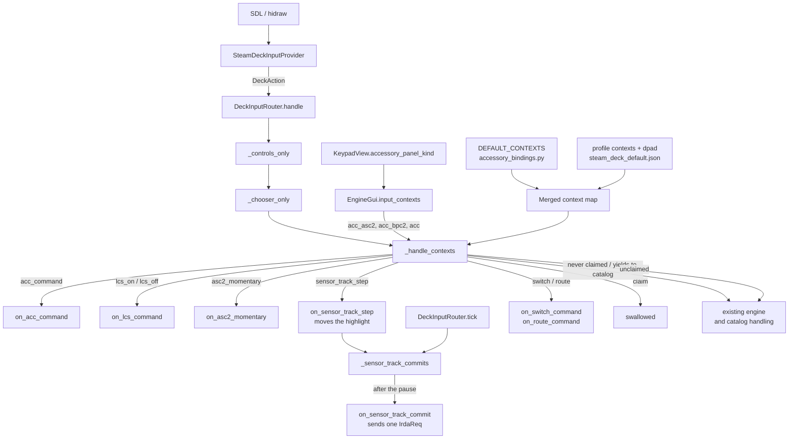

# Understanding

### Confirmation of your request

Yes — understood. To restate it in my own words so we are aligned before any code moves:

1. **This is a spec pass, not an implementation pass.** We expect several rounds of revision before anything is built.
2. **Accessories are the last scope to wire up**, and they are the hardest because one ACC port (TMCC ID / address) can be any of seven different things: BPC2, ASC2, AMC2, Sensor Track, a Lionel operating accessory, an operating accessory driven through ASC2 ports, or an unassigned port awaiting configuration.
3. **The GUI compounds it**: the same scope shows three different panel shapes — an operating-accessory control panel, an ASC2/BPC2/Sensor-Track ops panel, and a generic ACC control panel.
4. **The binding depends on the cross product** of what the port *is* and what panel is *showing*.
5. **It must be configurable, not hard-coded** — and you have accepted that this may require reworking what is already built.
6. **The Controls help page is explicitly out of scope this turn.** I have recorded exactly what it will need in the "Controls Page Notes" tab, and I will not touch it.
7. **A new Controls page may be needed** just for accessories; I have costed that but not committed to it.

### Amendments received on this pass

Six, all folded in below.

**A-1 — The generic ACC bindings follow the *panel*, not the component.** The hard buttons bind **whenever the generic ACC control panel is displayed, even for an LCS device.** The earlier predicate (`is_lcs_component is False`) was wrong, and the code shows exactly why: `apply_ops_mode_ui_non_engine` (`keypad_view.py:788-830`) branches Sensor Track → AMC2 → BPC2-or-ASC2 → **else**, and that `else` is the generic panel. An **LCS STM2** is `is_lcs_component is True` and matches none of the four, so it lands on the generic panel today — as does any LCS port whose `_control_req` / `_config_req` has not identified it yet. Under the old predicate those ports showed a full set of aux keys on screen and claimed nothing on the pad.

**A-2 — Stick ↔ sends `TMCC1AuxCommandEnum.TOGGLE_DIRECTION`.** This costs nothing new: the generic panel already carries a `toggle.jpg` key wired to `host.on_acc_command(["TOGGLE_DIRECTION"])` (`keypad_view.py:239-253`), and `on_acc_command` resolves any name through `TMCC1AuxCommandEnum.by_name`. The stick simply reaches the command that button already sends.

**A-3 — On a power district, the stick pushed right turns the power on and pushed left turns it off.** This was never specified: your original BPC2 requirement named R2, L2 and the D-pad pair only, and `direction` is bound in exactly one place in the table — `_ACC_GENERIC_BINDINGS` — which `acc_bpc2` deliberately does not inherit (the structural half of A-1). So the stick resolves nothing there and is claimed by the `acc` base under FR-0, which is the "does nothing" you saw. Working as specified; the specification was short.

The part of A-3 that is a genuine gap rather than a missing row: **the table cannot express it today.** `Dispatch.axis_signed` gates only *whether* a positive deflection fires — a route uses it to mean "up and right fire, down and left are swallowed" — and there is no way to give left and right **different** dispatches. That is the one new piece of mechanism this pass adds, and it is KD-9.

**A-4 — On an ASC2, the stick works the whole panel: pushed right On, pushed left Off, pushed up *or* down the momentary output.** Confirmed, and it splits cleanly into a half that is already specced and a half that is not:

- **The left/right pair is A-3 arriving by inheritance.** `acc_asc2` inherits `acc_bpc2`, so the `direction_left` / `direction_right` rows Step 6 adds reach the ASC2 panel with no entry of their own. This also settles open question 8 — the pair reaches ASC2, which is what you have just asked for — so nothing new is needed for it beyond building Step 6.
- **The vertical stick is genuinely new mechanism.** A momentary output has to stay energised for as long as the stick is held and drop the moment it recenters, and neither existing axis mode can say that: `axis_latched` fires once on deflection and has **no release at all**, and the analog mode (`acc_throttle`) sends a value rather than a press/release pair. So `Dispatch` gains a third axis mode — a held axis — which is KD-10.

A-4 answers the vertical half of open question 7 for the ASC2 panel. It stays open for a bare BPC2, where there is no momentary output for a held stick to hold.

One consequence of A-4 worth stating up front, because it is the one place this could go quietly wrong: on the ASC2 panel **two controls can now hold the same output at once** — A (or D-pad ↑) and the stick. The off must therefore be sent when the *last* holder lets go, not when either does, or letting the stick recenter would kill an output the operator is still holding A down for.

**A-5 — On a Sensor Track, D-pad ↑ / ↓ move up and down through the Sequence radio buttons.** This is the first binding for a panel the table has been holding a name for: `PANEL_SENSOR_TRACK` already exists in `accessory_bindings.py:260`, and the comment above `PANEL_CONTEXT_CHAINS` says in as many words why it has no chain yet — *"neither panel's controls have been given gamepad bindings, and a chain of nothing but the base would claim every control and send none of them."* A-5 supplies the bindings, so the chain can now be registered.

The panel is a ten-option radio group — `SENSOR_TRACK_OPTS` (`engine_gui_conf.py:466-477`), values 0 through 9, "No Action" through "Recorded Sequence" — built as a `CheckBoxGroup(style="radio")` whose `command=on_sensor_track_change` reads `.value` and sends `IrdaReq(... IRDA_SET, SEQUENCE)`. Three answers you gave shape the binding:

- **Stop at the ends.** ↑ on "No Action" and ↓ on "Recorded Sequence" do nothing and send nothing. No wrap, so a stray press cannot loop the far end of the list back to the near one.
- **One step per press.** No repeat while held, so no write is ever sent that a finger did not ask for individually.
- **Send after a pause.** Stepping moves the highlight immediately; the write goes out once the D-pad has been still for a moment. Crossing the list costs one write rather than nine.

That last one is the only piece of new mechanism A-5 needs, and it is KD-11. It is affordable precisely because moving the highlight and sending are *already* separable: `engine_gui.py:1387` assigns `sensor_track_buttons.value` when incoming state arrives and no command is sent, because the radio group's `command` fires on a click rather than on an assignment. The pad reuses that same assignment.

**A-6 — Not requested, but found while specifying A-5: an accessory panel is currently a navigation dead end.** `acc.claims_unbound` swallows *every* action no accessory context binds, and that turns out to include the controls a pane is navigated *with*. Verified against the live router on all three accessory panels:

| Control | Expected | Actual on an accessory panel |
|---|---|---|
| Menu (`scope_catalog`) | opens the scope catalog | claimed, nothing happens |
| X (`CLOSE_POPUP_BUTTON`) | closes an open popup | claimed, popup stays up |
| D-pad ← with the catalog open | closes the catalog | sends power **off** to the BPC2 |

The first two mean the pad cannot pick a different component once it is on an accessory panel; the third means an open catalog cannot be scrolled or dismissed from a panel whose context binds the D-pad — which today is ASC2 and BPC2, and **which A-5 is about to make true of the Sensor Track panel, where the D-pad is the whole binding.** So this is not a tidy-up alongside A-5; registering the sensor track chain without it would ship a panel that takes the D-pad and cannot be left. It is specified as FR-7 and fixed first.

**A-7 — The Sensor Track write becomes explicit: D-pad → and A select the highlighted option, D-pad ← and X revert to the previously selected one.** This supersedes the half of A-5 that sent the write after a pause. Two answers shape it:

- **The pause goes away entirely.** Stepping now only moves the highlight; nothing reaches the track until select is pressed. The 0.5 s auto-write and select cannot coexist — the pause would win the race on almost every press and leave revert with nothing to undo.
- **Revert undoes the last committed write.** It restores the option that was selected *before* the most recent select and writes it, so a select the operator regrets is recoverable from the pad. It is one-shot: after a revert there is nothing further to undo until the next select.

Where nothing has been selected yet, revert has no committed write to undo and instead abandons an uncommitted move — the highlight snaps back to the option the track is actually set to and **nothing is sent**, the track already being there. That is the only reading that leaves both buttons meaningful before the first select.

One genuine conflict this surfaces, and it is a hole in what is already shipped rather than in A-7. `resolve()` returns an explicit binding *before* it applies the popup carve-out, and `POPUP_ONLY_ACTIONS` carves out `reset` — X — only while a popup is up. Nothing bound `reset` until now, so the ordering never mattered; binding it for revert would mean X reverting the Sequence instead of closing an open popup, which is exactly the dead end FR-7 was written to prevent ("while a popup is open ... **Always** closes it"). The popup gate therefore moves ahead of the binding walk for `POPUP_ONLY_ACTIONS` members, and the test that asserted the opposite is rewritten. `NEVER_CLAIMED_ACTIONS` (Menu) keeps the explicit-binding-wins rule: nothing binds it, and being able to *open* the catalog is not a modal obligation.

### Your requirements, as I now read them

| Context | Predicate | Bindings |
|---|---|---|
| Generic ACC panel | the generic ACC panel is the one displayed — **regardless of `is_lcs_component`** | Stick ↕ → Throttle (relative speed); **Stick ↔ → `TOGGLE_DIRECTION`**; L1 → Rear Coupler; R1 → Front Coupler; D-pad ↑/↓ → Boost / Brake |
| BPC2 panel | `is_power_district` is True | R2, D-pad → and **stick pushed right** → `send_lcs_on_command`; L2, D-pad ← and **stick pushed left** → `send_lcs_off_command` |
| ASC2 panel | `is_asc2` is True | R2, D-pad → and **stick pushed right** → On; L2, D-pad ← and **stick pushed left** → Off; A, D-pad ↑ and **stick pushed up or down** → `KeypadView.when_pressed` while held, `when_released` on release / recenter |
| **Sensor Track panel** | `is_sensor_track` is True | **D-pad ↑ / ↓ → move up / down the Sequence radio group, clamped at both ends, one step per press, sending nothing; D-pad → and A → write the highlighted option; D-pad ← and X → put back the option the last select replaced** |

Every binding in that table now has an on-screen twin on the panel it belongs to, which is a useful check that the mapping is honest rather than invented.

### One structural consequence of A-1

Because the generic bindings are now keyed to *the generic panel being shown*, they must **not** be inherited by the BPC2 and ASC2 contexts — those panels do not show the aux keys, so a coupler or a Boost has nothing to act on there. The chain therefore gains a base:

- `acc` — base for **any** accessory panel: swallow engine-only controls, nothing more.
- `acc_generic` — the aux-key bindings, reached only when the generic panel is up.
- `acc_bpc2`, `acc_asc2` — as before, over the same `acc` base.

This is a rename of what the earlier draft called `acc`, not a new mechanism.

### Decisions you have already made

- **Defaults in Python, overridable from `steam_deck_default.json`.**
- **Migrate switches and routes onto the new mechanism now**, so there is one mechanism rather than two.
- **Ordered context chain** — a pane reports `("acc_asc2", "acc_bpc2", "acc")` and the most specific entry wins.
- **Full profile `dpad` section** — the D-pad stops being hard-coded and becomes as bindable as buttons and axes.
- **Verb-plus-payload entries** — each binding names a dispatch verb and its payload.
- **AMC2, operating-accessory overlay and unassigned ports are deferred** to a later pass. **Sensor Track is no longer deferred** — A-5 specifies it.
- **The generic bindings follow the displayed panel**, so an LCS device on the generic panel is bound like any other accessory.
- **On a Sensor Track the D-pad steps the Sequence options**, clamped at the ends, one step per press, with the write sent after a pause.

### Open questions I would like settled in the next pass

These are deliberately *not* resolved in this spec — they are what the next round of back-and-forth should decide:

1. **Numeric keypad on the generic ACC panel.** You listed it as a feature of that panel but gave it no binding. A gamepad has no clean way to offer 1–9; a chooser-style overlay (reusing `chooser_visible`) is the obvious candidate.
2. **What the generic ACC stick throttle sends.** `AccessoryState` carries `_relative_speed` and `KeypadView` has an `acc_throttle` slider with its own repeat loop. Should the stick drive `RELATIVE_SPEED` directly, or reuse the slider's send-and-repeat path so gamepad and touch cannot diverge? (Stick ↔ is now settled by A-2; this is only about stick ↕.)
3. **AUX1 on the ASC2 panel.** `KeypadView` shows `ac_aux1_cell` for ASC2 but your requirements do not bind it.
4. **Whether the operating-accessory overlay is a context or a page.** It is a popup with `OperationAssets`-driven buttons, so it may want a chooser rather than fixed bindings — this is most likely the "new page" you mentioned.
5. **Does an unassigned port claim controls or ignore them?** Claiming prevents a stray stick reaching a stale engine; ignoring is less surprising.
6. **Should the ACC contexts be pane-scoped or focused-only?** Switches and routes are per-pane; accessories may want the same.
7. **The vertical stick on a bare power district.** A-4 settles ↕ for the ASC2 panel (it holds the momentary output) but a BPC2 has no momentary output, so ↕ stays claimed and dropped there. The obvious symmetry would be `throttle_up` → On and `throttle_down` → Off, which KD-9's variant table would carry in two rows — but with the stick already meaning On/Off left and right, a second pair on the same stick may be more confusing than useful. Your call.
8. ~~**Should the A-3 stick pair be BPC2-only, or reach ASC2 as well?**~~ **Settled by A-4:** it reaches both, by inheritance.
9. **`SET_ADDRESS` and `AUX1_OPT_ONE` on the generic panel.** Both are aux keys on the panel that A-1 now binds, and neither has a control assigned. `SET_ADDRESS` in particular is one I would rather leave unbound than put on a button somebody can brush.
10. **Should a held stick on an ASC2 also drive `AUX1`?** A-4 gives the vertical stick the `CONTROL1` momentary. `AUX1` is the only other key on that panel and is still unbound (question 3), so if you want it on the pad it needs a control of its own.
11. **The rest of the Sensor Track panel.** A-5 binds the Sequence group and nothing else. The panel is only that group, so there is nothing else on it to bind — but the sticks and triggers are claimed and dropped there under FR-0, and you may want one of them to mean something.
12. **AMC2 is now the only accessory panel with no chain.** Once Sensor Track is registered, AMC2 is alone in being left to the engine handling. Its `Amc2OpsPanel` has motor and lamp controls that would map naturally onto the sticks, and it is the obvious next pass.

# Requirements

### Overview & Goals

Give the Steam Deck gamepad meaningful control over the ACC scope, and do it through a **data-driven context mechanism** rather than another bespoke handler. The mechanism is the deliverable; the accessory contexts you specified are its first consumers, and switches and routes are migrated onto it to prove it can carry what already works.

A context is chosen by **the panel a pane is displaying**, not by a flag re-tested in the input layer — the correction behind amendment A-1, and the reason `KeypadView` gains a single property naming the panel it drew.

The end state: *what a control does in a given situation* is a table entry, editable from the bundled profile JSON, not a branch in `DeckInputRouter`.

### Scope

**In scope**

- A context-resolution mechanism: ordered context chains, per-context binding tables, Python defaults, profile overrides.
- A `dpad` section in the profile schema, making the D-pad bindable for the first time.
- A dispatch-verb registry so an entry can say *how* to send, not just *what*.
- Five accessory contexts: `acc` (base — claim only), `acc_generic`, `acc_bpc2`, `acc_asc2`, `acc_sensor_track`.
- A navigation carve-out, so no accessory panel can claim the controls it is left by (A-6).
- A single source of truth for *which accessory panel is displayed*, so the pad and the screen cannot disagree.
- Migration of `_handle_switch` / `_handle_route` onto the mechanism, behavior-for-behavior.
- A widget-free ASC2 momentary entry point on `EngineGui`.

**Out of scope (this turn)**

- **Any change to `ControlsPanel` or `control_labels.py`.** Recorded as notes only.
- AMC2, unassigned-port and operating-accessory-overlay contexts.
- Any binding on the Sensor Track panel beyond the Sequence group — the sticks and triggers stay claimed and dropped there.
- The numeric keypad on the generic ACC panel.
- Any change to on-screen accessory panels; the gamepad drives the panels that exist.

### User Stories

- As an operator with a generic accessory selected, I want the stick and shoulder buttons to work the way they do for an engine, so I do not have to relearn the pad per scope.
- As an operator with an LCS port that shows the generic panel (an STM2, or one not yet identified), I want the pad to drive the keys I can see, rather than going dead because the port happens to be an LCS device.
- As an operator with a reversible accessory selected, I want a flick of the stick to reverse it, so I do not have to find the toggle key on screen.
- As an operator with a power district selected, I want a trigger or a D-pad press to switch the block on and off without reaching for the screen.
- As an operator with an ASC2 selected, I want a button I can *hold* for a momentary output, because that is what the on-screen key does.
- As an operator with a Sensor Track selected, I want to step through the Sequence options with the D-pad, so I can change what the track does without aiming at one of ten small radio buttons.
- As an operator stepping past several Sequence options to reach the one I want, I want only the option I settle on to be written to the track, not every option I passed over.
- As an operator on any accessory panel, I want the Menu button to still open the catalog and X to still close a popup, so I can leave the panel the same way I arrived at it.
- As a user with an unusual layout, I want to retune any of this in my own profile without editing Python.
- As a maintainer, I want one mechanism for context remaps, so the next scope is a table entry rather than a fourth handler.

### Functional Requirements

**FR-0 — Base accessory context (`acc`)**

Active whenever a pane is showing **any** accessory panel. It binds nothing; it exists so that engine-only controls are **claimed and dropped** on every accessory panel, exactly as the switch and route contexts already do, and so a stick or trigger cannot address an engine the pane no longer holds. Each of FR-1 to FR-3 sits over it.

**FR-1 — Generic ACC context (`acc_generic`)**

Active when **the generic ACC control panel is the panel displayed** — that is, an accessory panel is up, an id is selected, and the state is neither Sensor Track, AMC2, BPC2 nor ASC2. **`is_lcs_component` is not consulted**: an LCS STM2, or an LCS port not yet identified, shows the generic panel and is bound here like any other accessory (amendment A-1).

| Control | Effect |
|---|---|
| Stick ↕ (own pane) | Accessory throttle / relative speed |
| Stick ↔ (own pane) | `TOGGLE_DIRECTION` — one toggle per deflection |
| L1 | Rear coupler |
| R1 | Front coupler |
| D-pad ↑ / ↓ | Boost / Brake, repeating while held |

Every one of these is a command the generic panel already offers on screen (`keypad_view.py:160-269`), so nothing new is invented for the pad.

Stick ↔ is **latched**: one `TOGGLE_DIRECTION` per push, re-armed only once the stick comes back near center, and the **sign is ignored** — left and right both toggle, because the command is a toggle and there is no left-hand or right-hand version of it. This is the same latch `_handle_direction` and `_throw_switch_from_axis` already use, driven by `direction_threshold` and `hysteresis`.

**FR-2 — BPC2 context (`acc_bpc2`)**

Active when the pane is showing an accessory panel, an id is selected, and `is_power_district` is True. Note this is **not** ACC-scope-only: `KeypadView.is_accessory_or_bpc2` (`keypad_view.py:99-104`) also admits a `LcsProxyState` power district under TRAIN scope, and that pane shows the BPC2 panel — so the context must follow that same predicate, not `scope == ACC`.

| Control | Effect |
|---|---|
| R2, D-pad →, **stick pushed right** | `send_lcs_on_command` |
| L2, D-pad ←, **stick pushed left** | `send_lcs_off_command` |

The stick pair (amendment A-3) is **latched and sign-specific**: one command per deflection, and the direction of the push chooses which. Push left for Off, let the stick come back through center, push right for On. A thumb resting on a deflected stick sends once, not once per poll.

The **vertical** stick on a *bare* power district stays claimed and dropped under FR-0 — there is no momentary output on that panel for it to hold. On an ASC2 it drives the momentary output, which is FR-3 below, and open question 7 is what remains: whether a BPC2 wants ↕ for On/Off as well.

**FR-3 — ASC2 context (`acc_asc2`)**

Active when the pane is showing an accessory panel, an id is selected, and `is_asc2` is True. Inherits `acc_bpc2`'s On/Off pair through the chain rather than restating it.

| Control | Effect |
|---|---|
| R2, D-pad →, stick pushed right | `send_lcs_on_command` |
| L2, D-pad ←, stick pushed left | `send_lcs_off_command` |
| A, D-pad ↑ | **Momentary**: press → `when_pressed`, release → `when_released` |
| **Stick ↕, either way** | **Momentary**: held past `direction_threshold` → `when_pressed`; recentered → `when_released` |

The momentary bindings are the only ones in this spec that need both phases, and they are why the dispatch verb carries the phase.

The stick ↕ row (amendment A-4) is **sign-blind and held, not latched**: up and down both energise the output, and it stays energised for as long as the stick is away from center. This is a third axis mode — see KD-10 — because the latched mode has no release and the analog mode sends a value rather than a phase.

The left/right pair arrives here **by inheritance from `acc_bpc2`**, with no entry of its own, which is what the chain is for.

**FR-3b — Sensor Track context (`acc_sensor_track`)**

Active when the pane is showing the Sensor Track panel — `accessory_panel_kind` reports `sensor_track`. Sits directly over the `acc` base and inherits nothing else: the panel shows one radio group and no keys, so there is nothing on it for a generic or power-district binding to act on.

| Control | Effect |
|---|---|
| D-pad ↑ | Move the Sequence selection one option **toward** "No Action" |
| D-pad ↓ | Move it one option **toward** "Recorded Sequence" |
| D-pad →, A | **Select**: write the highlighted option to the track |
| D-pad ←, X | **Revert**: put back the option the last select replaced, and write it |

X keeps its first duty: while a popup is up it closes the popup and reverts nothing (FR-7).

The direction convention matches the catalog's: up is a negative delta, toward the top of the list, exactly as `scroll_catalog(-1)` means up.

- **Clamped, not wrapping.** ↑ with "No Action" already selected, and ↓ with "Recorded Sequence" already selected, move nothing and send nothing.
- **One step per press.** The binding is not `repeat`-flagged, so a held D-pad steps once. Ten presses cross the list.
- **Stepping sends nothing at all.** The write is explicit (amendment A-7), so crossing the whole list costs **one** `IrdaReq` and only when it is asked for. Superseded: the 0.5 s pause of the first draft is gone. See KD-11.
- **An unset selection** (the panel has no `IrdaState` yet, so `sensor_track_buttons.value` is `None`) is treated as being at index 0: the first press of either direction highlights "No Action", and a second press moves off it.

Nothing else on the Sensor Track panel is bound. The sticks and triggers are claimed and dropped by the `acc` base under FR-0, as they are on every other accessory panel.

**FR-3a — Last holder wins**

A (or D-pad ↑) and the stick ↕ drive the *same* `CONTROL1` output. While more than one of them is held the output stays on, and `when_released` is sent when the **last** one lets go. Releasing one control must never turn off an output another is still holding, and no control may be left holding an output that has already been switched off.

**FR-7 — An accessory panel must not claim the controls it is navigated by (A-6)**

Three controls keep the meaning they have everywhere else on **every** accessory panel, whatever a context claims:

| Control | Requirement |
|---|---|
| `scope_catalog` (Menu) | Always opens or closes the scope catalog. |
| `CLOSE_POPUP_BUTTON` (X) **while a popup is open** | Always closes it. |
| D-pad ↑ ↓ ← → **while the catalog is open** | Scroll, confirm and cancel the highlighted entry, never the accessory binding. |

Menu holds whether or not anything is open — being able to *open* the catalog is the point. X does not: FR-7 asks of it only that it close an open popup, and with nothing open it is claimed by the accessory context like any other engine control. Carving it out unconditionally is not free, which is the correction Step 8's review found: an unclaimed X falls through to the ordinary panel-command path, which registers a held repeat and re-sends `RESET` at the pane. On an ACC-scope panel `on_engine_command`'s guard makes that a silent no-op, but a power district reached as an `LcsProxyState` shows the BPC2 panel under **TRAIN** scope, where the guard passes and a repeating TMCC train `RESET` goes out at the district's own address — exactly what `acc`'s `claims_unbound` exists to prevent.

The third row is the existing `yields_to_catalog` carve-out extended from the face buttons to the D-pad, and applies to any accessory context.

A release that arrives while the catalog is open must still reach `_momentary_holds`, so an ASC2 output held by D-pad ↑ when the catalog opened is not left energised. That ordering already holds — the release check precedes the catalog carve-out in `_handle_contexts` — and must not be disturbed. A **repeating** binding the catalog takes is dropped on the same principle: a D-pad ↑ registered as a repeat before the list came up must stop the moment it comes up, not when the thumb comes off, or `tick()` goes on boosting the accessory underneath the list the operator is reading.

**FR-4 — Configurability**

- Every entry above is a **default**, defined in Python.
- A `contexts` section in the profile JSON overrides, adds or removes any entry.
- Removal is explicit (`null`), so "unbind this" is expressible and not merely an omission.
- An unknown context name, action or verb is **logged and skipped**, never raised — matching `ControlProfile.load`'s existing fallback discipline.

**FR-5 — No regression**

Switch and route behavior after migration is **identical**, verified by the existing suites in `tests/gui/controller/test_steam_deck_input.py` passing unmodified except where they reference internals that move.

### Non-Functional Requirements

- **No new per-event allocation.** Context resolution runs on every action inside the Tk-driven poll that also services the touch screen; resolution is a dict lookup over a short tuple.
- **Contexts are resolved fresh per action, never cached across actions** — a pane's scope can change between two presses of the same button, which is exactly the `_handle_switch` clean-up case.
- **The pad and the screen agree by construction.** The context reported must be derived from the *same* branch that chose the panel, so no accessory can show one set of keys and answer to another.
- **Tk-free tables.** `accessory_bindings.py` imports no `tkinter` and no `guizero`, so the whole map is testable headless, as `control_labels.py` already is.

# Technical Design

### Current Implementation

The input layer is three files plus a profile:

- **`steam_deck_input.py`** — `ControlProfile` (JSON schema + validation), `SteamDeckInputProvider` (SDL/hidraw → `DeckAction`), `DeckInputRouter` (`DeckAction` → GUI calls).
- **`control_labels.py`** — pure, Tk-free rendering of a profile into help-screen sections.
- **`steam_deck_default.json`** — the bundled profile: `axes`, `buttons`, `touchpads`, `chords`. **No `dpad` section.**

Context remaps today are **module constants plus a handler per panel type**:

- `SWITCH_THRU_ACTIONS` / `SWITCH_OUT_ACTIONS` / `SWITCH_AXIS_ACTIONS` / `SWITCH_BUTTON_ACTIONS` → `_handle_switch`, gated on `gui.switch_active`.
- `ROUTE_FIRE_ACTIONS` / `ROUTE_CLAIMED_ACTIONS` / `ROUTE_AXIS_ACTIONS` → `_handle_route`, gated on `gui.route_active`.
- `_controls_only` and `_chooser_only` are the same shape one level up: claim-everything gates that run before the layout sees an action.

`handle()` is an ordered chain of early-return gates:

```
disconnect → _controls_only → _chooser_only → _handle_switch → _handle_route → throttle → direction → quilling_horn → dpad ↕ → admin → dpad ↔ → repeat buttons → (pressed-only) → global → panel commands
```

The D-pad never reaches the profile at all: `_hat_actions` emits fixed `dpad_*` names and `_handle_scroll_boost` / `_handle_select_smoke` hard-code boost/brake and smoke.

GUI-side entry points that already exist and that the verbs will call:

| Target | Location |
|---|---|
| `on_acc_command(target, data)` → `TMCC1AuxCommandEnum` for `active_state` | `engine_gui.py:2549` |
| `send_lcs_on_command(state)` / `send_lcs_off_command(state)` → BPC2 vs ASC2 branch | `engine_gui_conf.py:503-508` |
| `KeypadView.when_pressed` / `when_released` → `Asc2Req(... CONTROL1, values=1/0)` | `keypad_view.py:882-903` |
| `switch_active` / `route_active`, `on_switch_command` / `on_route_command` | `engine_gui.py:1996-2042` |

Two details shape the design:

- `when_pressed` / `when_released` take a guizero `EventData` **only** to read `event.widget.enabled`. Extracting a widget-free `on_asc2_momentary(pressed: bool)` is therefore a genuine refactor, not a reimplementation.
- `KeypadView.apply_ops_mode_ui_non_engine` (`keypad_view.py:788-830`) already branches Sensor Track / AMC2 / BPC2-or-ASC2 / **else = generic** — **the same four-way split the contexts need**. Amendment A-1 is precisely a statement about that `else`: an LCS STM2 (`is_stm2`, and `is_lcs_component is True`) matches none of the first three and lands on the generic panel, as does any LCS port not yet identified by its `_control_req` / `_config_req`. So the context must be chosen by *the branch taken*, not by a flag re-tested elsewhere.
- The generic panel's aux keys are all `on_acc_command` calls, already wired: `FRONT_COUPLER` / `REAR_COUPLER` (`keypad_view.py:173, 189`), `BOOST` / `BRAKE` (205, 221), `SET_ADDRESS` (237), `TOGGLE_DIRECTION` (253) and `AUX1_OPT_ONE` (269). Amendment A-2 therefore needs no new verb or GUI method — `on_acc_command("TOGGLE_DIRECTION")` is the same call the on-screen key makes.
- `_handle_direction` (`steam_deck_input.py:1773-1795`) already gives a horizontal stick one fire per deflection via `direction_threshold` minus `hysteresis` and a per-target latch set. Stick ↔ → `TOGGLE_DIRECTION` reuses that shape rather than adding a second notion of "the stick was pushed".

### Key Decisions

**KD-1 — Ordered context chain, reported by the pane.** `EngineGui.input_contexts` returns a tuple, most specific first, e.g. `("acc_asc2", "acc_bpc2", "acc")`. The router walks it and takes the first context defining the action. Chosen over one flat name per context because `acc_asc2` then states only its *differences* from `acc_bpc2`, which is exactly how your ASC2 requirement reads.

After amendment A-1 the chains are:

| Panel displayed | Chain |
|---|---|
| Generic ACC | `("acc_generic", "acc")` |
| BPC2 | `("acc_bpc2", "acc")` |
| ASC2 | `("acc_asc2", "acc_bpc2", "acc")` |
| **Sensor Track** | `("acc_sensor_track", "acc")` |
| AMC2 | deferred — no context reported |

The aux-key bindings live in `acc_generic`, **not** in the shared `acc` base. That is the structural half of A-1: because they are keyed to the generic panel, they cannot leak onto a BPC2 or ASC2 panel, where there is no coupler or Boost key to correspond to them. `acc` carries only the claim.

**KD-2 — Defaults in Python, overrides in JSON.** `accessory_bindings.py` holds `DEFAULT_CONTEXTS`; `ControlProfile.from_dict` merges a `contexts` section over it. Code-reviewed defaults, user-retunable behavior.

**KD-3 — The D-pad becomes a first-class profile section.** A `dpad` section binds `up`/`down`/`left`/`right` to actions the same way `buttons` does. `_hat_actions` keeps emitting `dpad_*` so the provider is unchanged; the *router* resolves those through the profile instead of hard-coding. Today's boost/brake/smoke behavior moves into the bundled JSON, so it is visibly a default rather than a law.

**KD-4 — Verb-plus-payload entries.** Each entry names a dispatch verb from a small registry. Verbs, and the GUI method each calls:

| Verb | Calls | Phases |
|---|---|---|
| `acc_command` | `gui.on_acc_command(command, data)` | pressed |
| `engine_command` | `gui.on_engine_command(command, data)` | pressed |
| `lcs_on` / `lcs_off` | `gui.on_lcs_command(on=True/False)` | pressed |
| `asc2_momentary` | `gui.on_asc2_momentary(pressed)` | **both** |
| `switch_thru` / `switch_out` | `gui.on_switch_command(thru)` | pressed |
| `route_fire` | `gui.on_route_command()` | pressed |
| `acc_throttle` | `gui.on_acc_speed_command(value)` | analog |
| `sensor_track_step` | `gui.on_sensor_track_step(delta)`, then arm the commit | pressed |
| `claim` | nothing — swallow | both |

`claim` is the verb that makes the migration honest: the switch and route handlers' "swallow so it cannot reach an engine that is not there" becomes a table entry rather than a comment.

**KD-5 — Migrate switches and routes now, as a pure refactor.** `_handle_switch` / `_handle_route` are replaced by `switch` / `route` contexts in the same table. The distinctive parts — axis latching, the catalog's claw-back of the face buttons, the `_held_commands` / `_sequences` clean-up — become **per-context flags**, not lost behavior. Any behavior change here is a bug.

**KD-6 — `_controls_only` and `_chooser_only` stay as they are.** They are modal gates over *every* action, not per-action remaps, and folding them in would make the table describe two different things.

**KD-7 — One source of truth for the displayed panel: `KeypadView.accessory_panel_kind`.** Rather than have `EngineGui.input_contexts` re-derive "is this the generic panel?" as a four-way negation, extract the branch in `apply_ops_mode_ui_non_engine` into a property returning `"sensor_track" | "amc2" | "bpc2" | "asc2" | "generic" | None`, and have the UI code *and* `input_contexts` both read it. This is what makes A-1 stay true: the pad follows the panel because there is only one place that decides which panel it is. A duplicated negation is the exact drift the risk list already worried about, and re-testing `is_lcs_component` separately is how the first draft got A-1 wrong.

**KD-8 — Stick ↔ is a latched, sign-blind axis binding.** The `direction` action is bound in `acc_generic` to `acc_command TOGGLE_DIRECTION` and marked `axis_latched`, reusing the `direction_threshold` / `hysteresis` latch that `_handle_direction` and `_throw_switch_from_axis` share. Sign is ignored, as `_throw_switch_from_axis` already ignores it: the command is a toggle, so there is nothing for left and right to mean differently. A held stick toggles once, not repeatedly — the alternative would flip a crane or a gantry back and forth for as long as a thumb rested on it.

**KD-9 — A left/right split is expressed as directional pseudo-actions, not as a nested negative branch.** An axis action resolves `direction_left` / `direction_right` (and, by symmetry, `throttle_down` / `throttle_up`) **before** the plain action name, falling back to it when no variant is bound. Chosen over adding a `negative: Dispatch` field to `Dispatch` for three reasons:

1. **It already exists in the table, one row up.** `acc_bpc2` binds `dpad_right` → `lcs_on` and `dpad_left` → `lcs_off`. A-3 is that same pair on the stick, so it should read the same way — and the D-pad and the stick then become visibly two ways to reach one thing, which is what `startup` / `startup_immediate` / `startup_delayed` already do for the triggers.
2. **It survives the JSON round trip.** A profile override names `direction_left` as a flat key under `bindings`, needing no schema change; a nested negative branch would need both new schema and a second merge rule.
3. **The generic panel is untouched.** `acc_generic` binds plain `direction`, the fallback finds it, and `TOGGLE_DIRECTION` stays sign-blind per KD-8.

The sign-to-name mapping is a table in `accessory_bindings.py` rather than arithmetic in the router: `direction` → (`direction_left`, `direction_right`) and `throttle` → (`throttle_down`, `throttle_up`), positive taking the second. The bundled profile inverts axes 1 and 4, so positive already means up.

**The latch stays keyed on the physical action** (`direction`), not on the resolved variant name. Two independent latch sets would let a sweep straight across the stick fire both Off and On; one set means crossing center passes through `direction_threshold - hysteresis`, drops the latch and re-arms exactly once. That is also what makes "left for Off, back through center, right for On" behave the way an operator expects.

**KD-10 — A held axis is a third axis mode, beside latched and analog.** `Dispatch` gains `axis_held`. Where `axis_latched` fires once per deflection and never releases, and `is_analog` sends a value every time the stick moves, `axis_held` delivers a **press/release pair driven by position**: the press when `abs(value)` first crosses `profile.direction_threshold`, the release when it falls back inside `direction_threshold - hysteresis`. The thresholds are the ones the latched mode already uses, so a stick too light to throw a switch is too light to energise an output.

Four points make this the right shape rather than a variant of what already exists:

1. **It reuses the release path already built for the button.** `_handle_contexts` records a momentary press in `_momentary_holds`, keyed `(target, action)`, and delivers the release from that record rather than by re-resolving the chain — precisely so a pane re-scoped under the thumb cannot leave an output energised. A held axis records itself the same way; the only difference is what counts as a release. **A stick needs this more than a button does**, because a button's release event always arrives, while a stick's "release" is a value that may simply stop being reported.
2. **Sign-blindness is free.** `acc_asc2` binds plain `throttle`, so KD-9's variant resolution finds no `throttle_up` / `throttle_down` and falls back to it — up and down both energise, which is what A-4 asks for. A profile that wants them to differ binds the variants, and the mechanism carries it with no new code.
3. **Last-holder-wins is a predicate, not a new structure.** `_momentary_holds` is already a set of `(target, action)`; the release becomes "discard mine, and send the off only when no hold remains for this target". With a single holder that is identical to today's behavior, so FR-3a costs a condition rather than a reference count.
4. **`clear()` must release, not merely forget.** It currently empties `_momentary_holds` without sending anything. Harmless while only a button can hold — the release always arrives — but a pad that disconnects with the stick pushed would leave an accessory output energised with nothing left to turn it off. `clear()` therefore sends the off for any hold it drops.

**KD-13 — Select and revert are two more verbs, and the undo point lives with the panel.** `sensor_track_select` writes whatever the Sequence group is highlighting; `sensor_track_revert` puts back what the last select replaced. Both are no-arg, as `asc2_momentary` is, because everything they need is on the pane.

`EngineGui` keeps two pairs rather than one: `_sensor_track_selected`, the `(tmcc_id, sequence)` the track is believed to hold — seeded where `on_new_accessory` already assigns the highlight from an incoming `IrdaState`, so it starts out right rather than being guessed — and `_sensor_track_undo`, the pair the most recent select displaced. Both are `(tmcc_id, value)` rather than bare values, so a pane re-scoped to a different Sensor Track cannot revert one track to another's option; a pair whose id does not match the pane is ignored.

Select records an undo point only where the value actually changes, so selecting the option already showing does not quietly destroy a real undo. Revert is one-shot: it clears the undo point, moves the highlight and writes. With no undo point it restores the highlight to the believed value and sends nothing — the track is already there.

A widget-free `KeypadView.set_sensor_track_sequence(value)` moves the highlight without sending, which `step_sensor_track_sequence` is refactored onto, and a `sensor_track_sequence` property reads back what is highlighted with guizero's string-backed `value` normalised in one place rather than two.

**KD-11 (superseded by KD-13 — recorded as the reasoning behind what was built and then removed) — The pause before the Sensor Track write was a pending entry in `tick()`, and the GUI held what was pending.** Two halves, split along the line the rest of the input layer already draws:

- **The router owns the timing.** A `_sensor_track_commits: dict[Target, float]` accumulates elapsed time exactly as `_held_commands` does — `waited += elapsed` on each tick, fire at `SENSOR_TRACK_COMMIT_DELAY`, and a further step resets `waited` to zero. Accumulated rather than compared against an absolute deadline, for the reason the comment on `_held_commands` already gives: *"so the repeat does not depend on the caller's clock matching any clock read at press time."* This also keeps `_dispatch` clock-free, which matters because `_dispatch` has no `now` to read.
- **The GUI owns what will be sent.** `on_sensor_track_step(delta)` moves the highlight and records the `(tmcc_id, sequence)` pair it moved *to*; `on_sensor_track_commit()` sends the recorded pair and clears it. The router's call is therefore no-arg, and the write is immune to a pane re-scoped during the pause: it sends the pair the operator selected, at the id they selected it on, not whatever the panel happens to show when the pause elapses.

`SENSOR_TRACK_COMMIT_DELAY` is 0.5 s, the same figure as `CATALOG_SCROLL_INITIAL_DELAY` — already the file's notion of "the operator has settled", so a second constant with a different value would be a second opinion about the same human pause.

`on_sensor_track_step` returns whether it actually moved, so a press clamped at either end neither arms nor re-arms the pause. And `clear()` **flushes** rather than drops: a pad that disconnects a moment after a step has the write sent, not discarded, so the panel and the device cannot be left disagreeing. This is the same choice `clear()` already makes for a held momentary output, and for the same reason — no further input is coming to correct it.

Also considered and rejected: debouncing GUI-side with Tk's `after`. It would need no router state, but it would put the only timing in this feature behind a Tk event loop, where the rest of the input layer's timing is driven by `tick(now)` and is testable headless.

**KD-12 — Navigation actions are never claimed, and the catalog takes the whole D-pad (A-6).** Two data-driven changes rather than two branches in the router:

1. **Two carve-out sets** in `accessory_bindings.py` — `NEVER_CLAIMED_ACTIONS = {"scope_catalog"}` and `POPUP_ONLY_ACTIONS = {"reset"}`, the actions the bundled profile puts on Menu and X. `resolve()` returns `None` for a member of the first unconditionally, and for a member of the second only when its caller passes `popup_visible=True` — the router reads that from the pane it already asks about the popup. Two sets rather than one flag inside the router, so which carve-out is conditional is visible in the table. Either way `claims_unbound` no longer swallows the action, an explicit binding still wins (a profile that deliberately puts something else on Menu should get it), and an explicit `null` unbind is not a binding for this purpose — unbound is the state the carve-out is written for.
2. **The D-pad joins `yields_to_catalog`** for every accessory context. `_handle_contexts` already returns False for a `yields_to_catalog` action while `catalog_visible`, and the action then falls through to `_handle_scroll_boost` / `_handle_select_smoke`, which is where the catalog's scroll, confirm and cancel live. So this is one frozenset addition, not new code.

Keyed on action names rather than on button indices, like every other carve-out in the table — `ADMIN_CHORD_MODIFIER` and `CATALOG_JUMP_MODIFIER` are both action-keyed for the same reason: a profile that moves the button keeps the behavior.

Why not simply narrow `claims_unbound`? Because FR-0's swallow is right for what it was written for — a stick or trigger reaching a stale engine. The problem is only that "every unbound action" caught navigation as well as engine driving, and the honest fix is to name the exceptions rather than to weaken the rule.

### Proposed Changes

**1. `accessory_bindings.py` (new)** — Tk-free, `control_labels.py`-style.

```python
@dataclass(frozen=True)
class Dispatch:
    verb: str
    command: str | None = None
    axis_latched: bool = False                # one fire per deflection, sign ignored
    axis_held: bool = False                   # press on deflection, release on recenter
    data: int | None = None
    repeat: bool = False
    both_phases: bool = False

@dataclass(frozen=True)
class ContextSpec:
    name: str
    inherits: str | None = None               # next link in the chain
    bindings: Mapping[str, Dispatch | None]   # action -> dispatch; None = unbind
    claims_unbound: bool = False              # swallow anything not bound here
    yields_to_catalog: frozenset[str] = frozenset()

# acc, acc_generic, acc_bpc2, acc_asc2, switch, route

DEFAULT_CONTEXTS: Mapping[str, ContextSpec] = {...}
```

**2. `steam_deck_input.py`**

- `ControlProfile`: parse `dpad`; parse and merge `contexts`; validate verbs; keep `load`'s log-and-fall-back behavior.
- `DeckInputRouter`: add `_handle_contexts(action)` in place of `_handle_switch` / `_handle_route`, positioned identically in `handle()`'s chain. It resolves `gui.input_contexts`, walks the chain, dispatches or claims.
- Retain `SWITCH_*` / `ROUTE_*` names as thin aliases over the table so `control_labels.py` and its tests keep importing what they import — the Controls page stays untouched this turn.

**3. `engine_gui.py`**

- `input_contexts` property — built from `KeypadView.accessory_panel_kind` (KD-7) plus `switch_active` / `route_active`, so it names a panel rather than re-deriving one.
- `on_lcs_command(on)` — resolves state, calls `send_lcs_on_command` / `send_lcs_off_command`, matching `do_command`'s existing branch at lines 1985-1992.
- `on_asc2_momentary(pressed)` — delegates to `KeypadView`.
- `on_acc_speed_command(value)` — relative-speed entry point (**pending open question 2**).

**4. `keypad_view.py`**

- Add `accessory_panel_kind` (KD-7), lifting the branch out of `apply_ops_mode_ui_non_engine` so that method reads the property instead of re-testing the flags inline. Pure refactor; the branch order and its outcomes are unchanged.
- Extract the bodies of `when_pressed` / `when_released` into `asc2_control(pressed: bool)`; the existing event handlers become one-line wrappers that keep the `event.widget.enabled` check. No behavior change for touch.

**5. `steam_deck_default.json`** — add `dpad` (carrying today's boost/brake/smoke as defaults) and `contexts` (carrying the accessory contexts: `acc`, `acc_generic`, `acc_bpc2`, `acc_asc2`, `acc_sensor_track`).

**6. Sensor Track (A-5 / A-6)**

- `accessory_bindings.py` — `VERB_SENSOR_TRACK_STEP`; `ACC_SENSOR_TRACK_CONTEXT` with `dpad_up` → `data=-1` and `dpad_down` → `data=+1`; `PANEL_CONTEXT_CHAINS[PANEL_SENSOR_TRACK]`; `NEVER_CLAIMED_ACTIONS`; the D-pad added to each accessory context's `yields_to_catalog`.
- `steam_deck_input.py` — the verb in `_dispatch`, `_sensor_track_commits` with its `tick()` loop, `SENSOR_TRACK_COMMIT_DELAY`, the flush in `clear()`, and `resolve()` honoring the never-claimed set.
- `keypad_view.py` — `step_sensor_track_sequence(delta)` (move and clamp, no send) and `send_sensor_track_sequence(tmcc_id, value)` (widget-free send), with `on_sensor_track_change` reduced to a wrapper over the latter so touch and pad share one send path — the same shape the `asc2_control` extraction already took.
- `engine_gui.py` — `on_sensor_track_step(delta)` and `on_sensor_track_commit()`.

### Data Models / Contracts

```python

# KeypadView

@property
def accessory_panel_kind(self) -> str | None:
    """Which accessory panel is displayed: sensor_track | amc2 | bpc2 | asc2 | generic.

    None when this pane is not showing an accessory panel at all. The single
    decision point: apply_ops_mode_ui_non_engine reads this too, so the panel on
    screen and the context claiming the pad cannot disagree.
    """

# EngineGui

@property
def input_contexts(self) -> tuple[str, ...]:
    """Most specific first, e.g. ("acc_asc2", "acc_bpc2", "acc"). Empty = an engine panel."""

def on_lcs_command(self, on: bool) -> None: ...
def on_asc2_momentary(self, pressed: bool) -> None: ...
def on_acc_speed_command(self, value: int) -> None: ...

def on_sensor_track_step(self, delta: int) -> bool:
    """Move the Sequence selection by delta, clamped. True when it actually moved.

    Records the (tmcc_id, sequence) pair moved to; sends nothing. False at either
    end of the list, which is what tells the router not to arm the commit.
    """

def on_sensor_track_commit(self) -> None:
    """Send the recorded pair, if any, and forget it. A no-op when nothing is pending."""

# KeypadView

def step_sensor_track_sequence(self, delta: int) -> int | None:
    """The Sequence value moved to, or None if the move was clamped away.

    Assigns sensor_track_buttons.value, which moves the radio highlight without
    firing its command -- the same assignment on_new_accessory makes from incoming
    state. Re-checks that the Sensor Track panel is the one displayed, as
    asc2_control re-checks its own port.
    """

def send_sensor_track_sequence(self, tmcc_id: int, sequence: int) -> None:
    """Send one IRDA SEQUENCE write. The one send path; on_sensor_track_change wraps it."""
```

```json
"dpad": {
  "up":    {"action": "boost",     "target": "focused", "repeat": true},
  "down":  {"action": "brake",     "target": "focused", "repeat": true},
  "left":  {"action": "smoke_down", "target": "focused"},
  "right": {"action": "smoke_up",   "target": "focused"}
},
"contexts": {
  "acc": {
    "claims_unbound": true,
    "bindings": {}
  },
  "acc_generic": {
    "inherits": "acc",
    "bindings": {
      "throttle":  {"verb": "acc_throttle"},
      "direction": {"verb": "acc_command", "command": "TOGGLE_DIRECTION", "axis_latched": true},
      "rear_coupler":  {"verb": "acc_command", "command": "REAR_COUPLER"},
      "front_coupler": {"verb": "acc_command", "command": "FRONT_COUPLER"},
      "dpad_up":   {"verb": "acc_command", "command": "BOOST", "repeat": true},
      "dpad_down": {"verb": "acc_command", "command": "BRAKE", "repeat": true}
    }
  },
  "acc_bpc2": {
    "inherits": "acc",
    "bindings": {
      "startup":  {"verb": "lcs_on"},
      "shutdown": {"verb": "lcs_off"},
      "dpad_right": {"verb": "lcs_on"},
      "dpad_left":  {"verb": "lcs_off"}
    }
  },
  "acc_asc2": {
    "inherits": "acc_bpc2",
    "bindings": {
      "sequence_control": {"verb": "asc2_momentary", "both_phases": true},
      "dpad_up":          {"verb": "asc2_momentary", "both_phases": true}
    }
  },
  "acc_sensor_track": {
    "inherits": "acc",
    "bindings": {
      "dpad_up":   {"verb": "sensor_track_step", "data": -1},
      "dpad_down": {"verb": "sensor_track_step", "data": 1}
    }
  }
}
```

Note that R2/L2 are reached as `startup` / `shutdown`, and L1/R1 as `rear_coupler` / `front_coupler` — the actions the bundled profile puts on those controls — not as axis or button indices, so a user who moves them keeps the accessory behavior. This is the same action-keyed indirection the existing `SWITCH_*` constants and `CATALOG_JUMP_MODIFIER` use. It also means amendment A-2 is expressed as a remap of the `direction` action, which is what the profile calls the horizontal stick axes (`steam_deck_default.json` axes 0 and 3), rather than as a new action name.

### Architecture Diagram



### Risks

- **The switch/route migration is the real risk.** Those handlers carry hard-won detail: axis latching with hysteresis, the catalog reclaiming A/Y, dropping pending `_throttles` / `_commanded_speeds` / `_held_commands` / `_sequences` when a pane changes scope. Mitigation: migrate with the existing tests unmodified, and treat any diff as a defect. If a behavior genuinely cannot be expressed as a flag, that is a signal to add a flag — not to accept the change.
- **`_handle_contexts` runs on every action** in the thread that also services the touch screen. Mitigation: resolution is a dict lookup over a tuple of ≤2 names; no allocation on the miss path.
- **`is_asc2` and `is_power_district` are not mutually exclusive in principle** (`is_power_district` is `is_bpc2`, and both read `_control_req` / `_config_req`). Mitigation: `accessory_panel_kind` resolves them in one ordered branch, and the chain follows it, so the most specific wins deterministically and identically for the screen and the pad.
- **A-1 widens what the generic context claims.** Ports that were previously left alone — an STM2, an LCS port not yet identified — now claim the engine-driving controls. That is the intent, but it means a control that did nothing on such a pane now sends an aux command. Mitigation: the bindings are exactly the keys that pane already shows, so anything the pad can now send was already reachable by touch.
- **Profile override surface is wide** — a user can unbind HALT. Mitigation: refuse overrides for `global`-target safety actions, as `_validate_action_target` already refuses a non-global HALT.
- **The context name and the panel on screen can drift.** This is not hypothetical: the first draft of this spec keyed the generic context off `is_lcs_component`, which is *not* what the panel branch tests, and it would have left an STM2 showing aux keys that answered to nothing. Mitigation: KD-7 — one property decides, both readers use it, and a test asserts each panel kind maps to the chain that binds the keys that panel shows.
- **`TOGGLE_DIRECTION` on an axis is easy to fire by accident.** A thumb resting on a stick would flip a gantry or a crane repeatedly. Mitigation: `axis_latched` plus `direction_threshold` — one toggle per full deflection, re-armed only near center.
- **A held axis can leave an accessory output energised.** The most consequential failure in the whole spec, because a real relay stays closed. Three ways it could happen, each with its own mitigation: the pane is re-scoped under the thumb (release delivered from `_momentary_holds` rather than by re-resolving the chain), the pad disconnects while deflected (`clear()` sends the off for every hold it drops), and a second control releases first (FR-3a's last-holder-wins). Each gets its own test.
- **Three axis modes over one field set.** `axis_latched`, `axis_held` and `is_analog` are mutually exclusive in practice and nothing in the dataclass says so. Mitigation: validate the combination where the verbs are validated, log and drop a binding claiming two, and keep the router's branch ordered so the outcome is defined even if one slips through.
- **Registering the Sensor Track chain claims controls that were previously left alone.** The panel currently reports no context, so every control falls through to the engine handling. Once the chain exists, the `acc` base swallows the sticks and triggers. That is the intent of FR-0 — those controls would otherwise address whatever engine the pane held before — but it is a behavior change on a panel nobody asked to change. Mitigation: FR-7 lands **first**, so the panel is never claimable without being leavable.
- **The pause is a window in which the panel and the device disagree.** For up to `SENSOR_TRACK_COMMIT_DELAY` the highlight shows a sequence the track has not been told about. Unavoidable given the choice to debounce; bounded at half a second, and `clear()` flushes rather than drops so a disconnect inside the window still sends. The remaining exposure is a crash inside the window, which loses a write the operator would repeat.
- **An incoming `IrdaState` update during the pause could fight the highlight.** `on_new_accessory` assigns `sensor_track_buttons.value` from state, so a report arriving mid-pause would move the highlight away from the pending selection while the pending *pair* still holds the operator's choice. Mitigation: the commit sends the recorded pair rather than reading the widget, so the write is right either way; the visible flicker is the same one the touch path already has and is not made worse.
- **A-6's `NEVER_CLAIMED_ACTIONS` is keyed on `reset`**, the action the bundled profile puts on X. A profile that moves `reset` elsewhere and puts something else on X would carve out the wrong control. Mitigation: this is the same action-keyed indirection `ADMIN_CHORD_MODIFIER` and `CATALOG_JUMP_MODIFIER` already accept, and the popup path is button-indexed anyway (`CLOSE_POPUP_BUTTON`), so the two agree for any profile that keeps `reset` on X. Worth a comment where the set is defined.
- **`axis_actions()` filters on `axis_latched` alone.** It derives the legacy `*_AXIS_ACTIONS` name sets `control_labels.py` still imports, so a held-axis binding would be invisible to it. Mitigation: widen it to any axis mode as part of adding the field, rather than leaving a second definition of "is this an axis" behind.

# Controls Page Notes

### Not changing this turn — recorded per your instruction

No edit will be made to `controls_panel.py` or `control_labels.py` in this work. This is the change list for when we do.

### Why it slots in cleanly

`control_labels.py:169` already anticipates this. The comment introducing the panel-section headings reads:

> "…so the panel types still to come — **Aux** — need no new phrasing invented for them, as Routes did not."

The heading vocabulary was designed with an accessory section in mind.

### Changes needed

**1. New section titles**, beside `SWITCH_PANEL_TITLE` / `ROUTE_PANEL_TITLE` (lines 175-179), in the established `"<type> (w focus)"` form:

- `ACC_PANEL_TITLE = "Accessories (w focus)"`
- `BPC2_PANEL_TITLE = "Power Districts (w focus)"`
- `ASC2_PANEL_TITLE = "ASC2 (w focus)"`

**2. Entries stop being `FIXED_*` constants.** `FIXED_SWITCH_ENTRIES` and `FIXED_ROUTE_ENTRIES` are literals because the remaps were module constants. Once contexts come from the merged table, these sections must be **generated from it**, or the help screen will confidently describe bindings a custom profile has overridden. This is the largest change and the reason it deserves its own turn.

**3. `ControlSection.fixed` needs rethinking.** Its docstring says fixed means "a custom profile cannot change" — and it is currently True for the D-pad, switch, route, catalog and popup sections. After KD-3 and KD-5, **the D-pad, switch and route sections are no longer fixed.** Rendering them as fixed would tell the user the D-pad is not remappable at the exact moment it becomes remappable.

**4. `ACTION_LABELS` additions** (lines 109-146) for the new verbs and any new action names: LCS on/off, ASC2 momentary, accessory throttle, boost/brake and smoke as *bound* actions rather than fixed D-pad text. `DPAD_UP`'s label is currently the literal `"Boost speed"`; once bindable it must resolve through the profile.

**5. The momentary hold needs a note.** `ACTION_NOTES` (line 151) has `"hold: w dialog"` for startup/shutdown. ASC2 momentary needs something like `"hold: output on"` — it is the only binding in the set whose *release* does something. It now applies to the **stick** as well as to A, so whatever phrasing is chosen has to read sensibly against an axis row, where "hold" means "held away from center".

**6. Column budget is the hard constraint.** The comments at lines 520-536 record that the last column already fills "to within a row of the budget `ROWS_PER_COLUMN` falls back to", and that adding one row "put the catalog behind a page turn nobody would think to take." **Three new panel sections cannot fit.** Options, for you to choose from next pass:

- **A second Controls page** — the "new page just to handle accessories" you floated. `ControlsPanel` already pages (`page_controls(forward=...)` is bound to D-pad ↕ in `_controls_only`), so the machinery exists.
- **Context-sensitive Controls** — show the accessory sections only when the focused pane holds an accessory. Cheapest on layout, but the page stops being a stable reference.
- **One merged "Accessories" section** with a row per accessory type. Fits, but compresses three distinct binding sets into three rows.

My recommendation is the second page, because it is what the paging support was built for and it keeps every section legible.

**7. `tests/gui/controller/test_control_labels.py` and `test_controls_panel.py`** will both need updating — they assert section titles, ordering and column packing.

**8. Two consequences of A-1 and A-2.** The accessory section must show **stick ↔ as Toggle Direction**, which means `ACTION_LABELS` cannot keep resolving `direction` to one fixed label — it means Forward/Reverse on an engine panel and Toggle Direction on the generic accessory panel, so labels become context-aware, not merely profile-aware. And the generic section's heading must not imply "non-LCS": it applies to any port showing the generic panel, an STM2 included.

**9. Two consequences of A-5 and A-6.** The accessory sections must gain a **Sensor Track** row for the D-pad pair, and the D-pad's own section can no longer describe up/down as Boost/Brake without qualification — they mean stepping a radio group on one panel and holding an output on another. More pointedly, whatever the page says about the D-pad on an accessory panel is now *also* qualified by whether the catalog is open, which is exactly the kind of conditional the `ControlSection.fixed` rework in item 3 has to accommodate.

# Testing

### Validation Approach

Three layers, following the split the codebase already uses:

1. **Pure table tests** — `accessory_bindings.py` and the merge logic are Tk-free, so context resolution, chain walking, override merging and validation are tested as data, the way `test_control_labels.py` tests label resolution.
2. **Router tests with stub GUIs** — `tests/gui/controller/test_steam_deck_input.py` already has `_switch_gui()` (line 3016) and `_route_gui()` (line 3240) building stubs that record calls. An `_acc_gui(kind=...)` in the same shape covers the accessory contexts.
3. **Regression by non-modification** — the existing switch and route tests are the migration's acceptance criteria. They should pass **unmodified** except where they touch internals that move.

Per the project guidelines: `../bin/python -m ruff format --check` on every changed file, then the full `../bin/python -m pytest`.

### Key Scenarios

- Generic ACC: stick ↕ drives accessory throttle; L1/R1 send rear/front coupler; D-pad ↑/↓ send Boost/Brake and repeat while held.
- Generic ACC on an **LCS** component: a state that is `is_lcs_component is True` but is none of Sensor Track / AMC2 / BPC2 / ASC2 — an STM2 — reports `("acc_generic", "acc")` and takes every binding above. This is amendment A-1's regression test, and it fails against the first draft.
- Stick ↔ sends `TOGGLE_DIRECTION` once per deflection, for a push either way, and does not send again until the stick returns inside `direction_threshold - hysteresis`.
- A BPC2 or ASC2 panel does **not** take the aux bindings: a coupler or Boost action there resolves no entry in `acc_bpc2` / `acc_asc2` and is claimed by `acc`, not sent.
- A BPC2 reached as a `LcsProxyState` power district under **TRAIN** scope reports the BPC2 chain, matching `is_accessory_or_bpc2`.
- BPC2: R2 and D-pad → each reach `on_lcs_command(on=True)`; L2 and D-pad ← each reach `on_lcs_command(on=False)`.
- BPC2 stick: pushed right reaches `on_lcs_command(on=True)` and pushed left `on_lcs_command(on=False)`, once per deflection, re-armed only inside `direction_threshold - hysteresis` — and the same pair arrives on the ASC2 panel by inheritance rather than restatement.
- The generic panel still resolves plain `direction` to `TOGGLE_DIRECTION` for a push either way, exercising KD-9's fallback: no directional variant is bound there.
- ASC2: the On/Off pair is inherited from `acc_bpc2` through the chain, not restated; A and D-pad ↑ call `on_asc2_momentary(True)` on press and `(False)` on release.
- ASC2 stick ↕: a push past `direction_threshold` calls `on_asc2_momentary(True)` once — not once per poll while it is held — and the value falling back inside `direction_threshold - hysteresis` calls `(False)` once. A push the other way does exactly the same, the binding being sign-blind.
- ASC2 stick ↕ held while the pane is re-scoped: the recenter still delivers `on_asc2_momentary(False)`, from the hold record rather than from the chain.
- Sensor Track: D-pad ↓ moves the Sequence selection one option toward "Recorded Sequence" and D-pad ↑ one option toward "No Action", and neither sends anything on the press.
- Sensor Track: after `SENSOR_TRACK_COMMIT_DELAY` of ticks with no further press, exactly one `IrdaReq` is sent, carrying the option settled on.
- Sensor Track: nine presses in quick succession send **one** write, not nine — each press re-arms the pause.
- Sensor Track: ↑ on "No Action" and ↓ on "Recorded Sequence" move nothing, send nothing, and do not arm the pause.
- Sensor Track: a held D-pad steps exactly once — the binding is not `repeat`-flagged and no `_context_repeats` entry is made.
- Sensor Track: `clear()` inside the pause sends the pending write rather than dropping it.
- Sensor Track: a pane re-scoped during the pause still writes the pair the operator selected, at the id they selected it on.
- Sensor Track: the sticks and triggers are claimed by `acc` and sent nowhere, and `on_sensor_track_step` is never reached by them.
- On every accessory panel: Menu reaches `show_scope_catalog`, and X with a popup up reaches `close_popup` — FR-7, and each fails against the current code.
- With the catalog open on an ASC2 or BPC2 panel: D-pad ↑/↓ scroll the highlight, → confirms, ← closes, and none of them reaches `on_asc2_momentary` or `on_lcs_command`.
- A held and the stick pushed at once: releasing either leaves the output on, and only the second release sends `on_asc2_momentary(False)` — FR-3a.
- A BPC2 panel: stick ↕ resolves nothing in `acc_bpc2`, is claimed by `acc`, and never reaches `on_asc2_momentary`, which does not apply to a power district.
- Chain precedence: a pane reporting `("acc_asc2", "acc_bpc2", "acc")` takes the ASC2 entry where both it and `acc_bpc2` define an action, and falls through where only the outer link does.
- Profile override: a `contexts` entry replaces a default; `null` unbinds; the default survives untouched where the override is silent.
- An engine panel (empty `input_contexts`) reaches the existing engine handling completely unchanged.

### Edge Cases

- **Scope changes mid-press** — press on an engine panel, release after the pane becomes an accessory. This is the exact case `_handle_switch`'s `_held_commands` / `_sequences` clean-up exists for (tests at lines 3148-3156 and 3369-3377); it must hold for accessories too.
- **Catalog open over an accessory panel** — A must still confirm the highlighted entry, matching `yields_to_catalog` and the existing switch/route carve-out.
- **Controls or chooser open** — `_controls_only` / `_chooser_only` still gate everything ahead of context resolution.
- **`is_asc2` and `is_bpc2` both true** — chain order decides, deterministically, and identically for `accessory_panel_kind` and `input_contexts`.
- **Stick ↔ held over while the pane changes scope** — the latch must not survive into the next panel and toggle something the operator never pushed the stick for.
- **Stick swept straight across center on a power district** — Off then On, once each, not twice and not four times. This is what KD-9's single physical-action latch exists for.
- **A directional variant bound with no plain fallback** — a power district binds `direction_left` and `direction_right` but no `direction`, so a value at rest must still drop the latch rather than leave it held because neither variant resolved.
- **A profile that overrides only one side** — binding `direction_right` and leaving `direction_left` alone must not disturb the other, and `null` on one side must unbind only it.
- **Stick pushed diagonally** — ↕ throttle and ↔ toggle arrive as two independent axis actions; both must resolve, and the toggle latch must not be re-armed by throttle movement.
- **Malformed profile** — an unknown context, action or verb logs and is skipped; the bundled default still loads. Mirrors `ControlProfile.load`'s existing fallback, which is already tested.
- **ACC scope with id 0** (entry mode, nothing selected) — no accessory context is reported, so nothing is claimed.
- **HALT** — resolves no gui, is never gated, and no override may unbind it.
- **Momentary release lost** — if a pane changes scope between press and release, the ASC2 output must not be left latched on. The same must hold for a held stick, whose release is a *value* rather than an event.
- **Pad disconnects with the stick deflected** — `clear()` must switch a held output off rather than merely forgetting it held one. This is the one case where no further input arrives to correct the state.
- **Stick jitter around the threshold** — a value oscillating either side of `direction_threshold` must not chatter the output; the press/release pair uses the hysteresis band, exactly as the latch does.
- **Stick sitting at rest under the threshold** — a small resting offset must not energise anything, and must not accumulate a hold that a later recenter releases.
- **Stick pushed diagonally on an ASC2** — ↕ holds the momentary output and ↔ switches the district on or off, from the same physical stick; both must work and neither may consume the other's latch or hold.
- **A binding claiming two axis modes** — `axis_held` together with `axis_latched` is invalid; it is logged and dropped rather than resolved arbitrarily.
- **A Sensor Track panel with no `IrdaState`** — `sensor_track_buttons.value` is `None`; the first press must highlight "No Action" rather than raising on `int(None)`.
- **D-pad ↑ held on an ASC2 when the catalog opens** — the release must still reach `_momentary_holds` and drop the output, even though the catalog now has the D-pad. The release check precedes the carve-out in `_handle_contexts`; a test must pin that ordering.
- **A step, then the catalog opens before the pause elapses** — the pending write still goes out; opening the catalog is not a cancel.
- **A profile that explicitly binds `scope_catalog` in a context** — the explicit binding wins over `NEVER_CLAIMED_ACTIONS`, so the carve-out is a default rather than a prohibition.
- **Two panes each mid-pause** — `_sensor_track_commits` is keyed by target, so the left and right panes settle and write independently.

### Test Changes

- **New** `tests/gui/controller/test_accessory_bindings.py` — tables, chain resolution, merge and validation, all Tk-free.
- **Extend** `tests/gui/controller/test_steam_deck_input.py` — `_acc_gui(kind=...)` stub plus per-context cases, written in the shape of the existing switch/route blocks.
- **Extend** `tests/gui/controller/test_steam_deck_packaging.py` — the profile now has `dpad` and `contexts` sections to validate.
- **Extend** `tests/gui/test_keypad_view.py` — `asc2_control(pressed)` sends the same `Asc2Req` the event handlers did.
- **Extend** `tests/gui/test_keypad_view.py` — `accessory_panel_kind` returns each of the five kinds for the matching state, including `"generic"` for an STM2, and `None` off an accessory panel.
- **Extend** `tests/gui/test_engine_gui_accessories.py` — `input_contexts` for each accessory kind, and that it follows `accessory_panel_kind` rather than any flag of its own.
- **Extend** `tests/gui/controller/test_accessory_bindings.py` — the directional-variant resolution order, the fallback to the plain action name, and the sign-to-name table.
- **Extend** `tests/gui/controller/test_accessory_bindings.py` — `axis_held` on the `acc_asc2` `throttle` entry, the mode-exclusivity validation, and `axis_actions()` seeing a held binding.
- **Extend** `tests/gui/controller/test_steam_deck_input.py` — the held-axis press/release pair, the hysteresis band, last-holder-wins across A and the stick, the re-scope case, and `clear()` releasing a held output.
- **Extend** `tests/gui/controller/test_accessory_bindings.py` — the `acc_sensor_track` context and its chain, `NEVER_CLAIMED_ACTIONS` resolving to nothing under a claiming context and being overridable by an explicit binding, and the D-pad appearing in every accessory context's `yields_to_catalog`.
- **Extend** `tests/gui/controller/test_steam_deck_input.py` — an `_acc_gui(kind="sensor_track")` stub recording `sensor_track_calls` and `commit_calls`; the step pair, the clamp, the debounce and its re-arming, `clear()` flushing, and the FR-7 cases on all four accessory kinds.
- **Extend** `tests/gui/test_keypad_view.py` — `step_sensor_track_sequence` clamping at both ends, treating an unset value as index 0, moving the highlight without sending, and `send_sensor_track_sequence` sending the same `IrdaReq` `on_sensor_track_change` did.
- **Extend** `tests/gui/test_engine_gui_accessories.py` — `input_contexts` reporting the Sensor Track chain, and `on_sensor_track_step` / `on_sensor_track_commit` recording and sending the pair captured at step time rather than re-reading the panel.
- **Unmodified** — the existing switch and route suites, which are the migration's proof.

# Delivery Steps

### ✓ Step 1: Build the context mechanism with switches and routes migrated onto it
One data-driven context mechanism carries the existing switch and route remaps, with their test suites passing unmodified.

- Add `src/pytrain/gui/controller/accessory_bindings.py` with `Dispatch`, `ContextSpec` and `DEFAULT_CONTEXTS`; Tk-free and guizero-free, in the style of `control_labels.py`.
- Express the `switch` and `route` contexts in that table, including the per-context flags their handlers need: `axis_latched` for one-throw-per-deflection, `yields_to_catalog` for the catalog reclaiming A/Y, and `claims_unbound` for the swallow.
- Add `DeckInputRouter._handle_contexts(action)` and place it in `handle()`'s chain exactly where `_handle_switch` / `_handle_route` sat, preserving gate order after `_controls_only` and `_chooser_only`.
- Carry over the pending-state clean-up on a claim: `_throttles`, `_commanded_speeds`, `_held_commands`, `_sequences`.
- Add `EngineGui.input_contexts`, returning `("switch",)` / `("route",)` from the existing `switch_active` / `route_active` predicates.
- Retain `SWITCH_*` and `ROUTE_*` module names as thin aliases over the table so `control_labels.py` keeps importing what it imports and the Controls page stays untouched.
- Add `tests/gui/controller/test_accessory_bindings.py` for chain resolution and table shape; run the existing switch and route suites unmodified as the acceptance criterion.

### ✓ Step 2: Make the D-pad and the context tables profile-configurable
The profile JSON can bind the D-pad and override any context entry, with Python defaults behind it.

- Extend `ControlProfile.from_dict` to parse a `dpad` section binding `up`/`down`/`left`/`right` like `buttons`, with `repeat` support.
- Extend it to parse a `contexts` section, merged over `DEFAULT_CONTEXTS`: override, add, `null` to unbind, and `inherits` for chaining.
- Validate dispatch verbs and context names; log-and-skip anything unknown, matching `ControlProfile.load`'s existing fallback rather than raising.
- Refuse overrides that would unbind `global`-target safety actions, alongside the existing `_validate_action_target` rules for HALT and focus.
- Move today's hard-coded D-pad behavior out of `_handle_scroll_boost` / `_handle_select_smoke` and into the bundled `steam_deck_default.json` `dpad` section, so boost/brake and smoke become visible defaults with unchanged behavior.
- Extend `tests/gui/controller/test_steam_deck_packaging.py` for the new sections, and cover merge, unbind, inherit and malformed-input paths.

### ✓ Step 3: Report which accessory panel is displayed
One property names the accessory panel on screen, and the input layer reads it instead of re-deriving it.

- Add `KeypadView.accessory_panel_kind`, returning `"sensor_track" | "amc2" | "bpc2" | "asc2" | "generic" | None`, by lifting the existing branch out of `apply_ops_mode_ui_non_engine` (`keypad_view.py:788-830`) without changing its order or its outcomes.
- Have `apply_ops_mode_ui_non_engine` read the property, so there is one decision point rather than two — the point of amendment A-1.
- Base it on `is_accessory_or_bpc2`, not `scope == ACC`, so a `LcsProxyState` power district under TRAIN scope is reported like the BPC2 panel it shows.
- Extend `EngineGui.input_contexts` to build the accessory chains from it: `("acc_generic", "acc")`, `("acc_bpc2", "acc")`, `("acc_asc2", "acc_bpc2", "acc")`, and nothing for Sensor Track or AMC2 this pass.
- Define the `acc` base context with `claims_unbound` and no bindings, so every accessory panel swallows engine-only controls.
- Cover each kind in `tests/gui/test_keypad_view.py` — notably `"generic"` for an STM2, which is `is_lcs_component is True` — and the chains in `tests/gui/test_engine_gui_accessories.py`.

### ✓ Step 4: Add the generic ACC panel bindings
Whenever the generic ACC panel is displayed — LCS device or not — the stick, shoulders and D-pad drive the keys that panel shows.

- Define the `acc_generic` context over the `acc` base: stick ↕ to accessory throttle, L1 to `REAR_COUPLER`, R1 to `FRONT_COUPLER`, D-pad ↑/↓ to `BOOST`/`BRAKE` with repeat, keyed on the `throttle`, `rear_coupler`, `front_coupler` and `dpad_*` action names so a remapped control keeps its accessory meaning.
- Bind the `direction` action to `acc_command TOGGLE_DIRECTION` with `axis_latched` (amendment A-2), reusing the `direction_threshold` / `hysteresis` latch from `_handle_direction` so a push either way toggles exactly once and a held stick does not flip the accessory repeatedly.
- Ignore the sign of the `direction` value, as `_throw_switch_from_axis` already does: the command is a toggle with no left-hand or right-hand form.
- Add `EngineGui.on_acc_speed_command(value)` for the relative-speed path; every other binding reaches the existing `on_acc_command`, which resolves names through `TMCC1AuxCommandEnum.by_name`.
- Leave `SET_ADDRESS` and `AUX1_OPT_ONE` unbound pending your decision, so nothing re-addresses an accessory by accident.
- Add an `_acc_gui(kind="generic")` stub to `tests/gui/controller/test_steam_deck_input.py` in the shape of `_switch_gui` / `_route_gui`, and cover each binding, the latch on stick ↔, the claim of engine-only controls, and an STM2 taking the full set.

### ✓ Step 5: Add the BPC2 and ASC2 contexts with the momentary output
Power districts switch on and off from the pad, and ASC2 outputs respond to a held button.

- Extract the bodies of `KeypadView.when_pressed` / `when_released` into `asc2_control(pressed: bool)`, leaving the event handlers as wrappers that keep the `event.widget.enabled` check so touch behavior is unchanged.
- Add `EngineGui.on_lcs_command(on)`, resolving state and calling `send_lcs_on_command` / `send_lcs_off_command`, mirroring the branch already in `do_command`.
- Add `EngineGui.on_asc2_momentary(pressed)`, delegating to `KeypadView.asc2_control`.
- Define the `acc_bpc2` context: R2 and D-pad → to `lcs_on`, L2 and D-pad ← to `lcs_off`, keyed on the `startup` / `shutdown` actions so a remapped trigger keeps working.
- Define the `acc_asc2` context inheriting `acc_bpc2`, adding A and D-pad ↑ on the `asc2_momentary` verb with `both_phases` so press and release are both delivered.
- Confirm neither context inherits `acc_generic`, so a coupler or Boost action on a BPC2 or ASC2 panel is claimed by `acc` and sent nowhere — there is no such key on those panels.
- Cover both contexts in the router tests, including inheritance from `acc_bpc2`, the release path, a scope change between press and release leaving no output latched on, and the aux bindings being absent.
- Cover `asc2_control` in `tests/gui/test_keypad_view.py`, asserting the same `Asc2Req` the event handlers sent.

### ✓ Step 6: Bind the stick left/right on a power district to Off/On
On a BPC2 or ASC2 panel, pushing the stick right switches the block on and pushing it left switches it off.

- Add the directional-variant resolution of KD-9 to `accessory_bindings.py`: an `AXIS_DIRECTION_NAMES` table mapping `direction` → (`direction_left`, `direction_right`) and `throttle` → (`throttle_down`, `throttle_up`), with positive taking the second, and a resolver that tries the variant for the value's sign before the plain action name.
- Have `DeckInputRouter._handle_contexts` / `_dispatch_axis` use it, keeping the latch keyed on the **physical** action name so a sweep across center fires Off then On once each, and so a stick at rest drops the latch even when no directional variant resolves.
- Add `"direction_right": Dispatch(VERB_LCS_ON, axis_latched=True)` and `"direction_left": Dispatch(VERB_LCS_OFF, axis_latched=True)` to `_ACC_BPC2_BINDINGS`, beside the `dpad_right` / `dpad_left` pair they mirror; `acc_asc2` picks them up by inheritance with no entry of its own.
- Leave `acc_generic` as it is: it binds plain `direction`, so the fallback keeps `TOGGLE_DIRECTION` sign-blind, and the vertical stick on a power district stays claimed and dropped pending open question 7.
- Allow a profile to override either side independently, including `null` to unbind one, and validate the variant names the same way plain action names are validated — log and skip an unknown one.
- Extend `tests/gui/controller/test_accessory_bindings.py` for the resolution order, the fallback, and the one-sided override; extend the `_acc_gui(kind="bpc2")` and `kind="asc2"` router tests for each direction, the latch, the sweep across center, and the generic panel still toggling for either sign.

### ✓ Step 7: Hold the ASC2 momentary output from the vertical stick
On an ASC2 panel, pushing the stick up or down energises the momentary output for as long as it is held, and letting it recenter switches it off.

- Add `Dispatch.axis_held` to `accessory_bindings.py` as the third axis mode (KD-10), with an `is_axis` property covering latched and held alike, and widen `axis_actions()` to use it so the derived `*_AXIS_ACTIONS` name sets do not miss a held binding.
- Reject a binding that claims two axis modes where the verbs are already validated: log and drop it, matching `ControlProfile.load`'s fallback discipline rather than resolving it arbitrarily.
- Add `"throttle": Dispatch(VERB_ASC2_MOMENTARY, axis_held=True, both_phases=True)` to `_ACC_ASC2_BINDINGS` — plain `throttle`, not the `throttle_up` / `throttle_down` variants, so KD-9's fallback makes it sign-blind and a push either way energises the output.
- Add the held branch to `DeckInputRouter._handle_contexts` / `_dispatch_axis`: press when `abs(value)` first crosses `profile.direction_threshold`, release when it falls back inside `direction_threshold - hysteresis`, recording the hold in the existing `_momentary_holds` set so the release survives a pane re-scoped under the thumb.
- Send the off only when the **last** holder for that target lets go (FR-3a), so releasing the stick cannot kill an output A is still holding, and releasing A cannot kill one the stick is still holding.
- Have `clear()` release every hold it drops instead of merely emptying the set, so a pad that disconnects with the stick deflected cannot leave a relay closed.
- Leave `acc_bpc2` alone: a power district has no momentary output, so ↕ stays claimed and dropped there pending open question 7.
- Cover the pair, the hysteresis band, jitter at the threshold, a resting offset, last-holder-wins, the re-scope case and `clear()` in `tests/gui/controller/test_steam_deck_input.py`; cover the table entry, the mode validation and `axis_actions()` in `tests/gui/controller/test_accessory_bindings.py`.

### ✓ Step 8: Stop an accessory panel from claiming the controls it is left by
On every accessory panel, Menu opens the catalog, X closes a popup, and an open catalog gets the whole D-pad back.

- Add `NEVER_CLAIMED_ACTIONS = frozenset({"scope_catalog"})` and `POPUP_ONLY_ACTIONS = frozenset({"reset"})` to `accessory_bindings.py` — the actions the bundled profile puts on Menu and X — with a comment recording that they are action-keyed for the same reason `ADMIN_CHORD_MODIFIER` and `CATALOG_JUMP_MODIFIER` are, and why only X is gated.
- Have `resolve()` return `None` for a member of the first set unless a context binds it **explicitly**, and for a member of the second only under `popup_visible=True`, so `claims_unbound` no longer swallows either while a deliberate override still wins.
- Pass the pane's popup state from `_handle_contexts` into `resolve()`, so an X pressed with nothing open is claimed and cannot reach the repeating panel-command path — which on a power district under TRAIN scope puts a TMCC train `RESET` on the wire.
- Drop any pending `_context_repeats` entry as the catalog carve-out yields, and ask the same question of each entry in `tick()`'s repeat loop, so a D-pad held when the catalog opens stops repeating there and then rather than on release.
- Add the four `dpad_*` action names to `yields_to_catalog` on every accessory context — `acc`, `acc_generic`, `acc_bpc2`, `acc_asc2` — so an open catalog's scroll, confirm and cancel reach `_handle_scroll_boost` / `_handle_select_smoke` instead of working the accessory.
- Leave the `switch` and `route` contexts alone: neither binds a D-pad action, and neither claims unbound actions, so neither has the defect.
- Preserve the ordering in `_handle_contexts` that puts the `_momentary_holds` release check **ahead** of the catalog carve-out, so an ASC2 output held by D-pad ↑ when the catalog opens is still dropped on release.
- Cover in `tests/gui/controller/test_steam_deck_input.py`: Menu reaching `show_scope_catalog` and X reaching `close_popup` on each accessory kind, the D-pad driving the catalog rather than the accessory with it open, and the held-output release surviving the catalog opening under the thumb. Each of the first two fails against the current code, which is the point.
- Cover X with **no** popup on each accessory kind — nothing sent, nothing registered in `_held_commands`, nothing re-sent by `tick()` — and the same on a stub that applies `on_engine_command`'s own guard for a power district under TRAIN scope, which is the case that reached the wire.
- Cover the repeat drop: a D-pad ↑ held on the generic panel stops boosting when the catalog opens, is unaffected by a catalog opened over the *other* pane, and still scrolls nothing on its release.
- Cover the resolution rules in `tests/gui/controller/test_accessory_bindings.py`, including a profile that binds `scope_catalog` or `reset` explicitly and gets it, and an enumeration over every action name asserting that the set falling through equals exactly the carve-out set for each accessory chain.

### ✓ Step 9: Step the Sensor Track Sequence options from the D-pad
On a Sensor Track panel, D-pad up and down move through the ten Sequence options and the choice settled on is written once.

- Split the send out of `KeypadView.on_sensor_track_change` into `send_sensor_track_sequence(tmcc_id, sequence)`, leaving the change handler a wrapper that reads the widget — the same extraction `asc2_control` already made, so touch and pad share one send path.
- Add `KeypadView.step_sensor_track_sequence(delta)`: clamp within `SENSOR_TRACK_OPTS`, treat an unset value as index 0, assign `sensor_track_buttons.value` to move the highlight without firing its command, re-check that the Sensor Track panel is the one displayed, and return the value moved to or `None` when clamped.
- Add `EngineGui.on_sensor_track_step(delta)` recording the `(tmcc_id, sequence)` pair it moved to and returning whether it moved, and `EngineGui.on_sensor_track_commit()` sending that pair and clearing it.
- Add `VERB_SENSOR_TRACK_STEP` and the `acc_sensor_track` context to `accessory_bindings.py` — `dpad_up` with `data=-1`, `dpad_down` with `data=+1`, no `repeat` — and register `PANEL_CONTEXT_CHAINS[PANEL_SENSOR_TRACK] = (ACC_SENSOR_TRACK_CONTEXT, ACC_CONTEXT)`, replacing the comment that explains why it was absent.
- Extend `EngineGui.input_contexts` to report that chain for the Sensor Track panel, from `accessory_panel_kind` as every other chain already is.
- Add the verb to `DeckInputRouter._dispatch`, arming `_sensor_track_commits[target]` only when the step actually moved, and add the `tick()` loop that accumulates `elapsed` and calls `on_sensor_track_commit()` at `SENSOR_TRACK_COMMIT_DELAY` (0.5 s, matching `CATALOG_SCROLL_INITIAL_DELAY`), in the shape `_held_commands` already uses.
- Have `clear()` flush every pending commit rather than dropping it, as it already releases held momentary outputs.
- Cover in `tests/gui/controller/test_steam_deck_input.py` with an `_acc_gui(kind="sensor_track")` stub: the step pair and its direction convention, the clamp at both ends arming nothing, nine quick presses sending one write, the re-arming of the pause, a held D-pad stepping once, `clear()` flushing, and the sticks and triggers being claimed and sent nowhere.
- Cover the widget behavior in `tests/gui/test_keypad_view.py` and the recorded-pair behavior in `tests/gui/test_engine_gui_accessories.py`, including a pane re-scoped during the pause still writing the pair captured at step time.

### ✓ Step 10: Make the Sensor Track write explicit, with select and revert (A-7)
Stepping the Sequence group sends nothing; D-pad → and A write the highlighted option, and D-pad ← and X put back the option the last select replaced.

- Remove the debounce entirely: `SENSOR_TRACK_COMMIT_DELAY`, `_sensor_track_commits`, its `tick()` loop, `_flush_sensor_track_commits` and the flush in `clear()`. Nothing is written by the passage of time any more, so there is no pending write for a disconnect to flush.
- Add `VERB_SENSOR_TRACK_SELECT` and `VERB_SENSOR_TRACK_REVERT` to `accessory_bindings.py` and to `KNOWN_VERBS`, and bind them in `_ACC_SENSOR_TRACK_BINDINGS`: `dpad_right` and `sequence_control` to select, `dpad_left` and `reset` to revert. Keyed on the action names the bundled profile puts on A and X, as every other binding in the table is.
- Move the `POPUP_ONLY_ACTIONS` gate in `resolve()` **ahead** of the binding walk, so X closes an open popup even on a panel whose context binds `reset` — FR-7's "always". Leave `NEVER_CLAIMED_ACTIONS` alone: an explicit binding still wins there.
- Add `EngineGui.on_sensor_track_select()` and `on_sensor_track_revert()`, replacing `on_sensor_track_commit`, over `_sensor_track_selected` and `_sensor_track_undo` as KD-13 describes; seed the believed value where `on_new_accessory` assigns the highlight from an incoming `IrdaState`, and drop `_pending_sensor_track`.
- Add `KeypadView.set_sensor_track_sequence(value)` and the `sensor_track_sequence` property, and refactor `step_sensor_track_sequence` onto them so the guizero string normalising lives in one place.
- Cover in `tests/gui/controller/test_steam_deck_input.py`: select from both controls, revert from both, stepping sending nothing however many steps, a revert with nothing selected sending nothing, revert being one-shot, X closing a popup rather than reverting, an open catalog still taking all four D-pad directions, and `tick()` never writing on its own.
- Update the tests the removal invalidates: the debounce, re-arming, clamp-arms-nothing and `clear()`-flush cases in the router suite, `test_an_explicit_binding_of_x_wins_over_the_popup_gated_carve_out` in the binding suite, and the commit cases in `tests/gui/test_engine_gui_accessories.py`.