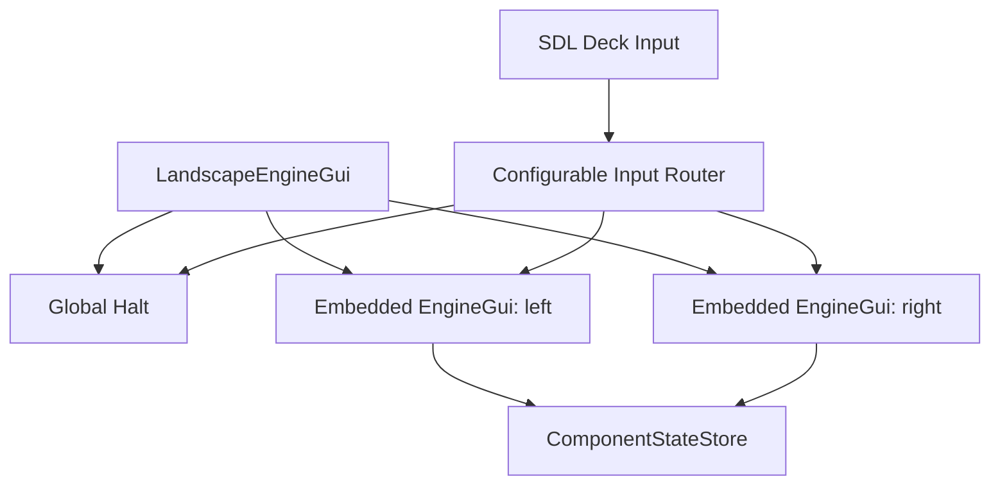

# Requirements

### Overview & Goals
Create a Steam Deck-focused landscape control panel for the native 1280×800, 16:10 display. It will show two equal, independently usable controllers while preserving the current standalone `EngineGui` feature set and single-screen launch behavior.

Backward compatibility is a release requirement: characterization tests must be added and pass before any production code is changed, then remain green throughout implementation.

### Functional Scope
- Provide two side-by-side panels, each with independent scope, TMCC ID, recent history, catalog, state watcher, keypad/operations mode, image, overlays, and Reset action.
- Retain engine, train, switch, route, accessory, configured-accessory, ASC2/BPC2, Sensor Track, AMC2, lighting, horn/bell, railroad-speed, speed-limit, and administrative controls currently reached through `EngineGui`, `KeypadView`, `ControllerView`, and `PopupManager`.
- Keep one always-accessible global Halt/Emergency Stop control above both panels.
- Allow optional explicit pairing. Panels remain independent by default, and pairing must never duplicate throttle commands unintentionally.
- For trains, provide an explicit “Open linked cars in other panel” action. It must not replace the other panel automatically; an occupied target requires confirmation.
- Assign the left joystick to the left panel and the right joystick to the right panel. Vertical deflection changes speed at a rate proportional to deflection; centering holds the current speed. Horizontal direction requests are accepted only under safe stopped-state rules.
- Support configurable native controller button actions and targets (`left`, `right`, `focused`, or `global`). Keep touch controls fully functional when no controller is connected.
- Support SteamOS KDE Desktop Mode and Gamescope Gaming Mode.
- Correct font installation/discovery so bundled fonts such as `DigitalDream` render on SteamOS, with a readable fallback if installation or discovery fails.
- Keep the existing `EngineGui` constructor defaults, portrait layout, standalone Halt/Reset behavior, scope and TMCC-ID transitions, command dispatch, overlays, linked-engine processing, watcher lifecycle, and shutdown semantics unchanged for existing users.

### UX and Safety
- Use a compact global header and two approximately equal panes separated by a visible divider; each pane has a clear focus/paired-state indicator and local Reset.
- Panel overlays remain clipped and modal only within their owning pane; they cannot hide or alter the other controller.
- Use joystick dead zones, hysteresis, bounded repeat rates, and configurable ramp sensitivity. Disconnecting a controller stops generating changes but does not unexpectedly stop a moving train.
- Keep global Halt directly callable from the touchscreen and an intentionally configured hardware button/chord. Steam and Quick Access buttons are treated as OS-reserved unless runtime capability detection proves otherwise.

### Out of Scope
- Replacing guizero/Tkinter with a game-engine UI toolkit.
- Automatic train/car split on train selection.
- Keyboard-based Steam Input emulation; the chosen design uses native SDL controller events.
- Assuming every rear grip or OS-reserved Deck button is exposed identically in both SteamOS sessions.

# Technical Design

### Current Implementation
- `src/pytrain/gui/controller/engine_gui.py::EngineGui` owns one complete portrait controller: one app/root, one scope and TMCC-ID map, one watcher set, one `KeypadView`, one `ControllerView`, one `ImagePresenter`, one `PopupManager`, and one Halt/Reset row.
- `KeypadView` dynamically switches the same keypad area among entry, engine/train, route, switch, normal accessory, Sensor Track, AMC2, ASC2/BPC2, and configured-accessory behavior.
- `PopupManager.create_popup()` creates overlays under `host.app`, while `show()`/`close()` hide and restore the owning host’s controller/keypad/AMC2/Sensor Track, image, and accessory boxes. `_suspend_host_layout()` also temporarily replaces `host.app.display_widgets`; these current standalone behaviors require explicit characterization before popup parenting changes.
- `CatalogPanel` already keeps sort and selection state per command scope and can remain instance-local in each embedded GUI.
- Train-linked engines currently pass through `EngineGui._train_linked_queue`; this behavior can be reused inside each panel and exposed to the sibling only through an explicit shell action.
- `src/pytrain/gui/wide_component_state_gui.py::_WidePane` demonstrates the existing project pattern for child GUIs sharing an app and parent message queue. `GuiZeroBase.attach_to_parent_queue()` supplies the queue-sharing mechanism.
- `src/pytrain/cli/make_gui.py::NEED_FONTS` currently includes only `LaunchGui`, although `KeypadView` requests `DigitalDream`; this explains why an installed `EngineGui` can miss its bundled font.

### Chosen Architecture
Use the requested embedded-GUI approach: adapt `EngineGui` to support a non-standalone parent/root and instantiate it twice from a new landscape shell. The shell owns the Tk app, global Halt, Deck input polling, focus/pairing state, and coordinated shutdown; each child retains its existing controller logic and independent state.

Apply a test-first compatibility gate. Before editing `EngineGui`, `PopupManager`, or any other production module, extend the standalone unit suite and run the complete existing test suite. Production refactoring starts only from a passing baseline; the same standalone tests are rerun after every implementation stage, with no expectation changes merely to accommodate the landscape GUI.

Retain guizero/Tk for this project rather than combining the landscape work with a toolkit migration. `EngineGui` and `PopupManager` depend directly on Tk widget parenting, `place`/`pack` behavior, and lifecycle error handling, while SDL input can operate behind a toolkit-neutral action-routing boundary. Reconsidering the toolkit is a separate future project only if the 1280×800 prototype reveals an unresolvable rendering, touch, layout, or Gamescope limitation.



### Proposed Changes
- First extend `tests/gui/test_engine_gui_transitions.py` and add focused standalone compatibility tests under `tests/gui/controller/` for default construction/layout, transitions, commands, popup restoration, watchers, linked-engine queue handling, and shutdown. Run the full suite before touching production code.
- Add `src/pytrain/gui/controller/landscape_engine_gui.py` with a `LandscapeEngineGui` shell and left/right pane lifecycle management.
- Extend `EngineGui` with explicit embedded-layout options such as parent/root, pane dimensions, compact mode, and local-Halt visibility. Preserve current defaults so portrait callers remain unchanged.
- Build pane content beneath a pane root rather than assuming every widget belongs directly to the app. Keep Reset in each pane while suppressing each child Halt in favor of the shell’s global button.
- Update `PopupManager` and popup positioning to use the owning `EngineGui` root and pane-relative dimensions. The shell’s global Halt remains outside overlay coverage.
- Add an explicit sibling callback/interface for pairing and “open linked car in other panel”; do not let child GUIs reach into each other’s private widget state.
- Add `src/pytrain/gui/controller/steam_deck_input.py` using an SDL-backed controller API (via `pygame`) with hot-plug detection and Tk-thread polling. Normalize events into an internal contract similar to:

```python
DeckAction(name: str, target: Literal["left", "right", "focused", "global"], value: float, phase: str)
```

- Add a JSON control profile containing axis assignments, dead zones, throttle rate, direction thresholds, button/chord actions, and target panel. Validate unknown actions and fall back to a bundled default profile.
- Route actions through public `EngineGui` operations (`on_speed_command`, direction/command dispatch, catalog/popup actions) on the Tk thread. Never mutate guizero widgets from the SDL polling thread.
- Add `pygame` to packaging/runtime requirements and log controller name/GUID, available axes/buttons, selected mapping, reconnects, and unsupported configured controls.
- Register landscape aliases and constructor templates in `src/pytrain/cli/make_gui.py`, including profile configuration and a 1280×800 default. Generate launch artifacts suitable for KDE and for adding as a non-Steam game in Gaming Mode.
- Add both `EngineGui` and `LandscapeEngineGui` to font-requiring GUI installation. Install packaged TTF files to the XDG user font directory (`~/.local/share/fonts`), refresh the font cache, verify Tk font-family visibility, and use a documented fallback family when unavailable.

### Steam Deck Platform Notes
SteamOS 3 is Arch-based, with KDE Plasma in Desktop Mode and Gamescope in Gaming Mode. SDL should consume the Deck/Steam virtual controller in both sessions, but exposed controls can differ with Steam client/controller configuration. Runtime enumeration and a diagnostics view/log are therefore required; Steam and Quick Access remain reserved, and rear grip buttons are configurable only when SDL exposes them.

### Risks and Mitigations
- **Embedding regressions could break existing single-screen controllers:** establish the standalone characterization suite first, preserve constructor defaults and the standalone widget tree, and treat any baseline failure as a blocker rather than updating expected behavior.
- **Two full `EngineGui` instances consume duplicate watchers, image caches, and request workers:** share the parent GUI queue and app, avoid duplicate synchronization ownership, and measure startup/shutdown behavior.
- **Portrait widgets may not fit a roughly 630×740 pane:** use compact sizing, panel-local overlays, and mode switching rather than shrinking touch targets below a usable size.
- **Popup assumptions can leak across panes:** parent overlays to pane roots and test independent simultaneous state.
- **Analog noise can issue unwanted commands:** apply dead zones, hysteresis, rate limits, focus-independent stick ownership, and stopped-only direction changes.
- **SteamOS controller capabilities vary:** enumerate by GUID/name and degrade unsupported bindings with a clear warning rather than failing GUI startup.

# Testing

### Validation Approach
Start with a standalone `EngineGui` characterization phase before any production edit. Use the project’s existing mocks/fixtures to lock current public behavior without over-specifying private implementation, run `../bin/python -m pytest` to record a green baseline, and require those tests to pass unchanged after each stage. Add isolated unit tests for routing and lifecycle behavior, mocked controller events for deterministic joystick tests, and headless Tk integration checks at 1280×800 where the environment supports a virtual display.

### Key Scenarios
- Existing standalone construction still creates one controller with its current portrait defaults, local Halt and Reset, and unchanged startup/shutdown ownership.
- Current scope/TMCC-ID transitions, recents/catalog selection, engine/train command dispatch, linked-engine queue processing, state updates, and Reset behavior remain unchanged.
- `PopupManager` still caches overlays, suspends/restores app layout during creation, hides the active standalone content, and restores image/accessory/content state after close or show failure.
- Both embedded `EngineGui` instances retain separate scopes, IDs, recents, watchers, Reset state, popups, and catalog filters.
- Global Halt emits one immediate halt command and remains reachable while either pane has an overlay.
- A popup in one pane does not hide or restore content in the sibling pane.
- Explicit linked-car transfer targets the other pane only after the user action and protects occupied state.
- Left/right joystick events route only to their fixed pane; centered axes hold speed; proportional deflection produces bounded rate changes.
- Direction requests while moving are rejected; dead-zone noise and disconnects emit no changes.
- Valid custom profiles remap actions; invalid or unavailable controls produce diagnostics and safe defaults.
- Portrait `EngineGui` behavior and existing transition tests remain unchanged.
- `make_gui` recognizes the landscape controller, installs fonts for both controller classes, and produces the intended launch configuration.

### Test Changes
- Before production changes, extend `tests/gui/test_engine_gui_transitions.py` and add standalone characterization tests under `tests/gui/controller/` for construction, command routing, popup lifecycle/restoration, watcher ownership, linked-engine processing, Reset, and shutdown.
- Add landscape shell and pane-isolation tests under `tests/gui/`.
- Add mocked SDL input/profile/rate-controller tests under `tests/gui/controller/`.
- After the baseline is established, extend transition coverage for embedded lifecycle and sibling transfer contracts without weakening the standalone assertions.
- Extend `tests/cli/test_make_gui.py` for aliases, constructor template, 1280×800 arguments, profile path, and font installation selection.
- Run Ruff formatting checks for every changed Python file and the full suite with `../bin/python -m pytest`.

# Delivery Steps

### ✓ Step 1: Establish the standalone EngineGui compatibility baseline
A passing characterization suite protects current single-screen controllers before any production code is modified.

- Extend `tests/gui/test_engine_gui_transitions.py` and add focused tests under `tests/gui/controller/` using the existing GUI mocking conventions.
- Lock current default construction, portrait/local Halt and Reset behavior, scope and ID transitions, command dispatch, linked-engine queue handling, watcher lifecycle, and shutdown ownership.
- Characterize `PopupManager` creation, caching, app-layout suspension, active-content hiding, image/accessory restoration, close callbacks, and failed-show recovery.
- Run `../bin/python -m ruff format --check` on the new Python tests and run the complete `../bin/python -m pytest` suite; do not begin production changes unless both pass.

### ✓ Step 2: Make EngineGui safely embeddable
Two non-standalone `EngineGui` instances can share one Tk application while every baseline standalone test remains unchanged and passing.

- Extend `src/pytrain/gui/controller/engine_gui.py` with backward-compatible parent/root, compact-pane, dimension, and local-Halt options whose defaults preserve current behavior.
- Share the parent message queue via `GuiZeroBase.attach_to_parent_queue()` and prevent child instances from owning duplicate app/synchronization lifecycle.
- Update `PopupManager` and child view construction to parent widgets and overlays to the correct pane root without changing standalone popup semantics.
- Add embedded lifecycle and popup-isolation coverage, then rerun the standalone characterization suite and full test suite as a compatibility gate.

### ✓ Step 3: Build the 1280x800 dual-panel shell
A Steam Deck-sized window displays two complete controllers, one global Halt, and one Reset per panel without overlapping controls.

- Add `LandscapeEngineGui` with global toolbar, left/right pane roots, focus indicators, divider, and coordinated startup/shutdown.
- Apply compact responsive sizing to `EngineGui`, `ControllerView`, `KeypadView`, catalog, state info, images, and operation overlays while preserving usable touch targets.
- Keep global Halt outside panel overlays and dispatch it immediately using the existing halt command path.
- Add virtual-display/layout tests for pane bounds, independent modes, global Halt visibility, and current portrait dimensions.

### ✓ Step 4: Integrate native Steam Deck controls
Both Deck joysticks and exposed hard buttons drive deterministic, configurable panel actions through native SDL events.

- Add the SDL/`pygame` input provider, hot-plug polling, device capability diagnostics, and a validated JSON profile loader.
- Implement fixed joystick-to-pane routing, rate-based throttle changes, dead zones, hysteresis, bounded repeat timing, and stopped-only direction requests.
- Route configured button actions to left, right, focused, or global targets on the Tk thread, including a deliberate emergency-stop binding.
- Add mocked event tests covering proportional rates, noise, safety interlocks, remapping, unavailable buttons, disconnects, and reconnection.

### ✓ Step 5: Add optional pairing and linked-car transfer
Users can explicitly coordinate panels and manually open a selected train’s linked cars in the other controller without automatic takeover.

- Add shell-level pairing state and a narrow public sibling-action contract instead of cross-accessing child widgets.
- Add the train action that presents linked cars and transfers the chosen car to the sibling pane only after explicit confirmation when occupied.
- Preserve independent panel selection and command dispatch when unpaired, and prevent paired state from duplicating throttle requests.
- Extend transition tests for empty/occupied sibling panes, missing linked cars, unpairing, and independent command targets.

### ✓ Step 6: Package SteamOS launch and font support
The landscape GUI launches in Desktop and Gaming Modes with bundled fonts available or a verified readable fallback.

- Register landscape aliases and constructor configuration in `src/pytrain/cli/make_gui.py`, including 1280×800 defaults and controller-profile path.
- Update project dependencies and generated launch artifacts for native SDL input and KDE/non-Steam-game launch workflows.
- Expand `NEED_FONTS`, install TTF assets into the XDG user font directory, refresh fontconfig, verify Tk discovery, and select a fallback when needed.
- Extend CLI tests, run Ruff format checks on all changed Python files, and run the complete `../bin/python -m pytest` suite, including the unchanged standalone `EngineGui` compatibility suite.