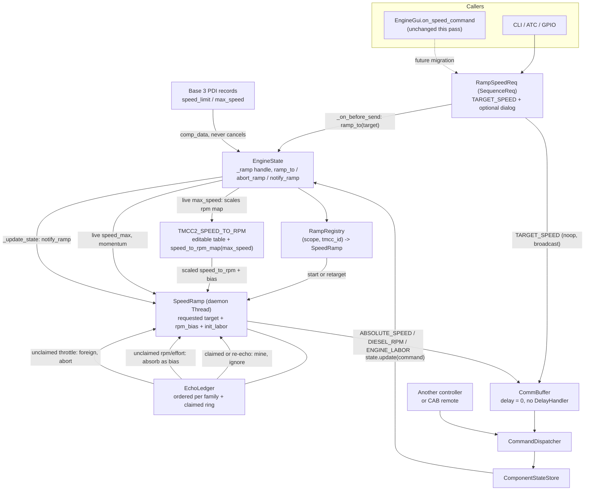

# Requirements

> **This pass is a pre-checkin warning triage on the shipped threaded ramper.** No functional change is proposed.
> Every earlier pass — the architecture, the RPM-bias fix, and the switchover to `RampSpeedReq` — is built, passing
> (3915 tests) and preserved beneath for context in the "Shipped RPM Bias Fix", "Shipped Architecture" and
> "Shipped Steps" tabs.

### Overview & Goals

PyCharm's inspections were run over all 20 Python files git reports as modified or added for this checkin.
**10 lint completely clean** — including `protocol/sequence/ramp_speed_req.py`, `db/engine_state.py`,
`gui/controller/engine_gui.py`, `cli/engine.py`, `src/pytrain/__init__.py`, `tests/protocol/sequence/test_speed_ramp_echoes.py`,
`test_speed_ramp_geometry.py`, `tests/protocol/test_speed_to_rpm.py` and `tests/gui/controller/test_engine_gui_compatibility.py`.

The other 10 carry **89 flags (37 WARNING, 52 WEAK WARNING)**. The goal is to take the checkin set down to the 10
flags that are demonstrably pre-existing and out of scope, deciding **fix or suppress** for each of the other 79 —
and to never suppress something that turns out to be a real defect.

One of the 89 **is** a real defect: `tests/protocol/sequence/test_ramp_registry.py:234` joins a variable that can be
unbound, so a failure in ramp setup would be masked by a `NameError`.

### Scope

#### In Scope

- `src/pytrain/protocol/sequence/speed_ramp.py` — 18 flags (5 unreachable-code, 13 `is True` / `is False` style).
- `src/pytrain/atc/block.py` and `src/pytrain/db/irda_state.py` — 9 flags, all from one mis-resolution of `RampSpeedReq`.
- `tests/protocol/sequence/test_ramp_speed_req.py` — 36 flags (32 from the same mis-resolution, 4 genuine hygiene).
- `tests/protocol/sequence/test_speed_ramp.py` — 12 unused-parameter flags on the `Recorder` hooks.
- `tests/protocol/sequence/test_ramp_registry.py` — the possibly-unbound `ramp` in a `finally` block.
- `tests/db/test_engine_state.py` — 3 of its 5 flags (the lambda `self` shadowing and `_update` may be static).

#### Out of Scope

- **All pre-existing flags, verified against the diff:** `protocol/sequence/sequence_constants.py:56,60`
  (`first_byte` / `address_mask` return types — the diff only appends two enum members),
  `protocol/tmcc2/tmcc2_constants.py:172,175` (unreachable code in the `alias` property — the diff only appends the
  RPM-scaling block from line 455 down), `tests/atc/test_block.py:50-53` (unreachable asserts in the untouched
  `test_create_block`; only their line numbers shifted), and `tests/db/test_engine_state.py:23,25`
  (the `TMCC1` / `TMCC2` alias imports, which pre-date this change and are used throughout the suite).
- Any behavior change. This pass alters annotations, parameter names, one `finally` guard and suppression comments only.
- Changing `EngineState.speed` to `-> int | None`. It is the correct annotation and would clear two flags at the
  source, but `speed` is read in dozens of places outside this checkin set. Deliberately left as a follow-up.
- Simplifying `is True` / `is False` anywhere in the other 229 places the idiom appears in `src/`.

### User Stories

- As the maintainer reviewing this checkin, I want the IDE's problem list for the changed files to be short and
  meaningful, so a genuine defect stands out instead of drowning in 26 false positives.
- As the maintainer, I want every remaining flag to be one I have consciously accepted, not one I have stopped seeing.
- As the maintainer, I want a suppression comment to say *why* it is there, matching how `engine_state.py:830` and
  `ramped_speed_req.py:39` already do it.
- As the maintainer, I want the one real bug — the masked test failure — fixed rather than silenced.

### Functional Requirements

1. **No behavior change.** `ruff format --check` clean on every changed file and the full `pytest` suite green at its
   3915-test baseline after each stage.
2. **Real defects are fixed, not suppressed.** The unbound `ramp` in `test_ramp_registry.py` is repaired so a setup
   failure reports itself.
3. **Honest annotations beat suppressions.** Where a parameter genuinely accepts `None`, the annotation is widened
   rather than the warning silenced.
4. **Suppressions follow existing precedent.** Any `# noinspection` added matches the form already used in
   `speed_ramp.py:299`, `ramped_speed_req.py:39` and `engine_state.py:830`, and carries a reason.
5. **Project idiom is preserved.** The `is True` / `is False` comparisons are not rewritten; 230 of them exist across
   `src/`, including in `engine_state.py:866-867`.
6. **Pre-existing flags are left untouched** and recorded as accepted, so the residual count is understood rather
   than mysterious.

# Technical Design

### Current Implementation

The 89 flags fall into five groups. Group membership, not file, is what determines the disposition.

| Group | What | Where | Count |
|---|---|---|---|
| A | Pre-existing, unrelated to the ramp work | `sequence_constants.py:56,60`; `tmcc2_constants.py:172,175`; `test_block.py:50-53`; `test_engine_state.py:23,25` | 10 |
| B | `None`-guard "unreachable code" | `speed_ramp.py:176,192,354,628,637`; `test_ramp_speed_req.py:42` | 6 |
| C | `is True` / `is False` "expression can be simplified" | `speed_ramp.py:255,554,568,595,649,657,688,699,702,705,712,742,743` | 13 |
| D | `RampSpeedReq` resolved as a function | `block.py:393,424`; `irda_state.py:112`; `test_ramp_speed_req.py` (15 sites) | 26 |
| E | Test hygiene | `test_ramp_registry.py:234`; `test_engine_state.py:411,533,534`; `test_speed_ramp.py` (12 hooks); `test_ramp_speed_req.py:193,197,234` | 34 |

**Group B root cause.** `EngineState.speed` (engine_state.py:826) is annotated `-> int` but returns `None` when
`comp_data` is absent — it carries its own `# noinspection PyTypeChecker` on that `return None`. PyCharm therefore
believes `None` is impossible and marks every downstream guard dead. Four of the five sites in `speed_ramp.py`,
however, guard *parameters* that this codebase declared `int` while genuinely accepting `None`
(`CommandReq.data` is `None` for a bare command), so they are annotation bugs of our own, not IDE noise.

**Group D root cause.** PyCharm resolves `RampSpeedReq` / `RampSpeedDialogReq` as **functions returning `None`**,
which is why it simultaneously rejects their arguments and calls the result unusable. They are ordinary classes.
The evidence that this is an IDE artifact and not a code problem:

- `gui/controller/engine_gui.py:2901,2903` constructs the *same two classes* with the *same argument shapes* and
  lints completely clean.
- `ruff` is clean and all 3915 tests pass.
- The flagged sites are exactly the ones that avoid a plain module-level relative import: `block.py` and
  `irda_state.py` import inside the function (**required** — `ramp_speed_req` imports `EngineState` at module scope,
  so a module-level import there would close a `db` ↔ `protocol.sequence` cycle), and the test imports through the
  `src.pytrain.*` path.
- The new module's import block is ordered differently from its predecessor: `ramp_speed_req.py` imports
  `from ...db.engine_state import EngineState` **before** `from .sequence_req import SequenceReq, T`, whereas
  `ramped_speed_req.py` imports its siblings first and the `...db` module last.

**Group C context.** There are **230 `is True` / `is False` comparisons across `src/`**. PyCharm flags only the
subset where it can prove the operand is a `bool`. Three of the thirteen (`688`, `712`, `743`) test `state.is_rpm`,
read from live and possibly unpopulated engine state and supplied as a plain attribute by the test doubles — the
defensive form is deliberate there. `.idea/inspectionProfiles` contains only `profiles_settings.xml`, so a
project-level disable of this inspection would **not** be shared through version control.

### Key Decisions

| # | Group | Decision | Rationale |
|---|---|---|---|
| 1 | A | **Leave all 10 alone.** | Verified pre-existing against the diff. Fixing them widens an already large checkin. The `first_byte` / `address_mask` typing inconsistency is real and belongs in its own change. |
| 2 | B | **Widen four parameter annotations to `int | None`; suppress the two state-driven sites.** | `record`, `claim`, `_absorb_rpm` and `_absorb_labor` really do accept `None`, so the annotation was wrong — an honest fix with zero runtime effect that makes the guards legible. `rpm_bias_for` reads `state.speed` / `state.rpm` and cannot be fixed locally. |
| 3 | B | **Do not change `EngineState.speed` in this pass.** | Correct in principle, but `speed` is read in dozens of modules outside the checkin set and would surface a new crop of warnings there. Recorded as a follow-up. |
| 4 | C | **Suppress at file level; do not simplify.** | Simplifying the 10 provably safe of 13 would leave the file inconsistent with itself and with 230 uses elsewhere. One `# noinspection PySimplifyBooleanCheck` costs no code churn and no risk. |
| 5 | D | **Try the import reorder first, then suppress what remains.** | Matching `ramped_speed_req.py`'s import order is formatting-only and may let PyCharm resolve the base class before the cycle, clearing all 26 at once. If it does not, targeted suppressions at four sites are the honest answer to a provable false positive. |
| 6 | E | **Fix all of them properly, except the two CamelCase aliases.** | Each has a clean, behavior-preserving fix: a guarded `finally`, a `@staticmethod`, leading-underscore parameter names, and renamed lambda parameters. Only the unused keyword-only `dialog` needs a suppression, because the façade calls it by name. |

### Proposed Changes

#### 1. `src/pytrain/protocol/sequence/speed_ramp.py` — 18 flags

Annotations (Group B, four sites) — signature-only, no body change:

```python
def record(self, family: EchoFamily, data: int | None) -> None:            # was data: int   (line 170)
def claim(self, family: EchoFamily, data: int | None, *, tolerance: int = 0) -> bool:   # line 181
def _absorb_rpm(self, rpm: int | None) -> None:                            # line 621
def _absorb_labor(self, labor: int | None) -> None:                        # line 634
```

`rpm_bias_for` (line 335) gains `# noinspection PyUnreachableCode`, exactly as its neighbor `effective_target`
(line 299) already carries for the same reason.

Group C: one file-level `# noinspection PySimplifyBooleanCheck` with a one-line comment naming the idiom and
pointing at `engine_state.py:866-867`. No expression is rewritten.

#### 2. `src/pytrain/atc/block.py`, `src/pytrain/db/irda_state.py`, `src/pytrain/protocol/sequence/ramp_speed_req.py` — 9 flags

First, reorder `ramp_speed_req.py`'s imports to match `ramped_speed_req.py` (siblings first, `...db.engine_state`
last) and re-lint. If the flags clear, nothing else is needed. If they do not, add
`# noinspection PyArgumentList,PyNoneFunctionAssignment` at `block.py:393`, `block.py:424` and `irda_state.py:112`,
each with a comment recording that the function-level import exists to break the `db` ↔ `protocol.sequence` cycle
and that `engine_gui.py` proves the call itself is valid. The function-level imports **stay** — they are load-bearing.

#### 3. `tests/protocol/sequence/test_ramp_registry.py` — the real bug

```python
    ramp = None
    try:
        ramp = RampRegistry.build().ramp_to(state, 60, sender=recorder, linger=0.0, delay_scale=0.0)
        ...
    finally:
        recorder.release()
        if ramp is not None:
            ramp.join(timeout=5)
```

#### 4. `tests/protocol/sequence/test_speed_ramp.py` — 12 flags

The two-parameter shape is mandated by `Recorder.hook: Callable[["Recorder", int], None]` (line 40), so the
parameters cannot be dropped. Rename the unused one to `_rec` / `_count` at each of the 12 hook definitions
(lines 157, 172, 190, 207, 236, 256, 272, 285, 379, 450, 467, 518). PyCharm honors the leading underscore, and it
documents which half of the hook each test actually uses.

#### 5. `tests/protocol/sequence/test_ramp_speed_req.py` — 4 hygiene flags

- Lines 197, 234: rename the lambda's `self` parameter to `req`, so it stops shadowing the enclosing `self`.
- Line 42: annotate `StubEngineState.speed` as `-> int` with `# noinspection PyTypeChecker`, mirroring
  `engine_state.py:826-831` exactly, so the stub matches the base it overrides.
- Line 193: the keyword-only `dialog` cannot be renamed — the façade calls `state.ramp_to(target, dialog=...)`.
  Record the flag in `order` and tighten the assertion, which turns the warning into extra coverage of the dialog
  handoff; fall back to `# noinspection PyUnusedLocal` if that proves awkward.

#### 6. `tests/db/test_engine_state.py` — 3 of 5 flags

- Line 411: make `_update` a `@staticmethod`; its sibling `_ramping_engine` (line 398) already is. Cleaner than
  adding the `# noinspection PyMethodMayBeStatic` that `test_speed_ramp.py:99`, `test_ramp_registry.py:206` and
  `test_ramp_speed_req.py:74` carry.
- Lines 533, 534: rename the lambda parameter `self` to `ramp`.
- Lines 23, 25: left alone (Group A).

### Components

| Component | Change |
|---|---|
| `protocol/sequence/speed_ramp.py` | 4 widened parameter annotations, 1 method-level and 1 file-level suppression. No logic touched. |
| `protocol/sequence/ramp_speed_req.py` | Import order only, to match `ramped_speed_req.py`. |
| `atc/block.py`, `db/irda_state.py` | Suppression comments at 3 call sites, only if the reorder does not clear them. |
| `tests/protocol/sequence/test_ramp_registry.py` | Guarded `finally` — the one real defect. |
| `tests/protocol/sequence/test_speed_ramp.py` | 12 hook parameters renamed to `_rec` / `_count`. |
| `tests/protocol/sequence/test_ramp_speed_req.py` | 2 lambda parameters renamed, stub return type aligned, `dialog` accounted for. |
| `tests/db/test_engine_state.py` | `_update` becomes static, 2 lambda parameters renamed. |
| `sequence_constants.py`, `tmcc2_constants.py`, `tests/atc/test_block.py` | **Untouched.** Group A. |

### Expected Outcome

| Group | Disposition | Flags cleared |
|---|---|---|
| A — pre-existing | accepted, untouched | 0 of 10 |
| B — `None` guards | 4 annotations widened, 2 suppressed | 6 |
| C — boolean idiom | 1 file-level suppression | 13 |
| D — `RampSpeedReq` resolution | import reorder, then suppress the remainder | 26 |
| E — test hygiene | real fixes; CamelCase aliases left alone | 34 |

**89 → 10**, and all 10 remaining are pre-existing and consciously accepted.

### Risks

- **Suppressing a warning that is really a defect.** Mitigated by root-causing every group before deciding, and by
  proving Group D against a clean-linting call site (`engine_gui.py`) rather than assuming.
- **The import reorder changes runtime import order.** `ramp_speed_req.py` is imported at module scope by
  `engine_gui.py` and at function scope by `block.py` / `irda_state.py`; reordering its own imports cannot introduce
  a cycle the current order avoids, since the same modules are imported either way. The full suite is the check.
- **A blanket file-level suppression hiding a future genuine warning.** `PySimplifyBooleanCheck` is a style
  inspection that can only ever report this one idiom, so the exposure is bounded. The Group D suppressions are
  deliberately per-site, not per-file, for exactly this reason.
- **`# noinspection` comment placement.** These comments bind to the following statement or declaration; a misplaced
  one silently does nothing. Every one added is verified by re-linting the file rather than assumed to work.
- **Renaming a parameter that is passed by keyword.** Only `dialog` at `test_ramp_speed_req.py:193` is keyword-bound;
  the 12 `Recorder` hooks and the 4 lambdas are all positional. Verified by the suite.

# Shipped RPM Bias Fix

> Delivered in an earlier pass; retained for context and not re-executed.

### The Defect

Reported: an engine was reset (speed 0, RPM 0), the operator manually trimmed RPM up to 2, and a ramp was then
started. The trim was lost immediately — RPM dropped to the bare table value and climbed from there.

Root cause, `src/pytrain/protocol/sequence/speed_ramp.py:343-353`:

```python
def rpm_bias_for(state: EngineState) -> int:
    if state is None or state.is_rpm is not True:
        return 0
    speed = state.speed
    if speed is None or speed == 0:      # <-- the bug
        return 0
    ...
    bias = rpm - tmcc2_speed_to_rpm(speed, rpm_max_speed(state))
    return max(-MAX_RPM_BIAS, min(MAX_RPM_BIAS, bias))
```

The `speed == 0` early return was written to mean "a stopped engine has no meaningful baseline," but a stopped engine
is in fact the *clearest* baseline there is. `TMCC2_SPEED_TO_RPM` (tmcc2_constants.py:444-455) maps speeds `0-3` to
RPM 0 and `4-28` to RPM 1, so an engine at rest reporting RPM 2 carries an unambiguous `+2`. Because the bias came
back as `0`, `SpeedRamp.__init__` stored `_rpm_bias = 0` and every subsequent `biased_rpm()` call emitted the bare
table value: `0` at speeds 1-3, then `1` at speed 4 — exactly the "reverted to 1, then went up per the ramp"
symptom.

A second, related limitation surfaced while confirming this: `MAX_RPM_BIAS = 2` (speed_ramp.py:80) silently caps any
derived bias. A trim of 2 survives it, but a trim to RPM 4 at rest would be cut in half with no indication.

### Goals

1. A bias trimmed in at rest is honored for the whole ramp and at settle, exactly as one trimmed in at speed is.
2. A deliberate trim is never silently reduced; the only clamp is the one the RPM notch range imposes anyway.
3. Every RPM the ramp emits carries the bias — accelerating, decelerating, and at settle.

### Scope

#### In Scope

- `rpm_bias_for()` in `src/pytrain/protocol/sequence/speed_ramp.py`: derive the bias for a stopped engine.
- `MAX_RPM_BIAS`: widen to the full notch range, and the three clamp sites that use it (`rpm_bias_for`,
  `SpeedRamp._absorb_rpm`, `SpeedRamp._sync_rpm_map`).
- Suppressing the redundant `DIESEL_RPM` a ramp sends when its first step's biased RPM already equals what the engine
  is reporting.
- Updating the tests that pin the old behavior, and adding a regression test that replays the reported scenario
  end to end.

#### Out of Scope

- Any change to `TMCC2_SPEED_TO_RPM` itself or to the max-speed reinterpolation.
- Any change to echo arbitration, the registry, the `SequenceReq` façade, or `EngineState`.
- Adding a user-facing, persisted RPM-bias setting — the bias stays inferred from the engine's reported RPM.
- Migrating callers off `RampedSpeedReq`.

### User Stories

- As an operator who trims RPM up two notches on a stopped engine, I want that trim carried through the whole ramp
  and held at the final speed, instead of collapsing to the table value the moment I open the throttle.
- As an operator who trims RPM up four notches, I want all four honored, not silently reduced to two.
- As an operator decelerating a trimmed engine, I want the RPM it drops to include my trim, the same as when
  accelerating.

### Functional Requirements

1. **A stopped engine's reported RPM is its bias, verbatim.** When `state.speed` is `0`, `rpm_bias_for()` returns
   `state.rpm` directly, without a table lookup. Confirmed as the chosen behavior over deriving it through
   `table(0)`: the two agree today, and the verbatim rule stays correct if the `0-3` band is ever hand-edited to a
   nonzero RPM.
2. **An unknown speed still yields no bias.** `state.speed is None` means `comp_data` has not arrived and there is
   nothing to compare against; that guard stays.
3. **A non-RPM engine still yields no bias.** Unchanged.
4. **The bias is clamped only by the notch range.** `MAX_RPM_BIAS` widens to `MAX_RPM` (7), so the effective band is
   `-7..+7`; `biased_rpm()` already clamps the *emitted* value to `0..7`, which is the only constraint that matters
   on the wire.
5. **Every emitted RPM carries the bias.** Acceleration steps, the single RPM drop at the head of a deceleration,
   and the settle value all go through `biased_rpm(speed, _rpm_bias, _rpm_max_speed)`.
6. **No redundant opening RPM command.** If the first step's biased RPM equals the RPM the engine already reports,
   the ramp does not re-send it.
7. **Nothing else changes.** Bias persistence stays as designed: snapshotted at construction, re-derived only by
   `_absorb_rpm` when a foreign `DIESEL_RPM` arrives, and re-derived by `_sync_rpm_map` when the roster `max_speed`
   changes mid-ramp.

## Technical Design — RPM Bias Fix

### Current Implementation

The relevant code is all in `src/pytrain/protocol/sequence/speed_ramp.py`:

| Site | Line | Role |
|---|---|---|
| `MAX_RPM_BIAS: int = 2` | 80 | the band every derived bias is held to |
| `biased_rpm(speed, bias, max_speed)` | 323-330 | `clamp(table(speed, max_speed) + bias, 0, MAX_RPM)` — the one emitter |
| `rpm_bias_for(state)` | 333-353 | the ramp-start derivation; **contains the defect** |
| `SpeedRamp.__init__` | 456 | `self._rpm_bias = rpm_bias_for(state)`, captured once |
| `next_step` | 388-392 | acceleration steps call `biased_rpm`; deceleration returns `rpm=None` |
| `_prime_deceleration` | 705-709 | the single up-front RPM drop, already `biased_rpm(target, ...)` |
| `_settle` | 736-740 | the landing RPM, already `biased_rpm(target, ...)` |
| `_absorb_rpm` | 614-625 | re-derives the bias from a foreign trim, clamped to `±MAX_RPM_BIAS` |
| `_sync_rpm_map` | 671-685 | re-derives the bias onto a new map, clamped to `±MAX_RPM_BIAS` |

The emission path is therefore already correct and already bias-aware in all three places (acceleration, the
deceleration drop, settle). Requirement 5 is largely a matter of *proving* it with tests rather than changing code —
the reported symptom comes entirely from the bias being `0`.

### Key Decisions

| # | Decision | Rationale |
|---|---|---|
| 1 | **A stopped engine's RPM is the bias verbatim**, not `state.rpm - table(0)`. | Chosen by the user. Identical today because the `0-3` band is RPM 0, but it stays correct if that band is ever hand-edited, and it reads as what it means: at a standstill there is no curve value to subtract. |
| 2 | **Keep the `speed is None` guard.** | "Stopped" and "not yet reported" are different states. An engine PyTrain has not learned yet has no baseline, and inventing one from a `None` speed would be a guess. |
| 3 | **Widen `MAX_RPM_BIAS` to `MAX_RPM` rather than deleting the constant.** | `biased_rpm` already clamps the emitted notch to `0..7`, so a wider bias can never produce an illegal command. Keeping the name means the three clamp expressions, and the tests that import it, need no restructuring — the band simply stops being the binding constraint. |
| 4 | **Seed `_last_rpm` and `_last_labor` from state at construction.** | The ramp already de-duplicates against `_last_rpm`; seeding it means the first step does not re-announce a value the engine is already sitting at. Small, and it makes the fixed behavior visibly quieter on the wire in the reported scenario. |
| 5 | **Bias persistence is unchanged.** | The snapshot-plus-absorb model already satisfies "the bias applies to the RPM associated with a given speed range, accelerating or decelerating" — that is a property of `biased_rpm` being the sole emitter, not of when the bias is sampled. |

### Proposed Changes

#### 1. `rpm_bias_for()` — derive at rest (speed_ramp.py:333-353)

```python
def rpm_bias_for(state: EngineState) -> int:
    if state is None or state.is_rpm is not True:
        return 0
    speed = state.speed
    rpm = state.rpm
    if speed is None or rpm is None:
        return 0                      # nothing reported yet: no baseline to compare against
    if speed == 0:
        bias = rpm                    # at a standstill the reported RPM *is* the trim
    else:
        bias = rpm - tmcc2_speed_to_rpm(speed, rpm_max_speed(state))
    return max(-MAX_RPM_BIAS, min(MAX_RPM_BIAS, bias))
```

The docstring is rewritten to state the standstill rule explicitly, replacing the current "...or that is stopped..."
sentence which now describes the opposite of the behavior.

#### 2. `MAX_RPM_BIAS` — widen to the notch range (speed_ramp.py:77-80)

```python
MAX_RPM: int = 7

# a bias is held only to the notch range itself; `biased_rpm` clamps the emitted value to

# 0..MAX_RPM, so a wider band can never put an illegal RPM on the wire

MAX_RPM_BIAS: int = MAX_RPM
```

No call site changes: `rpm_bias_for`, `_absorb_rpm` (line 624) and `_sync_rpm_map` (line 684) keep their existing
`max(-MAX_RPM_BIAS, min(MAX_RPM_BIAS, bias))` expressions.

#### 3. `SpeedRamp.__init__` — seed the de-duplication baselines (speed_ramp.py:459-462)

```python

# last values actually sent, seeded from what the engine already reports so the ramp

# does not open by re-announcing a value that is already in effect

self._last_speed: int | None = None
self._last_labor: int | None = state.labor
self._last_rpm: int | None = state.rpm if state.is_rpm is True else None
```

### Risks

- **A large negative bias muting the ramp.** The `±2` band was originally justified as a guard against a stale
  `state.rpm`. Widening it means an engine reporting RPM 0 at speed 120 (table 5) now carries `-5` and would ramp
  nearly silent. Accepted deliberately: that report is either accurate — in which case the operator really did trim
  it down and the ramp should honor it — or it is stale, in which case the next genuine `DIESEL_RPM` echo re-derives
  the bias through `_absorb_rpm`. `biased_rpm` still floors the emitted value at 0, so nothing illegal reaches the
  wire.
- **Tests that encode the old band.** `test_speed_ramp_geometry.py` parametrizes over `[-MAX_RPM_BIAS, -1, 0, 1,
  MAX_RPM_BIAS]` and computes expectations with the same clamp, so most follow the constant automatically; but
  `test_bias_zero_when_stopped_or_unknown` (line 284-286) asserts the defect directly and must be split. `test_engine_state.py:475` and
  `test_speed_ramp_echoes.py:271` also clamp with the constant and should keep working unchanged.
- **Bias at rest interacting with a scaled map.** `rpm_max_speed(state)` is not consulted on the standstill path,
  which is correct — there is no speed to look up — and the map is still used for every subsequent step. Worth an
  explicit test on a `max_speed = 100` engine so the two paths are known to agree.

## Testing — RPM Bias Fix

### Validation Approach

The existing ramp test scaffolding is reused unchanged: `RampEngineState` doubles plus a recording sender, with
`delay_scale=0.0, linger=0.0` for determinism. RPM expectations continue to be derived from
`tmcc2_speed_to_rpm` / `speed_to_rpm_map`, never typed in as literals, so the tests keep proving the
single-source-of-truth property.

Per project guidelines: `../bin/python -m ruff format --check` on every changed file, then the full
`../bin/python -m pytest` suite.

### Key Scenarios

1. **The reported scenario, end to end** — a Legacy RPM-capable engine at `speed=0, rpm=2, labor=12` ramping to a
   cruising speed: `ramp.rpm_bias == 2`, every emitted `DIESEL_RPM` equals `biased_rpm(step_speed, 2)`, the stream
   never dips below 2, and the settle value is `biased_rpm(target, 2)`. This is the regression test.
2. **Bias at rest, parametrized over the notch range** — `speed=0, rpm=n` for `n` in `0..7` yields `bias == n`.
3. **A trim larger than the old band survives** — `speed=0, rpm=4` yields `bias == 4`, not `2`.
4. **Unknown speed still yields zero** — `state.speed is None` yields `0`, whatever the RPM.
5. **Non-RPM engine still yields zero** — unchanged.
6. **Bias at rest on a scaled map** — a `max_speed = 100` engine at rest with `rpm=2` carries `+2`, and every step
   emits `speed_to_rpm_map(100)[speed] + 2`, clamped at 7.
7. **Bias applies while decelerating** — a trimmed engine ramping downward emits its single up-front RPM drop as
   `biased_rpm(target, bias)`, not the bare table value.
8. **Settle carries the bias** — the final `DIESEL_RPM` is `biased_rpm(target, bias, rpm_max_speed)` for both an
   at-rest-derived bias and an at-speed-derived one.
9. **No redundant opening RPM** — a ramp whose first step's biased RPM equals `state.rpm` emits no `DIESEL_RPM` for
   that step.
10. **Bias reaching the ceiling** — `speed=0, rpm=7` ramping up emits RPM 7 throughout and never exceeds it.

### Edge Cases

- **`state.rpm is None` at rest** — yields bias 0, not a `TypeError`.
- **A negative effective bias** — an engine at speed 120 reporting RPM 0 now carries `-5`; emitted RPM floors at 0
  and never goes negative.
- **Foreign trim after an at-rest bias** — a mid-ramp foreign `DIESEL_RPM` still re-derives the bias against the
  ramp's commanded speed via `_absorb_rpm`, overriding the at-rest value, and still does not abort the ramp.
- **`max_speed` changed mid-ramp with an at-rest bias** — `_sync_rpm_map` re-derives against the new curve and the
  emitted RPM stays continuous.
- **Bias survives a retarget** — a burst of retargets does not resample or drift the bias.

### Test Changes

- `tests/protocol/sequence/test_speed_ramp_geometry.py` — replace `test_bias_zero_when_stopped_or_unknown`
  (line 284-286) with `test_bias_zero_when_speed_unknown` plus a new `test_bias_at_rest_is_the_reported_rpm`
  parametrized over `0..MAX_RPM`; add the scaled-map at-rest case; confirm the widened band by asserting a bias of 4
  is returned intact.
- `tests/protocol/sequence/test_speed_ramp.py` — add the reported-scenario regression test, the deceleration-with-bias
  case, the no-redundant-opening-RPM case, and the ceiling case. Existing bias tests (lines 291-295, 354-357) derive
  their expectations from the table and the constant and should pass unchanged.
- `tests/protocol/sequence/test_speed_ramp_echoes.py` and `tests/db/test_engine_state.py` — no edits expected; both
  clamp with `MAX_RPM_BIAS` rather than a literal. Verified by running them.

# Shipped Architecture

> The plan below describes the already-implemented threaded ramper, retained for context. It is not re-executed by
> this pass.

### Overview & Goals

Replace the pre-computed, delay-queue ramp (`RampedSpeedReq`) with a **threaded speed ramper** that:

- treats **TARGET SPEED as the touchstone** — the ramp exists only to close the gap between the engine's commanded speed and its target;
- **retargets in place** when a new target arrives from the joystick or a slider, instead of cancelling and rebuilding a schedule;
- **re-reads live momentum, `speed_limit` and `max_speed` on every step**, so changing momentum or setting a speed limit mid-ramp takes effect immediately (impossible today);
- **drives RPM from an editable speed→RPM table, reinterpolated to the engine's own `max_speed`, plus the engine's RPM bias**, and returns effort (labor) to its ramp-start level when it settles;
- **tolerates lagged and reordered speed echoes** from the Base 3 and LCS Ser2 by matching them against an ordered record of the steps it actually sent, so only a genuine deviation aborts the ramp;
- **aborts** when another controller drives the throttle directly, and on HALT / STOP_IMMEDIATE / RESET / direction change / shutdown — but **never** on an RPM, effort, momentum or speed-limit change;
- runs **one daemon thread per engine or train**, stored on the `EngineState` object, so separate engines ramp independently and every thread dies when PyTrain exits.

This pass builds the **ramp module and its command front door only**. `RampedSpeedReq` and every existing caller are left untouched and keep working; deprecation is a later, separate decision.

### Scope

#### In Scope

- New ramp engine module: step geometry, ramp thread, ordered echo ledger, ramp registry.
- Speed ramp (ABSOLUTE_SPEED), **RPM ramp** (`DIESEL_RPM`, RPM-capable engines only) and **EFX / effort ramp** (`ENGINE_LABOR`, Legacy only).
- **Live speed ceiling**: every step re-reads `EngineState.speed_max`, which already folds `max_speed` and `speed_limit`, so a limit set or cleared mid-ramp is honored on the next step.
- **RPM bias**: derived once per ramp as `state.rpm - speed_to_rpm(state.speed, state.max_speed)` and applied to every RPM the ramp emits, including the settle value.
- **Max-speed-aware RPM table**: `TMCC2_SPEED_TO_RPM` is calibrated for a 199-speed engine; for any engine whose `max_speed` is below 195 the bands are reinterpolated proportionally onto `0..max_speed`, so a 100-max engine reaches RPM 7 at 100 instead of never leaving notch 4. The reinterpolation is derived from the base table's own boundaries and lives beside it in `tmcc2_constants.py`.
- **Effort restore**: the settle step returns `ENGINE_LABOR` to the value captured when the ramp began.
- **Lag-tolerant echo arbitration**: an ordered, TTL'd ledger of issued steps, tolerant of skips, late duplicates and Base 3-vs-Ser2 reordering.
- Both command generations: **TMCC1** (0–31, no RPM, no effort) and **TMCC2/Legacy** (0–199).
- Command-based interface through `SequenceReq`: new `RampSpeedReq` / `RampSpeedDialogReq` on new `SequenceCommandEnum` members.
- Minimal `EngineState` hooks: the ramp handle, `ramp_to` / `abort_ramp`, and the arbitration call inside `_update_state`.
- Unit tests for the ramp module and for the scaled table, deriving all RPM expectations from `TMCC2_SPEED_TO_RPM` and its reinterpolated variants rather than from hard-coded numbers.

#### Out of Scope

- Rewiring callers: `gui/controller/engine_gui.py` (`on_speed_command`), the Steam Deck router, `atc/block.py`, `db/irda_state.py`, `gpio/gpio_device.py`, `cli/engine.py` all keep using `RampedSpeedReq`.
- Deleting or deprecating `RampedSpeedReq` / `RampedSpeedDialogReq`.
- Train brake as a ramp input (a hook is left, no behavior).
- Changing the *shape* of the speed→RPM curve or the `labor_delta` effort curve — the eight-band curve stays exactly as it is today and remains hand-edited in one place; the only new behavior is scaling that same curve onto a slower engine's range.
- Rewiring the existing `tmcc2_speed_to_rpm()` call sites (`abs_speed_rpm.py:30,43`, `set_speed_req.py:38,51`, `speed_req.py:22`, `ramped_speed_req.py:81,124,135,145`) to pass `max_speed`: the new argument is optional and defaults to today's unscaled behavior, so those four modules are untouched.
- Adding a user-facing control for RPM bias; the bias is inferred from the engine's existing RPM setting.
- Moving ramp ownership to the server (explicitly rejected this pass — see Key Decisions).

### User Stories

- As an operator pushing the joystick up, I want the engine to keep accelerating smoothly toward the new target each time I nudge the stick, so that the speed never becomes indeterminate mid-ramp.
- As an operator pulling the stick back during an acceleration, I want the engine to reverse the ramp from wherever it actually is, so that it decelerates immediately instead of finishing an obsolete schedule.
- As an operator raising momentum mid-ramp, I want the remaining acceleration to become more gradual, so that momentum behaves like a live setting.
- As an operator setting a speed limit mid-ramp, I want the engine to stop at the new limit — and to resume toward my original target if I raise or clear the limit again.
- As an operator who likes an engine's diesel note a notch above stock, I want that offset preserved across the whole ramp and at the final speed, instead of being flattened back to the table value.
- As an operator running a switcher whose `max_speed` is 100, I want the RPM to climb across its whole usable range and reach notch 7 at its top speed, instead of stalling at notch 4 because the table is drawn for a 199-speed engine.
- As an operator who set effort before departing, I want the ramp to hand that effort setting back to me when it reaches speed.
- As a second operator trimming RPM or effort while someone else's ramp is running, I want my trim to stick and the ramp to keep going, not to stop the train.
- As a second operator grabbing the same engine's throttle from another controller, I want my direct speed command to win and the other controller's ramp to stop interfering.
- As an operator on a layout with both a Base 3 and an LCS Ser2, I want the ramp to survive speed echoes that arrive seconds late and out of order, instead of aborting on its own reflection.
- As an operator hitting emergency stop or HALT, I want every ramp to die instantly with no queued command able to re-accelerate the engine.
- As a user quitting PyTrain, I want no ramp thread to keep the process alive.

### Functional Requirements

1. **One ramp per target.** At most one live ramp per `(CommandScope, tmcc_id)`. Engine 12 and train 12 are distinct targets with distinct threads.
2. **Retarget, never rebuild.** A new ramp request for a target that is already ramping updates the target of the running thread; no second thread is created and no commands are cancelled.
3. **Live inputs.** Increment, step delay, effort and RPM are computed at the moment each step is sent, from `state.momentum`, `state.speed_max`, `state.is_rpm` and the ramp's own baselines.
4. **Live speed ceiling.** Every step re-clamps to `state.speed_max` (which folds `max_speed` and `speed_limit`, and caps TMCC1 at 31). A limit set mid-ramp caps the ramp on the next step; if the commanded speed already exceeds the new limit the ramp turns around and decelerates to it.
5. **The requested target survives clamping.** The operator's requested target is stored unclamped. If the limit is later raised or cleared, the ramp resumes toward the original target without a new request.
6. **Commanded speed is authoritative.** The ramp tracks what *it* last sent, not the Base 3 echo, so it never restarts from a stale `state.speed`.
7. **Lag-tolerant echo matching.** Speed echoes are matched against an ordered record of what the ramp sent. Skipped steps, late duplicates and re-echoes of already-seen values are accepted. Only a speed value the ramp never sent — a genuine deviation — aborts the ramp.
8. **Foreign throttle command cancels.** A `TARGET_SPEED` or `ABSOLUTE_SPEED` that did not come from this ramp aborts it; the engine is left at its current speed. A new target delivered through `RampSpeedReq` is *not* foreign — it retargets.
9. **RPM / effort / momentum / speed-limit changes never cancel.** A foreign `DIESEL_RPM` re-derives the ramp's RPM bias; a foreign `ENGINE_LABOR` re-baselines the effort restore value; momentum and speed-limit changes are simply read live on the next step. In all four cases the ramp keeps running.
10. **RPM follows an editable table plus bias.** RPM comes from `TMCC2_SPEED_TO_RPM` (tmcc2_constants.py:444) — the single editable source of truth — offset by `rpm_bias`, clamped to 0–7. `rpm_bias = state.rpm - speed_to_rpm(state.speed, state.max_speed)` at ramp start; an engine at speed 30 reporting RPM 3 where the table says 2 carries a `+1` bias for the rest of the ramp. The bias is derived from, and applied to, the *same* map the ramp emits from.
11. **The RPM table scales with `max_speed`.** For an engine whose `max_speed` is below `RPM_SCALE_THRESHOLD` (195), the table's bands are reinterpolated proportionally onto `0..max_speed`: RPM 0 still lands at a stop, and RPM 7 is reached at the engine's own top speed rather than never. A `max_speed` at or above the threshold, unset (`255`), or unknown uses the base table verbatim, so nothing changes for a standard Legacy engine.
12. **Scaling keys on the roster `max_speed`, never on `speed_max`.** `EngineState.max_speed` (engine_state.py:797) is the engine's own ceiling; `speed_max` (engine_state.py:801) folds in the operator's temporary `speed_limit`. A speed limit changes where the ramp stops, not where the diesel notches fall, so the sound curve must not move when a limit is set or cleared.
13. **Hard aborts.** HALT / SYSTEM_HALT, STOP_IMMEDIATE, RESET (and `NUMERIC 0`), direction change, and shutdown all abort the ramp immediately.
14. **Settle.** On reaching the target the ramp sends the exact target speed once, sends `speed_to_rpm(target, max_speed) + rpm_bias`, returns `ENGINE_LABOR` to its ramp-start baseline, and clears `is_ramping`.
15. **Generation correctness.** TMCC1 ramps 0–31 with increment 1 and emits no RPM or effort commands; Legacy ramps 0–199 with the momentum-banded increment. Both clamp to `state.speed_max`. A TMCC1 `max_speed` is on the 0–31 scale and is never fed to the RPM map.
16. **Command interface.** `RampSpeedReq(address, speed, scope).send()` is the only public entry point, dispatched through `SequenceCommandEnum` like every other sequence command; `RampSpeedDialogReq` adds the tower/engineer dialog.
17. **Daemon threads.** Every ramp thread is `daemon=True` and named `f"{PROGRAM_NAME} Speed Ramp <scope> <id>"`.

### Non-Functional Requirements

- **No scheduler involvement.** Ramp steps are sent with `delay=0`; nothing enters `DelayHandler`, which removes both existing cancel paths and the pop-vs-cancel race.
- **Interruptible.** A retarget or abort is acted on within one step interval (~0.2–0.3 s), never at the end of a queued sequence.
- **Echo lag budget.** Echo matching must stay correct for echoes arriving several seconds after the fact; the ledger TTL is a named constant (default 5 s) rather than a magic number.
- **Table-driven, not hard-coded.** The speed→RPM mapping is edited in exactly one place (`TMCC2_SPEED_TO_RPM`), the scaled variants are *derived* from that table's own band boundaries rather than written out separately, and the tests derive their expectations from both. Editing a band changes the base curve, every scaled curve and the tests' expectations in one move.
- **Scaled maps are cached, not rebuilt per step.** `speed_to_rpm_map(max_speed)` memoizes by `max_speed` so a 10 Hz ramp does not rebuild a `RangeKeyDict` on every step; a `reset_speed_to_rpm_cache()` hook exists for tests and for after a hand edit.
- **Bounded resources.** Dead ramps are reaped; the registry cannot grow without bound.
- **No behavior change for existing callers** until they are migrated.

# Technical Design

### Current Implementation

`src/pytrain/protocol/sequence/ramped_speed_req.py` builds the **entire** command sequence in `RampedSpeedReqBase.__init__` from a one-time snapshot of `state.speed`, `state.momentum`, `state.labor`, `state.rpm`, `state.is_ramping`, stamping a growing `delay` on each of ~30–60 entries. `SequenceReq.send` (sequence_req.py:147) then calls `_on_before_send()` → `state.cancel_ramps()` → `CommBuffer.cancel_delayed_requests(self)` with no request filter, and schedules the new sequence into `DelayHandler`'s `sched` queue.

Four things make a mid-ramp stick move indeterminate:

1. the sequence is computed **before** the cancel, from an already-stale `state.speed`;
2. `TrackedEvent.cancel()` cannot recall an event the scheduler has already popped;
3. `EngineState._update_state` (engine_state.py:405) fires a **second, independent** `cancel_ramps()` whenever a `TARGET_SPEED` arrives while `_ramping` — and every `RampedSpeedReq` leads with a `TARGET_SPEED`;
4. the single `submit_request` worker serializes construction and sending, so ramp N+1 is built while ramp N is still enqueueing.

Relevant existing facts the design leans on:

- **`TARGET_SPEED` is a no-op command.** `TMCC1EngineCommandEnum.TARGET_SPEED` and `TMCC2EngineCommandEnumEx.TARGET_SPEED` are both declared `noop=True`; `CommBuffer.base3_send` (comm_buffer.py:487) never puts them on the rails — it offers them straight to the dispatcher, which publishes them to every instance and into every `ComponentStateStore`. TARGET_SPEED is therefore a layout-wide *announcement of intent*, exactly the touchstone this design needs.
- **Every command reaches state through one funnel.** `CommandDispatcher` → `ComponentStateStore.__call__` (component_state_store.py:187) → `state.update(command)` → `ComponentState.update` takes `self.synchronizer` (an `RLock`-backed `Condition`), calls `_update_state`, then `notify_all()`.
- **`EngineState.speed_max`** (engine_state.py:800) already resolves the TMCC1-vs-Legacy 31/199 ceiling, honoring `max_speed` and `speed_limit`, and re-reads `comp_data` on every call — so it is *already* a live value. The ramper needs no new plumbing for point 1, only the discipline to call it every step.
- **Speed limits never arrive as TMCC commands.** `EngineGui.set_speed_limit` / `clear_speed_limit` (engine_gui.py:1413–1424) go through `BaseReq.do_update_field("SPEED_LIMIT", …)`, i.e. a PDI `BASE_MEMORY` / `D4` write. Those come back as `BaseReq`/`D4Req` records and are handled by the `CompDataMixin` and `BASE_MEMORY` branches of `_update_state`, which never touch the cancel branch. Speed-limit and max-speed changes therefore cannot abort a ramp by construction.
- **The speed→RPM table already exists and is already editable.** `TMCC2_SPEED_TO_RPM` (tmcc2_constants.py:444) is a `RangeKeyDict` mapping absolute-speed ranges to RPM 0–7, wrapped by `tmcc2_speed_to_rpm()` and shared by `abs_speed_rpm.py:30,43`, `set_speed_req.py:38,51`, `speed_req.py:22` and `ramped_speed_req.py:81,124,135,145`. It stays the single source of truth. Its bands — `0, 4, 29, 57, 86, 114, 143, 171` up to an open top of `200` — are implicitly calibrated for a 199-speed engine: RPM 7 begins at 171, i.e. at 86% of `TMCC2_HIGHBALL_SPEED`. An engine whose `max_speed` is 100 therefore tops out at notch 4 and never sounds like it is working.
- **`max_speed` and `speed_max` are two different numbers.** `EngineState.max_speed` (engine_state.py:797) decodes `comp_data.max_speed` — the engine's own roster ceiling. `EngineState.speed_max` (engine_state.py:801) is `min(max_speed, speed_limit)` with the 31/199 fallback, i.e. the *operating* ceiling including whatever limit the operator has dialed in. The ramp's speed clamp uses `speed_max`; the RPM curve uses `max_speed`.
- **`max_speed` is decoded on the engine's own generation.** `decode_tmcc_speed(self.comp_data.max_speed, self.comp_data.is_legacy)` means a TMCC1 engine's `max_speed` comes back on the 0–31 scale, which would compress the whole RPM curve if handed to the map. TMCC1 emits no `DIESEL_RPM` at all, so the call site guards on `state.is_legacy`.
- **Echo lag and reordering are a documented reality.** `CommandDispatcher.run` (command_listener.py:535–556) carries a long comment describing exactly the failure mode in point 4: speed commands 10/20/30/40 are echoed "almost instantly" by the Base 3 but re-echoed by the Ser2 "a few seconds later", producing a stream like `10, 20, 30, 10, 40, 30, 40`. The existing mitigation is `is_filtered` + `_filter_updates`, and `ABSOLUTE_SPEED`, `DIESEL_RPM` and `ENGINE_LABOR` are all declared `filtered=True` (tmcc2_constants.py:312, 336, 337). That filter only applies when one instance listens to *both* receivers, so the ramper cannot rely on it — it must be reorder-tolerant itself.
- **`CANCEL_PENDINGS_SET`** (engine_state.py:188) is exactly `DIRECTIONS_SET | RESET_SET | {STOP_IMMEDIATE} | SHUTDOWN_SET` — precisely the four hard-abort categories required.
- **Effort is already snapshot-and-restore.** `RampedSpeedReq` captures `init_labor = state.labor` and re-sends it as the final `ENGINE_LABOR` (ramped_speed_req.py:105, 143). Point 3 keeps that contract; what changes is that a foreign `ENGINE_LABOR` re-baselines the snapshot.
- **Precedents to follow:** `SetSpeedReq` (`set_speed_req.py`) registers via `register_cmd_class` and does its real work in `_on_before_send`; `LaborEffectBase` (`labor_effect.py`) recalculates from live state at send time; `StateWatcher` (`db/state_watcher.py`) is the model daemon thread parked on `state.synchronizer`.

### Key Decisions

| # | Decision | Rationale |
|---|---|---|
| 1 | **The originating instance owns the ramp.** The thread runs where `RampSpeedReq.send()` was called. Inbound `TARGET_SPEED` only ever *retargets or cancels* an existing local ramp — it never starts one. | Confirmed by the user. Lowest risk, no protocol change, inherits today's placement. The send path is injected, so moving ramps server-side later is not foreclosed. |
| 2 | **Any foreign *throttle* command cancels; RPM, effort, momentum and speed-limit changes never do.** Only the owning ramp's own `retarget()` may change the target. An inbound `TARGET_SPEED` or `ABSOLUTE_SPEED` the ramp did not issue aborts it. | Confirmed by the user. A second controller's direct throttle command always wins and the ramp stops interfering; but a sound trim or a limit change is not a throttle takeover, so per point 5 it must not stop the train. |
| 3 | **The ramp keeps an *ordered* echo ledger** of the steps it has sent and is about to send. A matching echo is claimed by scanning forward from the oldest unclaimed entry; skipped, duplicated and late-re-echoed values are all accepted. | Both a client (via the server broadcast) and a server (via `base3_send` → dispatcher) see their own commands come back, seconds late and possibly reordered between the Base 3 and Ser2 paths (command_listener.py:535). An unordered set would accept a foreign value that happens to collide; a "last sent only" check would abort on the very first late echo. |
| 4 | **The thread handle lives on `EngineState`** (`self._ramp`), with a `RampRegistry` for cross-cutting operations (`abort_all` on HALT, diagnostics, reaping). | Confirmed by the user: the state object is the natural owner and few engines ramp at once; the registry keeps global aborts and thread hygiene in one place. |
| 5 | **Short-lived thread with a brief linger** (default 250 ms) before exiting after settle. | "A live handle means a ramp in flight" keeps `ramp_to()` unambiguous, and the linger absorbs the Deck router's ~3–4 requests/second into `retarget()` calls on one thread instead of a thread start per nudge. |
| 6 | **`init_labor` is snapshotted at ramp start and re-baselined only by a *foreign* `ENGINE_LABOR`.** It is never resampled from `state.labor` on retarget, because mid-ramp effort is the ramp's own transient. | Satisfies point 3 ("return to the level set before the ramp began") while honoring point 5 ("absorb as new bias"): the ramp's own effort steps are ignored as baselines, a deliberate operator change is not. |
| 7 | **Nothing goes through `DelayHandler`.** Steps are sent with `delay=0` from the thread. | Removes both existing cancel paths and the pop-vs-cancel race in one move. |
| 8 | **RPM bias is derived, not configured.** At ramp start, `rpm_bias = state.rpm - speed_to_rpm(state.speed, max_speed)` (0 when the engine is not RPM-capable or has no speed yet); every emitted RPM is `clamp(speed_to_rpm(step, max_speed) + rpm_bias, 0, 7)` — always against the engine's own map. | The user's example: an engine at speed 30 whose table RPM is 2 but which reports 3 carries a `+1` bias. Needs no new field, no new command, no persistence, and it automatically honors an RPM the operator dialed in with `DIESEL_RPM`, `RPM_UP` or `RPM_DOWN`. |
| 9 | **A foreign `DIESEL_RPM` re-derives the bias against the ramp's *commanded* speed**, not `state.speed`: `rpm_bias = foreign_rpm - speed_to_rpm(commanded, max_speed)`. | `state.speed` is the lagged echo; using it would compute the bias against a speed the engine has already left and produce a visible RPM jump. |
| 10 | **`TMCC2_SPEED_TO_RPM` stays in `tmcc2_constants.py`** as the one editable table; the ramper calls `tmcc2_speed_to_rpm()` and the tests import the table and derive their expected values from it. | Point 2's "easily edited in code, and unit tests should use the table instead of hard-coding values". A ramp-local copy would drift from the four existing call sites. |
| 11 | **The requested target is kept unclamped**; each step recomputes `effective_target = min(requested, state.speed_max)`. | Point 1: a speed limit applied mid-ramp must cap the ramp, and raising or clearing it must let the ramp resume toward the operator's real target without a new request. A pre-clamped target would silently forget the operator's intent. |
| 12 | **A limit that drops below the commanded speed reverses the ramp.** The step generator only compares commanded against effective target, so this falls out of decision #11 with no special case. | Setting a limit of 20 while running at 80 should slow the engine to 20, which is what an operator means by "speed limit". |
| 13 | **The scaled RPM map is *derived* from `TMCC2_SPEED_TO_RPM`, not written out as a second table.** `speed_to_rpm_map(max_speed)` reads the base table's own band boundaries, multiplies them by `max_speed / TMCC2_HIGHBALL_SPEED`, forces the result strictly increasing, and keeps the top band open to 200. | Preserves "one hand-edited curve": editing a band in `tmcc2_constants.py` reshapes every scaled variant automatically. A second literal table would be a second thing to keep in sync, and the tests would stop proving anything about the first. |
| 14 | **Scaling lives in `tmcc2_constants.py` beside the table, and `tmcc2_speed_to_rpm()` gains an optional second argument** (`max_speed: int = None`). | The four existing call sites keep working byte-for-byte and stay out of scope, while the ramper — and any future caller — opts in with one argument. Putting the logic in `speed_ramp.py` would hide the curve from the module that owns it. |
| 15 | **RPM scaling keys on `state.max_speed`, the speed clamp keys on `state.speed_max`.** Both are re-read every step; when `max_speed` changes mid-ramp the RPM bias is re-derived against the new map. | Requested explicitly: "any engine where max_speed is less than 195." A `speed_limit` is an operator restriction, not an engine property — scaling on `speed_max` would make setting a limit of 40 shove notch 7 down to speed 34 and change the engine's voice, which is not what a speed limit means. Re-deriving the bias on a map change keeps the offset meaningful, since a bias is only defined relative to a curve. |

### Proposed Changes

#### 1. `src/pytrain/protocol/tmcc2/tmcc2_constants.py` — make the speed→RPM table max-speed aware

The base table is untouched; three things are added directly beneath it:

- `RPM_CALIBRATION_SPEED = TMCC2_HIGHBALL_SPEED` (199) — the speed the hand-edited bands are drawn for — and `RPM_SCALE_THRESHOLD = 195`, the cut-off below which an engine gets its own map. Both are named constants so the threshold is edited, not hunted for.
- `speed_to_rpm_map(max_speed: int = None) -> RangeKeyDict` — returns `TMCC2_SPEED_TO_RPM` itself when `max_speed` is `None`, `0`, `255`, or `>= RPM_SCALE_THRESHOLD`; otherwise builds (and caches) a reinterpolated copy:

  1. take the base table's own band lower bounds, sorted: `0, 4, 29, 57, 86, 114, 143, 171`;
  2. `scale = max_speed / RPM_CALIBRATION_SPEED`;
  3. `lo[0] = 0`, then `lo[i] = max(lo[i - 1] + 1, round(base_lo[i] * scale))` — the `max()` is what keeps the bands strictly increasing and non-empty when the range is small;
  4. each band runs `[lo[i], lo[i + 1])`; the **top band keeps the base table's open top of 200**, so a speed reported above the engine's ceiling still resolves to the top notch instead of raising `KeyError`.

  For `max_speed = 100` this yields `0, 2, 15, 29, 43, 57, 72, 86` — notch 7 from 86 up, the same 86% of top speed the base table gives a 199-speed engine.
- `tmcc2_speed_to_rpm(speed: int, max_speed: int = None) -> int` — the existing one-argument signature is preserved, so `abs_speed_rpm.py`, `set_speed_req.py`, `speed_req.py` and `ramped_speed_req.py` are unaffected; passing `max_speed` opts into the scaled map. A `reset_speed_to_rpm_cache()` helper clears the memo for tests and after a hand edit of the base table.

#### 2. New module `src/pytrain/protocol/sequence/speed_ramp.py`

No GUI or Deck dependencies; `EngineState` imported only under `TYPE_CHECKING` (the `comp_data.py` pattern) to avoid a cycle.

**Step geometry** — pure functions, unit-testable without threads. Preserves today's formulas but reads every input from live state:

- increment: `1` for TMCC1; for Legacy `3`, dropping to `2` at momentum ≥ 4 and `1` at momentum ≥ 6;
- step delay: `0.200 + momentum * (0.010 if legacy else 0.1)`, `0.200` when momentum is `None`;
- **ceiling**: `effective_target = min(requested_target, state.speed_max)`, recomputed on every call. Because `speed_max` folds `speed_limit` and `max_speed` and re-reads `comp_data` each time, a limit set, changed or cleared mid-ramp is picked up on the next step — and a limit below the commanded speed simply makes the next step a *decrement*;
- effort: the existing `labor_delta(cur, target, init_labor)` from `ramped_speed_req.py`, imported rather than re-derived;
- rpm: `clamp(tmcc2_speed_to_rpm(speed, rpm_max_speed(state)) + rpm_bias, 0, 7)`, only when `state.is_rpm`. `rpm_max_speed(state)` returns `state.max_speed` for a Legacy engine and `None` otherwise, so the 0–31 TMCC1 ceiling can never reach the map;
- deceleration: RPM and effort are dropped up front, as today.

**`SpeedRamp(Thread)`** — one per target, `daemon=True`, `name=f"{PROGRAM_NAME} Speed Ramp {scope.title} {tmcc_id}"`.

Baselines captured once at construction, under the ramp's own lock:

- `_init_labor = state.labor` — the effort value the settle step restores (decision #6);
- `_rpm_bias = state.rpm - tmcc2_speed_to_rpm(state.speed, rpm_max_speed(state))` when `state.is_rpm`, else `0` (decision #8) — derived against the *same* map the ramp will emit from, so the bias never silently absorbs the scaling;
- `_rpm_max_speed = rpm_max_speed(state)` — re-read each step; if it changes mid-ramp (a PDI write to the roster ceiling) the bias is re-derived against the new map (decision #15);
- `_commanded_speed = state.speed` — the only time the lagged echo is read.

Run loop, all waits interruptible via an `Event`:

1. wait one step delay (lets the façade's `TARGET_SPEED` reach the wire first);
2. recompute `effective_target = min(_requested_target, state.speed_max)`;
3. if `_commanded_speed == effective_target` → **settle**: send the exact target speed, then `speed_to_rpm(target, _rpm_max_speed) + _rpm_bias` (if RPM-capable and changed), then `ENGINE_LABOR = _init_labor`, clear `state.is_ramping`; linger for a retarget and exit;
4. otherwise compute increment/delay/effort/rpm from **live** state, record the intended commands in the ledger *before* sending, send only what changed (the `c_labor` / `c_rpm` de-duplication `RampedSpeedReq` does, but against live values), update `_commanded_speed`;
5. `wait(delay)` and repeat.

**`EchoLedger`** — the point-4 mechanism. One ordered `deque` of `PendingEcho(data, sent_at)` per command family (speed / rpm / effort), because the three families' echoes interleave arbitrarily but each family's own order is preserved on the wire. `claim(family, data)`:

1. purge entries older than `ECHO_TTL` (default 5.0 s — the user's "up to a few seconds");
2. scan the family's deque from the head for the first entry matching `data` (±1 tolerance for TMCC1, whose 31↔199 round trip through `encode_tmcc_speed`/`decode_tmcc_speed` can shift by one). If found at index *i*, discard entries `0..i` — those steps were superseded, dropped by the Base 3's own filtering, or duplicate-suppressed by `_update_state` — push `data` onto the claimed-history ring, and return `True`;
3. otherwise, if `data` equals `_commanded_speed`, or appears in the **claimed-history ring** (bounded, same TTL), return `True` without consuming anything. This is what makes the documented `10, 20, 30, 10, 40, 30, 40` Ser2 re-echo pattern (command_listener.py:540) harmless: `10` and `30` reappear after being claimed and are recognized as our own reflections;
4. otherwise return `False` — a genuine deviation.

`SpeedRamp.on_state_command(command)` maps the command to an outcome rather than a bare boolean:

- `ABSOLUTE_SPEED` / `TARGET_SPEED`: `claim()` → `True` (ours, ignore); no match → abort (requirement 8);
- `DIESEL_RPM`: `claim()` → ignore; no match → **re-derive** `_rpm_bias = data - speed_to_rpm(_commanded_speed, _rpm_max_speed)`, clamped, and keep running (requirement 9, decision #9);
- `ENGINE_LABOR` / `ENGINE_LABOR_DEFAULT`: `claim()` → ignore; no match → `_init_labor = data` and keep running;
- momentum, train-brake and every other command: never reaches the ramp — the `_update_state` branch does not fire for them, and momentum is read live from `state.momentum` on the next step anyway.

**`RampRegistry`** — `RLock`-guarded `dict[(CommandScope, int), SpeedRamp]`, reaping dead threads on access; `ramp_to`, `get`, `abort`, `abort_all(scope=None)`, `active_ramps`.

#### 3. New façade `src/pytrain/protocol/sequence/ramp_speed_req.py`

`RampSpeedReq` / `RampSpeedDialogReq` extend `SequenceReq`, registered on two **new** `SequenceCommandEnum` members (`RAMP_SPEED_SEQ`, `RAMP_SPEED_DIALOG_SEQ`, `SequenceDef(12/13, d_max=199)`), following `SetSpeedReq` exactly:

- request list holds only the generation-appropriate `TARGET_SPEED` (plus the tower dialog when asked); **no** step expansion;
- `_on_before_send()` → `state.ramp_to(target, dialog=...)`, which registers the target in the ledger and starts or retargets the thread — the retarget therefore lands *before* the `TARGET_SPEED` bytes go out, so the echo is recognized as the ramp's own;
- reuses `SequenceReq.decode_rr_speed` for `"restricted"` / `"limited"` strings and dialog resolution;
- the no-state / `DEFAULT_ADDRESS` path keeps `RampedSpeedReqBase`'s current behavior (a plain `ABSOLUTE_SPEED` + RPM) — with no `EngineState` there is nothing to ramp.

#### 4. Minimal `src/pytrain/db/engine_state.py` hooks

- `self._ramp: SpeedRamp | None = None` alongside `self._ramping` (line 222); `ramp` property, `ramp_to(speed, dialog=False)`, `abort_ramp(reason=None)`, `notify_ramp(command) -> bool` (all with function-level imports, matching `cancel_ramps`).
- `_update_state` HALT branch (line 383) gains `self.abort_ramp("halt")` next to its existing `is_ramping = False`.
- `_update_state` line 405 branch is widened to cover the commands the ramp arbitrates, with the ledger exemption in front of the cancel. `RPM_SET | LABOR_SET` are included **only** so `notify_ramp` can see them; `notify_ramp` returns `True` for them unconditionally, so they can never reach `cancel_ramps()`:

```python
RAMP_ARBITRATED = TARGET_SPEED_SET | SPEED_SET | RPM_SET | LABOR_SET

if command.command in CANCEL_PENDINGS_SET or (self._ramping and command.command in RAMP_ARBITRATED):
    if command.command in DIRECTIONS_SET and self.direction == command.command:
        pass                              # redundant direction command, existing carve-out
    elif self.notify_ramp(command):       # the live ramp claims, absorbs, or ignores this
        pass
    else:
        self.cancel_ramps()
```

  Note the ordering guarantee this relies on: `ComponentState.update` holds `self.synchronizer` for the whole of `_update_state`, so `notify_ramp` is serialized against nothing else touching this engine's state, and the RPM/effort branches further down (engine_state.py:487, 503) still record the new value in `comp_data` exactly as they do today.

- `cancel_ramps()` (line 625) calls `self.abort_ramp()` first, then keeps its existing `CommBuffer.cancel_delayed_requests` / rpm / labor / `_ramping` reset so `RampedSpeedReq` continues to work unchanged.
- `CommandDispatcher`'s system-halt path already calls `CommBuffer.cancel_delayed_requests(scope=...)`; `RampRegistry.abort_all(scope)` is available for it when callers are migrated.

### Data Models / Contracts

```python

# src/pytrain/protocol/tmcc2/tmcc2_constants.py  (additions, beneath TMCC2_SPEED_TO_RPM)

RPM_CALIBRATION_SPEED: int = TMCC2_HIGHBALL_SPEED   # 199: the speed the base bands are drawn for
RPM_SCALE_THRESHOLD: int = 195                      # below this, an engine gets its own map

def speed_to_rpm_map(max_speed: int = None) -> RangeKeyDict:
    """The base table, or a cached copy with its bands reinterpolated onto 0..max_speed."""

def tmcc2_speed_to_rpm(speed: int, max_speed: int = None) -> int:
    return speed_to_rpm_map(max_speed)[speed]

def reset_speed_to_rpm_cache() -> None:
    """Drop memoized scaled maps; for tests and after a hand edit of the base table."""
```

```python

# src/pytrain/protocol/sequence/speed_ramp.py

DEFAULT_RAMP_LINGER: float = 0.250
ECHO_TTL: float = 5.000          # Base 3 / Ser2 / network lag budget
CLAIMED_HISTORY: int = 32        # ring of already-claimed values, for late re-echoes
MAX_RPM: int = 7


class EchoFamily(Enum):
    SPEED = auto()               # ABSOLUTE_SPEED + TARGET_SPEED, both generations
    RPM = auto()                 # DIESEL_RPM
    EFFORT = auto()              # ENGINE_LABOR / ENGINE_LABOR_DEFAULT


class EchoOutcome(Enum):
    MINE = auto()                # claimed from the ledger: ignore
    ABSORB = auto()              # foreign rpm/effort: re-baseline, keep ramping
    FOREIGN = auto()             # foreign throttle command: abort


@dataclass(frozen=True)
class RampStep:
    speed: int
    labor: int | None            # None for TMCC1 / unchanged
    rpm: int | None              # None for non-RPM engines / unchanged
    delay: float


def ramp_increment(state: EngineState, is_legacy: bool) -> int: ...
def ramp_delay(state: EngineState, is_legacy: bool) -> float: ...
def effective_target(requested: int, state: EngineState) -> int: ...       # min(requested, state.speed_max)
def labor_delta(cur_speed: int, new_speed: int, cur_labor: int) -> int: ...  # re-exported from ramped_speed_req
def rpm_max_speed(state: EngineState) -> int | None: ...                   # state.max_speed for Legacy, else None
def biased_rpm(speed: int, rpm_bias: int, max_speed: int = None) -> int: ...  # clamp(tmcc2_speed_to_rpm(speed, max_speed) + bias, 0, MAX_RPM)
def rpm_bias_for(state: EngineState) -> int: ...                           # state.rpm - tmcc2_speed_to_rpm(state.speed, rpm_max_speed(state))
def next_step(commanded: int, requested: int, state: EngineState,
              init_labor: int, rpm_bias: int) -> RampStep | None: ...

Sender = Callable[[CommandDefEnum, int, int, CommandScope], None]

class SpeedRamp(Thread):
    def __init__(self, state: EngineState, target_speed: int, *,
                 dialog: bool = False, sender: Sender | None = None,
                 linger: float = DEFAULT_RAMP_LINGER) -> None: ...
    @property
    def requested_speed(self) -> int: ...      # unclamped operator intent
    @property
    def target_speed(self) -> int: ...         # min(requested, state.speed_max), live
    @property
    def commanded_speed(self) -> int: ...      # what this thread last sent
    @property
    def rpm_bias(self) -> int: ...
    @property
    def rpm_max_speed(self) -> int | None: ...   # live roster ceiling driving the RPM map
    @property
    def init_labor(self) -> int: ...
    @property
    def is_active(self) -> bool: ...
    def retarget(self, speed: int, *, dialog: bool = False) -> None: ...
    def abort(self, reason: str = None) -> None: ...
    def on_state_command(self, command: CommandReq) -> bool: ...   # True == do not cancel
    def run(self) -> None: ...

class EchoLedger:
    def record(self, family: EchoFamily, data: int) -> None: ...
    def claim(self, family: EchoFamily, data: int, *, tolerance: int = 0) -> bool: ...
    def purge(self, ttl: float = ECHO_TTL) -> None: ...
    @property
    def pending(self) -> dict[EchoFamily, tuple[int, ...]]: ...     # for assertions and diagnostics

class RampRegistry:
    @classmethod
    def build(cls) -> RampRegistry: ...
    def ramp_to(self, state: EngineState, speed: int, *,
                dialog: bool = False, sender: Sender | None = None) -> SpeedRamp: ...
    def get(self, state: EngineState) -> SpeedRamp | None: ...
    def abort(self, state: EngineState, reason: str = None) -> None: ...
    def abort_all(self, scope: CommandScope = None, reason: str = None) -> None: ...
    @property
    def active_ramps(self) -> list[SpeedRamp]: ...
```

```python

# src/pytrain/db/engine_state.py  (additions)

@property
def ramp(self) -> SpeedRamp | None: ...
def ramp_to(self, speed: int, *, dialog: bool = False) -> SpeedRamp: ...
def abort_ramp(self, reason: str = None) -> None: ...
def notify_ramp(self, command: L | P) -> bool: ...
```

### Components

| Component | Change |
|---|---|
| `protocol/sequence/speed_ramp.py` | **New.** Step geometry (live `speed_max`, momentum, biased RPM), `SpeedRamp` thread, `EchoLedger`, `RampRegistry`. |
| `protocol/sequence/ramp_speed_req.py` | **New.** `RampSpeedReq` / `RampSpeedDialogReq` façade — TARGET_SPEED plus optional dialog, ramp handed off in `_on_before_send`. |
| `protocol/sequence/sequence_constants.py` | **Modified.** Two new `SequenceCommandEnum` members. |
| `db/engine_state.py` | **Modified, minimally.** Ramp handle + four methods; HALT abort; widened arbitration branch at line 405 (`+ RPM_SET | LABOR_SET`); `cancel_ramps` aborts the thread. |
| `protocol/tmcc2/tmcc2_constants.py` | **Modified, additively.** `TMCC2_SPEED_TO_RPM` stays the single hand-edited curve; gains `RPM_CALIBRATION_SPEED`, `RPM_SCALE_THRESHOLD`, `speed_to_rpm_map(max_speed)`, `reset_speed_to_rpm_cache()`, and an optional `max_speed` argument on `tmcc2_speed_to_rpm()`. The existing one-argument signature is preserved. |
| `protocol/sequence/ramped_speed_req.py` | **Unchanged.** Still registered, still used by every current caller. `labor_delta` is shared. |
| `gui/controller/engine_gui.py`, Deck router, `atc/block.py`, `cli/engine.py`, `gpio/gpio_device.py`, `db/irda_state.py` | **Unchanged this pass.** |

### File Structure

```
src/pytrain/protocol/sequence/
  speed_ramp.py          (new)  ramp engine: geometry, thread, echo ledger, registry
  ramp_speed_req.py      (new)  SequenceReq façade
  sequence_constants.py  (mod)  + RAMP_SPEED_SEQ, RAMP_SPEED_DIALOG_SEQ
  ramped_speed_req.py    (unchanged, shares labor_delta)
src/pytrain/protocol/tmcc2/
  tmcc2_constants.py     (mod)  TMCC2_SPEED_TO_RPM (unchanged) + speed_to_rpm_map(max_speed)
src/pytrain/db/
  engine_state.py        (mod)  ramp handle, ramp_to/abort_ramp/notify_ramp, hooks
tests/protocol/sequence/
  __init__.py                   (new)
  test_speed_ramp_geometry.py   (new)  increment/delay/ceiling/rpm-bias tables
  test_speed_ramp.py            (new)  run loop, retarget, abort, settle
  test_speed_ramp_echoes.py     (new)  lagged/reordered echo arbitration
  test_ramp_registry.py         (new)
  test_ramp_speed_req.py        (new)
tests/protocol/
  test_speed_to_rpm.py          (new)  scaled table, flat beside test_constants.py
```

### Architecture Diagram



### Risks

- **TMCC1 ledger matching.** `encode_tmcc_speed` / `decode_tmcc_speed` scale between 31 and 199, and a round trip can shift by one. Mitigation: ±1 claim tolerance for TMCC1 targets, covered by a dedicated test.
- **Duplicate suppression.** `_update_state` returns `IGNORED` for an identical command inside one second (line 358), so a repeated identical step never reaches `notify_ramp`. Harmless — arbitration only needs the first sighting — but the ledger must rely on TTL expiry rather than every entry being claimed.
- **An echo lagging past the TTL looks foreign.** If a step's echo arrives after `ECHO_TTL`, `claim` fails and the ramp aborts on its own reflection. Mitigations: a generous 5 s default, the claimed-history ring, and the `_commanded_speed` fallback. A ramp that has already settled and exited is immune, because there is no thread left to abort. Worth a log line at `INFO` when an abort is triggered by an unclaimed speed, so the cause is diagnosable on a real layout.
- **A foreign command that happens to match a pending step.** Another controller setting exactly the speed the ramp was about to send is indistinguishable from our own echo, and the ramp keeps running. Accepted: the outcome is identical to what the other controller asked for.
- **RPM bias sign and clamping.** `state.rpm` can legitimately be 0 while the table says 3 (a stopped-then-started engine), which yields a large negative bias that would mute the whole ramp. Mitigation: clamp the derived bias to a small band (±2 proposed) and treat `state.speed in (None, 0)` as bias 0, with a geometry test per band.
- **Non-RPM and TMCC1 engines.** `biased_rpm` must never be called when `state.is_rpm` is false, and TMCC1 must emit neither `DIESEL_RPM` nor `ENGINE_LABOR` — both are TMCC2-only commands. Guarded in `next_step` and asserted by generation-specific tests.
- **A TMCC1 `max_speed` reaching the RPM map.** `EngineState.max_speed` decodes on the engine's own generation, so a TMCC1 engine returns 0–31 — a value that would squeeze the entire curve into a 31-step window if passed through. Mitigation: `rpm_max_speed(state)` returns `None` unless `state.is_legacy`, and TMCC1 emits no `DIESEL_RPM` anyway. A blanket "ignore any `max_speed` below 32" floor was considered and rejected: it would silently break a genuinely slow Legacy switcher, which is exactly the engine this feature is for.
- **Very small `max_speed` compressing the bands.** Eight bands need seven distinct boundaries; below that, proportional scaling would produce empty or inverted ranges. The `max(lo[i - 1] + 1, ...)` rule guarantees strictly increasing bounds, so the map stays well-formed at any ceiling, with the low notches simply one step apart. Covered by a test at an absurdly low ceiling.
- **Cache staleness.** `speed_to_rpm_map` memoizes by `max_speed`, so a hand edit of `TMCC2_SPEED_TO_RPM` after the first lookup would be invisible to already-built scaled maps. Mitigation: `reset_speed_to_rpm_cache()`, called by the tests that monkeypatch the table; in production the table is edited in source, before import.
- **Bias derived against one map and applied to another.** If the bias were computed from the base table but emitted through a scaled one, the scaling difference would be silently baked into the offset. Mitigation: `rpm_bias_for` and `biased_rpm` take the same `max_speed`; when `max_speed` changes mid-ramp the bias is re-derived. Asserted directly.
- **`max_speed` unset.** `comp_data.max_speed` is `255` when unknown; `speed_to_rpm_map` treats `255`, `0` and `None` alike and returns the base table, so an engine PyTrain has not fully learned yet sounds exactly as it does today.
- **`speed_max` returning `None`.** `speed_max` is typed `int | None`; a missing `comp_data` makes the clamp a `TypeError`. The ramper treats `None` as "no ceiling" and falls back to 199/31 by generation.
- **Two instances ramping the same engine.** With originator-owned ramps and decision #2, each instance sees the other's `ABSOLUTE_SPEED` as foreign and aborts. Result is last-writer-wins with the engine holding its current speed — the intended "stop interfering" behavior, but worth stating plainly.
- **`is_ramping` gates target-speed writes.** `encode_target_speed` (comp_data.py:69) returns `None` while ramping, so Base 3 records cannot overwrite `target_speed` mid-ramp. Every abort path must clear `is_ramping` or the state stops resyncing; asserted in tests.
- **Two ramp systems coexist.** While `RampedSpeedReq` remains wired up, `cancel_ramps()` must keep its `CommBuffer.cancel_delayed_requests` call *and* abort the thread. Both are retained deliberately.
- **Missing state.** `state.speed` is `None` when `comp_data` has not arrived; the façade falls back to a single `ABSOLUTE_SPEED`, matching today.

# Testing

### Validation Approach

The ramp thread takes its **send path by injection** (`sender`) and all its waits go through one `Event`, so the whole loop is testable without sockets, a Base 3, or real time: tests drive a fake `EngineState`-like double plus a recording sink and assert on the exact command stream. Mutating the double mid-ramp (`momentum`, `speed_limit`, `max_speed`, `rpm`, `labor`) is how every "live input" requirement is proven. Registry and thread-lifetime properties are asserted directly (`daemon`, `is_alive`, thread names). The façade is tested through `SequenceReq.build` / `.send()` with the ramp start stubbed, so the command-based contract is verified independently of the loop.

**RPM expectations are always derived, never typed in.** Tests import `TMCC2_SPEED_TO_RPM`, `speed_to_rpm_map` and `tmcc2_speed_to_rpm` from `tmcc2_constants.py` and compute `expected = clamp(tmcc2_speed_to_rpm(speed, max_speed) + bias, 0, 7)`, parametrizing over the relevant map's own range boundaries rather than a hard-coded list. This holds for the scaled maps too: a `max_speed = 100` test reads its expectations out of `speed_to_rpm_map(100)`, so editing a band in the base table reshapes both the code and the test in one move. Effort expectations are derived the same way, from `labor_delta`.

The scaled table itself is tested **by property, not by literal**: bands strictly increasing, RPM monotonically non-decreasing in speed, notch 0 at a stop, the top notch reached at `max_speed`, every speed 0–199 resolvable, and each scaled boundary within one step of `round(base_boundary * max_speed / 199)`.

Echo arbitration is tested by feeding synthesized `CommandReq` objects straight into `on_state_command` / `notify_ramp`, including the reordered Ser2 stream the dispatcher documents, so no real Base 3 or Ser2 is needed to reproduce point 4.

Per project guidelines, `ruff format --check` is run on every changed file and the full `pytest` suite is run after each stage.

### Key Scenarios

1. **Monotonic ramp up** — Legacy 0 → 60 emits strictly increasing `ABSOLUTE_SPEED` values, increment 3, last value exactly 60.
2. **Monotonic ramp down** — 120 → 20 decreases, and RPM plus effort are dropped up front, as the current implementation does.
3. **Retarget up → up** — a retarget mid-ramp continues from the ramp's own commanded speed with no repeat, no regression, and no second thread.
4. **Retarget up → down** — the direction reverses within one step interval from the actual commanded speed, not from a stale `state.speed`.
5. **Momentum changed mid-ramp** — raising `momentum` from 0 to 6 mid-flight changes the increment 3 → 1 and lengthens the step delay on the very next step. *This is the case the current implementation cannot express.*
6. **`speed_limit` lowered mid-ramp** — ramping 0 → 120, then setting `speed_limit` 40 on the double: the stream stops at 40 and settles there, never exceeding it.
7. **`speed_limit` raised or cleared mid-ramp** — after being capped at 40, clearing the limit (`255`) lets the same thread resume toward the original 120 with no new request, proving the requested target survived clamping.
8. **`speed_limit` below the commanded speed** — running at 80 and then limited to 20, the ramp reverses and decelerates to 20.
9. **`max_speed` and `speed_limit` together** — the ramp honors `min(max_speed, speed_limit)`, matching `EngineState.speed_max`.
10. **Abort mid-ramp** — `abort()` stops the stream within one step and sends nothing further; the engine is left at its last commanded speed.
11. **Settle** — the exact target is sent once, `DIESEL_RPM` carries `speed_to_rpm(target, max_speed) + rpm_bias`, `ENGINE_LABOR` carries the ramp-start baseline, and `is_ramping` is cleared.
12. **RPM bias derivation** — the user's example: `state.speed = 30`, `state.rpm = 3`, table says 2 ⇒ `rpm_bias == +1`; every emitted RPM through the ramp and at settle is the table value plus 1, clamped at 7. A zero-bias engine produces exactly the table values.
13. **EFX / effort ramp** — `ENGINE_LABOR` follows `labor_delta` and is emitted only when the value actually changes (no redundant commands).
14. **RPM ramp** — `DIESEL_RPM` follows the table on acceleration, is emitted only on change, and is absent entirely for non-RPM engines.
15. **Scaled RPM curve** — an engine with `max_speed` 100 ramping 0 → 100 emits the values of `speed_to_rpm_map(100)` and reaches notch 7 at 100; the identical ramp on a 199-max engine tops out at the base table's value for 100. Every expected value is read from the map under test.
16. **No scaling above the threshold** — `max_speed` of 195, 199, `255` or `None` all use `TMCC2_SPEED_TO_RPM` verbatim (`speed_to_rpm_map(None) is TMCC2_SPEED_TO_RPM`), so a standard Legacy engine's RPM stream is byte-for-byte what it is today.
17. **`speed_limit` does not move the notches** — an engine with `max_speed` 199 and `speed_limit` 100 ramps to 100 but emits the *base* table's RPM for each step: the ceiling changed, the voice did not. The `max_speed`-not-`speed_max` split, proven directly.
18. **Bias on a scaled curve** — a `max_speed` 100 engine at speed 50 reporting RPM 4 where `speed_to_rpm_map(100)` says 3 carries `+1`, and every emitted RPM through the ramp and at settle is the scaled table value plus 1, clamped at 7.
19. **Foreign `DIESEL_RPM` mid-ramp** — the ramp does **not** abort; the bias is re-derived against the commanded speed *and the engine's current map*, and subsequent steps plus the settle value reflect it.
20. **Foreign `ENGINE_LABOR` mid-ramp** — the ramp does **not** abort; the settle step restores the newly received effort value instead of the original snapshot.
21. **Lagged, reordered echo stream** — replaying the dispatcher's documented `10, 20, 30, 10, 40, 30, 40` pattern (command_listener.py:540) against a ramp that sent 10/20/30/40 leaves it running, with no abort on any entry.
22. **TMCC1 vs Legacy** — TMCC1 ramps 0–31 with increment 1, momentum delay factor 0.1, and emits **no** `DIESEL_RPM` or `ENGINE_LABOR`; Legacy ramps 0–199. A TMCC1 `max_speed` never reaches `speed_to_rpm_map`.
23. **Independent concurrent ramps** — two engines and a train ramp simultaneously without cross-talk; engine 12 and train 12 get separate threads.
24. **Façade contract** — `RampSpeedReq(tmcc_id, speed, scope)` produces exactly one generation-appropriate `TARGET_SPEED` (plus tower dialog for `RampSpeedDialogReq`) and calls `state.ramp_to(...)` from `_on_before_send`, before any bytes go out.

### Edge Cases

- **Self-echo is not a cancel** — feeding the ramp's own `ABSOLUTE_SPEED` and `TARGET_SPEED` back through `notify_ramp` leaves the ramp running (the ledger claims them). This is the regression that would otherwise kill every ramp on its first step.
- **Skipped echoes** — a ramp that sent 10/20/30/40 receiving only `40` claims it and discards the three older entries, without aborting.
- **Echo of an already-claimed value** — a second `30` after `30` was claimed hits the claimed-history ring and is accepted.
- **Echo arriving after `ECHO_TTL`** — an out-of-budget echo is a deviation by design; the test pins the behavior (abort with an `INFO` log) so it is a conscious choice rather than a surprise.
- **Foreign `ABSOLUTE_SPEED` cancels** — an unclaimed absolute speed aborts the ramp and sends nothing further.
- **Foreign `TARGET_SPEED` cancels** — per decision #2, an unclaimed target aborts rather than retargets; a target arriving through `RampSpeedReq` retargets instead.
- **±1 TMCC1 tolerance** — a self-echo shifted by one by the 31↔199 round trip is still claimed.
- **Hard aborts** — HALT, SYSTEM_HALT, STOP_IMMEDIATE, RESET, `NUMERIC 0`, direction change and shutdown each abort the ramp and clear `is_ramping`.
- **Same-direction direction command** — a redundant `FORWARD_DIRECTION` while already forward must *not* abort (preserves the existing carve-out at engine_state.py:407).
- **PDI speed-limit record never aborts** — pushing a `BaseReq` / `D4Req` `comp_data` record carrying a new `speed_limit` through `state.update()` leaves the ramp alive; only the ceiling changes.
- **`speed_max` clamp** — a target above `speed_max` ramps to `speed_max`; a `speed_max` that *drops* mid-ramp below the commanded speed is handled without an infinite loop; `speed_max is None` falls back to 199/31 by generation.
- **RPM bias extremes** — a bias that would push RPM above 7 or below 0 is clamped; `state.speed in (None, 0)` yields bias 0; a non-RPM engine yields bias 0 and emits no `DIESEL_RPM`.
- **Absurdly low `max_speed`** — a ceiling small enough to collide the scaled boundaries still yields strictly increasing, non-empty bands and no `KeyError` anywhere in 0–199.
- **Speed above the engine's ceiling** — a reported or commanded speed above `max_speed` resolves to the top notch, because the scaled map keeps the base table's open top of 200.
- **`max_speed` changed mid-ramp** — a PDI write that lowers the roster ceiling switches the ramp to the new map on the next step and re-derives the bias; the ramp does not abort and RPM does not jump by more than a notch.
- **Editing the base table rescales everything** — monkeypatching a band, calling `reset_speed_to_rpm_cache()`, and re-reading both the base and a scaled map shows the change in both. This is the single-source-of-truth property, asserted rather than assumed.
- **`max_speed` of 0 or 255** — treated as unknown; the base table is returned, not a degenerate scaled one.
- **`momentum is None`** — falls back to a 0.200 s step delay.
- **Target equals current speed** — sends the absolute speed once and exits; no empty ramp thread is left behind.
- **No `comp_data` / `state.speed is None`** — the façade degrades to a single `ABSOLUTE_SPEED`, no thread started.
- **Daemon and reaping** — every thread reports `daemon is True`; after settle plus linger the thread exits and the registry entry disappears.
- **Burst absorption** — 10 rapid `ramp_to` calls at the Deck router's cadence yield exactly one thread and nine retargets.

### Test Changes

One new file in the existing `tests/protocol/` package, plus a new `tests/protocol/sequence/` package for the ramp itself:

- `test_speed_to_rpm.py` (in `tests/protocol/`, flat beside the existing `test_constants.py`) — the scaled table on its own: identity above the threshold and for `None` / `0` / `255`, proportional boundaries within ±1 of `round(base * scale)`, strictly increasing and non-empty bands at any ceiling, monotonic RPM, notch 0 at a stop, top notch at `max_speed`, no `KeyError` across 0–199, cache identity and `reset_speed_to_rpm_cache()`, and a monkeypatched base table reshaping every scaled variant.
- `test_speed_ramp_geometry.py` — increment/delay bands for both generations, the live `effective_target` ceiling (`speed_limit`, `max_speed`, both, neither, `None`), `rpm_max_speed` returning `None` for TMCC1, and `rpm_bias_for` / `biased_rpm` parametrized over the boundaries of both `TMCC2_SPEED_TO_RPM` and a scaled map, plus the `labor_delta` re-export.
- `test_speed_ramp.py` — the run loop against a fake clock and recording sink: ramp up/down, retarget, abort, momentum change, speed-limit change (lowered, raised, cleared, below commanded), settle with biased RPM and restored effort, a `max_speed` 100 engine reaching notch 7 at its ceiling, a `speed_limit` leaving the RPM curve unscaled, `max_speed` changed mid-ramp, TMCC1 vs Legacy, non-RPM engines.
- `test_speed_ramp_echoes.py` — the `EchoLedger` and `on_state_command`: self-echo, skipped echoes, re-echo of a claimed value, the documented reordered Ser2 stream, TTL expiry, ±1 TMCC1 tolerance, foreign throttle abort, foreign RPM/effort absorption.
- `test_ramp_registry.py` — keying by `(scope, tmcc_id)`, retarget-not-restart, concurrency, reaping, `abort_all`, daemon assertions.
- `test_ramp_speed_req.py` — façade command list, `SequenceCommandEnum` registration via `register_cmd_class`, `_on_before_send` handoff, `DEFAULT_ADDRESS` / no-state fallback.

Existing `tests/db/test_engine_state.py` is extended for the widened `_update_state` arbitration branch (including that `RPM_SET` / `LABOR_SET` can never reach `cancel_ramps`) and the `cancel_ramps` abort. No existing test is expected to change behavior, since `RampedSpeedReq` and all its callers are untouched.

# Shipped Steps

> Already delivered in earlier passes; retained for context and not re-executed.

### ✓ Step 1: Make the speed→RPM table max-speed aware
An engine whose `max_speed` is below 195 gets a proportionally reinterpolated RPM curve that reaches notch 7 at its own top speed, with the hand-edited base table unchanged.

- In `src/pytrain/protocol/tmcc2/tmcc2_constants.py`, leave `TMCC2_SPEED_TO_RPM` exactly as it is and add `RPM_CALIBRATION_SPEED = TMCC2_HIGHBALL_SPEED` (199) and `RPM_SCALE_THRESHOLD = 195` beneath it.
- Add `speed_to_rpm_map(max_speed=None) -> RangeKeyDict`: return the base table for `None` / `0` / `255` / `>= RPM_SCALE_THRESHOLD`; otherwise derive the bands from the base table's own lower bounds scaled by `max_speed / RPM_CALIBRATION_SPEED`, forced strictly increasing with `lo[i] = max(lo[i-1] + 1, round(base_lo[i] * scale))`, keeping the top band open to 200 so an over-ceiling speed still resolves.
- Memoize built maps by `max_speed` and add `reset_speed_to_rpm_cache()` for tests and post-edit invalidation.
- Widen `tmcc2_speed_to_rpm(speed, max_speed=None)` to consult the map, preserving the one-argument signature so `abs_speed_rpm.py`, `set_speed_req.py`, `speed_req.py` and `ramped_speed_req.py` stay untouched.
- Add `tests/protocol/test_speed_to_rpm.py` asserting the scaled table **by property**: identity above the threshold, boundaries within ±1 of the proportional ideal, strictly increasing non-empty bands at any ceiling, monotonic RPM, notch 0 at a stop, notch 7 at `max_speed`, full 0–199 coverage, cache behavior, and a monkeypatched base band reshaping every scaled map.

### ✓ Step 2: Ramp step geometry as pure, live-state functions
Ramp arithmetic exists as standalone functions that read live engine state and the engine's own RPM map, covered by tests, with no threads involved yet.

- Create `src/pytrain/protocol/sequence/speed_ramp.py` with `EngineState` imported only under `TYPE_CHECKING` (the `comp_data.py` pattern) so `db` ↔ `protocol.sequence` stays acyclic.
- Implement `ramp_increment(state, is_legacy)`: `1` for TMCC1; `3` for Legacy, dropping to `2` at momentum ≥ 4 and `1` at momentum ≥ 6.
- Implement `ramp_delay(state, is_legacy)`: `0.200 + momentum * (0.010 if legacy else 0.1)`, falling back to `0.200` when `momentum` is `None`.
- Implement `effective_target(requested, state)` as `min(requested, state.speed_max)`, treating `speed_max is None` as 199/31 by generation — the single place the live `speed_limit` / `max_speed` ceiling is applied.
- Implement `rpm_max_speed(state)` returning `state.max_speed` for a Legacy engine and `None` otherwise, so a TMCC1 0–31 ceiling can never reach the RPM map — the one place that generation guard lives.
- Implement `rpm_bias_for(state)` = `state.rpm - tmcc2_speed_to_rpm(state.speed, rpm_max_speed(state))`, returning 0 when the engine is not RPM-capable or `state.speed` is `None`/0, and clamping the result to a ±2 band.
- Implement `biased_rpm(speed, bias, max_speed=None)` = `clamp(tmcc2_speed_to_rpm(speed, max_speed) + bias, 0, MAX_RPM)`, sourcing RPM exclusively from `tmcc2_constants.py` so that table stays the one editable curve and the bias is always derived from and applied to the same map.
- Share `labor_delta` with `ramped_speed_req.py` rather than duplicating the EFX curve.
- Implement `next_step(commanded, requested, state, init_labor, rpm_bias) -> RampStep | None` returning the `RampStep` dataclass (`speed`, `labor`, `rpm`, `delay`): re-clamps through `effective_target`, computes effort via `labor_delta`, RPM via `biased_rpm` only when `state.is_rpm`, and returns `None` at the target. Because the comparison is commanded-vs-effective-target, a ceiling that drops below the commanded speed naturally produces a decrementing step.
- Emit `labor`/`rpm` as `None` when unchanged or inapplicable (TMCC1, non-RPM engines), so the caller can de-duplicate.
- Add `tests/protocol/sequence/__init__.py` and `test_speed_ramp_geometry.py` covering both generations, all momentum bands, the ceiling matrix (`speed_limit` only, `max_speed` only, both, neither, `None`), `momentum is None`, `rpm_max_speed` returning `None` for TMCC1, and bias/RPM expectations **derived from `TMCC2_SPEED_TO_RPM` and from `speed_to_rpm_map(max_speed)`**, parametrized over each map's own range boundaries — never hard-coded.

### ✓ Step 3: Implement the SpeedRamp daemon thread with retarget and abort
A single engine can be ramped, retargeted mid-flight, and aborted by a daemon thread that re-reads momentum on every step.

- Add `SpeedRamp(Thread)` to `speed_ramp.py`: `daemon=True`, `name=f"{PROGRAM_NAME} Speed Ramp {scope.title} {tmcc_id}"`, matching `StateWatcher` and `DelayHandler` conventions.
- Hold `_requested_target` (**unclamped** operator intent), `_commanded_speed` (what this thread last sent, never the Base 3 echo), `_init_labor` and `_rpm_bias` under one lock.
- Capture the two baselines once at construction: `_init_labor = state.labor` and `_rpm_bias = rpm_bias_for(state)`; never resample them from state on retarget, so effort and RPM do not drift across a burst of joystick nudges.
- Track `_rpm_max_speed = rpm_max_speed(state)` and re-read it each step: pass it to every `biased_rpm` call, and re-derive `_rpm_bias` against the new map if the roster ceiling changes mid-ramp, since an offset is only meaningful relative to a curve.
- Run loop: wait one step delay, then repeatedly call `next_step` from live state, send only the values that changed, update `_commanded_speed`, and `wait(delay)` — every wait interruptible via a single `Event`. Re-reading `state.speed_max` and `state.momentum` each iteration is what makes a mid-ramp speed-limit or momentum change take effect on the next step.
- On deceleration, drop RPM and effort up front, preserving current `RampedSpeedReq` behavior.
- Settle on reaching the target: send the exact target speed once, then `biased_rpm(target, _rpm_bias, _rpm_max_speed)` if RPM-capable and changed, then `ENGINE_LABOR = _init_labor`, clear `state.is_ramping`, and linger `DEFAULT_RAMP_LINGER` (250 ms) for a retarget before exiting.
- Implement `retarget(speed, dialog=False)` (update `_requested_target`, wake the loop — no cancellation, no new thread) and `abort(reason)` (stop within one step, send nothing further, leave the engine where it is).
- Send steps with `delay=0` through an injectable `sender` (default `CommandReq.build(...).send()`), so nothing enters `DelayHandler` and tests can record the command stream.
- Add `tests/protocol/sequence/test_speed_ramp.py` for ramp up, ramp down, retarget up→up and up→down, abort mid-ramp, momentum changed mid-ramp, `speed_limit` lowered / raised / cleared / dropped below the commanded speed, settle with biased RPM and restored effort, a `max_speed` 100 engine reaching notch 7 at 100 where a 199-max engine does not, a `speed_limit` of 100 leaving the RPM curve unscaled, `max_speed` changed mid-ramp, target-equals-current, TMCC1 vs Legacy, and non-RPM engines.

### ✓ Step 4: Add the ordered echo ledger so lagged, reordered echoes cannot abort a ramp
The ramp recognizes its own speed echoes even when they arrive seconds late, out of order, or duplicated, and treats only a genuine deviation as foreign.

- Implement `EchoLedger` in `speed_ramp.py`: one ordered `deque` of `PendingEcho(data, sent_at)` per `EchoFamily` (SPEED / RPM / EFFORT), plus a bounded `CLAIMED_HISTORY` ring of already-claimed values, with `record`, `claim`, `purge` and a `pending` property for assertions.
- Record each intended command in the ledger *before* handing it to the sender, so the "about to send out" case is covered as well as the already-sent one.
- `claim(family, data)`: purge past `ECHO_TTL` (5 s, sized for Base 3, Ser2 and network lag), scan the family's deque from the head for the first match, discard everything before it (skipped or duplicate-suppressed steps), and push the value onto the claimed ring.
- Accept, without consuming, any value equal to `_commanded_speed` or present in the claimed ring — this is what makes the dispatcher's documented `10, 20, 30, 10, 40, 30, 40` Ser2 replay (command_listener.py:540) harmless.
- Apply a ±1 `claim` tolerance for TMCC1, whose 31↔199 round trip through `encode_tmcc_speed` / `decode_tmcc_speed` can shift a value by one.
- Log at `INFO` when a ramp aborts because of an unclaimed speed, including the ledger's pending values, so a real-layout abort is diagnosable.
- Add `tests/protocol/sequence/test_speed_ramp_echoes.py`: self-echo, skipped echoes, re-echo of a claimed value, the full reordered Ser2 stream, TTL expiry, ±1 TMCC1 tolerance, and per-family independence.

### ✓ Step 5: Wire arbitration into EngineState — foreign throttle aborts, RPM/effort absorbs
Another controller's direct throttle command stops the ramp, while its RPM, effort, momentum or speed-limit change is absorbed and the ramp keeps running.

- Implement `SpeedRamp.on_state_command(command) -> bool`, returning `True` for anything that must **not** cancel: a claimed speed echo, and every RPM or effort command whether claimed or not.
- On an unclaimed `DIESEL_RPM`, re-derive `_rpm_bias = clamp(data - tmcc2_speed_to_rpm(_commanded_speed, _rpm_max_speed))` — against the ramp's commanded speed and its current map, not the lagged `state.speed` — and keep ramping.
- On an unclaimed `ENGINE_LABOR` / `ENGINE_LABOR_DEFAULT`, re-baseline `_init_labor` to the new value so the settle step hands back the operator's latest effort setting.
- On an unclaimed `ABSOLUTE_SPEED` or `TARGET_SPEED`, return `False` so `_update_state` cancels: a direct throttle command from another controller wins.
- Add `notify_ramp(command)`, `ramp_to(speed, dialog=False)`, `abort_ramp(reason)` and the `ramp` property to `EngineState`, plus `self._ramp: SpeedRamp | None = None` beside `self._ramping`, using function-level imports as `cancel_ramps` already does.
- Widen the `_update_state` branch at engine_state.py:405 to `TARGET_SPEED_SET | SPEED_SET | RPM_SET | LABOR_SET` while `_ramping`, inserting the `notify_ramp(command)` exemption ahead of `cancel_ramps()` and preserving the existing same-direction carve-out; leave the RPM and effort branches at lines 487 and 503 untouched so `comp_data` still records the new values.
- Add `self.abort_ramp("halt")` to the HALT / SYSTEM_HALT branch (engine_state.py:383) and call `self.abort_ramp()` first inside `cancel_ramps()`, keeping its existing `CommBuffer.cancel_delayed_requests` call so `RampedSpeedReq` is unaffected.
- Extend `tests/db/test_engine_state.py`: self-echo does not cancel; foreign absolute and foreign target both abort; foreign `DIESEL_RPM` and `ENGINE_LABOR` never abort and do re-baseline; a PDI `comp_data` record carrying a new `speed_limit` never aborts; HALT / STOP_IMMEDIATE / RESET / direction / shutdown all abort and clear `is_ramping`; a redundant same-direction command does not.

### ✓ Step 6: Add the ramp registry for per-target ownership and global aborts
Ramps are keyed per engine and train, run independently, are reaped when done, and can be aborted en masse.

- Implement `RampRegistry` in `speed_ramp.py` as an `RLock`-guarded `dict[(CommandScope, int), SpeedRamp]` with a `build()` singleton accessor, following the `CommBuffer.build()` idiom.
- `ramp_to(state, speed, dialog=False, sender=None)`: retarget the live ramp for that key if one exists, otherwise create and start a thread — so a burst of joystick requests never spawns a second thread for the same target.
- Key on scope plus TMCC ID so engine 12 and train 12 are distinct targets with distinct threads.
- Reap dead threads on every access so the dictionary cannot grow without bound, and expose `get`, `abort`, `abort_all(scope=None)` and `active_ramps`.
- Route `EngineState.ramp_to` / `abort_ramp` through the registry while keeping the handle on `self._ramp`, giving state objects direct access and the registry a single place for cross-cutting aborts.
- Add `tests/protocol/sequence/test_ramp_registry.py`: two engines plus a train ramp concurrently without cross-talk, engine 12 vs train 12 separation, a second `ramp_to` retargets rather than starting a thread, 10 rapid calls yield one thread and nine retargets, all threads report `daemon is True`, entries disappear after settle plus linger, and `abort_all(scope)` stops only that scope.

### ✓ Step 7: Expose the ramper through a SequenceReq command front door
`RampSpeedReq(address, speed, scope).send()` starts or retargets a ramp through PyTrain's normal command dispatch, with `RampedSpeedReq` still in place.

- Add `RAMP_SPEED_SEQ` and `RAMP_SPEED_DIALOG_SEQ` to `SequenceCommandEnum` in `sequence_constants.py` as `SequenceDef(12, d_max=199)` / `SequenceDef(13, d_max=199)`.
- Create `src/pytrain/protocol/sequence/ramp_speed_req.py` with `RampSpeedReqBase`, `RampSpeedReq` and `RampSpeedDialogReq`, registered via `register_cmd_class` exactly as `SetSpeedReq` and `RampedSpeedReq` are.
- Build only the generation-appropriate `TARGET_SPEED` (`TMCC2EngineCommandEnumEx.TARGET_SPEED` for Legacy, `TMCC1EngineCommandEnum.TARGET_SPEED` otherwise) plus the tower dialog for the dialog variant — no step expansion, nothing scheduled.
- Hand off in `_on_before_send()` via `state.ramp_to(target, dialog=...)`, so the retarget and its ledger entry land before the `TARGET_SPEED` bytes reach the wire and the echo is recognized as the ramp's own rather than as a foreign target that would cancel it.
- Reuse `SequenceReq.decode_rr_speed` for `"restricted"` / `"limited"` strings, dialog resolution, and the 31/199 sanitization.
- Keep `RampedSpeedReqBase`'s no-state / `DEFAULT_ADDRESS` fallback: a plain `ABSOLUTE_SPEED` plus RPM, with no thread started when `state.speed` is `None`.
- Export the new classes from `src/pytrain/__init__.py` alongside the existing ramp requests, leaving `RampedSpeedReq` and every current caller untouched.
- Add `tests/protocol/sequence/test_ramp_speed_req.py`: the emitted command list for both variants and both generations, `SequenceReq.build` dispatch through the new enum members, the `_on_before_send` handoff ordering, and the no-state fallback.

## Previously delivered — RPM bias fix and switchover

### ✓ Step 1: Honor an RPM bias trimmed in on a stopped engine
`rpm_bias_for()` returns the reported RPM as the bias when the engine is at a standstill, so a trim applied at rest survives into the ramp.

- In `src/pytrain/protocol/sequence/speed_ramp.py`, remove the `speed == 0` early return from `rpm_bias_for()` (lines 345-347) that is discarding the trim.
- Read `state.rpm` before branching and keep returning `0` when either `state.speed` or `state.rpm` is `None` — an engine that has not reported yet has no baseline to compare against.
- When `state.speed == 0`, set `bias = state.rpm` verbatim, with no table lookup: at a standstill there is no curve value to subtract, and the rule stays correct if the table's `0-3` band is ever hand-edited to a nonzero RPM.
- When `state.speed > 0`, keep the existing `rpm - tmcc2_speed_to_rpm(speed, rpm_max_speed(state))` derivation untouched.
- Rewrite the docstring: the current text promises zero for "an engine that is stopped," which now describes the opposite of the behavior.
- In `tests/protocol/sequence/test_speed_ramp_geometry.py`, split `test_bias_zero_when_stopped_or_unknown` (lines 284-286) into a `speed is None` case that still expects `0` and a new `test_bias_at_rest_is_the_reported_rpm` parametrized over `0..MAX_RPM`.
- Add a `state.rpm is None` at-rest case asserting `0` rather than a `TypeError`, and an at-rest case on a `max_speed = 100` engine confirming the standstill path and the scaled map agree.

### ✓ Step 2: Stop silently capping a deliberate trim
`MAX_RPM_BIAS` no longer reduces an operator's trim; the only clamp left is the notch range that `biased_rpm()` already enforces on the wire.

- Set `MAX_RPM_BIAS = MAX_RPM` in `speed_ramp.py` (line 80), widening the band from `±2` to `±7`, with a comment recording why a wider band is safe: `biased_rpm()` clamps every emitted value to `0..MAX_RPM`.
- Leave the three clamp expressions as they are — `rpm_bias_for` (line 353), `SpeedRamp._absorb_rpm` (line 624) and `SpeedRamp._sync_rpm_map` (line 684) all reference the constant, so they widen with it and no call site changes.
- Confirm the widened band in `test_speed_ramp_geometry.py`: a stopped engine reporting RPM 4 must return `4`, not the old `2`.
- Verify the existing parametrized bias tests still hold, since they compute their expectations with the same constant: `test_biased_rpm_is_table_plus_bias_clamped` (line 256), `test_speed_ramp_echoes.py:271`, and `test_engine_state.py:475`.
- Add an edge case for the newly reachable negative extreme: an engine at speed 120 reporting RPM 0 now carries `-5`, and the emitted RPM must floor at 0 rather than going negative.

### ✓ Step 3: Prove the bias reaches every emitted RPM, and quiet the opening command
Every `DIESEL_RPM` a ramp sends — accelerating, at the head of a deceleration, and at settle — carries the bias, and the ramp no longer re-announces an RPM the engine already reports.

- Seed the de-duplication baselines in `SpeedRamp.__init__` (lines 459-462): `_last_labor = state.labor` and `_last_rpm = state.rpm if state.is_rpm is True else None`, so the first step suppresses a `DIESEL_RPM` identical to what is already in effect.
- Leave the three emission sites unchanged — `next_step` (lines 388-389), `_prime_deceleration` (lines 705-709) and `_settle` (lines 736-740) all already route through `biased_rpm(..., self._rpm_bias, self._rpm_max_speed)`; this step pins that behavior with tests rather than editing code.
- Add the reported-scenario regression test to `tests/protocol/sequence/test_speed_ramp.py`: a Legacy RPM-capable engine at `speed=0, rpm=2` ramping up asserts `ramp.rpm_bias == 2`, every emitted RPM equals `biased_rpm(step_speed, 2)`, the stream never dips below 2, and the settle value is `biased_rpm(target, 2)`.
- Add a deceleration case: a trimmed engine ramping downward emits its single up-front RPM drop as `biased_rpm(target, bias)`, not the bare table value.
- Add a ceiling case (`rpm=7` at rest ramps with RPM pinned at 7), a no-redundant-opening-RPM case, and a scaled-map case where every step emits `speed_to_rpm_map(100)[speed] + 2`.
- Add cases proving the bias survives a burst of retargets, and that a mid-ramp foreign `DIESEL_RPM` still overrides an at-rest-derived bias through `_absorb_rpm` without aborting the ramp.
- Run `../bin/python -m ruff format --check` on the changed files, then the full `../bin/python -m pytest` suite, confirming no regression against the 3884-test baseline.

### ✓ Step 4: Update / Follow-up
Switch over; change occurences of RampedSpeedReq to RampSpeedReq, and RampedSpeedDialogReq to RampSpeedDialogReq. Also look for cases where the enum names are used; `RAMPED_SPEED_DIALOG_SEQ` --> `RAMP_SPEED_DIALOG_SEQ` & `RAMPED_SPEED_SEQ` --> `RAMP_SPEED_SEQ`

# Delivery Steps

### ✓ Step 1: Fix the one real defect and the test hygiene flags
The new test modules no longer mask a setup failure, and their 34 hygiene flags are gone with no behavior change.

- In `tests/protocol/sequence/test_ramp_registry.py`, initialize `ramp = None` before the `try` at line 217 and guard the `ramp.join(timeout=5)` in the `finally` at line 234, so a failure inside `RampRegistry.build().ramp_to(...)` reports itself instead of being replaced by a `NameError`.
- In `tests/protocol/sequence/test_speed_ramp.py`, rename the unused hook parameter to `_rec` or `_count` at all 12 definitions (lines 157, 172, 190, 207, 236, 256, 272, 285, 379, 450, 467, 518), keeping the two-parameter shape that `Recorder.hook: Callable[["Recorder", int], None]` requires.
- In `tests/db/test_engine_state.py`, make `_update` (line 411) a `@staticmethod` alongside the existing static `_ramping_engine`, and rename the lambda parameter `self` to `ramp` at lines 533 and 534.
- In `tests/protocol/sequence/test_ramp_speed_req.py`, rename the lambda parameter `self` to `req` at lines 197 and 234.
- In the same file, account for the unused keyword-only `dialog` at line 193 by recording it in `order` and tightening the assertion at line 200, so the warning becomes coverage of the dialog handoff rather than a suppression.
- Leave `tests/db/test_engine_state.py:23,25` (the `TMCC1` / `TMCC2` alias imports) and `tests/atc/test_block.py:50-53` untouched: both pre-date this change.
- Run `../bin/python -m ruff format --check` on the changed files, then the full `../bin/python -m pytest` suite, confirming the 3915-test baseline holds.

### ✓ Step 2: Make the ramper's None-tolerant signatures honest
The "unreachable code" flags in `speed_ramp.py` are gone because the four parameters that genuinely accept `None` now say so, and the one state-driven site is suppressed with a stated reason.

- Widen four signatures in `src/pytrain/protocol/sequence/speed_ramp.py` to `int | None`: `EchoLedger.record` (line 170), `EchoLedger.claim` (line 181), `SpeedRamp._absorb_rpm` (line 621) and `SpeedRamp._absorb_labor` (line 634). Signatures only — no body changes, and `CommandReq.data` really is `None` for a bare command.
- Add `# noinspection PyUnreachableCode` to `rpm_bias_for` (line 335), matching the identical suppression its neighbor `effective_target` already carries at line 299, with a comment noting the cause: `EngineState.speed` is annotated `-> int` but returns `None` when `comp_data` is absent.
- In `tests/protocol/sequence/test_ramp_speed_req.py`, align `StubEngineState.speed` (line 42) with the base it overrides — annotate `-> int` with `# noinspection PyTypeChecker`, exactly as `engine_state.py:826-831` does.
- Do **not** change `EngineState.speed` itself this pass; record it as a follow-up, since `speed` is read across dozens of modules outside the checkin set.
- Re-lint `speed_ramp.py` and `test_ramp_speed_req.py` to confirm each suppression actually bound to the intended declaration, then run the format check and the full suite.

### ✓ Step 3: Clear the RampSpeedReq resolution flags at their source, or suppress them per site
The 26 false positives on `RampSpeedReq` / `RampSpeedDialogReq` are gone, and the function-level imports that break the import cycle are still in place.

- Reorder the imports in `src/pytrain/protocol/sequence/ramp_speed_req.py` so siblings come first and `from ...db.engine_state import EngineState` comes last, matching `ramped_speed_req.py:6-12`, then re-lint `atc/block.py`, `db/irda_state.py` and `tests/protocol/sequence/test_ramp_speed_req.py`.
- If the flags clear, stop there — nothing else changes and no suppressions are added.
- If they persist, add `# noinspection PyArgumentList,PyNoneFunctionAssignment` at `atc/block.py:393`, `atc/block.py:424` and `db/irda_state.py:112`, plus one file-level suppression in `test_ramp_speed_req.py` covering its 32 sites.
- Give each suppression a comment recording why it is a false positive: the function-level import exists to break the `db` ↔ `protocol.sequence` cycle, and `gui/controller/engine_gui.py:2901,2903` constructs the same classes with the same arguments and lints clean.
- Keep the function-level imports in `block.py` (lines 384, 417) and `irda_state.py` (line 110) exactly where they are — moving them to module scope would close a real import cycle.
- Run the format check on every changed file and the full suite.

### ✓ Step 4: Settle the boolean-idiom flags without churning the codebase
The 13 `is True` / `is False` flags in `speed_ramp.py` are silenced, and the project's defensive comparison idiom is left intact everywhere.

- Add a single file-level `# noinspection PySimplifyBooleanCheck` to `src/pytrain/protocol/sequence/speed_ramp.py`, with a comment naming the idiom and pointing at `db/engine_state.py:866-867` as precedent.
  - **As built:** PyCharm has no file-level suppression for Python — the comment bound only to the `from __future__` import that followed it and all 13 flags survived, exactly the misbinding the Risks section warned about. All 13 sites sit inside just two declarations, so the suppression went on `ramp_increment` (1 flag) and `class SpeedRamp` (12 flags) instead, carrying the one shared rationale. Verified by re-linting: `speed_ramp.py` reports zero problems.
- Rewrite none of the 13 expressions (lines 255, 554, 568, 595, 649, 657, 688, 699, 702, 705, 712, 742, 743): 10 are provably safe to simplify but 3 (`688`, `712`, `743`) guard `state.is_rpm`, read from live and possibly unpopulated engine state, and simplifying only some would leave the file inconsistent with itself and with the 230 uses across `src/`.
- Re-lint `speed_ramp.py` and confirm the residual flag count for the whole checkin set is 10 — all Group A, all pre-existing.
- Record the two accepted follow-ups in the plan: `EngineState.speed -> int | None`, and the `SequenceDef.first_byte` / `address_mask` return-type mismatch in `sequence_constants.py`.
- Run `../bin/python -m ruff format --check` on every file touched across all four steps, then the full `../bin/python -m pytest` suite.

# Accepted Follow-ups

> Recorded deliberately during the warning triage; neither is in scope for this checkin.

1. **`EngineState.speed` should be `-> int | None`** (`src/pytrain/db/engine_state.py:826-831`). It is annotated `-> int` but returns `None` when `comp_data` is absent, and carries its own `# noinspection PyTypeChecker` on that `return None`. Fixing it at the source would remove the need for the `PyUnreachableCode` suppression in `rpm_bias_for` and the `PyTypeChecker` suppression on `StubEngineState.speed`, but `speed` is read in dozens of modules outside this checkin set and would surface a new crop of warnings there. Deferred to its own change.
2. **`SequenceDef.first_byte` / `address_mask` return types** (`src/pytrain/protocol/sequence/sequence_constants.py:56,60`). Both return `bytes | None` where the `TMCC2CommandDef` base returns `bytes` / `int`. A genuine typing inconsistency, pre-existing and unrelated to the ramp work; it belongs in its own change.

The other 8 residual flags in the checkin set are consciously accepted and left untouched:
`tmcc2_constants.py:172,175` (unreachable code in the pre-existing `alias` property), `tests/atc/test_block.py:50-53`
(unreachable asserts in the untouched `test_create_block`), and `tests/db/test_engine_state.py:23,25` (the `TMCC1` /
`TMCC2` CamelCase alias imports, which pre-date this change and are used throughout the suite).