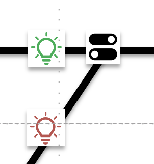
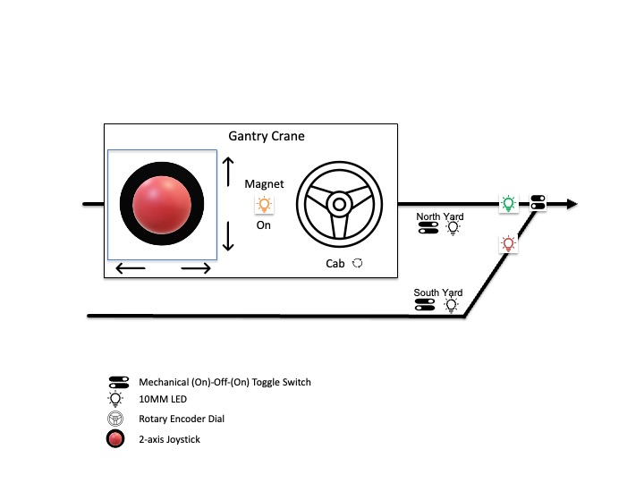

# PyLegacy

This project contains software to operate and control trains and other equipment that utilize 
Lionel's [TMCC and Legacy serial command protocol](https://ogrforum.com/fileSendAction/fcType/0/fcOid/156701992259624343/filePointer/156701992265497355/fodoid/156701992265497351/LCS-LEGACY-Protocol-Spec-v1.21.pdf).
Most Lionel engines produced after 2000 support either TMCC or Legacy, and all engines produced after 2010 do.
Additionally, Lionel produces track switches, operating accessories, as well as electronic modules to control your
layout that support Legacy commands (see [Lionel Layout Control System: LCS](https://control.lionel.com/docs/lionel-layout-control-system-lcs/)).

PyLegacy is developed in pure Python and can be run on Windows, Macintosh (Intel and M-series) as well as 
inexpensive Raspberry Pi systems. My goal is to capture physical button presses on a Pi and trigger specific
Legacy commands in response. This will facilitate the construction of operating control panels I will place
on my layout to fire routes, turn on and off power districts, operate accessories, and run trains.

Initial development focuses on the development of command-line tools (CLI) to operate engines
and trains, throw switches, operate accessories, and fire custom routes. This will be followed by 
developing code to translate physical button presses on a Raspberry Pi to Legacy and TMCC command 
actions, allowing the development of physical control panels to operate trains.

<div style="font-size: 16px; ">

<!-- TOC -->
* [PyLegacy](#pylegacy)
  * [Audience](#audience)
    * [Model Railroad Enthusiasts](#model-railroad-enthusiasts)
      * [Simple Panel](#simple-panel-)
      * [Raspberry Pi GPIO Pins](#raspberry-pi-gpio-pins)
    * [Lionel Legacy Gantry Crane and Yard](#lionel-legacy-gantry-crane-and-yard)
    * [Developers](#developers)
  * [Installing PyLegacy](#installing-pylegacy)
  * [Raspberry Pi Configuration](#raspberry-pi-configuration)
  * [Command-line Tools](#command-line-tools)
    * [PyTrain](#pytrain)
    * [PiConfig](#piconfig)
  * [Contributing](#contributing)
  * [Development](#development)
    * [Requirements](#requirements)
      * [Macintosh:](#macintosh)
      * [Raspberry Pi and Pi Zero W 2](#raspberry-pi-and-pi-zero-w-2)
    * [Installation and one time setup](#installation-and-one-time-setup)
  * [Future Enhancements](#future-enhancements)
  * [License](#license)
<!-- TOC -->

</div>

## Audience

The PyLegacy project is intended for two primary audiences:

* Model railroad enthusiasts running Lionel TMCC and/or Legacy layouts that
want to add physical control panels to operate their layout, including:
  * operating accessories
  * switches (turnouts)
  * power districts
  * routes
  * layout segments (e.g., yards, stations)
  * engines, trains, and operating cars equipped with TMCC or Legacy technology
  * control and recieve information from Lionel LCS Sensor Tracks
  * LCS devices, including the ASC2, STM2, and BPC2
* Developers interested in:
  * automated train control
  * adding elements of randomness into their layouts (lights on & off, sounding horn or bell effects, etc.)
  * building sequence commands that start up, ramp an engine to speed, then stop and shut down an engine
  * integration with smart speakers and intelligent assistants (e.g., Alexa, Ok Google)
  * console control of a layout via [ssh](https://www.raspberrypi.com/documentation/computers/remote-access.html#ssh)
  * integrating model railroading and computer science
  * learning the Lionel TMCC/Legacy command protocol
  * continuing to develop software post retirement :smirk:

### Model Railroad Enthusiasts

For the first audience, model railroad enthusiasts, PyLegacy allows you to build
full functionality control panels that use physical switches, dials, and keypads to control
your layout and get real-time feedback on LEDs and multi-line LCD screens. The software,
called **_PyTrain_**, runs on small, low-cost [Raspberry Pis](https://www.raspberrypi.com). These are
relatively inexpensive, (< $100), small (size of a deck of playing cards) single-board computers
that feature pin connections to which you can attach physical controls (toggle switches, push buttons,
keypads, speed-control dials and levers, etc.), as well as LEDs and LCD screens. An entire 
world of inexpensive control hardware is available from Amazon and other online suppliers. 

Rather than running wires from each control panel to the component(s) you want to control, you simply wire your 
buttons, switches, LEDs, etc. to the Pi itself that you mount within your panel. The Raspberry Pi communicates with
your layout via Wi-Fi to a Lionel Base 3 or LCS Wi-Fi module. The only wire you need to connect to your panel 
is power for the Pi itself!

What if you want multiple control panels situated near the layout elements you want to control? Simple!
Use multiple Raspberry Pis, mounting one in each control panel. The Pis can each communicate directly to a Base 
3 (or LCS Wi-Fi module), or, you designate one of your Pi's as a _**server**_. This Pi will handle all 
communication to and from your layout, and all the Pis that drive your other panels, the clients,
communicate directly with the server over Wi-Fi.

PyTrain provides many tools that let you operate specific switches, routes, accessories, and even engines
right out of the box. All you need is to specify the TMCC ID of the component you want to operate and the 
[pin(s)](https://gpiozero.readthedocs.io/en/latest/recipes.html#pin-numbering) on the Pi that your 
physical buttons, LEDs, etc. connect to. PyTrain does the rest. 

Let's say you want to control Lionel Turnout 12 (TMCC ID is 12).
The turnout can be a TMCC Command Controlled model or one that is wired to an LCS ASC2.
In this example, our panel would consist of a momentary (on)-off-(on) toggle switch and 2 bi-color red/green 
LEDs. The LEDs show the current path a train would take when traversing the turnout from right to left. In the 
panel below, the _through_ position is set, so the _through_ LED is green, and the _out_ LED is red. If we pull
down and release the toggle switch, the turnout would change to the _out_ position, and its LED would light green, 
and the _through_ path would turn red. We would also want the LEDs to reflect the actual turnout state, should it be 
controlled from a Cab-2, Cab-3, or from the auto-derail prevention feature of FasTrack turnouts.
 

<div align="center">



#### Simple Panel 
</div>

To construct this panel, we would need to connect toggle switch and LEDs to pins on the Raspberry Pi. Below is a 
schematic of a Pi pinout, taken from the [GPIO Zero](https://gpiozero.readthedocs.io/en/latest/index.html) 
project, which is used by PyTrain:

<div align="center">


#### Raspberry Pi GPIO Pins
</div>

To control and show the state of our turnout, we would connect the center terminal of out toggle switch and 
the common cathode lead of our Bi-Color LEDs to a GND pin on the Pi (any will do). We next need to decide 
which pins we will connect the other two terminals of the toggle (up for _through_ and down for _out_), and 
the 4 leads of the 2 LEDs. We can use any of the pins colored green above, as well as GPIO pins 7, 8, 9, 10, 11, 
14, and 15. Pins GPIO 2 and GPIO 3 are reserved to communicate with expander boards that provide 
additional GPIO pins, as are pins ID SD and ID SC.

Let's say we make the following connections:

| Pin | Component     | Function   |
|:---:|---------------|------------|
|  7  | Toggle  (Up)  | Through    |
|  8  | Toggle (Down) | Out        |
|  9  | Thru LED      | Green Lead |
| 10  | Thru LED      | Red Lead   |
| 10  | Out LED       | Green Lead |
|  9  | Out LED       | Red Lead   |

Here is the Python code to control the turnout:

```
from pytrain import GpioHandler

GpioHandler.switch(
    address = 12,     # TMCC ID of the turnout to control
    thru_pin = 7,      
    out_pin = 8,       
    thru_led_pin = 9,
    out_led_pin = 10
)
```
Note that the pins driving the 2 LEDs, 9 & 10 are connected to _both_ LEDs. 
Because the LEDs in our example are bi-color, when power is applied to pin 9, 
it simultaneously lights the green element in the _through_ LED and the red
element in the _out_ LED. 

When we pull _down_ on the toggle switch, pin 8 is connected to GND. The python code responds by
sending the TMCC command to your Base 3 or LCS Wi-Fi to set the turnout to the _out_ position. It
also turns off the power to pin 9 and turns on the power to pin 10, causing the red element in
the "through" led to shine red, and the green element in the _out_ led to shine green. The PyTrain 
software can send _**all**_ the defined TMCC and Legacy commands, including almost all the 
functionality available on the Cab 2 and Cab 3 controllers, including control of engine smoke, lights,
engine sounds, speed, momentum, volume, dialog, whistle and bell sounds, and much more. 
It can also fire routes, control momentary and on/off accessories, rotate gantry cranes, etc. 

Below is another control panel to operate a Lionel Command Control Gantry. This panel uses a 2-axis joystick 
to move the gantry back and forth on the special GarGraves 5-rail track, as well as to lift the magnet
up and down. A Rotary Encoder is used to rotate the crane cab. The encoder I use has a push button 
built in that I use to turn the magnet on and off. A yellow LED is lit when the magnet is energized. 
The panel also allows control of the two track power blocks in this part of my layout, as well
as the turnout to the two track segments.

<div align="center">



### Lionel Legacy Gantry Crane and Yard
</div>

### Developers

For developers...

## Installing PyLegacy

## Raspberry Pi Configuration


## Command-line Tools

PyLegacy includes several command-line tools you
The `cli` directory contains a number of Python command line scripts allowing 
you to operate engines, control switches and accessories, and fire custom routes.

### PyTrain

### PiConfig

## Contributing

## Development

### Requirements

#### Macintosh:

- Brew:

`/bin/bash -c "$(curl -fsSL https://raw.githubusercontent.com/Homebrew/install/HEAD/install.sh)"`

- Python 3.12.6 (your version may be newer; Note: Python 3.13 is _**not**_ supported:

`brew install python@3.12`

- gh:

`brew install gh`

- git (if you plan to modify the code and issue pull requests):

`brew install git`

#### Raspberry Pi and Pi Zero W 2

- Python 3.11, gh, and git:

```
sudo apt update
sudo apt upgrade

sudo apt install python3
sudo apt install gh
sudo apt install git
```

For the Raspberry Pi Zero W (**NOT** the 2 W):

```
sudo apt-get install swig
```

**Note**: some or all of this software may already be installed on your pi

### Installation and one time setup

```
cd /where/you/like/your/source

# Make sure this says 3.11. or greater; don't keep going in these directions until it does
python3 --version

# authenticate gh/git:
gh auth login

# establish a virtual Python environment
# see: https://docs.python.org/3/library/venv.html
python3 -m venv PyLegacyEnv
cd PyLegacyEnv
gh repo clone cdswindell/PyLegacy
cd PyLegacy

# Activate virtual environment
source ../bin/activate; export PYTHONPATH=.

# Install 3rd-party dependencies
pip3 install -r requirements.txt

```

You will need to activate this local python environment every time you open a
new shell, after changing your working directory to the `PyLegacy` local directory by typing:

```
source ../bin/activate
export PYTHONPATH=.
```

You may wish to create a macro or alias to issue these commands for you.

## Future Enhancements

## License

This software and its use are governed by the GNU Lesser General Public License (LPGL).